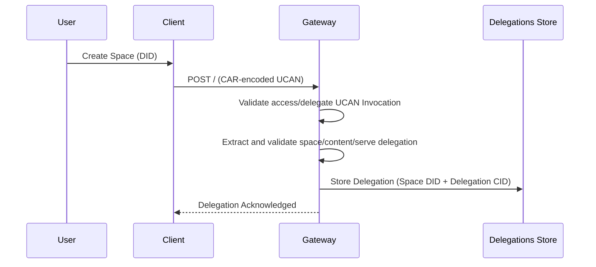
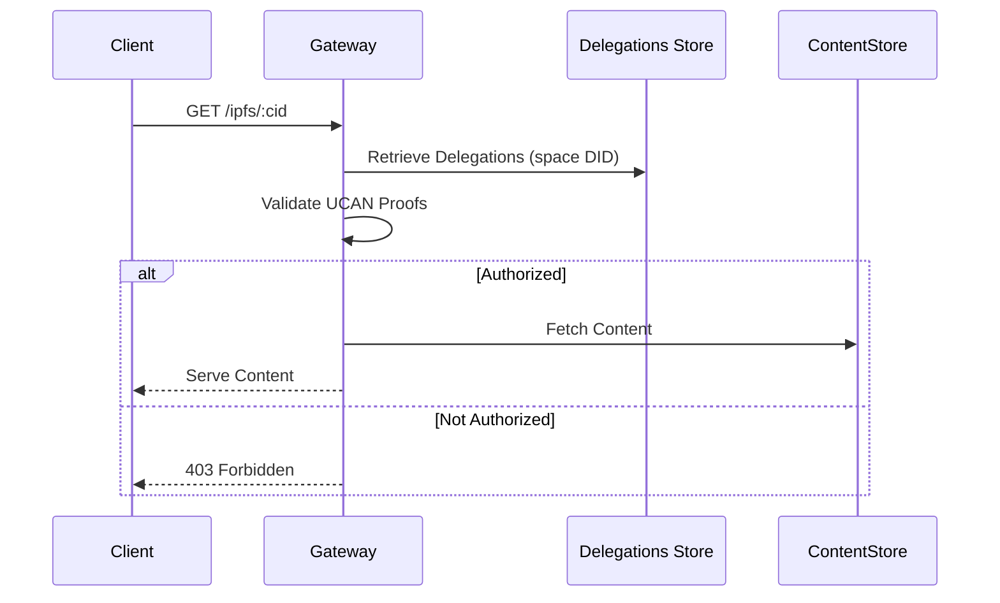

# Content Server Authorization Spec

## Editors

- [Felipe Forbeck](https://github.com/fforbeck), [Storacha Network](https://storacha.network/)

## Authors

- [Felipe Forbeck](https://github.com/fforbeck), [Storacha Network](https://storacha.network/)

## Abstract

Content Server Authorization ensures that access to content is governed by UCAN delegations (User Controlled Authorization Network) and served by explicitly authorized services.
This mechanism allows content owners to delegate retrieval capabilities to specific services, ensuring that only authorized entities can access the content.

## Terminology

- **Space**: A logical container for data, identified by a DID (Decentralized Identifier). Authorization is granted for an entire space, and all data within a space shares the same permissions.
- **Delegation**: The act of granting specific capabilities to another entity via UCAN, and the signed document proving the delegation (also called a "**proof**").
- **Gateway**: A service (e.g., Freeway) that facilitates content retrieval and enforces authorization policies.
- **Delegations Store**: A store used by the IPFS gateway to store and manage delegations.

## Delegation Flow Diagram for an IPFS Gateway



**Flow**
   1. Client creates a UCAN delegation granting `space/content/serve` capability to the gateway
      - During space creation, the Storacha Client delegates the `space/content/serve` capability to the services designed to serve content from the Storacha Network to clients (for example an IPFS Gateway), by sending a `POST /access/delegate` request containing the UCAN delegation.
      - `space/content/serve`: delegation that authorizes the service to serve data stored in a given space to any client requesting it.
      - In the future, IPFS Gateways may support different delegation strategies such as: restricting access to specific CIDs, use of access tokens, restrictions on transport modes (http/bitswap).
   2. Client wraps this delegation in an `access/delegate` UCAN invocation
   3. Client encodes the invocation as CAR format and sends to `POST /`
   4. Gateway validates the delegation chain and stores the delegation
      - For the Storacha IPFS Gateway, the Delegations are stored using a key composed of the space DID and the delegation CID, but the implementer can use any strategy to store the delegations.
      - Multiple delegations can exist for the same space, allowing flexibility in access control.

### API Specification

The IPFS Gateway needs to provide an endpoint with the following interface to process the delegation requests.

```http
POST /
Content-Type: application/car
```

**Request Body**

 - CAR-encoded UCAN invocation

**UCAN Invocation Structure**
```typescript
interface UCANInvocation {
  /** The capability being invoked */
  can: "access/delegate"
  /** The IPFS Gateway DID that will receive the delegation */
  with: string  // e.g., "did:web:storacha.link"
  /** Invocation parameters */
  nb: {
    /** Map of delegation CIDs to be stored */
    delegations: Record<string, CID>
  }
  /** Array of UCAN delegations containing space/content/serve capability */
  proofs: Delegation[]
}
```

**Space Content Serve Delegation Structure** (contained in proofs):
```typescript
interface ContentServeDelegation {
  /** The capability being delegated */
  can: "space/content/serve"
  /** Space DID being delegated */
  with: string  // e.g., "did:key:z6Mk..."
  /** Optional restrictions (currently unused) */
  nb: {}
}
```

**Response Codes**
- `200 OK`: Delegation accepted and stored
- `400 Bad Request`: Invalid UCAN or malformed request
- `403 Forbidden`: Unauthorized to delegate for this space
- `500 Internal Server Error`: Server-side validation or storage failure

## Content Retrieval Flow

When a client requests content

1. **Request Handling**

   - The client sends a `GET /ipfs/:cid` request to the Gateway.
   - The Gateway resolves the associated Space DID by looking up the CID in the Indexer Service, identifying the existing Spaces in the Location Claims response, and retrieving all delegations from the Delegations Store.

2. **Authorization Check**

   - The Gateway validates the UCAN delegations to ensure the requester has the `space/content/serve` capability for the content's space.
   - If authorized, the content is served; otherwise, the request is denied.

### Content Retrieval Flow Diagram



## Considerations

- **Legacy Spaces**

  - For Spaces created before the implementation of Content Serve Authorization, considered legacy data, the Gateway serves content without requiring authorization because it can't be attributed to a Space DID for billing.

- **Access Tokens**

  - :warning: The system supports the use of access tokens in request headers, although current implementations do not enforce token validation at the delegation level.

- **Billing**

  - Determining the space ID is essential for attributing egress costs to the correct account. This billing mechanism is under development and depends on the unification of the `upload-service` and `w3up` repositories.

## References

- [Content Authorization Flow - HackMD](https://hackmd.io/E22bpXWcS6e9JQpe0lvy5w?view#13-Document-Access-Control-amp-Revocation)
- [Issue #159 - Project Tracking](https://github.com/storacha/project-tracking/issues/159#issuecomment-2483570784)
- [Issue #137 - Project Tracking](https://github.com/storacha/project-tracking/issues/137#issuecomment-2459892514)
- [Issue #158 - Project Tracking](https://github.com/storacha/project-tracking/issues/158#issuecomment-2504194988)
