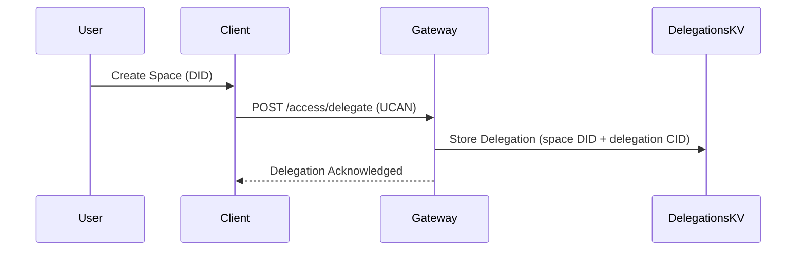
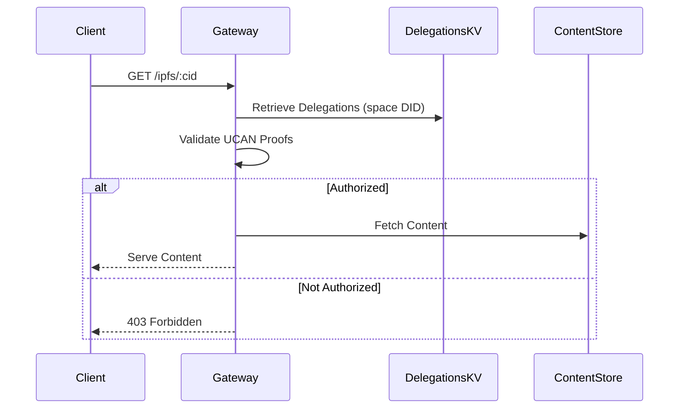

# Content Server Authorization Spec

## Editors

- [Felipe Forbeck](https://github.com/fforbeck), [Storacha Network](https://storacha.network/)

## Authors

- [Felipe Forbeck](https://github.com/fforbeck), [Storacha Network](https://storacha.network/)

## Abstract

Content Server Authorization ensures that access to content is governed by delegations using UCANs (User Controlled Authorization Networks) and served by explicitly authorized services.
This mechanism allows content owners to delegate retrieval capabilities to specific services, ensuring that only authorized entities can access the content.

## Terminology

- **UCAN**: User Controlled Authorization Network token/delegation, representing delegated capabilities.
- **Space**: A logical namespace identified by a DID (Decentralized Identifier) utilized to store data (e.g: bucket).
- **Delegation**: The act of granting specific capabilities to another entity via a UCAN.
- **Gateway**: A service (e.g., Freeway) that facilitates content retrieval and enforces authorization policies.
- **Delegations KV Store**: A key-value store used by the gateway to manage and validate delegations.

## Delegation Flow

The delegation process involves the following steps

1. **Space Creation and Delegation**

   - A user creates a space using the Storacha client.
   - The Storacha Client automatically delegates the `space/content/serve` capability to the Storacha Gateway (e.g., Freeway) by sending a `POST /access/delegate` request containing the UCAN delegation.
   - The Gateway validates the UCAN delegation and stores it in the Delegations KV store.

2. **Delegation Storage**

   - Delegations are stored using a key composed of the space DID and the delegation CID.
   - Multiple delegations can exist for the same space/bucket, allowing flexibility in access control.

### Delegation Flow Diagram

## Content Retrieval Flow

When a client requests content

1. **Request Handling**

   - The client sends a `GET /ipfs/:cid` request to the Gateway.
   - The Gateway resolves the associated space/bucket and retrieves the relevant delegations from the KV store.

2. **Authorization Check**

   - The Gateway validates the UCAN delegations to ensure the requester has the `space/content/serve` capability for the content's space.
   - If authorized, the content is served; otherwise, the request is denied.

### Content Retrieval Flow Diagram

## Considerations

- **Legacy Spaces**

  - For spaces created before the implementation of Content Serve Authorization, the Gateway serves content without requiring authorization, provided no authorization header is present.

- **Access Tokens**

  - :warning: The system supports the use of access tokens in request headers, although current implementations do not enforce token validation at the delegation level.

- **Billing**

  - Determining the space ID is essential for attributing egress costs to the correct account. This billing mechanism is under development and depends on the unification of the `upload-service` and `w3up` repositories.

## References

- [Content Authorization Flow - HackMD](https://hackmd.io/E22bpXWcS6e9JQpe0lvy5w?view#13-Document-Access-Control-amp-Revocation)
- [Issue #159 - Project Tracking](https://github.com/storacha/project-tracking/issues/159#issuecomment-2483570784)
- [Issue #137 - Project Tracking](https://github.com/storacha/project-tracking/issues/137#issuecomment-2459892514)
- [Issue #158 - Project Tracking](https://github.com/storacha/project-tracking/issues/158#issuecomment-2504194988)
