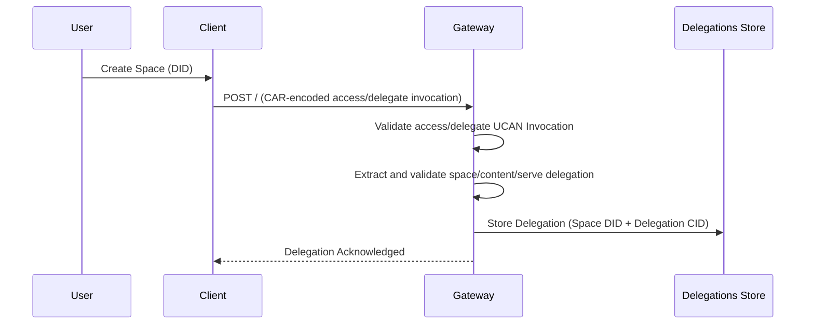
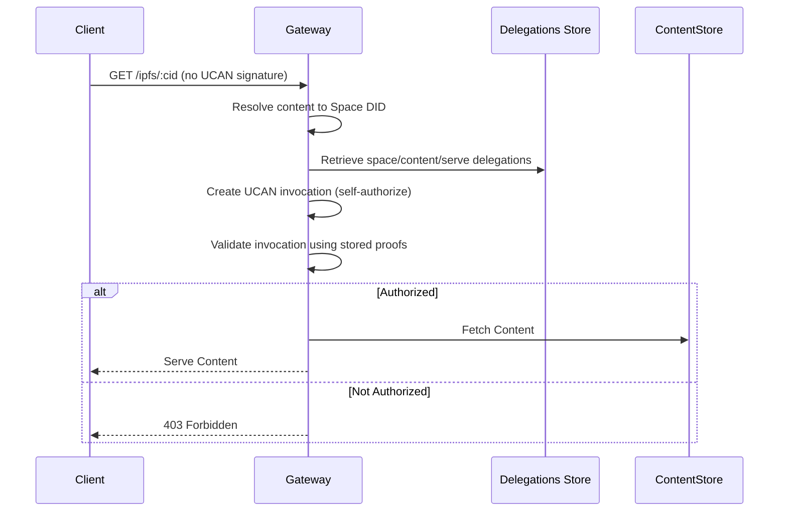

# Content Server Authorization Spec

## Editors

- [Felipe Forbeck](https://github.com/fforbeck), [Storacha Network](https://storacha.network/)
- [Petra Jaros](https://github.com/Peeja), [Storacha Network](https://storacha.network/)
- [Alan Shaw](https://github.com/alanshaw), [Storacha Network](https://storacha.network/)
- [Forrest Weston](https://github.com/frrist), [Storacha Network](https://storacha.network/)

## Authors

- [Felipe Forbeck](https://github.com/fforbeck), [Storacha Network](https://storacha.network/)

## Abstract

Content Server Authorization ensures that access to content is governed by UCAN delegations (User Controlled Authorization Network) and served by explicitly authorized services.
This mechanism allows content owners to delegate retrieval capabilities to specific services, ensuring that only authorized entities can access the content.

## Terminology

- **Space**: A logical container for data, identified by a DID (Decentralized Identifier).
- **Delegation**: The act of granting specific capabilities to another entity via UCAN, and the signed document proving the delegation (also called a "**proof**").
- **IPFS Gateway**: A service that implements the [IPFS HTTP Gateway spec](https://specs.ipfs.tech/http-gateways/) to facilitate content retrieval, that _also_ enforces authorization policies.
- **Delegations Store**: A store used by a Gateway to store and manage delegations.

## Delegation Flow Diagram for an IPFS Gateway



### Flow

1. Client creates a UCAN delegation granting `space/content/serve` capability to the gateway

   - The `space/content/serve` capability is delegated to the service(s) designed to serve content stored by the Storacha Network (for example an IPFS Gateway).
   - A `space/content/serve` delegation authorizes the service to serve data stored in a given space. Caveats MAY apply. The authorization is granted for the entire space, and all data within a space shares the same permissions.
   - In the future, IPFS Gateways may support different delegation strategies such as: restricting access to specific CIDs, use of access tokens, restrictions on transport modes (http/bitswap).

2. Client wraps this delegation in an `access/delegate` UCAN invocation
3. Client encodes the invocation and sends it to the IPFS Gateway
4. The IPFS Gateway validates the delegation chain and stores the delegation

   - Multiple delegations can exist for the same space, allowing flexibility in access control.

Note: The `access/delegate` is a standard Ucanto invocation flow, and additionally, the `space/content/serve` delegation needs to be validated because it is not automatically part of the invocation flow.

## API Specification

The IPFS Gateway needs to provide an endpoint with the following interface to process the delegation requests.

### `space/content/serve` Delegation Structure

```jsonc
{ // "/": "bafy...serveprf1",
  // The Agent sending the request that authorizes the IPFS Gateway
  "iss": "did:key:zAlice",
  // The IPFS Gateway DID that is authorized to serve the content
  "aud": "did:web:storacha.link",
  "att": [
    {
      // The capability
      "can": "space/content/serve",
      // The Space DID Key
      "with": "did:key:zSpace",
    }
  ],
  "prf": [],
}
```

### `access/delegate` Invocation Structure

```jsonc
{ // "/": "bafy...delegate",
  // The Agent sending the request
  "iss": "did:key:zAlice",
  // The IPFS Gateway DID that will receive the delegation
  "aud": "did:web:storacha.link",
  // The space DID key where the content is stored and is allowed to be served from
  "with": "did:key:zAliceSpace",
  "att": [
    {
      "with": "did:key:zAlice",
      "can": "access/delegate",
      "nb": {
        // Map of delegation CIDs to be stored
        "delegations": { "bafy...serveprf1": { "/": "bafy...serveprf1" } }
      }
    }
  ],
  // Array of UCAN delegations including the space/content/serve proof
  "prf": [
    // `space/content/serve` delegation proof (e.g: {"/": "bafy...serveprf1"})
  ]
}
```

### Response Codes

- `200 OK`: Delegation accepted and stored
- `400 Bad Request`: Invalid UCAN or malformed request
- `403 Forbidden`: Unauthorized to delegate for this space
- `500 Internal Server Error`: Server-side validation or storage failure

## Content Retrieval Flow



When a client requests content

1. **Request Handling**

   - The client sends a `GET /ipfs/:cid` request to the Gateway.
   - The Gateway resolves the associated Space DID by looking up the CID in the Indexer Service, identifying the existing Spaces in the Location Claims response, and retrieving all delegations from the Delegations Store.

2. **Authorization Check**

   - The Gateway looks up stored delegations for the content's space from the Delegations Store.
   - The Gateway creates a UCAN invocation authorizing itself to serve the content, using the stored `space/content/serve` delegations as proofs.
   - The Gateway validates its own UCAN invocation against the stored delegation proofs.
   - If the validation succeeds, the content is served; otherwise, the request is denied with 403 Forbidden.
   - **Note**: The HTTP client making the GET request does not need a DID or UCAN signature. The authorization happens between the Gateway (as the delegated authority) and the Space owner (via stored delegations).

## Considerations

- **Gateway as Delegated Authority**

  - The IPFS Gateway itself (with a DID like `did:web:storacha.link`) is the UCAN principal that has been delegated the `space/content/serve` capability.
  - HTTP clients making content requests do not need DIDs or UCAN signatures - they are not UCAN principals in this system.
  - Authorization happens between the Gateway and Space owners via stored delegations, not between HTTP clients and the Gateway.

- **Legacy Spaces**

  - For Spaces created before the implementation of Content Serve Authorization, considered legacy data, the Gateway serves content without requiring authorization because it can't be attributed to a Space DID for billing.

- **Access Tokens**

  - :warning: The system supports the use of access tokens in request headers, although current implementations do not enforce token validation at the delegation level.

- **Billing**

  - Determining the space ID is essential for attributing egress costs to the correct account. This billing mechanism is under development and depends on the unification of the `upload-service` and `w3up` repositories.

## References

- [Content Authorization Flow - HackMD](https://hackmd.io/E22bpXWcS6e9JQpe0lvy5w?view#13-Document-Access-Control-amp-Revocation)
- [Issue #159 - Project Tracking](https://github.com/storacha/project-tracking/issues/159#issuecomment-2483570784)
- [Issue #137 - Project Tracking](https://github.com/storacha/project-tracking/issues/137#issuecomment-2459892514)
- [Issue #158 - Project Tracking](https://github.com/storacha/project-tracking/issues/158#issuecomment-2504194988)
