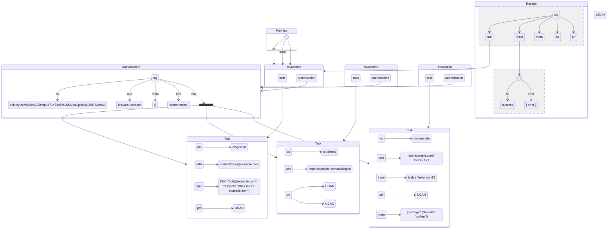
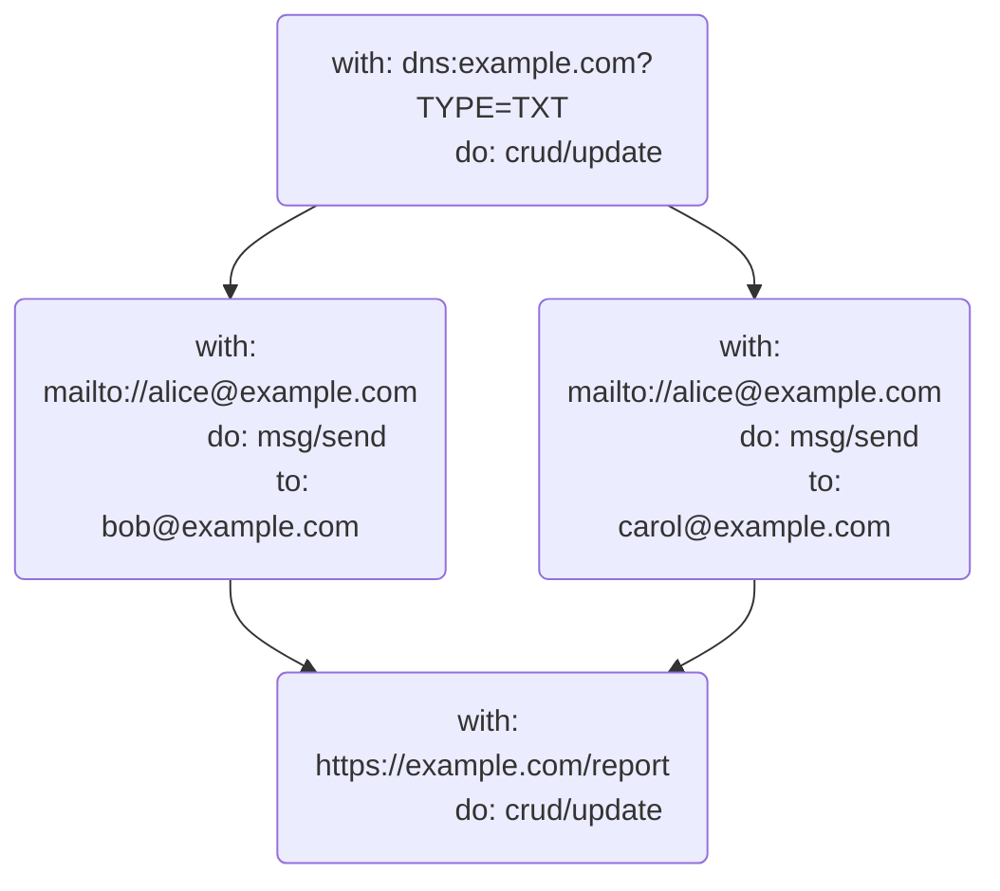

# UCAN Execution Specification v0.1.0

## Editors

- [Brooklyn Zelenka](https://github.com/expede/), [Fission](https://fission.codes/)
- [Irakli Gozalishvili](https://github.com/Gozala), [DAG House](https://dag.house/)

## Authors

- [Brooklyn Zelenka](https://github.com/expede/), [Fission](https://fission.codes/)
- [Irakli Gozalishvili](https://github.com/Gozala), [DAG House](https://dag.house/)

## Depends On

- [DAG-CBOR]
- [UCAN]
- [UCAN-IPLD]
- [Varsig]

# 0 Abstract

UCAN Invocation defines a format for expressing the intention to execute delegated UCAN capabilities, the attested receipts from an execution, and how to extend computation via promise pipelining.

> This is based on [UCAN invocation] specification, altering it slightly in order to make tasks self-contained as discussed in [#6](https://github.com/ucan-wg/invocation/issues/6)

## Language

The key words "MUST", "MUST NOT", "REQUIRED", "SHALL", "SHALL NOT", "SHOULD", "SHOULD NOT", "RECOMMENDED", "MAY", and "OPTIONAL" in this document are to be interpreted as described in [RFC 2119](https://datatracker.ietf.org/doc/html/rfc2119).

# 1 Introduction

> Just because you can doesn't mean that you should
>
> — Anonymous

UCAN is a chained-capability format. A UCAN contains all of the information that one would need to perform some task, and the provable authority to do so. This begs the question: can UCAN be used directly as an RPC language?

Some teams have had success with UCAN directly for RPC when the intention is clear from context. This can be successful when there is more information on the channel than the UCAN itself (such as an HTTP path that a UCAN is sent to). However, capability invocation contains strictly more information than delegation: all of the authority of UCAN, plus the command to perform the task.

## 1.1 Intuition

## 1.1.1 Car Keys

Consider the following fictitious scenario:

Akiko is going away for the weekend. Her good friend Boris is going to borrow her car while she's away. They meet at a nearby cafe, and Akiko hands Boris her car keys. Boris now has the capability to drive Akiko's car whenever he wants to. Depending on their plans for the rest of the day, Akiko may find Boris quite rude if he immediately leaves the cafe to go for a drive. On the other hand, if Akiko asks Boris to run some last minute pre-vacation errands for that require a car, she may expect Boris to immediately drive off.

## 1.1.2 Lazy vs Eager Evaluation

In a referentially transparent setting, the description of a task is equivalent to having done so: a function and its results are interchangeable. [Programming languages with call-by-need semantics](https://en.wikipedia.org/wiki/Haskell) have shown that this can be an elegant programming model, especially for pure functions. However, _when_ something will run can sometimes be unclear.

Most languages use eager evaluation. Eager languages must contend directly with the distinction between a reference to a function and a command to run it. For instance, in JavaScript, adding parentheses to a function will run it. Omitting them lets the program pass around a reference to the function without immediately invoking it.

```js
const message = () => alert("hello world")
message // Nothing happens
message() // A message interups the user
```

Delegating a capability is like the statement `message`. Task is akin to `message()`. It's true that sometimes we know to run things from their surrounding context without the parentheses:

```js
;[1, 2, 3].map(message) // Message runs 3 times
```

However, there is clearly a distinction between passing a function and invoking it. The same is true for capabilities: delegating the authority to do something is not the same as asking for it to be done immediately, even if sometimes it's clear from context.

## 1.2 Gossiping of delegations

In web3.storage user `alice@web.mail` can delegate to store file in her space to `bob@send.io` by sending that delegation to `web3.storage`. If service were to interpret this as invocation it would fail due to principal misalignment. By distinguishing capability invocation from delegation service is able to more correctly handle such a message, if it is an invocation it will still error due to principal misalignment, if it is a delegation it will hold it in Bob's inbox to be picked up when he's comes online.

## 1.3 Separation of Concerns

Information about the scheduling, order, and pipelining of tasks is orthogonal to the flow of authority. An agent collaborating with the original executor does not need to know that their call is 3 invocations deep; they only need to know that they been asked to perform some task by the latest invoker.

As we shall see in the [discussion of promise pipelining][pipelines], asking an agent to perform a sequence of tasks before you know the exact parameters requires delegating capabilities for all possible steps in the pipeline. Pulling pipelining detail out of the core UCAN spec serves two functions: it keeps the UCAN spec focused on the flow of authority, and makes salient the level of de facto authority that the executor has (since they can claim any value as having returned for any step).

```
  ────────────────────────────────────────────Time──────────────────────────────────────────────────────►

┌──────────────────────────────────────────Delegation─────────────────────────────────────────────────────┐
│                                                                                                         │
│  ┌─────────┐   ┌─────────┐   ┌─────────┐         ┌─────────┐                ┌─────────┐                 │
│  │         │   │         │   │         │         │         │                │         │                 │
│  │  Alice  ├──►│   Bob   ├──►│  Carol  ├────────►│   Dan   ├───────────────►│  Erin   │                 │
│  │         │   │         │   │         │         │         │                │         │                 │
│  └─────────┘   └─────────┘   └─────────┘         └─────────┘                └─────────┘                 │
│                                                                                                         │
└─────────────────────────────────────────────────────────────────────────────────────────────────────────┘

┌──────────────────────────────────────────Invocation─────────────────────────────────────────────────────┐
│                                                                                                         │
│                              ┌─────────┐         ┌─────────┐                                            │
│                              │         │         │         │                                            │
│                              │  Carol  ╞═══All══►│   Dan   │                                            │
│                              │         │         │         │                                            │
│                              └─────────┘         └─────────┘                                            │
│                                                                                                         │
│                                                  ┌─────────┐                              ┌─────────┐   │
│                                                  │         │                              │         │   │
│                                                  │   Dan   ╞═══════════Update DB═════════►│  Erin   │   │
│                                                  │         │                              │         │   │
│                                                  └─────────┘                              └─────────┘   │
│                                                                                                         │
│                                                           ┌─────────┐                ┌─────────┐        │
│                                                           │         │                │         │        │
│                                                           │   Dan   ╞═══Read Email══►│  Erin   │        │
│                                                           │         │           ▲    │         │        │
│                                                           └─────────┘           ┆    └─────────┘        │
│                                                                               With                      │
│                                                                               Result                    │
│                                                                  ┌─────────┐   Of         ┌─────────┐   │
│                                                                  │         │    ┆         │         │   │
│                                                                  │   Dan   ╞════Set DNS══►│  Erin   │   │
│                                                                  │         │              │         │   │
│                                                                  └─────────┘              └─────────┘   │
│                                                                                                         │
└─────────────────────────────────────────────────────────────────────────────────────────────────────────┘
```

## 1.3 A Note On Serialization

The JSON examples below are given in [DAG-JSON], but UCAN Task is actually defined as IPLD. This makes UCAN Task agnostic to encoding. DAG-JSON follows particular conventions around wrapping CIDs and binary data in tags like so:

```json
// CID
{"/": "Qmf412jQZiuVUtdgnB36FXFX7xg5V6KEbSJ4dpQuhkLyfD"}

// Bytes (e.g. a signature)
{"/": {"bytes": "s0m3Byte5"}}
```

This format help disambiguate type information in generic [DAG-JSON] tooling. However, your presentation need not be in this specific format, as long as it can be converted to and from this cleanly. As it is used for the signature format, [DAG-CBOR] is RECOMMENDED.

## 1.4 Note on Schema Syntax

We use [IPLD Schema] syntax extended with generics. Standard IPLD Schema can be derived by ignoring parameters enclosed in angle brackets and interpreting parameters as `any`.

Below schema is in the extended syntax

```ipldsch
type Box<T> struct {
  value T
}
```

It compiles down to a following standard syntax

```ipldsch
type Box struct {
  value Box_T
}
type Box_T any
```

## 1.5 Signatures

All payloads described in this spec MUST be signed with a [Varsig].

# 2 High-Level Concepts

## 2.1 Roles

Task adds two new roles to UCAN: invoker and executor. The existing UCAN delegator and delegate principals MUST persist to the invocation.

| UCAN Field | Delegation                             | Task                            |
| ---------- | -------------------------------------- | ------------------------------- |
| `iss`      | Delegator: transfer authority (active) | Invoker: request task (active)  |
| `aud`      | Delegate: gain authority (passive)     | Executor: perform task (active) |

### 2.1.1 Invoker

The invoker signals to the executor that a task associated with a UCAN SHOULD be performed.

The invoker MAY be specified explicitly using `iss` field. If `iss` field is omitted invoker is specified implicitly using `iss` field of the contained UCAN authorizing the invocation.

### 2.1.2 Executor

The executor is directed to perform some task described in the UCAN by the invoker.

The executor MAY be specified explicitly using `aud` field. If `aud` field is omitted executor is specified implicitly using `aud` field of the contained UCAN authorizing the invocation.

## 2.2 Components



### 2.2.1 Task

A [Task] is like a deferred function application: a request to perform some action on a resource with specific input.

### 2.2.2 Authorization

An [Authorization] is a cryptographically signed proof permitting execution of referenced tasks. It allows invoker to authorize a group of tasks using one cryptographic signature.

### 2.2.3 Invocation

An [Invocation] is an invoker authorized instruction to an executor to run the [Task].

### 2.2.4 Result

A [Result] is the output of a [Task].

### 2.2.5 Receipt

A [Receipt] is a cryptographically signed description of the [Invocation] output.

### 2.2.6 Promise

A [promise] is a reference to an eventual [Receipt] of an [Invocation].

## 2.3 IPLD Schema

```ipldsch
type Task<In> struct {
  with    URI
  do      Ability

  input   In (implicit {})
  meta    {String : Any} (implicit {})

  prf     [&UCAN] (implicit [])
}

type Authorization struct {
  v       SemVer

  # CIDs MUST be sorted alphabetically
  run     [&Task<any>] (implicit [])

  # If omitted iss / aud MUST be derived from the
  # delegated proof(s)
  iss     optional Principal
  aud     optional Principal

  meta    {String : Any} (implicit {})
  nnc     string (implicit "")

  s       VarSig
}

type Invocation<In> struct {
  task &Task<In>
  authorization  &Authorization
} representation tuple

type Receipt<In, Ok, Error> struct {
  ran     &Invocation<In>

  # output of the invocation
  out     Result<Ok, Error>

  # Related receipts
  origin  optional &Receipt<In, Any, Any>

  # All the other metadata
  meta    { String: Any } (implicit {})

  # Principal that issued this receipt. If omitted issuer is
  # inferred from the invocation task audience.
  iss     optional Principal

  # When issuer is different from executor this MUST hold a UCAN
  # delegation chain from executor to the issuer. Should be omitted executor is an issuer.
  prf     [&UCAN] implicit ([])

  # Signature from the `iss`.
  s       Varsig
}

type Result<Ok, Error> union {
  | Ok ("ok") # Success
  | Error ("error") # Error
}

# Promise is a way to reference invocation receipt
type Promise union {
  &Invocation<any>    "await/invocation/*"
  &Invocation<any>    "await/invocation/ok"
  &Invocation<any>    "await/invocation/error"
  # If it is a task you MUST derive invocation by using authorization of
  # this invocation
  &Task<any>          "await/task/*"
  &Task<any>          "await/task/ok"
  &Task<any>          "await/task/error"
} representation keyed

type URI string
```

# 3 Task

A Task is the smallest unit of work that can be requested from a UCAN. It describes one `(resource, ability, input)` triple. The `input` field is free form, and depend on the specific resource and ability being interacted with, and not described in this specification.

Using the JavaScript analogy from the introduction, a Task is similar to wrapping a call in an anonymous function:

```json
{
  "with": "mailto://alice@example.com",
  "do": "msg/send",
  "input": {
    "body": "world",
    "subject": "hello",
    "to": [
      "bob@example.com",
      "carol@example.com"
    ]
  },
  "prf": [
    { "/": "bafyreibblnq5bawcchzh73nxkdmkx47hu64uwistvg4kyvdgfd6igkcnha" }
  ]
}
```

```js
// Pseudocode
() => msg.send("mailto:alice@example.com", {
  to: ["bob@example.com", "carol@example.com"],
  subject: "hello",
  body: "world"
}, {
  proofs: [
    CID.parse('bafyreibblnq5bawcchzh73nxkdmkx47hu64uwistvg4kyvdgfd6igkcnha')
  ]
})
```

Later, when we explore [Promise]s, this also includes capturing the promise:

```json
{
  "bafyreibfcowm533mjovwymxu5wqg7tiqddvez5atgocyyomll3ouykppfy": {
    "with": "https://example.com/mailinglist",
    "do": "crud/read",
    "prf": [
      { "/": "bafyreib2dldcev74g5i76bacd4w72gowuraouv2kvnwa2ympvrvtybcsfi" }
    ]
  },
  "bafyreif3k6kz4pip7wu6j26kdrrju3tbttcqhcmibdy6rpolazv6vds2kq": {
    "with": "mailto://alice@example.com",
    "do": "msg/send",
    "input": {
      "body": "world",
      "subject": "hello",
      "to": {
        "await/task/*": {
          "/": "bafyreibfcowm533mjovwymxu5wqg7tiqddvez5atgocyyomll3ouykppfy"
        }
      }
    },
    "prf": [
      { "/": "bafyreibblnq5bawcchzh73nxkdmkx47hu64uwistvg4kyvdgfd6igkcnha" }
    ]
  }
}
```

```js
// Pseudocode
const mailingList = crud.read("https://exmaple.com/mailinglist", {}, {
  proofs: [
    CID.parse('bafyreib2dldcev74g5i76bacd4w72gowuraouv2kvnwa2ympvrvtybcsfi')
  ]
})
msg.send("mailto:alice@example.com", {
  to: (await mailingList).ok,
  subject: "hello",
  body: "world",
}, {
  proofs: [
    CID.parse('bafyreibblnq5bawcchzh73nxkdmkx47hu64uwistvg4kyvdgfd6igkcnha')
  ]
})
```

## 3.1 Schema

```ipldsch
type Task struct {
  with    URI
  do      Ability

  input   {String: Any} (implicit {})
  meta    {String : Any} (implicit {})

  prf     [&UCAN] (implicit [])
}

type URI string
```

## 3.2 Fields

### 3.2.1 Resource

The `with` field MUST contain the [URI](https://en.wikipedia.org/wiki/Uniform_Resource_Identifier) of the resource being accessed. If the resource being accessed is some static data, it is RECOMMENDED to reference it by the [`data`](https://en.wikipedia.org/wiki/Data_URI_scheme), [`ipfs`](https://docs.ipfs.tech/how-to/address-ipfs-on-web/#native-urls), or [`magnet`](https://en.wikipedia.org/wiki/Magnet_URI_scheme) URI schemes.

### 3.2.2 Ability

The `do` field MUST contain a [UCAN Ability](https://github.com/ucan-wg/spec/#23-ability). This field can be thought of as the message or trait being sent to the resource.

### 3.2.3 Input

The OPTIONAL `input` field, MAY contain any parameters expected by the URI/Ability pair, which MAY be different between different URIs and Abilities, and is thus left to the executor to define the shape of this data.

If present, `input` field MUST have an IPLD [map representation][ipld representation], and thus MAY be a:

1. [struct](https://ipld.io/docs/schemas/features/representation-strategies/#struct-map-representation) in map representation.
2. [keyed](https://ipld.io/docs/schemas/features/representation-strategies/#union-keyed-representation), [enveloped](https://ipld.io/docs/schemas/features/representation-strategies/#union-envelope-representation) or [inline](https://ipld.io/docs/schemas/features/representation-strategies/#union-inline-representation) union.
3. [unit](https://github.com/ipld/ipld/blob/353baf885adebb93191cbe1f7be34f0517e20bbd/specs/schemas/schema-schema.ipldsch#L753-L789) in empty map representation.
3. [map](https://ipld.io/docs/schemas/features/representation-strategies/#map-map-representation) in map representation.


UCAN capabilities provided in [Proofs] MAY impose certain constraint on the type of `input` allowed.

If `input` field is not present, it is implicitly a `unit` represented as empty map.

### 3.2.4 Metadata

The OPTIONAL `meta` field MAY be used to include human-readable descriptions, tags, execution hints, resource limits, and so on. If present, the `meta` field MUST contain a map with string keys. The contents of the map are left undefined to encourage extensible use.

If `meta` field is not present, it is implicitly a `unit` represented as an empty map.


### 3.2.5 Proofs

The `prf` field MUST contain links to any UCANs that provide the authority to perform the task. All of the outermost proofs MUST either

1. Set `aud` fields to the [Executor]'s DID and `iss` field set to the [Invoker]'s DID, allowing Executor to (re)delegate enclosed capabilities.
2. Set `aud` field to the [Invoker]'s DID, preventing Executor from (re)delegating enclosed capabilities.


## 3.3 DAG-JSON Examples

### 3.3.1 Interacting with an HTTP API

```json
{
  "with": "https://example.com/blog/posts",
  "do": "crud/create",
  "input": {
    "headers": {
      "content-type": "application/json"
    },
    "payload": {
      "title": "How UCAN Tasks Changed My Life",
      "body": "This is the story of how one spec changed everything...",
      "topics": ["authz", "journal"],
      "draft": true
    }
  },
  "prf": [
    { "/": "bafyreid6q7uslc33xqvodeysekliwzs26u5wglas3u4ndlzkelolbt5z3a" }
  ]
}
```

### 3.3.2 Sending Email

```json
{
  "with": "mailto:akiko@example.com",
  "do": "msg/send",
  "input": {
    "to": ["boris@example.com", "carol@example.com"],
    "subject": "Coffee",
    "body": "Hey you two, I'd love to get coffee sometime and talk about UCAN Tasks!"
  },
  "meta": {
    "dev/priority": "high",
    "dev/tags": ["friends", "coffee"]
  },
  "prf": [
    { "/": "bafyreihvee5irbkfxspsim5s2zk2onb7hictmpbf5lne2nvq6xanmbm6e4" }
  ]
}
```

### 3.3.3 Running WebAssembly

```json
{
  "with": "data:application/wasm;base64,AHdhc21lci11bml2ZXJzYWwAAAAAAOAEAAAAAAAAAAD9e7+p/QMAkSAEABH9e8GowANf1uz///8UAAAAAAAAAAAAAAAAAAAAAAAAAAAAAAAAAAAAAAAAAAAAAAAAAAAAAAAAAP////8AAAAACAAAACoAAAAIAAAABAAAACsAAAAMAAAACAAAANz///8AAAAA1P///wMAAAAlAAAALAAAAAAAAAAUAAAA/Xu/qf0DAJHzDx/44wMBqvMDAqphAkC5YAA/1mACALnzB0H4/XvBqMADX9bU////LAAAAAAAAAAAAAAAAAAAAAAAAAAvVXNlcnMvZXhwZWRlL0Rlc2t0b3AvdGVzdC53YXQAAGFkZF9vbmUHAAAAAAAAAAAAAAAAYWRkX29uZV9mAAAADAAAAAAAAAABAAAAAAAAAAkAAADk////AAAAAPz///8BAAAA9f///wEAAAAAAAAAAQAAAB4AAACM////pP///wAAAACc////AQAAAAAAAAAAAAAAnP///wAAAAAAAAAAlP7//wAAAACM/v//iP///wAAAAABAAAAiP///6D///8BAAAAqP///wEAAACk////AAAAAJz///8AAAAAlP///wAAAACM////AAAAAIT///8AAAAAAAAAAAAAAAAAAAAAAAAAAET+//8BAAAAWP7//wEAAABY/v//AQAAAID+//8BAAAAxP7//wEAAADU/v//AAAAAMz+//8AAAAAxP7//wAAAAAAAAAAAAAAAAAAAAAAAAAAAAAAAAAAAAAU////pP///wAAAAAAAQEBAQAAAAAAAACQ////AAAAAIj///8AAAAAAAAAAAAAAADQAQAAAAAAAA==",
  "do": "wasm/run",
  "input": {
    "func": "add_one",
    "args": [42]
  },
  "prf": [
    { "/": "bafyreibrqkoin6jzc35hnbrfbsenmcyvd26bn3xyq4of6iwk5z4h63qr34" }
  ]
}
```

# 4 Authorization


An [Authorization] authorizes one or more Tasks to be run. There are a few invariants that MUST hold between the `run`, `iss`, `aud` and `sig` fields:

- All of the `run` Tasks MUST be provably authorized by the UCANs in their `prf` field.
- All of the `run` Tasks MUST be authorized by the same [Invoker].
- The [Executor] MUST be either explicitly specified using `aud` field or be inferred per task basis from the audience (`aud`) of the UCANs in their `prf` field.
- The [Invoker] MUST be either explicitly specified using `iss` field, or be inferred from the `run` Tasks by the issuer of the UCANs in their `prf` filed.
- The `sig` field MUST be produced by the [Invoker].


## 4.1 Schema

```ipldsch
type Authorization struct {
  v       SemVer

  # CIDs MUST be sorted alphabetically
  run     [&Task<any>] (implicit [])

  # If omitted iss / aud MUST be derived from the
  # delegated proof(s)
  iss     optional Principal
  aud     optional Principal

  meta    {String : Any} (implicit {})
  nnc     string (implicit "")

  s       VarSig
}

type SemVer string
```
### 4.2 Fields

### 4.2.1 UCAN Invocation Version

The `v` field MUST contain the SemVer-formatted version of the UCAN Invocation Specification that this struct conforms to.

#### 4.2.2

The `run` field MUST be a set of [Task] links been authorized. It SHOULD be encoded as an alphabetically ordered list without duplicates.

If `run` field is omitted, it is implicitly a an empty list and has no practical use as it authorizes no tasks.


### 3.2.2 Invoker

If present, the OPTIONAL `iss` field MUST be a principal authorizing task run and MUST be encoded in format describe in [UCAN-IPLD] specification.

If `iss` field is omitted, Invoker MUST be inferred from the tasks by their [Proof]s `iss` field. All of the tasks MUST have a same invoker.

### 3.2.3 Executor

If present, the OPTIONAL `aud` filed MUST be a principal authorized to run the task. It MUST be encoded in format described in [UCAN-IPLD].

If `aud` field is omitted, Executor MUST be inferred per task from the [Proof]s `aud` field.

### 3.3.3 Metadata

The OPTIONAL `meta` field MAY be used to include human-readable descriptions, tags, execution hints, resource limits, and so on. If present, the `meta` field MUST contain a map with string keys. The contents of the map are left undefined to encourage extensible use.

Data inside the `meta` field SHOULD NOT be used for [Receipt]s.

If `meta` field is not present, it is implicitly a `unit` represented as an empty map.

### 3.3.4 Nonce

If present, the OPTIONAL `nnc` field MAY include a random nonce expressed in ASCII. This field can ensures that multiple invocations are unique.


### 3.3.5 Signature

The `sig` field MUST contain a [Varsig] of the [CBOR] encoded `Authorization` block without `v` and `s` and `meta` fields.

## 3.4 DAG-JSON Example

### 3.4.1 Infer Issuer & Audience

```json
{
  "v": "0.1.0",
  "run": [
    { "/": "bafyreiesce3tetk62gmescvwudyw4w6kf5usfhgad3n255wsneeklty6xu" },
    { "/": "bafyreiddsg6i4ypntdnju4gdtqztxqnqf2fty7wsdflxlnos5t75xbxhfi" }
  ],
  "s": {
    "/": {
      "bytes": "7aEDQBIqKMpONi41J/8gYAaKM/yVef4jwQkL4czPlRVid7rLV+Ftk4EgInLHLpLF/xMrJOcnIqQMwSOW3wwJQEzS0wI"
    }
  }
}
```

### 3.4.2 With all the optionals

```json
{
  "v": "0.1.0",
  "iss": "did:key:z6Mkk89bC3JrVqKie71YEcc5M1SMVxuCgNx6zLZ8SYJsxALi",
  "aud": "did:web:ucan.run",
  "run": [
    { "/": "bafyreiesce3tetk62gmescvwudyw4w6kf5usfhgad3n255wsneeklty6xu" },
    { "/": "bafyreiddsg6i4ypntdnju4gdtqztxqnqf2fty7wsdflxlnos5t75xbxhfi" }
  ],
  "meta": {
    "notes/personal": "I felt like making an invocation today!",
    "ipvm/config": {
      "time": [5, "minutes"],
      "gas": 3000
    }
  },
  "nnc": "6c*97-3=",
  "s": {
    "/": {
      "bytes": "7aEDQOQqEXrTp5HgGdYGQYhT+aLDB0IvBGDx161yAoN2EAsF/J0DwPY4j4bJstJX6x9sKy18JzVu1kGSdK10NSaWvAs"
    }
  }
}
```

# 4 Invocation

As [noted in the introduction][lazy-vs-eager], there is a difference between a reference to a function and calling that function. [Tasks] are not executable until they have been authorized using signed [Authorization] from the [Invoker].

Invocation describes `(task, authorization)` tuple and which instructs [Executor] to run the [Task].

The `authorization` MUST authorize the `task` - Linked [Authorization] MUST contain `task` in it's `run` field.

## 4.1 Schema

```ipldsch
type Invocation struct {
  task &Task
  authorization  &Authorization
} representation tuple
```

## 4.2 Fields

### 4.2.1

The `task` field MUST contain a link to the [Task] to be run.

### 4.2.2

The `authorization` field MUST contain a link to the [Authorization] that authorizes invoked `task`.

## 4.2 DAG-JSON Example

```json
{
  "blocks": {
    "bafyreiesce3tetk62gmescvwudyw4w6kf5usfhgad3n255wsneeklty6xu": {
      "with": "https://example.com/blog/posts",
      "do": "crud/create",
      "input": {
        "headers": {
          "content-type": "application/json"
        },
        "payload": {
          "title": "How UCAN Tasks Changed My Life",
          "body": "This is the story of how one spec changed everything...",
          "topics": ["authz", "journal"],
          "draft": true
        }
      },
      "prf": [
        { "/": "bafyreid6q7uslc33xqvodeysekliwzs26u5wglas3u4ndlzkelolbt5z3a" }
      ]
    },
    "bafyreiddsg6i4ypntdnju4gdtqztxqnqf2fty7wsdflxlnos5t75xbxhfi": {
      "with": "mailto:akiko@example.com",
      "do": "msg/send",
      "input": {
        "to": ["boris@example.com", "carol@example.com"],
        "body": "Hey you two, I'd love to get coffee sometime and talk about UCAN Tasks!",
        "subject": "Coffee"
      },
      "meta": {
        "dev/priority": "high",
        "dev/tags": ["friends", "coffee"]
      },
      "prf": [
        { "/": "bafyreihvee5irbkfxspsim5s2zk2onb7hictmpbf5lne2nvq6xanmbm6e4" }
      ]
    },
    "bafyreidbydkxrasilythrllw6kb5i7lfnrkxsgfabme4smccq37lx5w6by": {
      "v": "0.1.0",
      "iss": "did:key:z6Mkk89bC3JrVqKie71YEcc5M1SMVxuCgNx6zLZ8SYJsxALi",
      "aud": "did:web:ucan.run",
      "run": [
        { "/": "bafyreiesce3tetk62gmescvwudyw4w6kf5usfhgad3n255wsneeklty6xu" },
        { "/": "bafyreiddsg6i4ypntdnju4gdtqztxqnqf2fty7wsdflxlnos5t75xbxhfi" }
      ],
      "meta": {
        "notes/personal": "I felt like making an invocation today!",
        "ipvm/config": {
          "gas": 3000,
          "time": [5, "minutes"]
        }
      },
      "nnc": "6c*97-3=",
      "s": {
        "/": {
          "bytes": "7aEDQOQqEXrTp5HgGdYGQYhT+aLDB0IvBGDx161yAoN2EAsF/J0DwPY4j4bJstJX6x9sKy18JzVu1kGSdK10NSaWvAs"
        }
      },
    },
    "bafyreiapsuwuvn5p3logmujov7fphukk7eih73nn5hqb6qlm6vvvf4mpmi": [
      { "/": "bafyreiesce3tetk62gmescvwudyw4w6kf5usfhgad3n255wsneeklty6xu" },
      { "/": "bafyreidbydkxrasilythrllw6kb5i7lfnrkxsgfabme4smccq37lx5w6by" }
    ],
    "bafyreigu7s6i6av4wztcnkjy5ptf6lxq7vvdujc25r7znpx7xb5wbpw4cy": [
      { "/": "bafyreiddsg6i4ypntdnju4gdtqztxqnqf2fty7wsdflxlnos5t75xbxhfi" },
      { "/": "bafyreidbydkxrasilythrllw6kb5i7lfnrkxsgfabme4smccq37lx5w6by" }
    ]
  },
  "roots": [
    { "/": "bafyreiapsuwuvn5p3logmujov7fphukk7eih73nn5hqb6qlm6vvvf4mpmi" },
    { "/": "bafyreigu7s6i6av4wztcnkjy5ptf6lxq7vvdujc25r7znpx7xb5wbpw4cy" }
  ]
}
```

# 5 Result

A `Result` records the output of a [Task], as well as its success or failure state.

## 5.1 Schema

```ipldsch
type Result<Ok, Error> union {
  | Ok ("ok") # Success
  | Error ("error") # Error
}
```

## 5.2 Variants

## 5.2.1 Success

The success branch MUST contain the value returned from a successful [Task] wrapped in the "ok" tag. The exact shape of the returned data is left undefined to allow for flexibility in various Task types.

```json
{"ok": 42}
```

## 5.2.2 Failure

The failure branch MAY contain detail about why execution failed wrapped in the "error" tag. It is left undefined in this specification to allow for [Task] types to standardize the data that makes sense in their contexts.

If no information is available, this field SHOULD be set to `{}`.

```json
{
  "error": {
    "dev/reason": "unauthorized",
    "http/status": 401
  }
}
```

# 6 Receipt

An [Invocation] Receipt is an attestation of the [Result] of an Invocation. A Receipt MUST be signed by the [Executor] or it's delegate. If signed by delegate, proof of delegation from Executor to the Issuer (the `iss` of the receipt) MUST be provided in `prf`.

**NB: a Receipt this does not guarantee correctness of the result!** The statement's veracity MUST be only understood as an attestation from the executor.

Receipts MUST use the same version as the invocation that they contain.

## 6.1 Schema

```ipldsch
type Receipt<In, Ok, Error> struct {
  ran     &Invocation<In>

  # output of the invocation
  out     Result<Ok, Error>

  # Related receipts
  origin  optional &Receipt<In, Any, Any>

  # All the other metadata
  meta    { String: Any } (implicit {})

  # Principal that issued this receipt. If omitted issuer is
  # inferred from the invocation task audience.
  iss     optional Principal

  # When issuer is different from executor this MUST hold a UCAN
  # delegation chain from executor to the issuer. Should be omitted executor is an issuer.
  prf     [&UCAN] implicit ([])

  # Signature from the `iss`.
  s       Varsig
}
```

## 6.2 Fields

### 6.2.1 Invocation

The `ran` field MUST include a link to the Invocation that the Receipt is for.

### 6.2.2 Output

The `out` field MUST contain the output of the invocation in [Result] format.

### 6.2.3 Linked Receipts

In the case when [Invocation] execution is delimited it MAY produce multiple receipts, which SHOULD be chained by `origin` field.

### 6.2.4 Metadata Fields

The metadata field MAY be omitted or used to contain additional data about the receipt. This field MAY be used for tags, commentary, trace information, and so on.

### 6.2.5 Receipt Issuer

The OPTIONAL `iss` field, if present MUST contain the signer of the receipt. It MUST be an [Executor] or it's delegate. If delegate proof of delegation MUST be provided in `prf` field.

If `iss` field is omitted, it MUST implicitly imply an [Executor].

### 6.2.6 Proofs


The `prf` field MUST contain links to UCAN(s) that that delegate authority to perform the invocation from the [Executor] to the Receipt issuer (`iss`). If [Executor] and the Issuer are same no proofs are required.

### 6.2.7 Signature

The `s` field MUST contain a [Varsig] of the [DAG-CBOR] encoded Receipt without `s` field. The signature MUST be generated by the issuer (`iss`).

## 6.3 DAG-JSON Examples

### 6.3.1 Issued by Executor

```json
{
  "ran": { "/": "bafyreiddsg6i4ypntdnju4gdtqztxqnqf2fty7wsdflxlnos5t75xbxhfi" },
  "meta": {
    "time": [400, "hours"],
    "retries": 2
  },
  "out": {
    "ok": {
      "from": "bob@example.com",
      "text": "Hello world!"
    }
  },
  "s": {
    "/": {
      "bytes": "7aEDQHLoLYWZT7LC8EivDB6YRTlFS3WUlhwIuoxBImNqSqE3Gh2sMvFdT75zZp2w6iN9HfosCguYI4RPZ8Ia1NFRRAo"
    }
  }
}
```

### 6.3.2 Issued by Delegate

```json
{
  "ran": { "/": "bafyreiddsg6i4ypntdnju4gdtqztxqnqf2fty7wsdflxlnos5t75xbxhfi" },
  "out": {
    "ok": {
      "from": "bob@example.com",
      "text": "Hello world!"
    }
  },
  "meta": {
    "time": [400, "hours"],
    "retries": 2
  },
  "iss": "did:key:z6MkrZ1r5XBFZjBU34qyD8fueMbMRkKw17BZaq2ivKFjnz2z",
  "prf": [
    { "/": "bafyreibyuz4gwkrr3f7m6duhlm752u22zhk3bb5bjv4c6jwqahbd4jk2gy" }
  ],
  "s": {
    "/": {
      "bytes": "7aEDQI74mv2/6E4P7F3MxgcpORg/kVIhhU1y69WQm1Fp7AD4ScL9lxRc4n+vEPtPzi6NC6we9Lv7137AezohWZyVSQs"
    }
  }
}
```

# 7 Promise

> Machines grow faster and memories grow larger. But the speed of light is constant and New York is not getting any closer to Tokyo. As hardware continues to improve, the latency barrier between distant machines will increasingly dominate the performance of distributed computation. When distributed computational steps require unnecessary round trips, compositions of these steps can cause unnecessary cascading sequences of round trips
>
> — [Mark Miller](https://github.com/erights), [Robust Composition](http://www.erights.org/talks/thesis/markm-thesis.pdf)

There MAY not be enough information to described an Invocation at creation time. However, all of the information required to construct the next request in a sequence MAY be available in the same Batch, or in a previous (but not yet complete) Invocation.

Some invocations MAY require input from set of other invocations. Waiting for each request to complete before proceeding to the next task has a performance impact due to the amount of latency. [Promise pipelining](http://erights.org/elib/distrib/pipeline.html) is a solution to this problem: by referencing a prior invocation, a pipelined invocation can direct the executor to use the output of one invocations into the input of the other. This liberates the invoker from waiting for each step.

A Promise MAY be used as a variable placeholder for a concrete value in an [Invocation] output, waiting on a previous step to complete.

For example, consider the following invocation batch:

```json
{
  "bafyreih47gncsxq7ykxvfiecqdnwi566siv7rsv5iggyygq5eltvyxbz2y": {
    "with": "https://example.com/blog/posts",
    "do": "crud/create",
    "input": {
      "payload": {
        "body": "This is the story of how one spec changed everything...",
        "title": "How UCAN Tasks Changed My Life"
      }
    },
    "prf": [
      { "/": "bafyreid6q7uslc33xqvodeysekliwzs26u5wglas3u4ndlzkelolbt5z3a" }
    ]
  },
  "bafyreidgaki3ds2qqus4xz62lhjpycf5dy6p3kiyfurnesrlziucqglrya": {
    "with": "https://example.com/users/editors",
    "do": "crud/read",
    "prf": [
      { "/": "bafyreie3ukg4h2kf7lnx7k62kjujlo2a5l66rh7e7vlj52fnsrj7tuc2ya" }
    ]
  },
  "bafyreibcrmrmpw7igdo42samzveqde7kb4zggg6xpde5uzkhn7w4i77eum": {
    "with": "mailto:akiko@example.com",
    "do": "msg/send",
    "input": {
      "body": {
        "await/task/ok": {
          "/": "bafyreih47gncsxq7ykxvfiecqdnwi566siv7rsv5iggyygq5eltvyxbz2y"
        }
      },
      "subject": "Coffee",
      "to": {
        "await/task/ok": {
          "/": "bafyreidgaki3ds2qqus4xz62lhjpycf5dy6p3kiyfurnesrlziucqglrya"
        }
      }
    },
    "prf": [
      { "/": "bafyreihvee5irbkfxspsim5s2zk2onb7hictmpbf5lne2nvq6xanmbm6e4" }
    ]
  }
}
```

By analogy, above examples can be interpreted roughly as follows:

```js
const createDraft = crud.create("https://example.com/blog/posts", {
  payload: {
    title: "How UCAN Tasks Changed My Life",
    body: "This is the story of how one spec changed everything...",
  },
}, {
  proofs: [CID.parse('bafyreidxwlsckxfpyy4safgdyqq4lhlyxsreppfcfbh2373w53rslqb7ly')]
})

const getEditors = crud.read("https://example.com/users/editors", {}, {
  proofs: [CID.parse('bafyreifytuitcmz47m63gibhfgzngzbjo5c6bfklxesgntplol3b7fek4i')]
})

const notify = msg.send("mailto:akiko@example.com", {
  to: (await createDraft).ok,
  subject: "Coffee",
  body: (await getEditors).ok,
}, {
  proofs: [CID.parse('bafyreibukcml2eggjterlo4zxxal4livmm2dou4jeizgwxnclqbvkbsrle')]
})
```

While a Promise MAY be substituted for any field in a [Task], substituting the `do` field is NOT RECOMMENDED. The `do` field is critical in understanding what kind of action will be performed, and schedulers SHOULD use this fields to grant atomicity, parallelize tasks, and so on.

After resolution, the Invocation MUST be validated against the UCANs known to the Executor. A Promise resolved to an invocation that is not backed by a valid UCAN MUST NOT be executed, and SHOULD return an unauthorized error to the user.

Promises MAY be used inside of a single Invocation, or across multiple Invocations, and MAY even be across multiple Invokers and Executors. As long as the invocation can be resolved, it MAY be promised. This is sometimes referred to as ["promise pipelining"](http://erights.org/elib/distrib/pipeline.html).

A Promise SHOULD resolve to a [Result]. If a particular branch's value is required to be unwrapped, the Result branch (ok or error) MAY be specified.

An invocation MUST fail if promise is resolved does not match the specified branch.

## 7.1 Schema

The `Promise` describes a pointer to the eventual value in a Promise on either branch (`await/task/*`, `await/invocation/*`), or specifically the success (`await/task/ok`, `await/invocation/ok`) or failure (`await/task/error`, `await/invocation/error`) branches.

```ipldsch
type Promise union {
  &Invocation<any>    "await/invocation/*"
  &Invocation<any>    "await/invocation/ok"
  &Invocation<any>    "await/invocation/error"
  # If it is a task you MUST derive invocation by using authorization of
  # this invocation
  &Task<any>          "await/task/*"
  &Task<any>          "await/task/ok"
  &Task<any>          "await/task/error"
} representation keyed
```

## 7.2 Variants

### 7.2.1 Relative Addressing

Promises keyed as `await/task/*`, `await/task/ok`, `await/task/error` use a `Task` link to reference an Invocation in the same [Authorization]. They MUST be resolved to `Invocation` with the same [Authorization] as the invocation using a promise.

> Note that [Task]s in the same [Authorization] will be unable to use `Invoaction` link because it would be impossible to sign an authorization and reference it from the [Task] linked from the authorization.

### 7.2.2

Promises keyd as `await/invocation/*`, `await/invocation/ok`, `await/invocation/error` use an [Invocation] when referencing an Invocation from different [Authorization].


## 5.2 Pipelines

Pipelining uses promises as inputs to determine the required dataflow graph. The following examples both express the following dataflow graph:

### 5.2.1 Batched



```json
{
  "blocks": {
    "bafyreiej6eephmdkbsepd2vt37b7llyjaddnflb6v7grdq6p4pxgbwxsla": {
      "with": "dns:example.com?TYPE=TXT",
      "do": "crud/update",
      "input": {
        "value": "hello world"
      },
      "prf": [
        { "/": "bafyreieynwqrabzdhgl652ftsk4mlphcj3bxchkj2aw5eb6dc2wxieilau" }
      ]
    },
    "bafyreifkepdop7vrw4i6reeyzgxbj2alidkhvyccm7p6bhfczh2k4bagom": {
      "with": "mailto://alice@example.com",
      "do": "msg/send",
      "input": {
        "to": "bob@example.com",
        "subject": "DNSLink for example.com",
        "body": {
          "await/task/ok": {
            "/": "bafyreiej6eephmdkbsepd2vt37b7llyjaddnflb6v7grdq6p4pxgbwxsla"
          }
        }
      },
      "prf": [
        { "/": "bafyreibblnq5bawcchzh73nxkdmkx47hu64uwistvg4kyvdgfd6igkcnha" }
      ]
    },
    "bafyreidfkvsjw2vya4leyudwjwoptwkgk6de5oxf4cydjpxwpdfxrqvhlq": {
      "with": "mailto://alice@example.com",
      "do": "msg/send",
      "input": {
        "to": "carol@example.com",
        "subject": "Hey Carol, DNSLink was updated!",
        "body": {
          "await/task/ok": {
            "/": "bafyreiej6eephmdkbsepd2vt37b7llyjaddnflb6v7grdq6p4pxgbwxsla"
          }
        }
      },
      "prf": [
        { "/": "bafyreibblnq5bawcchzh73nxkdmkx47hu64uwistvg4kyvdgfd6igkcnha" }
      ],
    },
    "bafyreih7z6nrzp6mx2cphvzwnt6ief6x5skdjkxoafqemseltgxcmly5um": {
      "with": "https://example.com/report",
      "do": "crud/update",
      "input": {
        "payload": {
          "from": "mailto://alice@exmaple.com",
          "to": ["bob@exmaple.com", "carol@example.com"],
          "event": "email-notification"
        },
        "_": [
          {
            "await/task/ok": {
              "/": "bafyreifkepdop7vrw4i6reeyzgxbj2alidkhvyccm7p6bhfczh2k4bagom"
            }
          },
          {
            "await/task/ok": {
              "/": "bafyreidfkvsjw2vya4leyudwjwoptwkgk6de5oxf4cydjpxwpdfxrqvhlq"
            }
          }
        ]
      },
      "prf": [
        { "/": "bafyreiflsrhtwctat4gulwg5g55evudlrnsqa2etnorzrn2tsl2kv2in5i" }
      ],
    },
    "bafyreibk6k2tjretvbebvxrkuqwak56yok635awraxd6uqwu3ut7j3b2u4": {
      "v": "0.1.0",
      "run": [
        { "/": "bafyreiej6eephmdkbsepd2vt37b7llyjaddnflb6v7grdq6p4pxgbwxsla" },
        { "/": "bafyreifkepdop7vrw4i6reeyzgxbj2alidkhvyccm7p6bhfczh2k4bagom" },
        { "/": "bafyreidfkvsjw2vya4leyudwjwoptwkgk6de5oxf4cydjpxwpdfxrqvhlq" },
        { "/": "bafyreih7z6nrzp6mx2cphvzwnt6ief6x5skdjkxoafqemseltgxcmly5um" }
      ],
      "nnc": "abcdef",
      "s": {
        "/": {
          "bytes": "7aEDQIcE6PG2nwLfi3zE/iT7scpYXKBCu5bfTVwIRFNCpAKpBnMp6eEHgsFg3mwDkX/BKpWdiWaQymNyTYQ+HXYNEgM"
        }
      }
    },
    "bafyreih5lzopso4jtwq7v2mt33e5p2ihuvqxmsmpiz34z7ptc5myraxara": [
      { "/": "bafyreiej6eephmdkbsepd2vt37b7llyjaddnflb6v7grdq6p4pxgbwxsla" },
      { "/": "bafyreibk6k2tjretvbebvxrkuqwak56yok635awraxd6uqwu3ut7j3b2u4" }
    ],
    "bafyreiawyrlpqzex2xabvghi7eiuuy47ida5tfkwjugsgh4mc4tuaeteja": [
      { "/": "bafyreifkepdop7vrw4i6reeyzgxbj2alidkhvyccm7p6bhfczh2k4bagom" },
      { "/": "bafyreibk6k2tjretvbebvxrkuqwak56yok635awraxd6uqwu3ut7j3b2u4" }
    ],
    "bafyreidwsezjbi5taeedhyn6n3i7hlmbkglvgtpim67e4wrm6iolprurse": [
      { "/": "bafyreidfkvsjw2vya4leyudwjwoptwkgk6de5oxf4cydjpxwpdfxrqvhlq" },
      { "/": "bafyreibk6k2tjretvbebvxrkuqwak56yok635awraxd6uqwu3ut7j3b2u4" }
    ],
    "bafyreiby75y3vpappphkarojt5gr4oxwviqn3oor57q6q3l2yqmqjl4mcu": [
      { "/": "bafyreih7z6nrzp6mx2cphvzwnt6ief6x5skdjkxoafqemseltgxcmly5um" },
      { "/": "bafyreibk6k2tjretvbebvxrkuqwak56yok635awraxd6uqwu3ut7j3b2u4" }
    ]
  },
  "roots": [
    { "/": "bafyreih5lzopso4jtwq7v2mt33e5p2ihuvqxmsmpiz34z7ptc5myraxara" },
    { "/": "bafyreiawyrlpqzex2xabvghi7eiuuy47ida5tfkwjugsgh4mc4tuaeteja" },
    { "/": "bafyreidwsezjbi5taeedhyn6n3i7hlmbkglvgtpim67e4wrm6iolprurse" },
    { "/": "bafyreiby75y3vpappphkarojt5gr4oxwviqn3oor57q6q3l2yqmqjl4mcu" }
  ]
}
```

# 6 Prior Art

[ucanto RPC](https://github.com/web3-storage/ucanto) from DAG House is a production system that uses UCAN as the basis for an RPC layer.

The [Capability Transport Protocol (CapTP)](http://erights.org/elib/distrib/captp/index.html) is one of the most influential object-capability systems, and forms the basis for much of the rest of the items on this list.

The [Object Capability Network (OCapN)](https://github.com/ocapn/ocapn) protocol extends CapTP with a generalized networking layer. It has implementations from the [Spritely Institute](https://www.spritely.institute/) and [Agoric](https://agoric.com/). At time of writing, it is in the process of being standardized.

[Electronic Rights Transfer Protocol (ERTP)](https://docs.agoric.com/guides/ertp/) builds on top of CapTP for blockchain & digital asset use cases.

[Cap 'n Proto RPC](https://capnproto.org/) is an influential RPC framework [based on concepts from CapTP](https://capnproto.org/rpc.html#specification).

# 12 Acknowledgements

Many thanks to [Mark Miller](https://github.com/erights) for his [pioneering work](http://erights.org/talks/thesis/markm-thesis.pdf) on [capability systems](http://erights.org/).

Many thanks to [Luke Marsen](https://github.com/lukemarsden) and [Simon Worthington](https://github.com/simonwo) for their feedback on invocation model from their work on [Bacalhau](https://www.bacalhau.org/) and [IPVM](https://github.com/ipvm-wg).

Many thanks to [Zeeshan Lakhani](https://github.com/zeeshanlakhani) for his many suggestions, references, clarifications, and suggestions on how to restructure sections for clarity.

Thanks to [Marc-Antoine Parent](https://github.com/maparent) for his discussions of the distinction between declarations and directives both in and out of a UCAN context.

Many thanks to [Quinn Wilton](https://github.com/QuinnWilton) for her discussion of speech acts, the dangers of signing canonicalized data, and ergonomics.

Thanks to [Blaine Cook](https://github.com/blaine) for sharing their experiences with OAuth 1, irreversible design decisions, and advocating for keeping the spec simple-but-evolvable.

Thanks to [Philipp Krüger](https://github.com/matheus23/) for the enthusiastic feedback on the overall design and encoding.

Thanks to [Christine Lemmer-Webber](https://github.com/cwebber) for the many conversations about capability systems and the programming models that they enable.

Thanks to [Rod Vagg](https://github.com/rvagg/) for the clarifications on IPLD Schema implicits and the general IPLD worldview.

[ucan invocation]: https://github.com/ucan-wg/invocation/tree/rough
[dag-json]: https://ipld.io/docs/codecs/known/dag-json/
[varsig]: https://github.com/ChainAgnostic/varsig/
[ipld schema]: https://ipld.io/docs/schemas/
[varsig]: https://github.com/ChainAgnostic/varsig
[ucan-ipld]: https://github.com/ucan-wg/ucan-ipld/
[ucan]: https://github.com/ucan-wg/spec/
[dag-cbor]: https://ipld.io/specs/codecs/dag-cbor/spec/
[car]: https://ipld.io/specs/transport/car/carv1/
[result]: #4221-Result
[extended result]: #4222-Extended-Result
[pipelines]: #52-Pipelines
[task]: #3-Task
[authorization]: #4-Authorization
[invocation]: #4-Invocation
[receipt]: #5-receipt
[promise]: #6-promise
[executor]: #323-executor
[invoker]: #322-invoker
[ipld representation]:https://ipld.io/docs/schemas/features/representation-strategies/
[lazy-vs-eager]: #112-Lazy-vs-Eager-Evaluation
