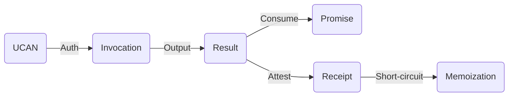
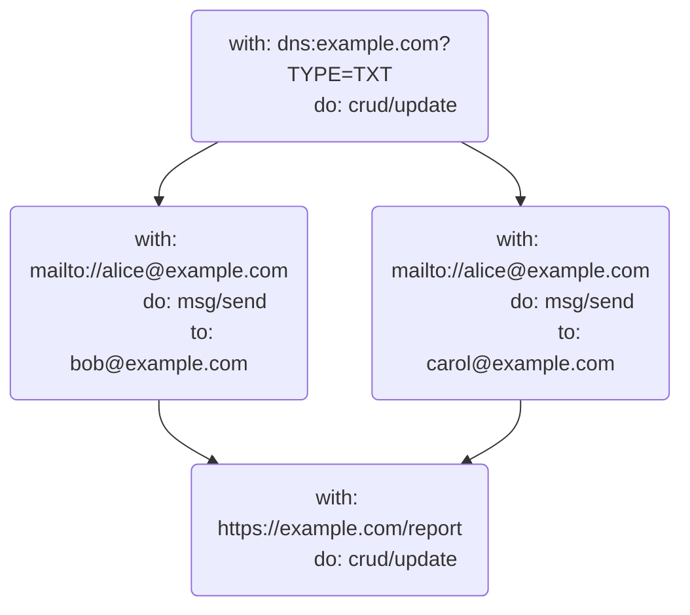

# UCAN Execution Specification v0.1.0

## Editors

- [Irakli Gozalishvili](https://github.com/Gozala), [DAG House](https://dag.house/)
- [Brooklyn Zelenka](https://github.com/expede/), [Fission](https://fission.codes/)

## Authors

- [Brooklyn Zelenka](https://github.com/expede/), [Fission](https://fission.codes/)
- [Irakli Gozalishvili](https://github.com/Gozala), [DAG House](https://dag.house/)

## Depends On

- [DAG-CBOR]
- [UCAN]
- [UCAN-IPLD]
- [Varsig]

# 0 Abstract

UCAN Execution defines a format for expressing the intention to execute delegated UCAN capabilities, the attested receipts from an execution, and how to extend computation via promise pipelining.

> This is based on [UCAN invocation] specification, altering it slightly in order to make tasks self-contained as discussed in [#6](https://github.com/ucan-wg/invocation/issues/6)

## Language

The key words "MUST", "MUST NOT", "REQUIRED", "SHALL", "SHALL NOT", "SHOULD", "SHOULD NOT", "RECOMMENDED", "MAY", and "OPTIONAL" in this document are to be interpreted as described in [RFC 2119](https://datatracker.ietf.org/doc/html/rfc2119).

# 1 Introduction

> Just because you can doesn't mean that you should
>
> — Anonymous

UCAN is a chained-capability format. A UCAN contains all of the information that one would need to perform some task, and the provable authority to do so. This begs the question: can UCAN be used directly as an RPC language?

Some teams have had success with UCAN directly for RPC when the intention is clear from context. This can be successful when there is more information on the channel than the UCAN itself (such as an HTTP path that a UCAN is sent to). However, capability invocation contains strictly more information than delegation: all of the authority of UCAN, plus the command to perform the task.

## 1.1 Intuition

## 1.1.1 Car Keys

Consider the following fictitious scenario:

Akiko is going away for the weekend. Her good friend Boris is going to borrow her car while she's away. They meet at a nearby cafe, and Akiko hands Boris her car keys. Boris now has the capability to drive Akiko's car whenever he wants to. Depending on their plans for the rest of the day, Akiko may find Boris quite rude if he immediately leaves the cafe to go for a drive. On the other hand, if Akiko asks Boris to run some last minute pre-vacation errands for that require a car, she may expect Boris to immediately drive off.

## 1.1.2 Lazy vs Eager Evaluation

In a referentially transparent setting, the description of a task is equivalent to having done so: a function and its results are interchangeable. [Programming languages with call-by-need semantics](https://en.wikipedia.org/wiki/Haskell) have shown that this can be an elegant programming model, especially for pure functions. However, _when_ something will run can sometimes be unclear.

Most languages use eager evaluation. Eager languages must contend directly with the distinction between a reference to a function and a command to run it. For instance, in JavaScript, adding parentheses to a function will run it. Omitting them lets the program pass around a reference to the function without immediately invoking it.

```js
const message = () => alert("hello world")
message // Nothing happens
message() // A message interups the user
```

Delegating a capability is like the statement `message`. Task is akin to `message()`. It's true that sometimes we know to run things from their surrounding context without the parentheses:

```js
;[1, 2, 3].map(message) // Message runs 3 times
```

However, there is clearly a distinction between passing a function and invoking it. The same is true for capabilities: delegating the authority to do something is not the same as asking for it to be done immediately, even if sometimes it's clear from context.

## 1.2 Gossiping of delegations

In web3.storage user `alice@web.mail` can delegate to store file in her space to `bob@send.io` by sending that delegation to `web3.storage`. If service were to interpret this as invocation it would fail due to principal misalignment. By distinguishing capability invocation from delegation service is able to more correctly handle such a message, if it is an invocation it will still error due to principal misalignment, if it is a delegation it will hold it in Bob's inbox to be picked up when he's comes online.

## 1.3 Separation of Concerns

Information about the scheduling, order, and pipelining of tasks is orthogonal to the flow of authority. An agent collaborating with the original executor does not need to know that their call is 3 invocations deep; they only need to know that they been asked to perform some task by the latest invoker.

As we shall see in the [discussion of promise pipelining][pipelines], asking an agent to perform a sequence of tasks before you know the exact parameters requires delegating capabilities for all possible steps in the pipeline. Pulling pipelining detail out of the core UCAN spec serves two functions: it keeps the UCAN spec focused on the flow of authority, and makes salient the level of de facto authority that the executor has (since they can claim any value as having returned for any step).

```
  ────────────────────────────────────────────Time──────────────────────────────────────────────────────►

┌──────────────────────────────────────────Delegation─────────────────────────────────────────────────────┐
│                                                                                                         │
│  ┌─────────┐   ┌─────────┐   ┌─────────┐         ┌─────────┐                ┌─────────┐                 │
│  │         │   │         │   │         │         │         │                │         │                 │
│  │  Alice  ├──►│   Bob   ├──►│  Carol  ├────────►│   Dan   ├───────────────►│  Erin   │                 │
│  │         │   │         │   │         │         │         │                │         │                 │
│  └─────────┘   └─────────┘   └─────────┘         └─────────┘                └─────────┘                 │
│                                                                                                         │
└─────────────────────────────────────────────────────────────────────────────────────────────────────────┘

┌──────────────────────────────────────────Invocation─────────────────────────────────────────────────────┐
│                                                                                                         │
│                              ┌─────────┐         ┌─────────┐                                            │
│                              │         │         │         │                                            │
│                              │  Carol  ╞═══All══►│   Dan   │                                            │
│                              │         │         │         │                                            │
│                              └─────────┘         └─────────┘                                            │
│                                                                                                         │
│                                                  ┌─────────┐                              ┌─────────┐   │
│                                                  │         │                              │         │   │
│                                                  │   Dan   ╞═══════════Update DB═════════►│  Erin   │   │
│                                                  │         │                              │         │   │
│                                                  └─────────┘                              └─────────┘   │
│                                                                                                         │
│                                                           ┌─────────┐                ┌─────────┐        │
│                                                           │         │                │         │        │
│                                                           │   Dan   ╞═══Read Email══►│  Erin   │        │
│                                                           │         │           ▲    │         │        │
│                                                           └─────────┘           ┆    └─────────┘        │
│                                                                               With                      │
│                                                                               Result                    │
│                                                                  ┌─────────┐   Of         ┌─────────┐   │
│                                                                  │         │    ┆         │         │   │
│                                                                  │   Dan   ╞════Set DNS══►│  Erin   │   │
│                                                                  │         │              │         │   │
│                                                                  └─────────┘              └─────────┘   │
│                                                                                                         │
└─────────────────────────────────────────────────────────────────────────────────────────────────────────┘
```

## 1.3 A Note On Serialization

The JSON examples below are given in [DAG-JSON], but UCAN Task is actually defined as IPLD. This makes UCAN Task agnostic to encoding. DAG-JSON follows particular conventions around wrapping CIDs and binary data in tags like so:

```json
// CID
{"/": "Qmf412jQZiuVUtdgnB36FXFX7xg5V6KEbSJ4dpQuhkLyfD"}

// Bytes (e.g. a signature)
{"/": {"bytes": "s0m3Byte5"}}
```

This format help disambiguate type information in generic [DAG-JSON] tooling. However, your presentation need not be in this specific format, as long as it can be converted to and from this cleanly. As it is used for the signature format, [DAG-CBOR] is RECOMMENDED.

## 1.4 Note on Schema Syntax

We use [IPLD Schema] syntax extended with generics. Standard IPLD Schema can be derived by ignoring parameters enclosed in angle brackets and interpreting parameters as `Any`.

Below schema is in our extended syntax

```ipldsch
type Box<T> struct {
  value T
}
```

Above schema compiled to standard syntax

```ipldsch
type Box struct {
  value Box_T
}
type Box_T any
```

## 1.5 Signatures

All payloads described in this spec MUST be signed with a [Varsig].

# 2 High-Level Concepts

## 2.1 Roles

Task adds two new roles to UCAN: invoker and executor. The existing UCAN delegator and delegate principals MUST persist to the invocation.

| UCAN Field | Delegation                             | Task                            |
| ---------- | -------------------------------------- | ------------------------------- |
| `iss`      | Delegator: transfer authority (active) | Invoker: request task (active)  |
| `aud`      | Delegate: gain authority (passive)     | Executor: perform task (active) |

### 2.1.1 Invoker

The invoker signals to the executor that a task associated with a UCAN SHOULD be performed.

The invoker MUST be the UCAN delegator. Their DID MUST be authenticated in the `iss` field of the contained UCAN.

### 2.1.2 Executor

The executor is directed to perform some task described in the UCAN by the invoker.

The executor MUST be the UCAN delegate. Their DID MUST be set the in `aud` field of the contained UCAN.

## 2.2 Components



### 2.2.1 Invocation

An [Invocation] is like a cryptographically signed function application, a request to perform some action on a resource with specific input. Invocation MAY have optional metadata that is not used to describe the meaning of the computation or effect to be run. Executor MUST produce same result regardless of the metadata.

### 2.2.2 Receipt

A [Receipt] describes the output of an invocation. It is referenced either by the invocation itself or an IPLD Link of the invocation.

### 2.2.3 Promise

A [promise] is a reference to expected result of the invocation receipt.

## 2.3 IPLD Schema

```ipldsch
type Invocation<In> struct {
  v      SemVer

  iss    Principal
  aud    Principal

  with   URI
  do     Ability
  input  In (implicit {})

  meta   {String : Any} (implicit {})

  prf    [&UCAN]
  nnc    optional String
  nbf    optional Int

  s      Varsig
}

type Receipt<In, Out> struct {
  job     &Invocation<In>

  # output of the invocation
  out     Out

  # Related receipts
  origin optional &Receipt<In, Any>

  # All the other metadata
  meta    { String: Any }

  # Principal that issued this receipt
  iss     Principal

  # Signature from the `iss`.
  s       Varsig

  # Proof that `iss` was authorized to by invocation `aud` to issue
  # receipts. Can be omitted if `job.aud === this.iss`
  prf     [&UCAN] implicit ([])
}

# Promise is a way to reference data from the output of the invocation
type Promise struct {
  Await    "<-"
} representation keyed


type Await union {
  # Invocation reference
  | &Invocation<Any>
  # Inline invocation
  | Invocation<Any>
  # Specific invocation output
  | ResultSelector
} representation kinded

type ResultSelector struct {
  job   InvocationReference
  at    Selector
} representation tuple

type Selector union {
  | Key     String
  | Path    [String]
} kinded

type InvocationReference union {
  | Invocation<Any>
  | &Invocation<Any>
} representation kinded
```

# 3 Invocation

An invocation is the smallest unit of work that can be requested from a UCAN. It describes one `(resource, ability, input)` triple. The `input` field is free form, and depend on the specific resource and ability being interacted with, and not described in this specification.

Using the JavaScript analogy from the introduction, an invocation is similar to function application:

```json
{
  "v": "0.1.0",
  "iss": "did:key:z6Mkqa4oY9Z5Pf5tUcjLHLUsDjKwMC95HGXdE1j22jkbhz6r",
  "aud": "did:web:ucan.run",

  "with": "mailto:alice@example.com",
  "do": "msg/send",
  "inputs": {
    "to": ["bob@example.com", "carol@example.com"],
    "subject": "hello",
    "body": "world"
  },

  "prf": [
    { "/": "bafkreie2cyfsaqv5jjy2gadr7mmupmearkvcg7llybfdd7b6fvzzmhazuy" }
  ],
  "s": {
    "/": {
      "bytes:": "5vNn4--uTeGk_vayyPuNTYJ71Yr2nWkc6AkTv1QPWSgetpsu8SHegWoDakPVTdxkWb6nhVKAz6JdpgnjABppC7"
    }
  }
}
```

```js
// Pseudocode
msg.send("mailto:alice@example.com", {
  to: ["bob@example.com", "carol@example.com"],
  subject: "hello",
  body: "world",
})
```

Later, when we explore [Promise]s, this also includes capturing the promise:

```json
{
  "v": "0.1.0",
  "iss": "did:key:z6Mkqa4oY9Z5Pf5tUcjLHLUsDjKwMC95HGXdE1j22jkbhz6r",
  "aud": "did:web:ucan.run",
  "with": "mailto://alice@example.com",
  "do": "msg/send",
  "input": {
    "to": {
      "<-": [
        {
          "v": "0.1.0",
          "iss": "did:key:zAlice",
          "aud": "did:web:ucan.run",
          "with": "https://example.com/mailinglist",
          "do": "crud/read",
          "s": {
            "/": {
              "bytes:": "5vNn4--uTeGk_vayyPuNTYJ71Yr2nWkc6AkTv1QPWSgetpsu8SHegWoDakPVTdxkWb6nhVKAz6JdpgnjABppC7"
            }
          },
          "prf": [{"/": "bafybeia3tspzaay4gcx3npcczgidbrsutq7yxnag3sfzrmvua6ogqjwy7a"}]
        },
        "ok"
      ],
    }
    "subject": "hello",
    "body": "world"
  },
  "prf": [
    { "/": "bafkreie2cyfsaqv5jjy2gadr7mmupmearkvcg7llybfdd7b6fvzzmhazuy" }
  ],
  "s": {
    "/": {
      "bytes:": "5vNn4--uTeGk_vayyPuNTYJ71Yr2nWkc6AkTv1QPWSgetpsu8SHegWoDakPVTdxkWb6nhVKAz6JdpgnjABppC7"
    }
  }
}
```

```js
// Pseudocode
const mailingList = crud.read("https://exmaple.com/mailinglist", {})
msg.send("mailto:alice@example.com", {
  to: mailingList.catch(error => error).then(result => result.ok),
  subject: "hello",
  body: "world",
})
```

## 3.1 Schema

```ipldsch
type Invocation<In> struct {
  v      SemVer

  iss    Principal
  aud    Principal

  with   URI
  do     Ability
  input  In (implicit {})

  meta   {String : Any} (implicit {})

  prf    [&UCAN]
  nnc    optional String
  nbf    optional Int

  s      Varsig
}
```

## 3.2 Fields

An Invocation authorizes execution of the capability. There are a few invariants that MUST hold between the `iss`, `aud`, `prf` and `sig` fields:

- The `iss` MUST be the Invoker.
- All of the `prf` UCANs MUST list the Invoker in their `iss`.
- All of the `prf` UCANs MUST list the Executor in their `aud` field, grating it authority to perform some action on a resource, or be the root authority for it.
- The `sig` field MUST be produced by the Invoker
- Invocation MUST be provably authorized by the UCANs in the `prf` field.

### 3.2.1 UCAN Invocation Version

The `v` field MUST contain the SemVer-formatted version of the UCAN Invocation Specification that this struct conforms to.

### 3.2.2 Invoker

The `iss` field MUST be a principal authorizing the invocation. It MUST be encoded in format describe in [UCAN-IPLD].

### 3.2.3 Executor

The `aud` field MUST be a principal authorized to perform the invocation. It MUST be encoded in format described in [UCAN-IPLD].

### 3.2.4 Resource

The `with` field MUST contain the [URI](https://en.wikipedia.org/wiki/Uniform_Resource_Identifier) of the resource being accessed. If the resource being accessed is some static data, it is RECOMMENDED to reference it by the [`data`](https://en.wikipedia.org/wiki/Data_URI_scheme), [`ipfs`](https://docs.ipfs.tech/how-to/address-ipfs-on-web/#native-urls), or [`magnet`](https://en.wikipedia.org/wiki/Magnet_URI_scheme) URI schemes.

### 3.2.5 Ability

The `do` field MUST contain a [UCAN Ability](https://github.com/ucan-wg/spec/#23-ability). This field can be thought of as the message or trait being sent to the resource.

### 3.2.6 Input

The `input` field MUST contain any arguments expected by the URI/Ability pair. This MAY be different between different URIs and Abilities, and is thus left to the executor to define the shape of this data.

UCAN capability provided in proofs MAY impose certain constraint on the type of `Input` allowed.

### 3.2.7 Proofs

The `prf` field MUST contain links to any UCANs that provide the authority to perform the invocation. All of the outermost proofs MUST either

1. Set `aud` fields to the [Executor]'s DID and `iss` field set to the [Invoker]'s DID, allowing Executor to (re)delegate enclosed capabilities.
2. Set `aud` field to the [Invoker]'s DID, preventing Executor from (re)delegating enclosed capabilities.

### 3.2.8 Nonce

If present, the OPTIONAL `nnc` field MAY include a random nonce expressed in ASCII. This field can ensures that multiple invocations are unique.

### 3.2.9 Metadata

The OPTIONAL `meta` field MAY be used to include human-readable descriptions, tags, execution hints, resource limits, and so on. If present, the `meta` field MUST contain a map with string keys. The contents of the map are left undefined to encourage extensible use.

Data inside the `meta` field SHOULD NOT be used for [Receipt]s.

### 3.2.10 Signature

The `s` field MUST contain a [Varsig] of the invocation payload, an invocation without `meta` and `s` fields encoded in [DAG-CBOR].

## 3.3 DAG-JSON Examples

Interacting with an HTTP API:

```json
{
  "v": "0.1.0",
  "iss": "did:key:z6Mkqa4oY9Z5Pf5tUcjLHLUsDjKwMC95HGXdE1j22jkbhz6r",
  "aud": "did:web:ucan.run",
  "with": "https://example.com/blog/posts",
  "do": "crud/create",
  "input": {
    "headers": {
      "content-type": "application/json"
    },
    "payload": {
      "title": "How UCAN Tasks Changed My Life",
      "body": "This is the story of how one spec changed everything...",
      "topics": ["authz", "journal"],
      "draft": true
    }
  },
  "s": {
    "/": {
      "bytes:": "5vNn4--uTeGk_vayyPuNTYJ71Yr2nWkc6AkTv1QPWSgetpsu8SHegWoDakPVTdxkWb6nhVKAz6JdpgnjABppC7"
    }
  },
  "prf": [
    { "/": "bafybeia3tspzaay4gcx3npcczgidbrsutq7yxnag3sfzrmvua6ogqjwy7a" }
  ]
}
```

Sending Email:

```json
{
  "v": "0.1.0",
  "iss": "did:key:z6Mkqa4oY9Z5Pf5tUcjLHLUsDjKwMC95HGXdE1j22jkbhz6r",
  "aud": "did:web:ucan.run",
  "with": "mailto:akiko@example.com",
  "do": "msg/send",
  "input": {
    "to": ["boris@example.com", "carol@example.com"],
    "subject": "Coffee",
    "body": "Hey you two, I'd love to get coffee sometime and talk about UCAN Tasks!"
  },
  "meta": {
    "dev/tags": ["friends", "coffee"],
    "dev/priority": "high"
  },
  "s": {
    "/": {
      "bytes:": "5vNn4--uTeGk_vayyPuNTYJ71Yr2nWkc6AkTv1QPWSgetpsu8SHegWoDakPVTdxkWb6nhVKAz6JdpgnjABppC7"
    }
  },
  "prf": [
    { "/": "bafybeia3tspzaay4gcx3npcczgidbrsutq7yxnag3sfzrmvua6ogqjwy7a" }
  ]
}
```

Running WebAssembly from binary:

```json
{
  "v": "0.1.0",
  "iss": "did:key:z6Mkqa4oY9Z5Pf5tUcjLHLUsDjKwMC95HGXdE1j22jkbhz6r",
  "aud": "did:web:ucan.run",
  "with": "data:application/wasm;base64,AHdhc21lci11bml2ZXJzYWwAAAAAAOAEAAAAAAAAAAD9e7+p/QMAkSAEABH9e8GowANf1uz///8UAAAAAAAAAAAAAAAAAAAAAAAAAAAAAAAAAAAAAAAAAAAAAAAAAAAAAAAAAP////8AAAAACAAAACoAAAAIAAAABAAAACsAAAAMAAAACAAAANz///8AAAAA1P///wMAAAAlAAAALAAAAAAAAAAUAAAA/Xu/qf0DAJHzDx/44wMBqvMDAqphAkC5YAA/1mACALnzB0H4/XvBqMADX9bU////LAAAAAAAAAAAAAAAAAAAAAAAAAAvVXNlcnMvZXhwZWRlL0Rlc2t0b3AvdGVzdC53YXQAAGFkZF9vbmUHAAAAAAAAAAAAAAAAYWRkX29uZV9mAAAADAAAAAAAAAABAAAAAAAAAAkAAADk////AAAAAPz///8BAAAA9f///wEAAAAAAAAAAQAAAB4AAACM////pP///wAAAACc////AQAAAAAAAAAAAAAAnP///wAAAAAAAAAAlP7//wAAAACM/v//iP///wAAAAABAAAAiP///6D///8BAAAAqP///wEAAACk////AAAAAJz///8AAAAAlP///wAAAACM////AAAAAIT///8AAAAAAAAAAAAAAAAAAAAAAAAAAET+//8BAAAAWP7//wEAAABY/v//AQAAAID+//8BAAAAxP7//wEAAADU/v//AAAAAMz+//8AAAAAxP7//wAAAAAAAAAAAAAAAAAAAAAAAAAAAAAAAAAAAAAU////pP///wAAAAAAAQEBAQAAAAAAAACQ////AAAAAIj///8AAAAAAAAAAAAAAADQAQAAAAAAAA==",
  "do": "wasm/run",
  "input": {
    "func": "add_one",
    "args": [42]
  },
  "meta": {
    "dev/notes": "The standard Wasm demo",
    "ipvm/verification": "attestation",
    "ipvm/resources": {
      "gas": 5000
    }
  },
  "s": {
    "/": {
      "bytes:": "5vNn4--uTeGk_vayyPuNTYJ71Yr2nWkc6AkTv1QPWSgetpsu8SHegWoDakPVTdxkWb6nhVKAz6JdpgnjABppC7"
    }
  },
  "prf": [
    { "/": "bafybeia3tspzaay4gcx3npcczgidbrsutq7yxnag3sfzrmvua6ogqjwy7a" }
  ]
}
```

Batch invocation is simply passing promises as inputs to an invocation

```json
{
  "v": "0.1.0",
  "iss": "did:key:z6Mkqa4oY9Z5Pf5tUcjLHLUsDjKwMC95HGXdE1j22jkbhz6r",
  "aud": "did:web:ucan.run",
  "with": "javascript:(data) => data",
  "do": "js/call",
  "input": {
    "publishPost": {
      "<-": [
        {
          "iss": "did:key:z6Mkqa4oY9Z5Pf5tUcjLHLUsDjKwMC95HGXdE1j22jkbhz6r",
          "aud": "did:web:ucan.run",
          "with": "https://example.com/blog/posts",
          "do": "crud/create",
          "input": {
            "headers": {
              "content-type": "application/json"
            },
            "payload": {
              "title": "How UCAN Tasks Changed My Life",
              "body": "This is the story of how one spec changed everything...",
              "topics": ["authz", "journal"],
              "draft": true
            }
          },
          "s": {
            "/": {
              "bytes:": "5vNn4--uTeGk_vayyPuNTYJ71Yr2nWkc6AkTv1QPWSgetpsu8SHegWoDakPVTdxkWb6nhVKAz6JdpgnjABppC7"
            }
          },
          "prf": [
            {
              "/": "bafybeia3tspzaay4gcx3npcczgidbrsutq7yxnag3sfzrmvua6ogqjwy7a"
            }
          ]
        },
        "ok"
      ]
    },
    "sendEmail": {
      "<-": [
        {
          "iss": "did:key:z6Mkqa4oY9Z5Pf5tUcjLHLUsDjKwMC95HGXdE1j22jkbhz6r",
          "aud": "did:web:ucan.run",
          "with": "mailto:akiko@example.com",
          "do": "msg/send",
          "input": {
            "to": ["boris@example.com", "carol@example.com"],
            "subject": "Coffee",
            "body": "Hey you two, I'd love to get coffee sometime and talk about UCAN Tasks!"
          },
          "s": {
            "/": {
              "bytes:": "5vNn4--uTeGk_vayyPuNTYJ71Yr2nWkc6AkTv1QPWSgetpsu8SHegWoDakPVTdxkWb6nhVKAz6JdpgnjABppC7"
            }
          },
          "prf": [
            {
              "/": "bafybeia3tspzaay4gcx3npcczgidbrsutq7yxnag3sfzrmvua6ogqjwy7a"
            }
          ]
        },
        "ok"
      ]
    },
    "sendTextMessage": {
      "<-": [
        {
          "/": "bafybeibwlfwol5bdwj75hdqs3liv6z7dyqwtd2t4ovvgncv4ixkaxlkfle"
        },
        "ok"
      ]
    }
  },
  "s": {
    "/": {
      "bytes:": "5vNn4--uTeGk_vayyPuNTYJ71Yr2nWkc6AkTv1QPWSgetpsu8SHegWoDakPVTdxkWb6nhVKAz6JdpgnjABppC7"
    }
  }
}
```

# 4 Receipt

An Invocation Receipt is an attestation of the Result of an Invocation. A Receipt MUST be signed by the Executor (the `aud` of the associated UCANs) or it's delegate, in which case proof of delegation (of the invoked capability) from Executor to the Signer (the `iss` of the receipt) MUST be provided in `prf`.

**NB: a Receipt this does not guarantee correctness of the result!** The statement's veracity MUST be only understood as an attestation from the executor.

Receipts MUST use the same version as the invocation that they contain.

## 4.1 Schema

```ipldsch
type Receipt<In, Out> struct {
  job     &Invocation<In>

  # output of the invocation
  out     Out

  # Related receipts
  origin optional &Receipt<In, Any>

  # All the other metadata
  meta    { String: Any }

  # Principal that issued this receipt
  iss     Principal

  # Proof that `iss` was authorized to by invocation `aud` to issue
  # receipts. Can be omitted if `job.aud === this.iss`
  prf     [&UCAN] implicit ([])

  # Signature from the `iss`.
  s       Varsig
}
```

## 4.2 Fields

### 4.2.1 Invocation

The `job` field MUST include a link to the Invocation that the Receipt is for.

### 4.2.2 Output

The `out` field MUST contain the output of the invocation. It is RECOMMENDED that invocation produce output in [Result] format or it's extension with added type variants when needed, which allows selecting either success or failure branch during promise pipelining.

### 4.2.2.1 Result

A Result records success or a failure state of the [Invocation].

#### 4.2.2.1.1 Variants

```ipldsch
type Result<T, X> union {
  | T  ("ok")    # Success
  | X  ("error") # Failure
} representation keyed
```

#### 4.2.2.1.2 Success

The success branch MUST contain the value returned from a successful invocation wrapped in the `"ok"` tag. The exact shape of the returned data is left undefined to allow for flexibility.

```json
{ "ok": 42 }
```

#### 4.2.2.1.3 Failure

The failure branch MAY contain detail about why execution failed wrapped in the `"error"` tag. The exact shape of the returned data is left undefined to allow for flexibility.

If no information is available, this field SHOULD be set to `{}`.

```json
{
  "error": {
    "dev/reason": "unauthorized",
    "http/status": 401
  }
}
```

### 4.2.2.2 Extended Result

An extension of Result records SHOULD be used when result of [Invocation] does not fit binary success / failure criteria.

```ipldsch
type Status<T, X, P> union {
  | T  ("ok")      # Success
  | X  ("error")   # Failure
  | P  ("pending") # Pending
} representation keyed
```

```json
{ "pending": {} }
```

### 4.2.3 Recursive Receipt

In the case when Invocation execution is delimited it MAY produce multiple states that SHOULD be chained by `origin` field.

### 4.2.4 Metadata Fields

The metadata field MAY be omitted or used to contain additional data about the receipt. This field MAY be used for tags, commentary, trace information, and so on.

### 4.2.5 Receipt Issuer

The `iss` field MUST contain the signer of the receipt. It MAY be an `aud` of the Invocation or it's delegate. In later case proof delegating invoked capability MUST be provided.

### 4.2.6 Proofs

The `prf` field MUST contain links to any UCANs that delegate authority to perform the invocation from the Executor to the receipt issuer (`iss`). If Executor and the receipt issuer are same no proofs are required.

### 4.2.7 Signature

The `s` field MUST contain a [Varsig] of the receipt payload, a receipt without `s` fields encoded in [DAG-CBOR]. The signature MUST be generated by the `iss`.

## 4.3 DAG-JSON Examples

```json
{
  "job": { "/": "bafkreifzjut3te2nhyekklss27nh3k72ysco7y32koao5eei66wof36n5e" },
  "out": {
    "ok": [
      {
        "from": "bob@example.com",
        "text": "Hello world!"
      },
      {
        "from": "carol@example.com",
        "text": "What's up?"
      }
    ]
  },
  "meta": {
    "time": [400, "hours"],
    "retries": 2
  },
  "iss": "did:web:ucan.run",
  "prf": [
    { "/": "bafkreie2cyfsaqv5jjy2gadr7mmupmearkvcg7llybfdd7b6fvzzmhazuy" }
  ],
  "sig": {
    "/": {
      "bytes": "bdNVZn_uTrQ8bgq5LocO2y3gqIyuEtvYWRUH9YT-SRK6v_SX8bjt_VZ9JIPVTdxkWb6nhVKBt6JGpgnjABpOCA"
    }
  }
}
```

# 5 Promise

> Machines grow faster and memories grow larger. But the speed of light is constant and New York is not getting any closer to Tokyo. As hardware continues to improve, the latency barrier between distant machines will increasingly dominate the performance of distributed computation. When distributed computational steps require unnecessary round trips, compositions of these steps can cause unnecessary cascading sequences of round trips
>
> — [Mark Miller](https://github.com/erights), [Robust Composition](http://www.erights.org/talks/thesis/markm-thesis.pdf)

There MAY not be enough information to described an Invocation at creation time. However, all of the information required to construct the next request in a sequence MAY be available in the same Batch, or in a previous (but not yet complete) Invocation.

Some invocations MAY require input from set of other invocations. Waiting for each request to complete before proceeding to the next task has a performance impact due to the amount of latency. [Promise pipelining](http://erights.org/elib/distrib/pipeline.html) is a solution to this problem: by referencing a prior invocation, a pipelined invocation can direct the executor to use the output of one invocations into the input of the other. This liberates the invoker from waiting for each step.

A Promise MAY be used as a variable placeholder for a concrete value in an [Invocation] output, waiting on a previous step to complete.

For example, consider the following invocation batch:

```json
{
  "v": "0.1.0",
  "iss": "did:key:z6Mkqa4oY9Z5Pf5tUcjLHLUsDjKwMC95HGXdE1j22jkbhz6r",
  "aud": "did:web:ucan.run",

  "with": "mailto:akiko@example.com",
  "do": "msg/send",

  "inputs": {
    "to": {
      "<-": [
        {
          "/": "bafkreidcqdxosqave5u5pml3pyikiglozyscgqikvb6foppobtk3hwkjn4"
        },
        "ok"
      ]
    },
    "subject": "Coffee",
    "body": {
      "promise/ok": [
        {
          "/": "bafkreieimb4hvcwizp74vu4xfk34oivbdojzqrbpg2y3vcboqy5hwblmeu"
        },
        "ok"
      ]
    }
  }

  "prf": [
    { "/": "bafkreie2cyfsaqv5jjy2gadr7mmupmearkvcg7llybfdd7b6fvzzmhazuy" }
  ],
  "s": {
    "/": {
      "bytes:": "5vNn4--uTeGk_vayyPuNTYJ71Yr2nWkc6AkTv1QPWSgetpsu8SHegWoDakPVTdxkWb6nhVKAz6JdpgnjABppC7"
    }
  }
}
```

Which is roughly equivalent of the of the following invocation, which inlines above linked invocations instead for illustration purposes.

> ℹ️ In most cases invocation batches are likely to be [CAR] encoded to avoid running into [block size limitation](https://discuss.ipfs.tech/t/git-on-ipfs-links-and-references/730/2) making inlined variants less common.

```json
{
  "v": "0.1.0",
  "iss": "did:key:z6Mkqa4oY9Z5Pf5tUcjLHLUsDjKwMC95HGXdE1j22jkbhz6r",
  "aud": "did:web:ucan.run",

  "with": "mailto:akiko@example.com",
  "do": "msg/send",

  "inputs": {
    "to": {
      "<-": [
        {
          "meta": { "name": "create-draf" },

          "v": "0.1.0",
          "iss": "did:key:z6Mkqa4oY9Z5Pf5tUcjLHLUsDjKwMC95HGXdE1j22jkbhz6r",
          "aud": "did:web:ucan.run",
          "with": "https://example.com/blog/posts",
          "do": "crud/create",
          "inputs": {
            "payload": {
              "title": "How UCAN Tasks Changed My Life",
              "body": "This is the story of how one spec changed everything..."
            }
          },
          "prf": [
            "/": "bafkreieimb4hvcwizp74vu4xfk34oivbdojzqrbpg2y3vcboqy5hwblmeu"
          ],
          "s": {
            "/": {
              "bytes:": "5vNn4--uTeGk_vayyPuNTYJ71Yr2nWkc6AkTv1QPWSgetpsu8SHegWoDakPVTdxkWb6nhVKAz6JdpgnjABppC7"
            }
          }
        },
        "ok"
      ]
    },
    "subject": "Coffee",
    "body": {
      "promise/ok": [
        {
          "meta": { "name": "get-editors" },

          "v": "0.1.0",
          "iss": "did:key:z6Mkqa4oY9Z5Pf5tUcjLHLUsDjKwMC95HGXdE1j22jkbhz6r",
          "aud": "did:web:ucan.run",

          "with": "https://example.com/users/editors",
          "do": "crud/read"

          "prf": [
            "/": "bafkreieimb4hvcwizp74vu4xfk34oivbdojzqrbpg2y3vcboqy5hwblmeu"
          ],
          "s": {
            "/": {
              "bytes:": "5vNn4--uTeGk_vayyPuNTYJ71Yr2nWkc6AkTv1QPWSgetpsu8SHegWoDakPVTdxkWb6nhVKAz6JdpgnjABppC7"
            }
          }
        },
        "ok"
      ]
    }
  },

  "prf": [
    { "/": "bafkreie2cyfsaqv5jjy2gadr7mmupmearkvcg7llybfdd7b6fvzzmhazuy" }
  ],
  "s": {
    "/": {
      "bytes:": "5vNn4--uTeGk_vayyPuNTYJ71Yr2nWkc6AkTv1QPWSgetpsu8SHegWoDakPVTdxkWb6nhVKAz6JdpgnjABppC7"
    }
  }
}
```

By analogy, above examples can be interpreted roughly as follows:

```js
const createDraft = crud.create("https://example.com/blog/posts", {
  payload: {
    title: "How UCAN Tasks Changed My Life",
    body: "This is the story of how one spec changed everything...",
  },
})

const getEditors = crud.read("https://example.com/users/editors")

const notify = msg.send("mailto:akiko@example.com", {
  to: await createDraft,
  subject: "Coffee",
  body: await getEditors,
})
```

While a Promise MAY be substituted for any field in an Invocation, substituting the `do` field is NOT RECOMMENDED. The `do` field is critical in understanding what kind of action will be performed, and schedulers SHOULD use this fields to grant atomicity, parallelize tasks, and so on.

After resolution, the Invocation MUST be validated against the UCANs known to the Executor. A Promise resolved to an invocation that is not backed by a valid UCAN MUST NOT be executed, and SHOULD return an unauthorized error to the user.

Promises MAY be used inside of a single Invocation, or across multiple Invocations, and MAY even be across multiple Invokers and Executors. As long as the pointer can be resolved, any invocation MAY be promised. This is sometimes referred to as ["promise pipelining"](http://erights.org/elib/distrib/pipeline.html).

A Promise SHOULD resolve to a [Result] or it's [extension][extended result]. If a particular branch's value is required to be unwrapped, the Result tag (`ok` or `error`) MAY be supplied as a selector.

An invocation MUST fail if promise is resolved does not match the supplied branch selector.

## 5.1 Schema

The `Promise` describes a pointer to the eventual value in a Promise. When the `selector` of the `Await` omitted pointer resolves to the invocation result (`out` of the Receipt), otherwise it resolves to the specified branch `ok` on success and `error` on failure. Selector could also be used to resolve value nested deeper in any branch.

```ipldsch
# Promise is a way to reference data from the output of the invocation
type Promise struct {
  Await    "<-"
} representation keyed


type Await union {
  # Invocation reference
  | &Invocation<Any>
  # Inline invocation
  | Invocation<Any>
  # Specific invocation output
  | ResultSelector
} representation kinded

type ResultSelector struct {
  job   InvocationReference
  at    Selector
} representation tuple

type Selector union {
  | Key     String
  | Path    [String]
} kinded

type InvocationReference union {
  | Invocation<Any>
  | &Invocation<Any>
} representation kinded
```

If there are dependencies or ordering required, then you need a promise pipeline

## 5.2 Pipelines

Pipelining uses promises as inputs to determine the required dataflow graph. The following examples both express the following dataflow graph:

### 5.2.1 Batched



```json
{
  "bafyreifngx2r7ifssddx5ohdxsn2x5ukfhh6rxy6hswulkxbn6yw6f7jce": {
    "v": "0.1.0",
    "iss": "did:key:z6Mkqa4oY9Z5Pf5tUcjLHLUsDjKwMC95HGXdE1j22jkbhz6r",
    "aud": "did:web:ucan.run",
    "with": "dns:example.com?TYPE=TXT",
    "do": "crud/update",
    "input": { "value": "hello world" },
    "prf": [
      { "/": "bafyreicelfj3kxtnpp2kwefs66rebbnpawjjnvkscrdtyjc6bxjmuix27u" }
    ],
    "sig": {
      "/": {
        "bytes": "bdNVZn_uTrQ8bgq5LocO2y3gqIyuEtvYWRUH9YT-SRK6v_SX8bjt-VZ9JIPVTdxkWb6nhVKBt6JGpgnjABpOCA"
      }
    }
  },
  "bafyreigb4gzn3ghfownvf5u6tqv4gjb247ai4fbv56nadtcpfznh37y5p4": {
    "v": "0.1.0",
    "iss": "did:key:z6Mkqa4oY9Z5Pf5tUcjLHLUsDjKwMC95HGXdE1j22jkbhz6r",
    "aud": "did:web:ucan.run",
    "with": "mailto://alice@example.com",
    "do": "msg/send",
    "input": {
      "to": "bob@example.com",
      "subject": "DNSLink for example.com",
      "body": {
        "<-": [
          {
            "/": "bafyreifngx2r7ifssddx5ohdxsn2x5ukfhh6rxy6hswulkxbn6yw6f7jce"
          },
          "ok"
        ]
      }
    },
    "prf": [
      { "/": "bafyreialservj7dxazg4cskm5fuqwh5atgs54rgkvpmtkylbddygs37tce" }
    ],
    "sig": {
      "/": {
        "bytes": "bdNVZn_uTrQ8bgq5LocO2y3gqIyuEtvYWRUH9YT-SRK6v_SX8bjt-VZ9JIPVTdxkWb6nhVKBt6JGpgnjABpOCA"
      }
    }
  },
  "bafyreidqviro3x5pxy6kneolt6qjdorva46ayrtifeouhyudnxhucqqe7u": {
    "v": "0.1.0",
    "iss": "did:key:z6Mkqa4oY9Z5Pf5tUcjLHLUsDjKwMC95HGXdE1j22jkbhz6r",
    "aud": "did:web:ucan.run",
    "with": "mailto://alice@example.com",
    "do": "msg/send",
    "input": {
      "to": "carol@example.com",
      "subject": "Hey Carol, DNSLink was updated!",
      "body": {
        "<-": [
          {
            "/": "bafyreifngx2r7ifssddx5ohdxsn2x5ukfhh6rxy6hswulkxbn6yw6f7jce"
          },
          "ok"
        ]
      }
    },
    "prf": [
      { "/": "bafyreifusp3qabhrzexltt6ausy4cz7t3cjxcnmwyiqkon5iuthx4h5uo4" }
    ],
    "sig": {
      "/": {
        "bytes": "bdNVZn_uTrQ8bgq5LocO2y3gqIyuEtvYWRUH9YT-SRK6v_SX8bjt-VZ9JIPVTdxkWb6nhVKBt6JGpgnjABpOCA"
      }
    }
  },
  "bafyreigr4evtgj6zojwhvceurdbpclm2wrftka5snymvze53fcpbtmiaeq": {
    "v": "0.1.0",
    "iss": "did:key:z6Mkqa4oY9Z5Pf5tUcjLHLUsDjKwMC95HGXdE1j22jkbhz6r",
    "aud": "did:web:ucan.run",
    "with": "https://example.com/report",
    "do": "crud/update",
    "input": {
      "payload": {
        "from": "mailto://alice@exmaple.com",
        "to": ["bob@exmaple.com", "carol@example.com"],
        "event": "email-notification"
      },
      "_": [
        {
          "<-": [
            {
              "/": "bafyreigb4gzn3ghfownvf5u6tqv4gjb247ai4fbv56nadtcpfznh37y5p4"
            },
            "ok"
          ]
        },
        {
          "<-": [
            {
              "/": "bafyreidqviro3x5pxy6kneolt6qjdorva46ayrtifeouhyudnxhucqqe7u"
            },
            "ok"
          ]
        }
      ]
    },
    "prf": [
      { "/": "bafyreihwfiwuv4f2sajj7r247rezqaarhydd7ffod4tcesdv2so5nkmq7y" }
    ],
    "sig": {
      "/": {
        "bytes": "bdNVZn_uTrQ8bgq5LocO2y3gqIyuEtvYWRUH9YT-SRK6v_SX8bjt-VZ9JIPVTdxkWb6nhVKBt6JGpgnjABpOCA"
      }
    }
  }
}
```

# 6 Prior Art

[ucanto RPC](https://github.com/web3-storage/ucanto) from DAG House is a production system that uses UCAN as the basis for an RPC layer.

The [Capability Transport Protocol (CapTP)](http://erights.org/elib/distrib/captp/index.html) is one of the most influential object-capability systems, and forms the basis for much of the rest of the items on this list.

The [Object Capability Network (OCapN)](https://github.com/ocapn/ocapn) protocol extends CapTP with a generalized networking layer. It has implementations from the [Spritely Institute](https://www.spritely.institute/) and [Agoric](https://agoric.com/). At time of writing, it is in the process of being standardized.

[Electronic Rights Transfer Protocol (ERTP)](https://docs.agoric.com/guides/ertp/) builds on top of CapTP for blockchain & digital asset use cases.

[Cap 'n Proto RPC](https://capnproto.org/) is an influential RPC framework [based on concepts from CapTP](https://capnproto.org/rpc.html#specification).

# 12 Acknowledgements

Many thanks to [Mark Miller](https://github.com/erights) for his [pioneering work](http://erights.org/talks/thesis/markm-thesis.pdf) on [capability systems](http://erights.org/).

Many thanks to [Luke Marsen](https://github.com/lukemarsden) and [Simon Worthington](https://github.com/simonwo) for their feedback on invocation model from their work on [Bacalhau](https://www.bacalhau.org/) and [IPVM](https://github.com/ipvm-wg).

Many thanks to [Zeeshan Lakhani](https://github.com/zeeshanlakhani) for his many suggestions, references, clarifications, and suggestions on how to restructure sections for clarity.

Thanks to [Marc-Antoine Parent](https://github.com/maparent) for his discussions of the distinction between declarations and directives both in and out of a UCAN context.

Many thanks to [Quinn Wilton](https://github.com/QuinnWilton) for her discussion of speech acts, the dangers of signing canonicalized data, and ergonomics.

Thanks to [Blaine Cook](https://github.com/blaine) for sharing their experiences with OAuth 1, irreversible design decisions, and advocating for keeping the spec simple-but-evolvable.

Thanks to [Philipp Krüger](https://github.com/matheus23/) for the enthusiastic feedback on the overall design and encoding.

Thanks to [Christine Lemmer-Webber](https://github.com/cwebber) for the many conversations about capability systems and the programming models that they enable.

Thanks to [Rod Vagg](https://github.com/rvagg/) for the clarifications on IPLD Schema implicits and the general IPLD worldview.

[ucan invocation]: https://github.com/ucan-wg/invocation/tree/rough
[dag-json]: https://ipld.io/docs/codecs/known/dag-json/
[varsig]: https://github.com/ChainAgnostic/varsig/
[ipld schema]: https://ipld.io/docs/schemas/
[varsig]: https://github.com/ChainAgnostic/varsig
[ucan-ipld]: https://github.com/ucan-wg/ucan-ipld/
[ucan]: https://github.com/ucan-wg/spec/
[dag-cbor]: https://ipld.io/specs/codecs/dag-cbor/spec/
[car]: https://ipld.io/specs/transport/car/carv1/
[result]: #4221-Result
[extended result]: #4222-Extended-Result
[pipelines]: #52-Pipelines
[invocation]: #3-Invocation
[receipt]: #4-receipt
[promise]: #5-promise
[executor]: #323-executor
[invoker]: #322-invoker
