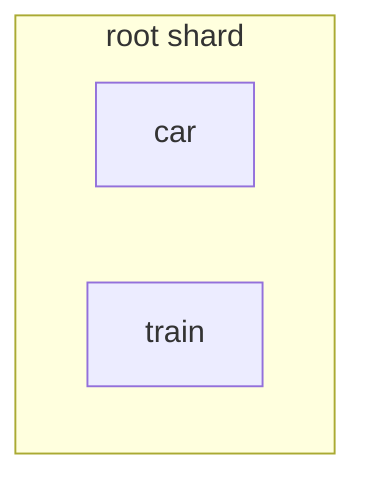
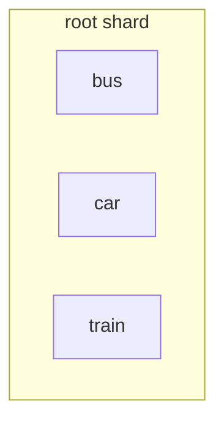
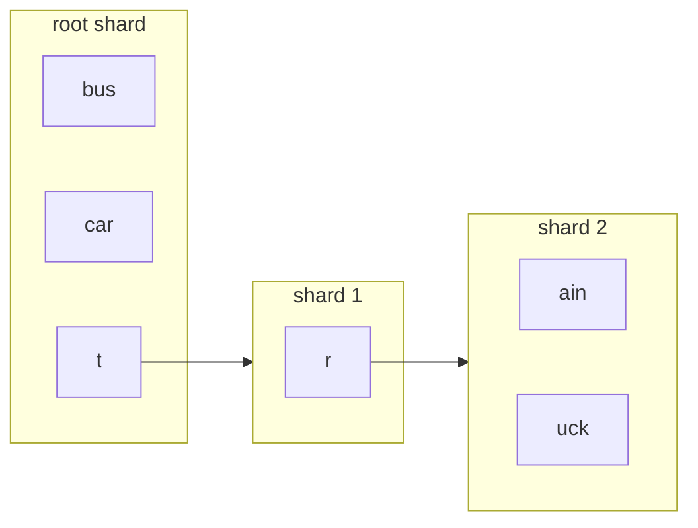
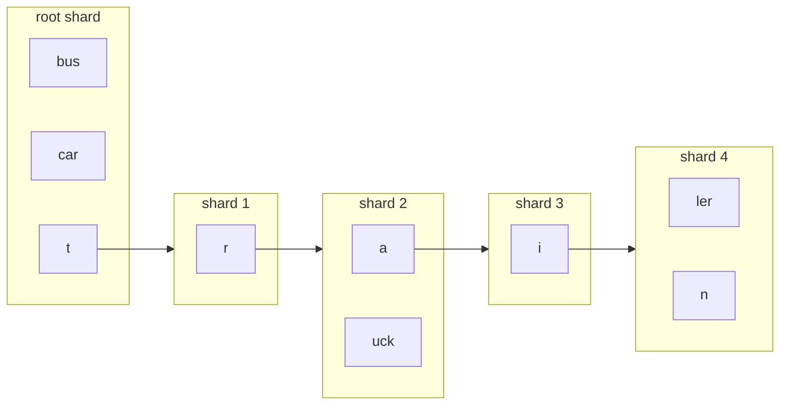
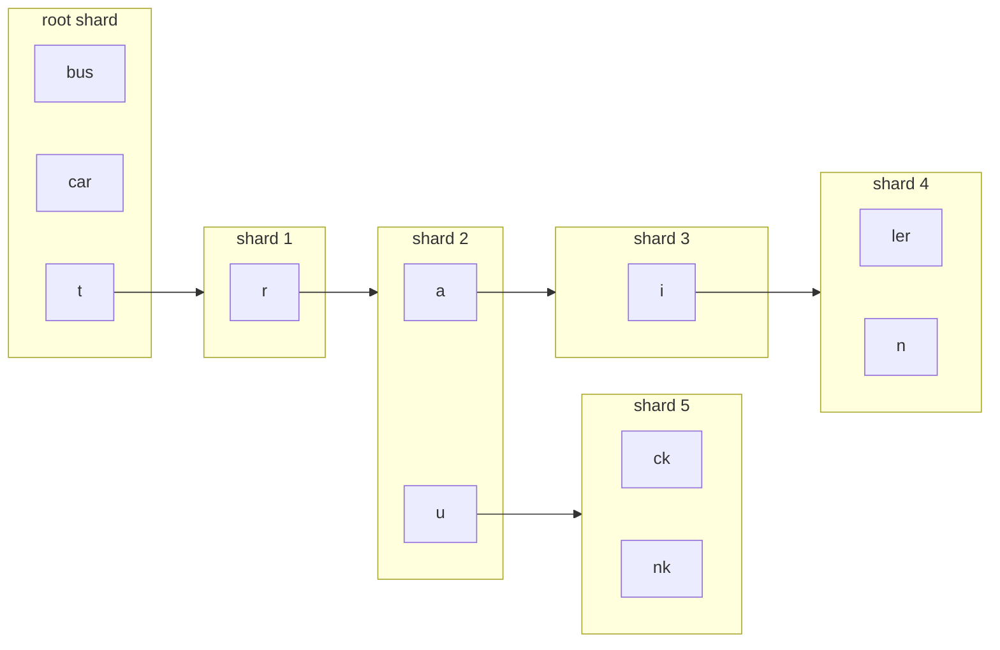

# Pail

## Editors

* [Alan Shaw](https://github.com/alanshaw), [DAG House](https://dag.house/)

## Authors

* [Alan Shaw](https://github.com/alanshaw), [DAG House](https://dag.house/)

## Language

The key words "MUST", "MUST NOT", "REQUIRED", "SHALL", "SHALL NOT", "SHOULD", "SHOULD NOT", "RECOMMENDED", "MAY", and "OPTIONAL" in this document are to be interpreted as described in [RFC 2119](https://datatracker.ietf.org/doc/html/rfc2119).

## Abstract

This specification describes a method of key/value storage implemented as an IPLD DAG. It details the format, encoding and mechanisms to mutate the storage.

This method of key/value storage is optimized for fast _ordered_ value lookup by key _prefix_ or _range_.

## Data Format

IPLD Schema

```ipldsch
# A shard is just a list of entries, and some config
type Shard struct {
  # Shard compatibility version.
  version Int
  # Characters allowed in keys, referring to a known character set.
  # e.g. "ascii" refers to the printable ASCII characters in the code range 32-126.
  keyChars String
  # Max key size in bytes - default 4096 bytes.
  maxKeySize Int
  # The key prefix from the root to this shard.
  prefix String
  # The entries in this shard.
  entries [ShardEntry]
}

# Single key/value entry within a shard
type ShardEntry struct {
  key String
  value ShardValue
} representation tuple

# User data (any CID to any data) or shard link
type ShardValue union {
  | &UserData Link
  | ShardLinkValue List
} representation kinded

# A link to another shard, and optional user data
type ShardLinkValue struct {
  link &Shard
  data optional &UserData
} representation tuple

# User data - any CID to any data
type UserData Any
```

Typescript

```ts
import { Link } from 'multiformats/link'

/** A shard is just a list of entries, and some config */
interface Shard {
  /** Shard compatibility version. */
  version: number
  /**
   * Characters allowed in keys, referring to a known character set.
   * e.g. "ascii" refers to the printable ASCII characters in the code range 32-126.
   */
  keyChars: string
  /** Max key size in bytes - default 4096 bytes. */
  maxKeySize: number
  /** The key prefix from the root to this shard. */
  prefix: string
  /** The entries in this shard. */
  entries: ShardEntry[]
}

/** Single key/value entry within a shard */
type ShardEntry = [
  key: string,
  value: ShardValue
]

type ShardValue = UserData | [ShardLink, UserData?]

/** A link to another shard */
type ShardLink = Link<Shard>

/** User data - any CID to any data */
type UserData = Link<any>
```

### Shard

The storage is made up of shards. They are blocks of IPLD data. Shards are recommended to be [dag-cbor](https://ipld.io/specs/codecs/dag-cbor/spec/) encoded.

A shard is an ordered list of [shard entries](#shard-entry). Shard entries must always be ordered lexicographically by key within a shard.

The maximum encoded shard size is controlled by the creator of the pail by specifying 2 options:

* `keyChars` - the characters allowed in keys (default ASCII only).
* `maxKeySize` - maximum size in bytes a UTF-8 encoded key is allowed to be (default 4096 bytes).

A good estimate for the max size of a shard is the number of characters allowed in keys multiplied by the maximum key size. This is because there cannot be more than one key with the same first character in a shard (see section on [Sharding](#sharding) for further explanation). For ASCII keys of 4096 bytes the biggest possible shard will stay well within the maximum block size allowed by libp2p.

Note: The default max key size is the same as "`MAX_PATH`" - the maximum filename+path size on most Windows/Unix systems so should be sufficient for most purposes.

Note: Even if you use unicode key characters it would be difficult to exceed the max libp2p block size, but it is not impossible.

### Shard Entry

A key/value pair whose value corresponds to [user data](#user-data) or a [shard link](#shard-link).

### Key

A UTF-8 encoded string.

### Value

#### User Data

An IPLD [Link](https://github.com/multiformats/cid) to any data that has explicitly been put to the storage by a user.

For example (dag-json encoded):

```javascript
{ '/': 'bafkreiem4twkqzsq2aj4shbycd4yvoj2cx72vezicletlhi7dijjciqpui' }
```

#### Shard Link

An IPLD [Link](https://github.com/multiformats/cid) link to another shard in the storage.

Shard link values must be encoded as an array (tuple) in order to differentiate them from [user data](#user-data).

If the value is a shard link value, the first item in the array must be an IPLD [CID](https://github.com/multiformats/cid) link to another shard in the storage. If the array contains a second item, the item is [user data](#user-data).

Shard link values must contain one or two elements. The first element (the shard link) is required (not nullable).

For example, a shard link _without_ user data (dag-json encoded):

```javascript
[{ '/': 'bafyreibq6w6xgqluv7ubskavehlfsnvodmh2gbc2q4c3d4ijlf7gva2day' }]
```

For example, a shard link _with_ user data (dag-json encoded):

```javascript
[
  { '/': 'bafyreibq6w6xgqluv7ubskavehlfsnvodmh2gbc2q4c3d4ijlf7gva2day' },
  { '/': 'bafkreiem4twkqzsq2aj4shbycd4yvoj2cx72vezicletlhi7dijjciqpui' }
]
```

## Operations

### Put

The "put" operation adds a new value or updates an existing value for a given key in the storage.

The storage must first be [traversed](#shard-traversal) to identify the target shard where the value should be placed, as well as the key within the shard that should be used.

Any changes made must be [propagated to the root shard](#propagating-changes).

#### New Value

If no value exists in the shard for the shard key then a new user data entry should be added to the shard at the correct lexicographical index.

For example, putting a key `b` and value `bafyvalueb` to a shard with existing keys `a` and `c` (dag-json encoded):

Before:

```javascript
[
  ['a', { '/': 'bafyvaluea' }],
  ['c', { '/': 'bafyvaluec' }]
]
```

After:

```javascript
[
  ['a', { '/': 'bafyvaluea' }],
  ['b', { '/': 'bafyvalueb' }], // <- new entry
  ['c', { '/': 'bafyvaluec' }]
]
```

#### Existing User Data Value

If a value exists in the shard for the shard key and the value is user data, then the entry must be updated.

For example, putting a key `a` and value `bafyvalueaaa` to a shard with existing key `a` and value `bafyvaluea` (dag-json encoded):

Before:

```javascript
[['a', { '/': 'bafyvaluea' }]]
```

After:

```javascript
[['a', { '/': 'bafyvalueaaa' }]]
```

#### Existing Shard Link Value

If a value exists in the shard for the shard key and the value is a shard link, then the value must be placed at index 1 of the shard link array.

For example, putting a key `a` and value `bafyvaluea` to a shard with existing key `a` with a shard link value `bafyshard` (dag-json encoded):

Before:

```javascript
[['a', [{ '/': 'bafyshard' }]]]
```

After:

```javascript
[['a', [{ '/': 'bafyshard' }, { '/': 'bafyvaluea' }]]]
```

For example, putting a key `a` and value `bafyvalueaaa` to a shard with existing key `a` with a shard link value `bafyshard`, with user data `bafyvaluea` (dag-json encoded):

Before:

```javascript
[['a', [{ '/': 'bafyshard' }, { '/': 'bafyvaluea' }]]]
```

After:

```javascript
[['a', [{ '/': 'bafyshard' }, { '/': 'bafyvalueaaa' }]]]
```

### Delete

The "delete" operation removes a value for a given key in the storage.

The storage must first be [traversed](#shard-traversal) to identify the target shard where the value should be removed from, as well as the key within the shard that should be used.

Any changes made must be [propagated to the root shard](#propagating-changes).

Deleting the last remaining key in a non-root shard must remove the shard entirely and it's entry in it's parent shard. That is unless the entry in the parent shard contains user data. In this case the value in the parent shard is updated from a shard link (with user data) to user data.

For example, deleting a key `a` from a root shard (dag-json encoded):

Before:

```javascript
[['a', { '/': 'bafyvaluea' }]]
```

After:

```javascript
[]
```

For example, deleting a key `abba` from a non-root shard (dag-json encoded):

Before:

```javascript
[['a', [{ '/': 'bafyshard' }]]]
```

```javascript
// bafyshard
[['bba', { '/': 'bafyvalue' }]]
```

After:

```javascript
[]
```

For example, deleting a key `abba` from a non-root shard with user data in key `a` (dag-json encoded):

Before:

```javascript
[['a', [{ '/': 'bafyshard' }, { '/': 'bafyvalueabb' }]]]
```

```javascript
// bafyshard
[['bba', { '/': 'bafyvalue' }]]
```

After:

```javascript
[['a', { '/': 'bafyvalueabb' }]]
```

## Shard Traversal

Given a key `k` it is often necessary to locate the shard the value is stored in or should be stored in for the purpose of adding, updating or removing the value from the storage.

The root shard must first be loaded. Then `k` must be matched exactly with an existing key or prefixed by an existing key whose value is a link to another shard. In the former case the shard has been identified. In the latter case, the linked shard must be loaded and `k` shortened, removing the prefix. The process is then repeated in the linked shard. If no match is found for `k` then traversal has finished.

The following is pseudocode of an algorithm for traversing the storage to identify the shard a key should be placed/found in:

1. Let `link` be the CID of the root shard
2. Retrieve and decode the shard for `link`
3. LOOP over all entries in the shard
    1. IF key of `entry` _equals_ `k` BREAK
    2. IF key of `entry` _starts with_ `k` AND value of `entry` is a shard link
        1. Set `link` to be `entry` shard link
        2. Set `k` to the substring of `k` starting _after_ the key of `entry`
        3. GOTO 2

Traversal should return enough information for a caller to easily identify the key _within_ a shard that should be used to place their value.

## Sharding

When putting a value it is sometimes necessary to create one or more shards in order to accomodate a new value within the storage.

The storage must first be [traversed](#shard-traversal) to identify the target shard where the value should be placed, as well as the key within the shard that should be used. This will be referred to as the "sharded insertion key" from here on.

The traversal process ensures there is no further traversal possible for the provided key.

If any existing key is equal to the sharded insertion key, no sharding needs to happen - an existing value just needs to be replaced.

Otherwise, the first UTF-8 character of each existing key should be compared to the first UTF-8 character of the sharded insertion key. If no match exists, the key and value are simply added to the shard at the correct lexicographical index.

If there is a match, a new shard must be created. The existing key is replaced with the first character of the existing key, and it's value becomes a pointer to the new shard. The remainder of the existing key (and it's value) is moved into the new shard. The process is then repeated in the new shard, using the sharded insertion key, minus the matched first character.

For example, given a pail with 2 keys:

<!--
car
train
-->



Put "bus":

<!--
bus
car
train
-->



Put "truck":

<!--
bus
car
t   -> r -> ain
            uck
-->



Put "trailer":

<!--
bus
car
t   -> r -> a   -> i -> ler
                        n
            uck
-->



Put "trunk":

<!--
bus
car
t   -> r -> a -> i -> ler
                      n
            u -> ck
                 nk
-->



## Propagating Changes

Any changes made to a shard will result in a change to it's CID. If the shard is not the root shard, the change must be propagated to the root.
