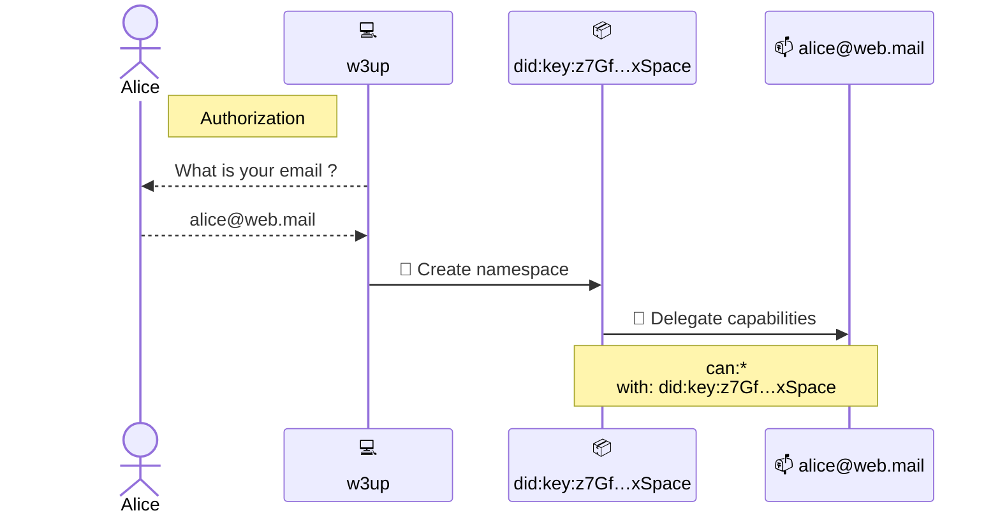
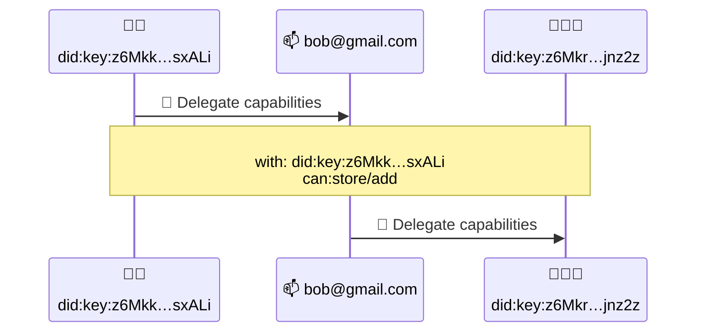

# W3 Account


## Editors

- [Irakli Gozalishvili], [Protocol Labs]

## Authors

- [Irakli Gozalishvili], [Protocol Labs]
- [Natalie Bravo], [Storacha Network]
- [Vicente Olmedo], [Storacha Network]

# Abstract

The W3 protocol governs user interactions within self-certified Public Key Infrastructure (PKI)-based namespaces. Access control to these namespaces, for simplicity referred to as spaces, is managed through delegated capabilities in [UCAN] format.

Users access their spaces across various user agents operating on multiple devices. Here we introduce an [account] primitive designed to enable synchronization of access across authorized user agents with a user-friendly experience.

## Language

The key words "MUST", "MUST NOT", "REQUIRED", "SHALL", "SHALL NOT", "SHOULD", "SHOULD NOT", "RECOMMENDED", "MAY", and "OPTIONAL" in this document are to be interpreted as described in [RFC2119](https://datatracker.ietf.org/doc/html/rfc2119).

# Introduction

In the W3 protocol, a namespace, or space for short, corresponds to an asymmetric keypair and is identified by a [`did:key`] URI. The private key holder, is the [owner] of that namespace and has absolute authority over it. They can delegate limited or absolute authority over the namespace to any other [principal]. However, managing delegations across multiple user agents on multiple devices presents several user experience challenges:

1. To synchronizing namespace access across user agents they need to discover their [`did:key`] identifiers and level of access granted to them.
2. Recovering access in the case when all devices are lost becomes impossible.

To address these issues, we propose the concept of an account. An account SHOULD have a human-meaningful identifier such as email address. We propose use of email addresses as account identifiers so that derived [`did:mailto`] can act as the [principal] in the [UCAN] delegation chain. This creates [principal] that can be used to aggregate capabilities and manage them.

Account can be used to solve both discovery and recovery problems:

1. Instead of user agents trying to discover each other in order to delegate capabilities, all capabilities get delegated to an account which is then used to re-delegate them as necessary to individual agents.
2. Recovery is possible even if all devices have been lost as long as the user retains control of their email, because an account can always delegate capabilities to new agents.

Agent authorization can use familiar email-based authorization flows providing a smooth onboarding experience and hide complexity of the underlying [PKI]. This approach also better reflects user intuition: they have ambient authority over owned spaces and can authorize user agents (think apps) giving them necessary level of access.

> ℹ️ This specification mainly focuses on [`did:mailto`] identifiers, but implementations are free to extend it to various other [DID methods].
>
> Also, note that [account] is defined as non [`did:key`] identifier because [`did:key`] identifiers can aggregate and re-delegate capabilities natively with [UCAN]s. [Account]s simply bring human-meaningful identifiers that users can type in on every agent. Use of out of bound authorization also frees users from key management.

## Serialization

[UCAN]s MUST be encoded with some [IPLD] codec. [DAG-CBOR] is RECOMMENDED.

## Concepts

## Roles

There are several distinct roles that [principals] may assume in described specification:

| Name      | Description                                                                                            |
| --------- | ------------------------------------------------------------------------------------------------------ |
| Principal | The general class of entities that interact with a UCAN. Listed in the `iss` or `aud` field            |
| Account   | [Principal] identified by memorable identifier like [`did:mailto`].                                    |
| Agent     | [Principal] identified by [`did:key`] identifier, representing a user in some application installation |
| Issuer    | Principal sharing access. It is the signer of the [UCAN]. Listed in the `iss` field                    |
| Audience  | Principal access is shared with. Listed in the `aud` field                                             |

### Space

Namespace, or space for short, is an owned resource that can be shared. It corresponds to the asymmetric keypair and is identified by the [`did:key`] URI.

A space DID is always listed in the `with` field of the [UCAN] capability.

### Owner

The [owner] of the [space] is the holder of its private key. The space owner can share limited or full access to their owned space via a [UCAN] delegation issued by the [space] [`did:key`] and signed with the [space]'s private key.

### Account

An _account_ is a principal identified by a memorable identifier such as [`did:mailto`]. It is a principal that aggregates access to user spaces and that manages access of various user [agent]s.

An account enables familiar authorization and recovery email flows.

### Agent

An _agent_ is a principal identified by a [`did:key`] identifier. Users interact with a system through different _agents_ across multiple devices and applications. _Agents_ SHOULD use [non-extractable keys] where possible.

> ℹ️ Note that _agents_ are meant to be ephemeral, implying that they could be disposed of or created on demand.

### Authority

Authority is a trusted [DID] identifier. For example various subsystems may recognize signatures from a global service authority.

Various services run by different entities MAY also recognize each others authority and choose to trust their signatures as opposed to performing verification work.

# Protocol

## Overview

### Aggregating capabilities

Any principal CAN delegate capabilities to an [account] identified by a [`did:mailto`] according to the [UCAN] specification. It is RECOMMENDED to delegate full authority over created namespace to the user [account] at creation to offer access recovery mechanism.


```mermaid
sequenceDiagram
actor Alice
participant App as 💻<br/><br/>w3up #32;
participant Space as 📦<br/><br/>did:key:z7Gf…xSpace
participant Email as 📫 alice@web.mail


Note right of Alice: Authorization
App -->> Alice: What is your email ?
Alice -->> App: alice@web.mail
App->>Space:🔑 Create namespace

Space ->> Email: 🎫 Delegate capabilities
note over Space,Email:can:*<br/>with: did:key:z7Gf…xSpace
```

> On first run, an application creates a new namespace and delegates full authority to the user account. For simplicity we omit steps where the application first requests access from an account before deciding to create a new space.

### Delegating capabilities

[Account] CAN authorize user agents by re-delegating a set of capabilities.


```mermaid
sequenceDiagram
participant Alice as 👩‍💻<br/><br/>did:key:z6Mkk…sxALi
participant Email as 📫 bob@gmail.com
participant Bob as 👨🏽‍💻 <br/><br/>did:key:z6Mkr…jnz2z

Alice ->> Email: 🎫 Delegate capabilities
note over Alice,Bob:<br/>with: did:key:z6Mkk…sxALi<br/>can:store/add
Email ->> Bob: 🎫 Delegate capabilities
```

> **Alice** delegates the `store/add` capability to **Bob**s [account]. Later **Bob**s user agent gets re-delegated the capability from the [account].

### Authorization

Delegations issued by a [`did:key`] principal are authorized by signing the payload with their private key. Delegations issued by a [`did:mailto`] principal are not authorized by signing over the payload as there is no private key associated with [`did:mailto`] to sign it with. Instead, such delegations are authorized through an interactive email flow in which the [account] holder is able to review and approve the requested authorization through an action.

Since there is no private key to sign the [UCAN] payload, we define an extension to the [UCAN] specification that introduces two new signature types that can be used in delegations issued by [`did:mailto`] principals.

We also define a verification mechanism for these signature types.

> ℹ️ The signatures for [account]s identified by other [DID methods] are not defined.

## Signature Types

### DomainKeys Identified Mail (DKIM) Signature

> ⚠️ [w3up] implementation currently does not support this signature type.

The [`did:mailto`] principal MAY issue a delegation signed using a DomainKeys Identified Mail ([DKIM]) signature.

This signature MUST be generated by sending a message from the [account] email address corresponding to the issuer [`did:mailto`] with the `Subject` header set to the [authorization payload].

The signer MUST derive the "DKIM payload" from the received message according to the [RFC6376] specification and encode it in UTF-8 encoding. Resulting bytes MUST be encoded as a [Nonstandard `VarSig` signature] with the `alg` parameter set to `"DKIM"`.

#### Authorization Payload

The [UCAN] data model for the desired delegation issued by [`did:mailto`] MUST be structured per [UCAN-IPLD Schema] specification, except for the `s` field, which MUST be omitted.

The IPLD [link] of constructed data model MUST be derived and used the `cid` when formatting according payload according to the following [ABNF] definition.

```abnf
auth := "I am signing ipfs://" cid "to grant access to this account"
cid  := z[a-km-zA-HJ-NP-Z1-9]+
```

### Attestation Signature

Delegation MAY be authorized through an interactive email flow where the [account] holder is emailed a request to approve an authorization that gives an agent access to specific set of capabilities. If the user approves by clicking the embedded link, a signed [attestation] is issued that confirms that the delegation has been authorized through the interactive flow.

In this scenario a delegation issued by the [`did:mailto`] identifier MAY be signed using the _attestation signature_ type. This signature alone MUST NOT be considered as a valid authorization. A delegation signed with an _attestation signature_ MUST be accompanied with a [UCAN attestation] issued by the trusted [authority].

If delegation is signed with an _attestation signature_, but is not accompanied with a [UCAN attestation] from a trusted [authority] it MUST be considered invalid. In this scenario the implementer MAY initiate an interactive verification flow and issue the [UCAN attestation] retroactively instead of denying service.

> When the received delegation is issued by the `did:mailto:web.mail:alice`, signed with _attestation signature_, but is not accompanied by a [UCAN attestation], the receiver could iteratively confirm authorization by sending an email to `alice@web.mail` with a confirmation link, which, when followed, issues an [attestation] from the receiver resuming the invocation.

#### Attestation Signature Format

The attestation signature is denoted by a [Nonstandard `VarSig` signature] with zero (`0`) signature bytes.

##### Attestation Signature Example

> Attestation Signature in [DAG-JSON] format

```jSON
{ "/": { "bytes": "gKADAA" } }
```

## Capabilities

### `account/usage/*`

Capability can only be delegated (not invoked) to allow an audience to derive any `account/usage/*` prefixed capability for the account identified in the `with` field.

```ts
type AccountUsage = {
  can: 'account/usage/*'
  with: AccountDID
}
```

### `account/usage/get`

Capability can be invoked by an agent to retrieve usage data for all, or a specified set, of spaces within an account for a given period.

#### Capability schema

```ipldsch
type AccountUsageGet struct {
  with AccountDID
  nb optional AccountUsageGetNB
}

type AccountUsageGetNB struct {
  # Optional list of spaces to filter. If omitted, provider SHOULD aggregate all spaces the account is authorized to include.
  spaces optional [SpaceDID]

  # Optional time period (Unix timestamps in seconds).
  # If omitted, provider MUST return a current snapshot.
  # Semantics: from is inclusive; to is exclusive.
  period optional Period
}

type Period struct {
  from Int # inclusive
  to Int   # exclusive
}
```

#### Invocation examples

> Example: getting the current total usage

```json
{
  "iss": "did:key:z6MktfnQz8Kcz5nsC65oyXWFXhbbAZQavjg6LYuHOOOagent",
  "aud": "did:web:storacha.network",
  "att": [
    {
      "with": "did:mailto:web.mail:alice",
      "can": "account/usage/get"
    }
  ],
  "prf": [
    { "/": "bafyAccountDelegationCid" },
    { "/": "bafySessionAttestationCid" }
  ],
  "sig": "..."
}
```

> Example: filtering a single space and period

```json
{
  "iss": "did:key:z6MktfnQz8Kcz5nsC65oyXWFXhbbAZQavjg6LYuHOOOagent",
  "aud": "did:web:storacha.network",
  "att": [
    {
      "with": "did:mailto:web.mail:alice",
      "can": "account/usage/get",
      "nb": {
        "spaces": [
          "did:key:z6MkuxVKbEvYzXw89c9ESd3xoZ988MFrCgqT5JF5wtBvuYWe"
        ],
        "period": {
          "from": 1754006400,
          "to": 1758111728
        }
      }
    }
  ],
  "prf": [
    { "/": "bafyAccountDelegationCid" },
    { "/": "bafySessionAttestationCid" }
  ],
  "sig": "..."
}
```

#### Authorization requirements

The service MUST verify that the Account DID is authorized to access usage data for all requested spaces. If any requested space is not authorized, the entire invocation SHOULD fail with an error message indicating which spaces lack authorization.

#### Receipt

```ipldsch
type AccountUsageGetReceipt = {
  ran Link<AccountUsageGet>
  out Result<AccountUsageGetSuccess, AccountUsageGetFailure>
}

type AccountUsageGetFailure {
  message String
}

type AccountUsageGetSuccess {
  total  Int
  spaces Record<SpaceDID, SpaceUsage>   # keys MUST be sorted
}

type SpaceUsage {
  total     Int
  providers Record<ProviderDID, UsageData>  # keys MUST be sorted
}

# UsageData is shared with `usage/report`
type UsageData {
  provider ProviderDID
  space    SpaceDID
  period   PeriodISO
  size     SizeDelta
  events   optional [UsageEvent]
}

type SizeDelta {
  initial Int
  final   Int
}

type UsageEvent {
  cause     Link
  delta     Int
  receiptAt ISO8601Date
}

type PeriodISO {
  from ISO8601Date
  to   ISO8601Date
}

type ISO8601Date string
type ProviderDID string
```

In all responses, the keys of the `spaces` field in `AccountUsageGetSuccess` and the `providers` field in `SpaceUsage` MUST be sorted lexicographically by their respective key (`SpaceDID`, `ProviderDID`). This ensures that the same query produces the same output each time.

##### Receipt example (success)

```json
{
  "total": 5356848797,
  "spaces": {
    "did:key:z6MkuxVKbEvYzXw89c9ESd3xoZ988MFrCgqT5JF5wtBvuYWe": {
      "total": 5356848797,
      "providers": {
        "did:web:web3.storage": {
          "provider": "did:web:web3.storage",
          "space": "did:key:z6MkuxVKbEvYzXw89c9ESd3xoZ988MFrCgqT5JF5wtBvuYWe",
          "period": {
            "from": "2025-07-01T00:00:00.000Z",
            "to": "2025-08-12T15:55:11.000Z"
          },
          "size": {
            "initial": 1035217049,
            "final": 5356848797
          },
          "events": [
            {
              "cause": { "/": "bafyreiafouslzry3vunc4okazrqpwpuanrq4d3ehb2oatn4vmrhnmj6rzy" },
              "delta": 54394,
              "receiptAt": "2025-07-01T14:34:50.947Z"
            }
          ]
        }
      }
    }
  }
}
```

### `account/egress/get`

Capability can be invoked by an agent to retrieve egress data for all, or a specified set, of spaces within an account for a given period.

#### Capability schema

```ipldsch
type AccountEgressGet struct {
  with AccountDID
  nb optional AccountEgressGetNB
}

type AccountEgressGetNB struct {
  # Optional list of spaces to filter. If omitted, provider SHOULD aggregate all spaces the account is authorized to include.
  spaces optional [SpaceDID]

  # Optional time period
  # If omitted, provider MUST return egress data from the first day of the last full month to the day the request is made.
  period optional Period
}

# From and to are both expressed as ISO-8601 date-only strings (e.g. 2026-01-20).
# From is inclusive; to is exclusive.
type Period struct {
  from ISO8601Date
  to ISO8601Date
}

type ISO8601Date string
```

#### Invocation examples

> Example: getting the current total egress

```json
{
  "iss": "did:key:z6MktfnQz8Kcz5nsC65oyXWFXhbbAZQavjg6LYuHOOOagent",
  "aud": "did:web:etracker.storacha.network",
  "att": [
    {
      "with": "did:mailto:web.mail:alice",
      "can": "account/egress/get"
    }
  ],
  "prf": [
    { "/": "bafyAccountDelegationCid" },
    { "/": "bafySessionAttestationCid" },
  ],
  "sig": "..."
}
```

> Example: filtering a single space and period

```json
{
  "iss": "did:key:z6MktfnQz8Kcz5nsC65oyXWFXhbbAZQavjg6LYuHOOOagent",
  "aud": "did:web:etracker.storacha.network",
  "att": [
    {
      "with": "did:mailto:web.mail:alice",
      "can": "account/egress/get",
      "nb": {
        "spaces": ["did:key:z6MkuxVKbEvYzXw89c9ESd3xoZ988MFrCgqT5JF5wtBvuYWe"],
        "period": {
          "from": "2025-07-01",
          "to": "2025-07-03"
        }
      }
    }
  ],
  "prf": [{ "/": "bafyAccountDelegationCid" }, { "/": "bafySessionAttestationCid" }],
  "sig": "..."
}
```

#### Authorization requirements

The service MUST verify that the Account DID is authorized to access egress data for all requested spaces. If any of the requested spaces is not authorized, the entire invocation SHOULD fail with an error message indicating which spaces lack authorization.

#### Receipt

```ipldsch
type AccountEgressGetReceipt = {
  ran Link<AccountEgressGet>
  out Result<AccountEgressGetSuccess, AccountEgressGetFailure>
}

type AccountEgressGetFailure {
  name    String
  message String
}

type AccountEgressGetSuccess {
  total  Int # total egress for the account in the requested period. Unit: bytes.
  spaces Record<SpaceDID, SpaceEgress> # breakout per-space. Keys MUST be sorted.
}

type SpaceEgress {
  total      Int # total egress for the space in the requested period. Unit: bytes.
  dailyStats [DailyStat] # sorted by date ascending
}

type DailyStat {
  date   ISO8601Date
  egress Int # egress for that date. Unit: bytes.
}
```

In all responses, the keys of the `spaces` field in `AccountEgressGetSuccess` MUST be sorted lexicographically. `DailyStats` within each `SpaceEgress` MUST be sorted by date ascending. This ensures that the same query produces the same output each time.

##### Receipt example (success)

```json
{
  "total": 1111111110,
  "spaces": {
    "did:key:z6MkuxVKbEvYzXw89c9ESd3xoZ988MFrCgqT5JF5wtBvuYWe": {
      "total": 1111111110,
      "dailyStats": [
        {
          "date": "2025-07-01",
          "egress": 123456789
        },
        {
          "date": "2025-07-02",
          "egress": 987654321
        }
      ]
    }
  }
}
```

[Protocol Labs]: https://protocol.ai/
[Irakli Gozalishvili]: https://github.com/Gozala
[Natalie Bravo]: https://github.com/bravonatalie
[Vicente Olmedo]: https://github.com/volmedo
[Storacha Network]: https://storacha.network/
[PKI]: https://en.wikipedia.org/wiki/Public_key_infrastructure
[UCAN]: https://github.com/ucan-wg/spec/blob/692e8aab59b763a783fe1484131c3f40d997b69a/README.md
[`did:mailto`]: ./did-mailto.md
[`did:key`]: https://w3c-ccg.github.io/did-key-spec/
[principal]: https://github.com/ucan-wg/spec/blob/692e8aab59b763a783fe1484131c3f40d997b69a/README.md#321-principals

<!-- markdown-link-check-disable -->
<!-- stackexchange 403s this, presumably to prevent bot scraping -->

[non-extractable keys]: https://crypto.stackexchange.com/questions/85587/what-do-people-use-non-extractable-webcrypto-keys-for/102695#102695

<!-- markdown-link-check-enable-->

[agent]: #agent
[account]: #account
[UCAN-IPLD Schema]: https://github.com/ucan-wg/ucan-ipld/#2-ipld-schema
[link]: https://ipld.io/docs/schemas/features/links/
[authorization payload]: #authorization-payload
[RFC6376]: https://www.rfc-editor.org/rfc/rfc6376#section-3.4
[Nonstandard `VarSig` signature]: https://github.com/ucan-wg/ucan-ipld/#251-nonstandard-signatures
[ABNF]: https://en.wikipedia.org/wiki/Augmented_Backus%E2%80%93Naur_form
[DAG-JSON]: https://ipld.io/specs/codecs/dag-json/spec/
[ucan attestation]: ./w3-ucan.md#attestation
[IPLD]: https://ipld.io/
[DAG-CBOR]: https://ipld.io/specs/codecs/dag-cbor/spec/
[DID methods]: https://www.w3.org/TR/did-core/#methods
[w3up]: https://github.com/web3-storage/w3up
[owner]: #owner
[space]: #space
[DKIM]: https://en.wikipedia.org/wiki/DomainKeys_Identified_Mail
[attestation]: ./w3-ucan.md#attestation
[authority]: #authority
