# Account


## Editors

- [Irakli Gozalishvili], [Protocol Labs]

## Authors

- [Irakli Gozalishvili], [Protocol Labs]

# Abstract

In w3 family of open protocols users interact with self-certified ([PKI] baked) namespaces. Access to such namespaces is managed through delegated [UCAN] capabilities that need to be synced across multiple user agents on multiple devices. Doing this in an open and decentralized system introduces unique UX challenges that we attempt to address through a concept of an **account** as described by this specification.

## Language

The key words "MUST", "MUST NOT", "REQUIRED", "SHALL", "SHALL NOT", "SHOULD", "SHOULD NOT", "RECOMMENDED", "MAY", and "OPTIONAL" in this document are to be interpreted as described in [RFC2119](https://datatracker.ietf.org/doc/html/rfc2119).

# Introduction

In web3 namespace is simply [`did:key`] identifier. As a result, [principal] identified by the [`did:key`] is an owner of that namespace with a absolute authority over it. It can delegate some or all of the capabilities for the resources under that namespace to any other [principal]. However managing delegations across various user agents has several UX challenges:

1. Syncing delegations to namespace(s) across multiple user agents on multiple devices introduces discovery problem, challenged by use of not memorable [`did:key`] identifiers.
2. Recovering access in case where user loses access to all of the devices.

We propose concept of an account as convenience for aggregating and managing capabilities under human-meaningful identifier like an email address. More specifically we propose deriving account [`did:mailto`] identifier from user controlled email address, so it can act as [principal] in [UCAN] delegation chains.

User can aggregate all delegations under such an account identifier and re-delegate desired capabilities to other agents. Use of memorable identifier addresses discovery problem. Furthermore email address as an account provides smooth web3 onboarding experience by hiding all of the [PKI] under familiar email based authorization flows.

> ℹ️ This specification is focuses on [`did:mailto`] identifiers, however approach can easily be extended to various other identifiers.

# High-Level Concepts

## Roles

There are several distinct roles that [principals] may assume in described specification:

| Name        | Description                                                                                                                                    |
| ----------- | ---------------------------------------------------------------------------------------------------------------------------------------------- |
| Account    | [Principal] identified by memorable identifier like [`did:mailto`]. |
| Agent       | [Principal] identified by [`did:key`] identifier, representing a user in some application installation |

### Account

_Account_ is a [principal] identified by a memorable identifier like [`did:mailto`].

Account MAY be used for convenience of aggregating and managing capabilities across various user [Agent]s.

Account CAN be used to facilitate familiar user authorization and recovery flows.

### Agent

_Agent_ is a [principal] identified by a [`did:key`] identifier.

Users interacts with a system through different _agents_ across multiple devices and applications. It is highly RECOMMENDED that _agents_ use [non-extractable keys] when possible.

> ℹ️ _Agents_ are meant to be ephemeral that could be disposed or created on demand.

# Protocol

## Overview

### Aggregating capabilities

Any [`did:key`] identified [agent] CAN (re)delegate capabilities to [`did:mailto`] identified [account] per [UCAN] specification. This MAY be used to delegate complete authority over created namespace on creation.

```mermaid
sequenceDiagram
actor Alice
participant W3 as 💻<br/><br/>web3.storage #32;
participant Space as 📦<br/><br/>did:key:z6Mkk…sxALi
participant Email as 📫 alice@web.mail


W3 -->> Alice: What is your email ?
Alice -->> W3: alice@web.mail
W3->>Space:🔑 Create namespace

Space ->> Email: 🎫 Delegate capabilities
note over Space,Email:can:*<br/>with: ucan:/*
```



> On first run new namespace is generated and complete authority is delegated to the user account

Any user CAN (re)delegate capabilities to their peer by delegating to their [`did:mailto`] identified [account] _(which can be derived from the email address)_. Also note that no setup is required from delegate until they decide to invoke delegated capability.

```mermaid
sequenceDiagram
participant Alice as 👩‍💻<br/><br/>did:key:z6Mkk…sxALi
participant Email as 📫 bob@gmail.com
participant Bob as 👨🏽‍💻 <br/><br/>did:key:z6Mkr…jnz2z


Alice ->> Email: 🎫 Delegate capabilities
note over Alice,Bob:<br/>with: space://z6Mkr…jnz2z<br/>can:store/add
Email ->> Bob: 🎫 Delegate capabilities
```



> **Alice** delegates `store/add` capability to **Bob**, who later creates an agent and re-delegates capability to it.

### Delegating capabilities

Delegating capabilities from [`did:mailto`] identified [account] to an [agent] is less straightforward, because signing key is not self-evident from the delegation.

Here we propose extension to the [UCAN] specification to allow signing and verification of [`did:mailto`] issued delegations without requiring a [`did:mailto`] key resolution.

We define two alternative signature types with a different tradeoffs. Protocol implementer MAY support either or both signature types.

> ℹ️ Signatures for [account]s identified by other DID methods is left undefined.

#### DomainKeys Identified Mail (DKIM) Signature

Delegation issued by an [account] identified with [`did:mailto`] identifier MAY be signed using DKIM-Signature DomainKeys Identified Mail ([DKIM]) Signature.

Signature MUST be generated by sending a message from the email address of the [account] with a `Subject` header set to an [authorization payload].

Signer MUST derive "DKIM payload" from the received message per [RFC6376] specification and encode it in UTF-8 encoding. Resulting bytes MUST be encoded as a [Nonstandard `VarSig` signature] with `DKIM` string as an `alg` parameter.

##### Authorization Payload

> ℹ️ Using UCAN standard signing payload would result in a large signatures, which is why we define an alternative payload format.

UCAN data model MUST be structured according to [UCAN-IPLD Schema] omitting `s` field. IPLD [link] of the data model must be derived and formatted according to following [ABNF] definition, where `cid` refers to derived link.

```abnf
auth := "I am signing ipfs://" cid "to grant access to this account"
cid  := z[a-km-zA-HJ-NP-Z1-9]+
```

#### Authorization Session Signature

Delegation issued by an [account] identified with [`did:mailto`] identifier MAY use _authorization session_ signature in conjunction with an [authorization session] (issued by trusted [authority]). If delegation has a proof with such signature, it MUST also have a qualified [authorization session]. If authorization session is not present in the proofs validator MUST carry out an out-of-bound authorization flow to obtain [authorization session] on demand. If validator is unable to carry out authorization flow, it MUST consider signature invalid.

##### Authorization Session Signature Format

The [Nonstandard `VarSig` signature] with `0` bytes MUST be used.
This type of signature is encoded as a "NonStandard" [VarSig] with 0 bytes, which is shown in [DAG-JSON] format below

##### Authorization Session Signature Example

> Authorization Session Signature in [DAG-JSON] format

```jSON
{ "/": { "bytes": "gKADAA" } }
```

### Signup

### Authorization

> On first run **w3.app** request `store/*` capability from **alice@web.mail** through **web3.storage**, which performs out of bound email authorization and delegates granted capability.

```mermaid
sequenceDiagram
actor Alice
participant App as 💻 w3.app
participant W3 as 🌐<br/><br/>did:web:web3.storage #32;
participant Email as 📫 alice@web.mail


App -->> Alice: What is your email ?
Alice -->> App: alice@web.mail
App ->> W3: Can I store/* ❓
W3 -->> Email: Can w3.app store/* ❓
note over W3,Email: space://z6Mkk…sxALi<br/>can: store/*<br/>#32;<br/>space://z6Mk…n9bob<br/>can: store/*


Email -->> W3: ✉️ grant
note over Email,W3:with: space://z6Mkk…sxALi<br/>can: store/*
W3 ->> App: 🎫 delegate
Note over W3,App:with: space://z6Mkk…sxALi<br/>can:store/*
```



[Protocol Labs]:https://protocol.ai/
[Irakli Gozalishvili]:https://github.com/Gozala
[PKI]:https://en.wikipedia.org/wiki/Public_key_infrastructure
[ucan]: https://github.com/ucan-wg/spec/
[`did:mailto`]: https://github.com/ucan-wg/did-mailto/
[`did:key`]: https://w3c-ccg.github.io/did-method-key/
[principal]:https://github.com/ucan-wg/spec/#321-principals
[non-extractable keys]:https://crypto.stackexchange.com/questions/85587/what-do-people-use-non-extractable-webcrypto-keys-for/102695#102695
[agent]:#agent
[account]:#account
[UCAN-IPLD Schema]:https://github.com/ucan-wg/ucan-ipld/#2-ipld-schema
[link]:https://ipld.io/docs/schemas/features/links/
[authorization payload]:#authorization-payload
[RFC6376]:https://www.rfc-editor.org/rfc/rfc6376#section-3.4
[Nonstandard `VarSig` signature]:https://github.com/ucan-wg/ucan-ipld/#251-nonstandard-signatures
[ABNF]:https://en.wikipedia.org/wiki/Augmented_Backus%E2%80%93Naur_form
[DAG-JSON]:https://ipld.io/specs/codecs/dag-json/spec/
[authorization session]:./w3-session.md
