# W3 Account


## Editors

- [Irakli Gozalishvili], [Protocol Labs]

## Authors

- [Irakli Gozalishvili], [Protocol Labs]

# Abstract

The W3 protocol governs user interactions within self-certified Public Key Infrastructure (PKI)-based namespaces. Access control to these namespaces, for simplicity referred to as spaces, is managed through delegated capabilities in [UCAN] format.

Users access their spaces across various user agents operating on multiple devices. Here we introduce an [account] primitive designed to enable synchronization of access across authorized user agents with a user-friendly experience.

## Language

The key words "MUST", "MUST NOT", "REQUIRED", "SHALL", "SHALL NOT", "SHOULD", "SHOULD NOT", "RECOMMENDED", "MAY", and "OPTIONAL" in this document are to be interpreted as described in [RFC2119](https://datatracker.ietf.org/doc/html/rfc2119).

# Introduction

In the W3 protocol, a namespace, or space for short, corresponds to an asymmetric keypair and is identified by a [`did:key`] URI. The private key holder, is the [owner] of that namespace and has absolute authority over it. They can delegate limited or absolute authority over the namespace to any other [principal]. However, managing delegations across multiple user agents on multiple devices presents several user experience challenges:

1. To synchronizing namespace access across user agents they need to discover their [`did:key`] identifiers and level of access granted to them.
2. Recovering access in the case when all devices are lost becomes impossible.

To address these issues, we propose the concept of an account. An account SHOULD have a human-meaningful identifier such as email address. We propose use of email addresses as account identifiers so that derived [`did:mailto`] can act as the [principal] in the [UCAN] delegation chain. This creates [principal] that can be used to aggregate capabilities and manage them.

Account can be used to solve both discovery and recovery problems:

1. Instead of user agents trying to discover each other in order to delegate capabilities, all capabilities get delegated to an account which is then used to re-delegate them as necessary to individual agents.
2. Recovery is possible even if all devices have been lost as long as the user retains control of their email, because an account can always delegate capabilities to new agents.

Agent authorization can use familiar email-based authorization flows providing a smooth onboarding experience and hide complexity of the underlying [PKI]. This approach also better reflects user intuition: they have ambient authority over owned spaces and can authorize user agents (think apps) giving them necessary level of access.

> ℹ️ This specification mainly focuses on [`did:mailto`] identifiers, but implementations are free to extend it to various other [DID methods].
>
> Also, note that [account] is defined as non [`did:key`] identifier because [`did:key`] identifiers can aggregate and re-delegate capabilities natively with [UCAN]s. [Account]s simply bring human-meaningful identifiers that users can type in on every agent. Use of out of bound authorization also frees users from key management.

## Serialization

[UCAN]s MUST be encoded with some [IPLD] codec. [DAG-CBOR] is RECOMMENDED.

## Concepts

## Roles

There are several distinct roles that [principals] may assume in described specification:

| Name        | Description                                                                                                                                    |
| ----------- | ---------------------------------------------------------------------------------------------------------------------------------------------- |
| Principal | The general class of entities that interact with a UCAN. Listed in the `iss` or `aud` field |
| Account    | [Principal] identified by memorable identifier like [`did:mailto`]. |
| Agent       | [Principal] identified by [`did:key`] identifier, representing a user in some application installation |
| Issuer | Principal sharing access. It is the signer of the [UCAN]. Listed in the `iss` field |
| Audience | Principal access is shared with. Listed in the `aud` field |

### Space

Namespace, or space for short, is an owned resource that can be shared. It corresponds to the asymmetric keypair and is identified by the [`did:key`] URI.

A space DID is always listed in the `with` field of the [UCAN] capability.

### Owner

The [owner] of the [space] is the holder of its private key. The space owner can share limited or full access to their owned space via a [UCAN] delegation issued by the [space] [`did:key`] and signed with the [space]'s private key.

### Account

An _account_ is a principal identified by a memorable identifier such as [`did:mailto`]. It is a principal that aggregates access to user spaces and that manages access of various user [agent]s.

An account enables familiar authorization and recovery email flows.

### Agent

An _agent_ is a principal identified by a [`did:key`] identifier. Users interact with a system through different _agents_ across multiple devices and applications. _Agents_ SHOULD use [non-extractable keys] where possible.

> ℹ️ Note that _agents_ are meant to be ephemeral, implying that they could be disposed of or created on demand.

### Authority

Authority is a trusted [DID] identifier. For example various subsystems may recognize signatures from a global service authority.

Various services run by different entities MAY also recognize each others authority and choose to trust their signatures as opposed to performing verification work.

# Protocol

## Overview

### Aggregating capabilities

Any principal CAN delegate capabilities to an [account] identified by a [`did:mailto`] according to the [UCAN] specification. It is RECOMMENDED to delegate full authority over created namespace to the user [account] at creation to offer access recovery mechanism.

```mermaid
sequenceDiagram
actor Alice
participant App as 💻<br/><br/>w3up #32;
participant Space as 📦<br/><br/>did:key:z7Gf…xSpace
participant Email as 📫 alice@web.mail


Note right of Alice: Authorization
App -->> Alice: What is your email ?
Alice -->> App: alice@web.mail
App->>Space:🔑 Create namespace

Space ->> Email: 🎫 Delegate capabilities
note over Space,Email:can:*<br/>with: did:key:z7Gf…xSpace
```



> On first run, an application creates a new namespace and delegates full authority to the user account. For simplicity we omit steps where the application first requests access from an account before deciding to create a new space.

### Delegating capabilities

[Account] CAN authorize user agents by re-delegating a set of capabilities.

```mermaid
sequenceDiagram
participant Alice as 👩‍💻<br/><br/>did:key:z6Mkk…sxALi
participant Email as 📫 bob@gmail.com
participant Bob as 👨🏽‍💻 <br/><br/>did:key:z6Mkr…jnz2z

Alice ->> Email: 🎫 Delegate capabilities
note over Alice,Bob:<br/>with: did:key:z6Mkk…sxALi<br/>can:store/add
Email ->> Bob: 🎫 Delegate capabilities
```



> **Alice** delegates the `store/add` capability to **Bob**s [account]. Later **Bob**s user agent gets re-delegated the capability from the [account].

### Authorization

Delegations issued by a [`did:key`] principal are authorized by signing the payload with their private key. Delegations issued by a [`did:mailto`] principal are not authorized by signing over the payload as there is no private key associated with [`did:mailto`] to sign it with. Instead, such delegations are authorized through an interactive email flow in which the [account] holder is able to review and approve the requested authorization through an action.

Since there is no private key to sign the [UCAN] payload, we define an extension to the [UCAN] specification that introduces two new signature types that can be used in delegations issued by [`did:mailto`] principals.

We also define a verification mechanism for these signature types.

> ℹ️ The signatures for [account]s identified by other [DID methods] are not defined.

## Signature Types

### DomainKeys Identified Mail (DKIM) Signature

> ⚠️ [w3up] implementation currently does not support this signature type.

The [`did:mailto`] principal MAY issue a delegation signed using a DomainKeys Identified Mail ([DKIM]) signature.

This signature MUST be generated by sending a message from the [account] email address corresponding to the issuer [`did:mailto`] with the `Subject` header set to the [authorization payload].

The signer MUST derive the "DKIM payload" from the received message according to the [RFC6376] specification and encode it in UTF-8 encoding. Resulting bytes MUST be encoded as a [Nonstandard `VarSig` signature] with the `alg` parameter set to `"DKIM"`.

#### Authorization Payload

The [UCAN] data model for the desired delegation issued by [`did:mailto`] MUST be structured per [UCAN-IPLD Schema] specification, except for the `s` field, which MUST be omitted.

The IPLD [link] of constructed data model MUST be derived and used the `cid` when formatting according payload according to the following [ABNF] definition.

```abnf
auth := "I am signing ipfs://" cid "to grant access to this account"
cid  := z[a-km-zA-HJ-NP-Z1-9]+
```

### Attestation Signature

Delegation MAY be authorized through an interactive email flow where the [account] holder is emailed a request to approve an authorization that gives an agent access to specific set of capabilities. If the user approves by clicking the embedded link, a signed [attestation] is issued that confirms that the delegation has been authorized through the interactive flow.

In this scenario a delegation issued by the [`did:mailto`] identifier MAY be signed using the _attestation signature_ type. This signature alone MUST NOT be considered as a valid authorization. A delegation signed with an _attestation signature_ MUST be accompanied with a [UCAN attestation] issued by the trusted [authority].

If delegation is signed with an _attestation signature_, but is not accompanied with a [UCAN attestation] from a trusted [authority] it MUST be considered invalid. In this scenario the implementer MAY initiate an interactive verification flow and issue the [UCAN attestation] retroactively instead of denying service.

> When the received delegation is issued by the `did:mailto:web.mail:alice`, signed with _attestation signature_, but is not accompanied by a [UCAN attestation], the receiver could iteratively confirm authorization by sending an email to `alice@web.mail` with a confirmation link, which, when followed, issues an [attestation] from the receiver resuming the invocation.

#### Attestation Signature Format

The attestation signature is denoted by a [Nonstandard `VarSig` signature] with zero (`0`) signature bytes.

##### Attestation Signature Example

> Attestation Signature in [DAG-JSON] format

```jSON
{ "/": { "bytes": "gKADAA" } }
```

## Implementations

### [`w3 login <email>` in w3cli](https://github.com/web3-storage/w3cli#w3-login-email)

- invokes [Account.login](https://github.com/web3-storage/w3cli/blob/fc97ee1b76551bced861f08a4d1e7a31440a6a14/bin.js#L56) which calls `login` on a `@web3-storage/w3up-client`

### [@web3-storage/w3up-client][]

- login method [returns](https://github.com/web3-storage/w3up/blob/main/packages/w3up-client/src/account.js#L82) an `Account` instance
  - [used](https://github.com/web3-storage/w3cli/blob/fc97ee1b76551bced861f08a4d1e7a31440a6a14/account.js#L1) by w3cli

[@web3-storage/w3up-client]: https://github.com/web3-storage/w3up/tree/main/packages/w3up-client

### [@ucanto/*](https://github.com/web3-storage/ucanto/tree/main)

ucanto contains all kinds of tools for building application layer services aligned with the w3-account model.

Examples

- [@web3-storage/upload-api](https://github.com/web3-storage/w3up/tree/main/packages/upload-api) - application logic for up.web3.storage
  - `createServer` [uses `@ucanto/server`](https://github.com/web3-storage/w3up/blob/main/packages/upload-api/src/lib.js#L29)
  - example [invocation handler for `access/delegate`](https://github.com/web3-storage/w3up/blob/main/packages/upload-api/src/access/delegate.js#L17) using `@ucanto/types`
- [@web3-storage/access-client](https://github.com/web3-storage/w3up/tree/main/packages/access-client) - uses `@ucanto/client` to invoke `@web3-storage/upload/api`

### [@web3-storage/did-mailto](https://github.com/web3-storage/w3up/tree/e34eed1fa3d6ef24ce2c01982764f2012dbf30d8/packages/did-mailto)

- `fromEmail` and `toEmail` functions to encoded/decode `did:mailto` from email addresses.
- has `import("@web3-storage/did-mailto/types").DidMailto` typescript type

Examples

- [@web3-storage/w3cli for account management cli](https://github.com/web3-storage/w3cli/blob/fc97ee1b76551bced861f08a4d1e7a31440a6a14/account.js#L3)
- [@w3up-client](https://github.com/web3-storage/w3up/blob/e34eed1fa3d6ef24ce2c01982764f2012dbf30d8/packages/w3up-client/src/types.ts#L18)

[Protocol Labs]:https://protocol.ai/
[Irakli Gozalishvili]:https://github.com/Gozala
[PKI]:https://en.wikipedia.org/wiki/Public_key_infrastructure
[UCAN]:https://github.com/ucan-wg/spec/blob/692e8aab59b763a783fe1484131c3f40d997b69a/README.md
[`did:mailto`]:./did-mailto.md
[`did:key`]:https://w3c-ccg.github.io/did-method-key/
[principal]:https://github.com/ucan-wg/spec/blob/692e8aab59b763a783fe1484131c3f40d997b69a/README.md#321-principals
<!-- markdown-link-check-disable -->
<!-- stackexchange 403s this, presumably to prevent bot scraping -->
[non-extractable keys]:https://crypto.stackexchange.com/questions/85587/what-do-people-use-non-extractable-webcrypto-keys-for/102695#102695
<!-- markdown-link-check-enable-->
[agent]:#agent
[account]:#account
[UCAN-IPLD Schema]:https://github.com/ucan-wg/ucan-ipld/#2-ipld-schema
[link]:https://ipld.io/docs/schemas/features/links/
[authorization payload]:#authorization-payload
[RFC6376]:https://www.rfc-editor.org/rfc/rfc6376#section-3.4
[Nonstandard `VarSig` signature]:https://github.com/ucan-wg/ucan-ipld/#251-nonstandard-signatures
[ABNF]:https://en.wikipedia.org/wiki/Augmented_Backus%E2%80%93Naur_form
[DAG-JSON]:https://ipld.io/specs/codecs/dag-json/spec/
[ucan attestation]:./w3-ucan.md#attestation
[IPLD]: https://ipld.io/
[DAG-CBOR]: https://ipld.io/specs/codecs/dag-cbor/spec/
[DID methods]:https://www.w3.org/TR/did-core/#methods
[w3up]:https://github.com/web3-storage/w3up
[owner]:#owner
[space]:#space
[DKIM]:https://en.wikipedia.org/wiki/DomainKeys_Identified_Mail
[attestation]:./w3-ucan.md#attestation
[authority]:#authority
