# User Accounts


[](https://hackmd.io/8NywALT8Qp-cf0MSugZMDw)

## Editors

- [Irakli Gozalishvili](https://github.com/Gozala), [DAG House](https://dag.house/)

## Authors

- [Irakli Gozalishvili](https://github.com/Gozala), [DAG House](https://dag.house/)

# Abstract

In web3.storage we describe the concept of an account as convenience for aggregating and managing capabilities across various user spaces under same identity, simplifying recovery and authorization flows.

## Language

The key words "MUST", "MUST NOT", "REQUIRED", "SHALL", "SHALL NOT", "SHOULD", "SHOULD NOT", "RECOMMENDED", "MAY", and "OPTIONAL" in this document are to be interpreted as described in [RFC2119](https://datatracker.ietf.org/doc/html/rfc2119).

# Introduction

## Motivation

In web3.storage users may create many spaces simply by generating asymmetric key pairs. A user may also receive capability delegations allowing access to many other spaces. Managing all these delegations and key pairs across multiple agents and devices can get complicated.

To address this we propose a concept of an **account**; a [principal][] to which may be delegated abilities across multiple spaces. In this specification we require use of [`did:mailto`][] identifiers for an account, however it could be generalized to other DID methods.

We also specify an authorization flow through which an agent can obtain a verifiable proof that user has authorized it to act on behalf of the account [principal][].

> Conceptually it is similar to [authentication cookies][cookies]. It allows storing stateful information _(such as out-of-bound email authorization)_ in a stateless UCAN proof.

The sequence diagram below gives an overview of a complete authentication flow as described in this document.

```mermaid
sequenceDiagram
  participant Agent as 👩‍💻<br/><br/>did:key:zAgent
  participant W3 as 🌐<br/><br/>did:web:web3.storage #32;
  participant Email as 📬<br/><br/>alice@web.mail

  Agent ->> W3: access/authorize
  Note right of Agent:🎟<br/>with: did:key:zAgent<br/>as: did:mailto:alice@web.mail
  W3 ->> Email: ✉️ Verification email
  Email ->> W3: 🔗 Approve
  W3 -->> Agent: ./update
    Note right of Agent:🎫<br/>with: did:web:web3.storage<br/>key: did:key:zAgent
```



# Terminology

## Account

An account is a [principal][] identified by [`did:mailto`][] identifier. User MAY delegate capabilities to the account, allowing the owner to claim them. Users MAY delegate capabilities to any account no matter who owns it. There MUST be no limitations on what capabilities can be delegated to an account.

## Authorization

User interacts with a system through an agent that they authorized to represent their account. However, there is currently no way to resolve account key(s) from the [`did:mailto`][] documents, which makes it impossible to verify that [UCAN][] issued by [`did:mailto`] principal is signed by authorized agent. We address this limitation through notarization process: Agent sends authorization request to a trusted intermidiery (notary), which arranges out-of-bound authorization by sending an email to a user with a link to authorize agent. If user clicks the link notary sends signed delegation, which agent can use as a prove of authorization on undersigners authority.

> We plan to define [`did:mailto`][] key resolution algorithm in [UCAN mailto][] specification to remove need for notarization process.

### `access/authorize`

User agent MAY invoke `access/authorize` capability request an authorization to act on behalf of the account identified in the `att[0].nb.as` by.

> Example: An authorization request to represent `alice@web.mail` with `did:key:zAgent` agent from `web3.storage`

```ts
{
  iss: "did:key:zAgent",
  aud: "did:web:web3.storage",
  att: [{
    with: "did:key:zAgent",
    can: "access/authorize",
    nb: { as: "did:mailto:alice@web.mail" }
  }]
}
``` 

Authority over the account MUST be verified by the capability provider as described in the [Email Validation](#email-validation) section.

#### authorize `with`

Resource MUST be a [`did:key`][] identifier of an agent that is requesting an authorization to sign [UCAN][]s issued by the [`did:mailto`][] principal in the [`nb.as`][issue `as`] field.

> Please note that `with` field identifies requesting agent, which MAY be different from `iss` field identifying issuing agent.

#### authorize `as`

Value MUST be a [`did:mailto`][] identifier of the account that the agent wishes to represent via [`did:key`][] in the [`with`][issue `with`] field. It MUST be a valid [`did:mailto`][] identifier.

## Email validation

Provider MUST perform out-of-band email based authorization that enables user to assess requesting agent. For every granted authorization, provider MUST delegate [`./update`][] capability to a requested [`did:mailto`][] account and hand it back the issuing agent.

Delegation represents authorization to issue [UCAN][]s with [`did:mailto`] account principal, which MAY be signed with [`did:key`] of the agent.

### `./update`

Issued by trusted authority (usually one handling invocation that contains this proof) to the account (`aud`) to update invocation local state of the document. It is roughly equivalent of [`Set-Cookie`][] HTTP header and in this instance allows agent (`att[0].nb.key`) to prove that it has been authorized to sign [UCAN][]s issued by the account (`aud`). 

```ts
{
  iss: "did:web:web3.storage",
  aud: "did:mailto:alice@web.mail",
  att: [{
    with: "did:web:web3.storage",
    can: "./update",
    nb: { key: "did:key:zAgent" }
  }],
  exp: null
  sig: "..."
}
```

#### update `with`

Authorization context, implying that this proof MUST be considered valid by this recipient (`aud` matches this `with`).

Other recipients MAY also recognize proofs issued by trusted principals.

#### update `aud`

Audience of the [UCAN][] MUST be [`did:mailto`][] identifier of the account principal. This ensures that [principal alignment] requirement can be met when authorization is used as proof in [UCAN][]s issued by an account.

#### update `nb.key`

MUST be a [`did:key`][] of the principal which MAY sign [UCAN][]s issued by an account principal in [`aud`](#sign-aud). It MUST be the same DID as [`nb.as`][authorize-as] in the authorization request.


## Delegate Access

When an agent creates a new space, it MAY delegate all capabilities or a subset, to a desired account. This would allow a user to reclaim the delegated capabilities via a different agent.

> A delegation of capabilities to `did:key:zAliceSpace` space to the user account `alice@web.mail`

```ts
{
  iss: "did:key:zAliceSpace",
  aud: "did:mailto:alice@web.mail",
  att: [{ with: "did:key:zAliceSpace", can: "*" }],
  exp: null,
  sig: "..."
}
```

Agent MAY send the account delegation to a service so that it is persisted and can be retrieved later with a different agent.

### `access/delegate`

Issued by an agent on behalf of an account to the service, with proof that the account has been delegated capabilities on a resource and that the agent has been granted the capability to sign on behalf of the account.

> Invoke `access/delegate` asking web3.storage to record delegation from `did:key:zAlice` space to the `alice@web.mail` account.

```ts
{
 iss: "did:mailto:alice@web.mail",
 aud: "did:web:web3.storage",
 att: [{
   with: "did:mailto:web.mail",
   can: "access/delegate",
   nb: { ["bafy...prf1"]: {"/": "bafy...prf1"} }
 }],
 prf: [
   // Proof that did:key:zAgent may sign UCAN ☝️
   // did:mailto:alice@web.mail
   {
     iss: "did:web:web3.storage",
     aud: "did:mailto:alice@web.mail",
     att: [{
       with: "did:web:web3.storage",
       can: "./update",
       nb: { key: "did:key:zAgent" }
     }],
     exp: null
     sig: "..."
   },
   // bafy...prf1 referenced in the delegation allowing
   // account to access space
   {
     iss: "did:key:zAliceSpace",
     aud: "did:mailto:alice@web.mail",
     att: [{ with: "did:key:zAliceSpace", can: "*" }],
     exp: null,
     sig: "..."
   }
 ],
 sig: "..."
}
```

> [Recipient validation][] requires wrapping actual delegation(s) in a `access/delegate` invocation. In the future we hope to remove wrapping requirement.

#### delegate `with`

Field MUST be a [`did:mailto`][] identifier of the account to which capabilities are been delegated.

#### delegate `nb`

Field is a set of delegation links encoded as JSON where keys are CID strings of the values.

## Claim Access

When user is [authorizing][authorization] a new agent, the service MAY include all the valid, _(not yet expired or revoked)_ delegations with an authorization proof, that grant the agent access to all capabilities across all of the spaces.

However a user may also add new delegations on one device and expect to have access to them on another device without having having to go through another email [authorization][] flow. To address this service MUST provide `access/claim` capability, which an agent MAY invoke to collect (new) delegations for the account

### `access/claim`

Issued by an agent on behalf of an account to the service as a request for all valid delegations to the account previously stored with the service via `access/delegate`.

```ts
{
 iss: "did:mailto:alice@web.mail",
 aud: "did:web:web3.storage",
 att: [{
   with: "did:mailto:alice@web.mail",
   can: "access/claim"
 }],
 prf: [
   // proof that did:key:zAgent may represent
   // did:mailto:alice@web.mail
   {
     iss: "did:web:web3.storage",
     aud: "did:mailto:alice@web.mail",
     att: [{
       with: "did:web:web3.storage",
       can: "./sign",
       nb: { key: "did:key:zAgent" }
     }],
     exp: null
     sig: "..."
   }
 ],
 sig: "..."
}
```

# Limitations

Using delegation from specific authority as an authorization proof limits it to the contexts in which signing authority is trusted. It is a reasonable compromise when receiver and the issuer of the proof are the same authority (as is the case for a service like web3.storage).

We will remove this limitation in the future the account system by upgrading [authorization][] to use the [UCAN mailto][] specification, so that email ownership may be verified without the [email verification][] step described above, allowing this accounts system to be used from in a global, permissionless context.

# Related Notes

## Free provider

web3.storage offers one "free provider" per account. It will be denied if a `consumer` space is not specified or if account has already claimed it with a different `consumer` space.

Note that adding the "free provider" to a space more than once has no effect _(even when obtained through different accounts)_, because a space has _set_ of providers, and "free provider" is either in that set or not.

[ucan mailto]: https://github.com/ucan-wg/ucan-mailto/
[`did:mailto`]: https://github.com/ucan-wg/did-mailto/
[principal]: https://github.com/ucan-wg/spec/blob/main/README.md#321-principals
[recipient validation]: https://github.com/ucan-wg/spec/blob/main/README.md#621-recipient-validation
[`did:key`]: https://w3c-ccg.github.io/did-method-key/
[issue `as`]: #authorize-as
[issue `with`]: #authorize-with
[update `with`]: #update-with
[update `aud`]: #update-aud
[update `nb`]: #update-nb
[ucan]: https://github.com/ucan-wg/spec/
[principal alignment]: https://github.com/ucan-wg/spec/blob/main/README.md#62-principal-alignment
[email verification]: #Email-Verification
[authorization]: #Authorization
[access delegation]: #Delegate-Access
[Cookies]:https://en.wikipedia.org/wiki/HTTP_cookie
[`./update`]:#update
[`Set-Cookie`]:https://developer.mozilla.org/en-US/docs/Web/HTTP/Headers/Set-Cookie
