```mermaid
sequenceDiagram
participant Alice as 👩‍💻<br/><br/>did:key:z6Mkk…sxALi
participant Email as 📫 bob@gmail.com
participant Bob as 👨🏽‍💻 <br/><br/>did:key:z6Mkr…jnz2z


Alice ->> Email: 🎫 Delegate capabilities
note over Alice,Bob:<br/>with: space://z6Mkr…jnz2z<br/>can:store/add
Email ->> Bob: 🎫 Delegate capabilities
```

# Account


## Editors

- [Irakli Gozalishvili], [Protocol Labs]

## Authors

- [Irakli Gozalishvili], [Protocol Labs]

# Abstract

The w3 family of open protocols defines user interactions with self-certified [PKI] based namespaces. These namespaces can be accessed through delegated [UCAN] capabilities that must be synchronized across multiple user agents on multiple devices. Since this is an open and decentralized system, there are unique challenges in providing a user-friendly experience, which is addressed through the concept of an **account** as described in this specification.

## Language

The key words "MUST", "MUST NOT", "REQUIRED", "SHALL", "SHALL NOT", "SHOULD", "SHOULD NOT", "RECOMMENDED", "MAY", and "OPTIONAL" in this document are to be interpreted as described in [RFC2119](https://datatracker.ietf.org/doc/html/rfc2119).

# Introduction

In w3 family of protocols, a namespace is identified by a [`did:key`] identifier, which means that the owner of that namespace _(private key holder)_ has absolute authority over it. They can delegate some or all of the capabilities for the resources under that namespace to any other [principal]. However, managing these delegations across multiple user agents on multiple devices presents several user experience challenges:

1. Synchronizing delegations to namespaces across multiple user agents on multiple devices is difficult because of the use of non-memorable [`did:key`] identifiers.
2. Recovering access if the user loses access to all devices is also a challenge.

To address these issues, we propose the concept of an account as a way to aggregate and manage capabilities under a human-meaningful identifier such as an email address.

Specifically, with did:mailto Accounts we propose deriving an account identifier from a user-controlled email address in the form of a [`did:mailto`] identifier, which can act as the [principal] in [UCAN] delegation chains.

Using an account identifier based on a memorable email address solves the discovery problem, and email-based authorization flows provide a smoother onboarding experience by hiding the complexity of [PKI]. With this approach, users can aggregate all of their delegations under a single account identifier and re-delegate desired capabilities to other agents.

> ℹ️ This specification mainly focuses on [`did:mailto`] identifiers, but it can be extended to various other types of identifiers.

# High-Level Concepts

## Roles

There are several distinct roles that [principals] may assume in described specification:

| Name        | Description                                                                                                                                    |
| ----------- | ---------------------------------------------------------------------------------------------------------------------------------------------- |
| Account    | [Principal] identified by memorable identifier like [`did:mailto`]. |
| Agent       | [Principal] identified by [`did:key`] identifier, representing a user in some application installation |

### Account

An _account_ is a principal that is identified by a memorable identifier such as [`did:mailto`]. It can be used for the convenience of aggregating and managing capabilities across various user [agent]s. Additionally, an account can facilitate familiar user authorization and recovery flows.

### Agent

An _agent_ is a [principal] that is identified by a [`did:key`] identifier. Users interact with a system through different _agents_ across multiple devices and applications. It is strongly RECOMMENDED that _agents_ use [non-extractable keys] when possible.

> ℹ️ Note that _agents_ are meant to be ephemeral, which means that they could be disposed of or created on demand.

# Protocol

## Overview

### Aggregating capabilities

Any [agent] identified by a [`did:key`] CAN delegate or re-delegate capabilities to an [account] identified by a [`did:mailto`] according to the [UCAN] specification. This CAN be used to delegate complete authority over a created namespace at the time of creation.

```mermaid
sequenceDiagram
actor Alice
participant App as 💻<br/><br/>w3up #32;
participant Space as 📦<br/><br/>did:key:z6Mkk…sxALi
participant Email as 📫 alice@web.mail


Note right of Alice: Authorization
App -->> Alice: What is your email ?
Alice -->> App: alice@web.mail
App->>Space:🔑 Create namespace

Space ->> Email: 🎫 Delegate capabilities
note over Space,Email:can:*<br/>with: ucan:*
```



> During the first run, a new namespace is generated and complete authority is delegated to the user account. Illustration leaves out steps in which application attempts to claim capabilities before deciding to create a new space.

Any user CAN delegate or re-delegate capabilities to their peer by delegating to their [account] identified by a [`did:mailto`] _(which can be derived from their email address)_. It's worth noting that no setup is required from the delegate until they decide to invoke the delegated capability.



> **Alice** delegates the `store/add` capability to **Bob**, who later creates an agent and re-delegates the capability to it.

### Delegating capabilities

Delegating capabilities from an [account] identified by a [`did:mailto`] to an [agent] is less straightforward because the signing key is not self-evident from the delegation.

To address this issue, we propose an extension to the [UCAN] specification that allows signing and verification of delegations issued by [`did:mailto`] without requiring a [`did:mailto`] key resolution.

We define two alternative signature types that have different trade-offs, and protocol implementers MAY choose to support either or both signature types.

> ℹ️ The signatures for [account]s identified by other DID methods are not defined.

#### DomainKeys Identified Mail (DKIM) Signature

An [account] identified with the [`did:mailto`] identifier MAY issue a delegation that is signed using a DomainKeys Identified Mail ([DKIM]) signature.

The signature MUST be generated by sending a message from the email address of the [account] with a `Subject` header set to an [authorization payload].

The signer MUST derive the "DKIM payload" from the received message according to the [RFC6376] specification and encode it in UTF-8 encoding. The resulting bytes MUST be encoded as a [Nonstandard `VarSig` signature] with the `alg` parameter set to `"DKIM"`.

##### Authorization Payload

> ℹ️ Note that the UCAN standard signing payload would results in large signatures. Therefore, we propose an alternative payload format.

The UCAN data model MUST follow the structure specified in the [UCAN-IPLD Schema], but the `s` field should be omitted. The IPLD [link] of the data model must be derived and formatted according to the [ABNF] definition below, where `cid` refers to the derived link:

```abnf
auth := "I am signing ipfs://" cid "to grant access to this account"
cid  := z[a-km-zA-HJ-NP-Z1-9]+
```

#### Authorization Session Signature

Delegation issued by [account] identified with the [`did:mailto`] identifier MAY be
signed using _authorization session signature_. However, this signature alone does not verify that the [account] owner authorized the delegation. For this reason, the delegation MUST also have an accompanying [authorization session] issued by a trusted [authority] that confirms the authorization by the [account] owner. In situations where the [authorization session] is not present in the proof, the validator is required to obtain it through an out-of-band authorization flow upon request. Failure to carry out this authorization flow will result in the signature being considered invalid.

##### Authorization Session Signature Format

The authorization session signature is denoted by a [Nonstandard `VarSig` signature] with zero (`0`) signature bytes.

##### Authorization Session Signature Example

> Authorization Session Signature in [DAG-JSON] format

```jSON
{ "/": { "bytes": "gKADAA" } }
```

## Implementations

### [`w3 login <email>` in w3cli](https://github.com/web3-storage/w3cli#w3-login-email)

* invokes [Account.login](https://github.com/web3-storage/w3cli/blob/fc97ee1b76551bced861f08a4d1e7a31440a6a14/bin.js#L56) which calls `login` on a `@web3-storage/w3up-client`

### [@web3-storage/w3up-client]()

* login method [returns](https://github.com/web3-storage/w3up/blob/main/packages/w3up-client/src/account.js#L82) an `Account` instance
    * [used](https://github.com/web3-storage/w3cli/blob/fc97ee1b76551bced861f08a4d1e7a31440a6a14/account.js#L1) by w3cli

### [@ucanto/*](https://github.com/web3-storage/ucanto/tree/main)

ucanto contains all kinds of tools for building application layer services aligned with the w3-account model.

Examples
* [@web3-storage/upload-api](https://github.com/web3-storage/w3up/tree/main/packages/upload-api) - application logic for up.web3.storage
    * `createServer` [uses `@ucanto/server`](https://github.com/web3-storage/w3up/blob/main/packages/upload-api/src/lib.js#L29)
    * example [invocation handler for `access/delegate`](https://github.com/web3-storage/w3up/blob/main/packages/upload-api/src/access/delegate.js#L17) using `@ucanto/types`
* [@web3-storage/access-client](https://github.com/web3-storage/w3up/tree/main/packages/access-client) - uses `@ucanto/client` to invoke `@web3-storage/upload/api`

### [@web3-storage/did-mailto](https://github.com/web3-storage/w3up/tree/e34eed1fa3d6ef24ce2c01982764f2012dbf30d8/packages/did-mailto)

* `fromEmail` and `toEmail` functions to encoded/decode `did:mailto` from email addresses.
* has `import("@web3-storage/did-mailto/types").DidMailto` typescript type

Examples
* [@web3-storage/w3cli for account management cli](https://github.com/web3-storage/w3cli/blob/fc97ee1b76551bced861f08a4d1e7a31440a6a14/account.js#L3)
* [@w3up-client](https://github.com/web3-storage/w3up/blob/e34eed1fa3d6ef24ce2c01982764f2012dbf30d8/packages/w3up-client/src/types.ts#L18)


[Protocol Labs]:https://protocol.ai/
[Irakli Gozalishvili]:https://github.com/Gozala
[PKI]:https://en.wikipedia.org/wiki/Public_key_infrastructure
[ucan]: https://github.com/ucan-wg/spec/
[`did:mailto`]: https://github.com/ucan-wg/did-mailto/
[`did:key`]: https://w3c-ccg.github.io/did-method-key/
[principal]:https://github.com/ucan-wg/spec/#321-principals
[non-extractable keys]:https://crypto.stackexchange.com/questions/85587/what-do-people-use-non-extractable-webcrypto-keys-for/102695#102695
[agent]:#agent
[account]:#account
[UCAN-IPLD Schema]:https://github.com/ucan-wg/ucan-ipld/#2-ipld-schema
[link]:https://ipld.io/docs/schemas/features/links/
[authorization payload]:#authorization-payload
[RFC6376]:https://www.rfc-editor.org/rfc/rfc6376#section-3.4
[Nonstandard `VarSig` signature]:https://github.com/ucan-wg/ucan-ipld/#251-nonstandard-signatures
[ABNF]:https://en.wikipedia.org/wiki/Augmented_Backus%E2%80%93Naur_form
[DAG-JSON]:https://ipld.io/specs/codecs/dag-json/spec/
[authorization session]:./w3-session.md
