# User Accounts


[](https://hackmd.io/8NywALT8Qp-cf0MSugZMDw)

## Editors

- [Irakli Gozalishvili](https://github.com/Gozala), [DAG House](https://dag.house/)

## Authors

- [Irakli Gozalishvili](https://github.com/Gozala), [DAG House](https://dag.house/)

# Abstract

In web3.storage we describe the concept of an account as convenience for aggregating and managing capabilities across various user spaces under same identity, simplifying recovery and authorization flows.

## Language

The key words "MUST", "MUST NOT", "REQUIRED", "SHALL", "SHALL NOT", "SHOULD", "SHOULD NOT", "RECOMMENDED", "MAY", and "OPTIONAL" in this document are to be interpreted as described in [RFC2119](https://datatracker.ietf.org/doc/html/rfc2119).

# Introduction

## Motivation

In web3.storage users may create many spaces simply by generating asymmetric key pairs. A user may also receive capability delegations allowing access to many other spaces. Managing all these delegations and key pairs across multiple agents and devices can get complicated.

To address this we propose a concept of an **account**; a [principal][] to which may be delegated abilities across multiple spaces. In this specification we require use of [`did:mailto`][] identifiers for an account, however it could be generalized to other DID methods.

We also propose an account authorization flow that would allow an authorized agent to act on behalf of the account [principal][].

# Terminology

## Account

An account is a [principal][] identified by [`did:mailto`][] identifier.

> It MUST be a DID identifier as opposed to `mailto:` URI to be a valid principal in the UCAN protocol.

## Authorization

A User MAY authorize an agent to represent their account by delegating capabilities to it. 

However, there is currently no way to issue such a delegation, until a mechanism for creating and resolving [`did:mailto`][] documents is specified.

> We may implement the [UCAN mailto][] specification in the future.

To address this limitation, the service MUST provide the `ucan/issue` capability that an agent MAY invoke
to get an authorization to act on behalf of the account.

### Example

> an authorization request to represent `alice@web.mail` with `did:key:zAgent` agent from `web3.storage`_

```ts
{
  iss: "did:key:zAgent",
  aud: "did:dns:web3.storage",
  att: [{
    with: "did:key:zAgent",
    can: "ucan/issue",
    nb: { as: "did:mailto:alice@web.mail" }
  }]
}
```

#### issue `with`

Resource MUST be a [`did:key`][] URI. It represents a public key that user wishes to use for signing UCANs issued by the DID in the [`nb.as`][issue `as`] field. It SHOULD represent the user's agent DID.

#### issue `as`

Value MUST be an email account DID that the agent wishes to represent via [`did:key`][] in the [`with`][issue `with`] field. It MUST be a valid [`did:mailto`][] identifier.

## Email validation

Service MUST perform out-of-band email verification to ensure that user requesting authorization has access to the email address supplied in the `as` field.

> For example, the service could send an email with a link asking the user to authorize the agent. If the link is clicked, the agent will be delegated a UCAN with the requested authorization.

On successful verification, the service MUST delegate `ucan/sign` capability to the [`did:key`][] it was requested [`with`][issue `with`].

Delegation represents authorization to issue [UCAN][]s with [`did:mailto`] account principal, which MAY be signed with [`did:key`] of the agent.

### Example

```ts
{
  iss: "did:dns:web3.storage",
  aud: "did:mailto:alice@web.mail",
  att: [{
    with: "did:dns:web3.storage",
    can: "ucan/sign",
    nb: { as: "did:key:zAgent" }
  }],
  exp: null
  sig: "..."
}
```

#### sign `with`

Authorization context, implying that this authorization MUST be considered valid by this recipient (`aud` matches this `with`).

Other recipients MAY also recognize authorizations issued by trusted principals.

#### sign `aud`

Audience of the [UCAN][] MUST be [`did:mailto`][] identifier of the account principal. This ensures that [principal alignment] requirement can be met when authorization is used as proof by an account.

#### sign `as`

MUST be a [`did:key`][] of the principal which MAY sign [UCAN][]s issued by an account principal in [`aud`](#sign-aud).

### Authorization flow

Below sequence diagram illustrates complete authorization flow as described above.

```mermaid
sequenceDiagram
  participant Agent as 👩‍💻<br/><br/>did:key:zAgent
  participant W3 as 🌐<br/><br/>did:dns:web3.storage #32;
  participant Email as 📬<br/><br/>alice@web.mail

  Agent ->> W3: ucan/issue
  Note right of Agent:🎟<br/>with: did:key:zAgent<br/>as: did:mailto:alice@web.mail
  W3 ->> Email: ✉️ Verification email
  Email ->> W3: 🔗 Approve
  W3 -->> Agent: ucan/sign
    Note right of Agent:🎫<br/>with: did:dns:web3.storage<br/>as: did:key:zAgent
```



## Delegate Access

When an agent creates a new space, it MAY delegate all capabilities or a subset, to a desired account. This would allow a user to reclaim the delegated capabilities via a different agent.

> a delegation of capabilities to `did:key:zAliceSpace` space to the user account `alice@web.mail`

```ts!
{
  iss: "did:key:zAliceSpace",
  aud: "did:mailto:alice@web.mail",
  att: [{ with: "did:key:zAliceSpace", can: "*" }],
  exp: null,
  sig: "..."
}
```

Agent MAY send the account delegation to a service so that it is persisted and can be retrieved later with a different agent.

### Example

> Invokes `access/delegate` asking web3.storage to record delegation from `did:key:zAlice` space to the `alice@web.mail` account.

```ts
{
 iss: "did:mailto:alice@web.mail",
 aud: "did:dns:web3.storage",
 att: [{
   with: "did:mailto:web.mail",
   can: "access/delegate",
   nb: { ["bafy...prf1"]: {"/": "bafy...prf1"} }
 }],
 prf: [
   // proof that did:key:zAgent may represent
   // did:mailto:alice@web.mail
   {
     iss: "did:dns:web3.storage",
     aud: "did:mailto:alice@web.mail",
     att: [{
       with: "did:dns:web3.storage",
       can: "ucan/sign",
       nb: { as: "did:key:zAgent" }
     }],
     exp: null
     sig: "..."
   },
   // bafy...prf1 referenced in the delegation allowing
   // account to access space
   {
     iss: "did:key:zAliceSpace",
     aud: "did:mailto:alice@web.mail",
     att: [{ with: "did:key:zAliceSpace", can: "*" }],
     exp: null,
     sig: "..."
   }
 ],
 sig: "..."
}
```

> [Recipient validation][] requires wrapping actual delegation(s) in a `access/delegate` invocation. In the future we may hope to remove wrapping requirement.

#### delegate `with`

Field MUST be a [`did:mailto`][] identifier of the account to which capabilities are been delegated.

#### delegate `nb`

Field is a set of delegation links encoded as JSON where keys are CID strings of the values.

## Claim Access

When user is [authorizing][authorization] a new agent, the service MAY include all the valid, _(not yet expired or revoked)_ delegations with an authorization proof, that grant the agent access to all capabilities across all of the spaces.

However a user may also add new delegations on one device and expect to have access to them on another device without having having to go through another email [authorization][] flow. To address this service MUST provide `access/claim` capability, which an agent MAY invoke to collect (new) delegations for the account

```ts
{
 iss: "did:mailto:alice@web.mail",
 aud: "did:dns:web3.storage",
 att: [{
   with: "did:mailto:alice@web.mail",
   can: "access/claim"
 }],
 prf: [
   // proof that did:key:zAgent may represent
   // did:mailto:alice@web.mail
   {
     iss: "did:dns:web3.storage",
     aud: "did:mailto:alice@web.mail",
     att: [{
       with: "did:dns:web3.storage",
       can: "ucan/sign",
       nb: { as: "did:key:zAgent" }
     }],
     exp: null
     sig: "..."
   }
 ],
 sig: "..."
}
```

# Limitations

Using delegation from specific authority as an authorization proof limits it to the contexts in which signing authority is trusted. It is a reasonable compromise when receiver and the issuer of the proof are the same authority (as is the case for a service like web3.storage).

We will remove this limitation in the future the account system by upgrading [authorization][] to use the [UCAN mailto][] specification, so that email ownership may be verified without the [email verification][] step described above, allowing this accounts system to be used from in a global, permissionless context.

# Related Notes

## Free provider

web3.storage offers one "free provider" per account. It will be denied if a `consumer` space is not specified or has already been applied.

Note that adding the "free provider" to a space more than once has no effect _(even when obtained through different accounts)_, because a space has _set_ of providers, and "free provider" is either in that set or not.

[ucan mailto]: https://github.com/ucan-wg/ucan-mailto/
[`did:mailto`]: https://github.com/ucan-wg/did-mailto/
[principal]: https://github.com/ucan-wg/spec/blob/main/README.md#321-principals
[recipient validation]: https://github.com/ucan-wg/spec/blob/main/README.md#621-recipient-validation
[`did:key`]: https://w3c-ccg.github.io/did-method-key/
[issue `as`]: #issue-as
[issue `with`]: #issue-with
[ucan]: https://github.com/ucan-wg/spec/
[principal alignment]: https://github.com/ucan-wg/spec/blob/main/README.md#62-principal-alignment
[email verification]: #Email-Verification
[authorization]: #Authorization
[access delegation]: #Delegate-Access
