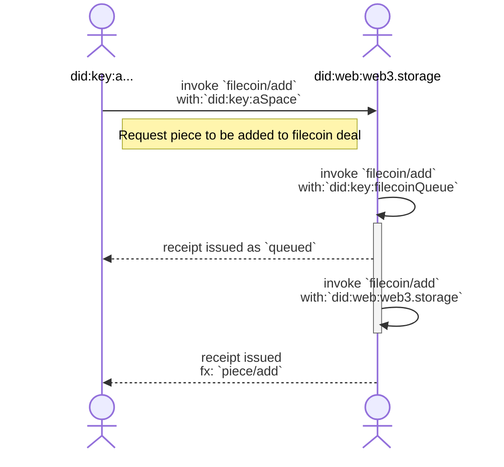
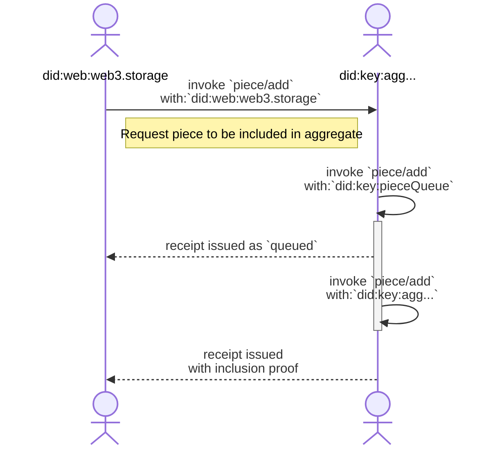
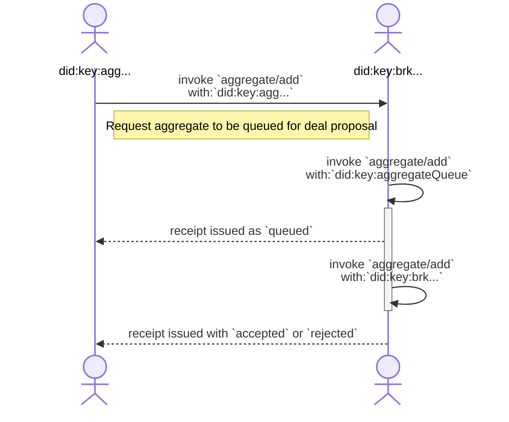
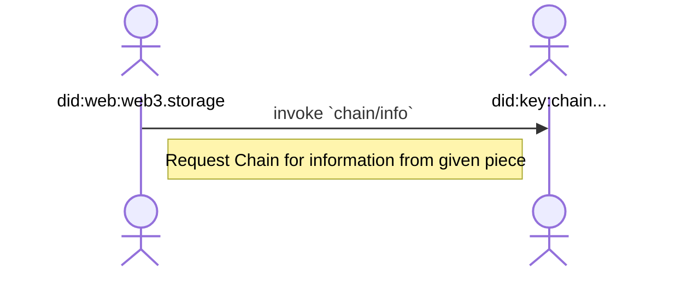

# CAR Aggregation Protocol


## Editors

- [Vasco Santos], [Protocol Labs]
- [Irakli Gozalishvili], [Protocol Labs]
- [Alan Shaw], [Protocol Labs]

## Authors

- [Vasco Santos], [Protocol Labs]

# Abstract

This spec describes a [UCAN] protocol allowing an implementer to receive an aggregate of CAR files for inclusion in a Filecoin deal.

## Language

The key words "MUST", "MUST NOT", "REQUIRED", "SHALL", "SHALL NOT", "SHOULD", "SHOULD NOT", "RECOMMENDED", "MAY", and "OPTIONAL" in this document are to be interpreted as described in [RFC2119](https://datatracker.ietf.org/doc/html/rfc2119).

# Terminology

## Roles

There are several roles in the authorization flow:

| Name        | Description |
| ----------- | ----------- |
| Storefront  | [Principal] identified by [`did:web`] identifier, representing a storage API like web3.storage |
| Aggregator  | [Principal] identified by `did:key` identifier, representing a storage aggregator like w3filecoin |
| Broker      | [Principal] identified by `did:key` identifier that arranges filecoin deals with storage providers like spade |
| Chain       | [Principal] identified by `did:key` identifier that tracks the filecoin chain |

### Storefront

A _Storefront_ is a type of [principal] identified by a [`did:web`] identifier.

A Storefront facilitates data storage services to applications and users, getting the requested data stored into Filecoin deals asynchronously.

### Aggregator

An _Aggregator_ is a type of [principal] identified by a `did:key` identifier.

An Aggregator facilitates data storage into Filecoin deals by aggregating smaller data (Filecoin Pieces) into a larger piece that can effectively be stored with a Filecoin Storage Provider.

### Broker

A _Broker_ is a type of [principal] identified by a `did:key` identifier that arranges deals for the aggregates submitted by _Storefront_.

### Chain

A _Chain_ is a type of [principal] identified by a `did:key` that tracks the filecoin chain to keep a view of successful deals.

# Protocol

## Overview

A Storefront is the entry point for user/application data into web3. It will act on behalf of users and move data around into different storage points. One of the key storage presences may be Filecoin Storage Providers. Storefront is able to ingest files of arbitrary sizes, while Storage Providers are looking for storing larger pieces, rather than small pieces. Accordingly, the aggregator is responsible for aggregating multiple smaller pieces into a bigger one that can be stored by Storage Providers.

### Authorization

Broker MUST have an authorization mechanism for allowed Storefront principals (e.g. web3.storage). Either by out of band exchange of information or through a well defined API. For example, a broker can authorize invocations from `did:web:filecoin.web3.storage` by validating the signature is from the DID. This way, it allows web3.storage to rotate keys and/or re-delegate access without having to coordinate with the broker.

### Storefront receives a Filecoin piece

When a Storefront's user (agent) intends to store a given content into a Filecoin Storage Provider, its proof SHOULD be computed (commonly known as Filecoin Piece) by the client and added to the Storefront. Note that Storefront MAY decide to compute the piece without waiting for an Agent to store received content into a Filecoin deal, or verify the agent claimed one. Storefront MUST acknowledge a request by issuing a signed receipt.

Once a Storefront receives the offer of a piece by an agent, the piece gets queued for verification. A receipt is created to proof the transition of the added piece state from `null` into `queued` for verification. It is worth mentioning that if an offer is for a piece that is already `queued` or `accepted`, it has no effect.

This receipt MUST have link to a followup task (using `.fx.join` field) that either succeeds (if the piece was accepted) or fails, so that its receipt COULD be looked up using it.

After a storefront dequeues the piece and verifies it, a receipt is created to proof the transition of the aggregate state from `queued` into `accepted` or `rejected`. This receipt MUST have link to a followup task (using `.fx.join` field) with `piece/add`.



### Storefront offers a piece to aggregate

Once a Storefront receives a valid piece, it MAY be offered for aggregation, so that it makes its way into a Storage Provider. Aggregation MAY be handled asynchronously, therefore the Aggregator MUST acknowledge a request by issuing a signed receipt.

Once an Aggregator successfully receives a piece offer, the piece gets queued for aggregation. A receipt is created to proof the transition of the offered aggregate state from `null` into `queued`. It is worth mentioning that if an offer is for a piece that is already `queued` or `accepted`, it has no effect.

This receipt MUST have link to a followup task (using `.fx.join` field) that either succeeds (if the piece was added into an aggregate) or fails, so that its receipt COULD be looked up using it.

After an aggregator dequeues the piece, it will be included into an aggregate to be offered for Storage Providers. A receipt is created to proof the transition of the aggregate state from `queued` into `accepted` or `rejected`. If successful, a inclusion proof should also be provided.



### Aggregator offers broker an aggregate

When the Aggregator has enough content to fulfill an aggregate (each broker MAY have different requirements), a Filecoin deal for an aggregate MAY be requested by an `aggregate/offer` invocation. Deal negotiations with Filecoin Storage Providers MAY be handled out of band. Broker MUST acknowledge a request by issuing a signed receipt.

Once a Broker successfully receives the offer of an aggregate, the aggregate gets queued for deals with Storage Providers. A receipt is created to proof the transition of the offered aggregate state from `null` into `queued`. It is worth mentioning that if an offer is for an aggregate that is already `queued` or `accepted`, it has no effect.

This receipt MUST have link to a followup task (using `.fx.join` field) that either succeeds (if the aggregate was added into a deal) or fails (if the aggregate was determined to be invalid) so that its receipt COULD be looked up using it.

After a broker dequeues the aggregate, it will interact with available Filecoin Storage Providers, in order to establish a previously determined (out of band) number of deals. Depending on storage providers availability, as well as the content present in the offer, the aggregate MAY be handled or not. A receipt is created to proof the transition of the aggregate state from `queued` into `accepted` or `rejected`.

> Note: Broker MAY have several intermediate steps and states it transitions through, however those intentionally are not captured by this protocol, because storefront will take no action until success / failure condition is met.



If the aggregate reaches the `accepted` state, the broker takes care of renewing deals.

The broker MAY request an out of bound signature from the Storefront to validate the terms of a deal.

### Storefront can query state of the aggregate deals

Storefront users MAY want to check details about deals from the content they previously stored. These deals will change over time as they get renewed. Therefore, Storefront should invoke `chain/info` capability to gather information about given aggregate identifier. Storefront should be able to look into previously received inclusion proofs to get the aggregate to look at based on the requested piece.



## Capabilities

This section describes the capabilities that form the w3 aggregation protocol, along with the details relevant for invoking capabilities with a service provider.

In this document, we will be exposing capabilities implemented by Storefront `web3.storage`, Aggregator `filecoin.web3.storage` and Broker `spade-proxy.web3.storage`.

### `filecoin/add`

An agent principal can invoke a capability to add a piece to upcoming Filecoin deal(s) with a Storage provider. See [schema](#filecoinadd-schema).

> `did:key:abc...` invokes capability from `did:web:web3.storage`

```json
{
  "iss": "did:key:abc...",
  "aud": "did:web:web3.storage",
  "att": [{
    "with": "did:key:abc...",
    "can": "filecoin/add",
    "nb": {
      "content": { "/": "bag..." }, /* CID of file previously added to resource space */
      "piece": { "/": "commitment...car" } /* commitment proof for piece */
    }
  }],
  "prf": [],
  "sig": "..."
}
```

Storefront MUST issue a signed receipt to acknowledge the received request. Issued receipt MUST contain an [effect](https://github.com/ucan-wg/invocation/#7-effect) with a subsequent task (`.fx.join` field) that is run when submitted piece is verified and either succeeds (implying that piece was valid) or fails (with `error` describing a problem with the piece).

```json
{
  "ran": "bafy...invocation",
  "out": {
    "ok": {
      "piece": { "/": "commitment...car" }, /* commitment proof for piece */
      "status": "queued"
    }
  },
  "fx": {
    "join": { "/": "bafy...dequeue" }
  },
  "meta": {},
  "iss": "did:web:web3.storage",
  "prf": []
}
```

When piece request to be added is dequeued, storefront should invoke `filecoin/add` to store it.

> `did:web:web3.storage` invokes capability from `did:web:web3.storage`

```json
{
  "iss": "did:web:web3.storage",
  "aud": "did:web:web3.storage",
  "att": [{
    "with": "did:web:web3.storage",
    "can": "filecoin/add",
    "nb": {
      "content": { "/": "bag..." }, /* CID of file previously added to resource space */
      "piece": { "/": "commitment...car" } /* commitment proof for piece */
    }
  }],
  "prf": [],
  "sig": "..."
}
```

Storefront MUST issue a signed receipt to communicate the response for the request. Issued receipt MUST contain an [effect](https://github.com/ucan-wg/invocation/#7-effect) with a subsequent task (`.fx.join` field) that is invoked to get a piece into an aggregate.

```json
{
  "ran": "bafy...invocation",
  "out": {
    "ok": {
      "piece": { "/": "commitment...car" }, /* commitment proof for piece */
      "status": "accepted"
    }
  },
  "fx": {
    "join": { "/": "bafy...piece...add" }
  },
  "meta": {},
  "iss": "did:web:web3.storage",
  "prf": []
}
```

See [`piece/add`](#pieceadd) section to see the subsequent task.
If the added piece is invalid, details on failing reason is also reported:

```json
{
  "ran": "bafy...invocation",
  "out": {
    "error": {
      "piece": { "/": "commitment...car" }, /* commitment proof for piece */
      "reason": "reasonCode",
    },
  },
  "fx": {
    "fork": []
  },
  "meta": {},
  "iss": "did:web:web3.storage",
  "prf": []
}
```

### `piece/add`

A storefront principal can invoke a capability to offer a piece to be aggregated for upcoming Filecoin deal(s). See [schema](#pieceadd-schema).

> `did:web:web3.storage` invokes capability from `did:key:agg...`

```json
{
  "iss": "did:web:web3.storage",
  "aud": "did:key:agg...",
  "att": [{
    "with": "did:web:web3.storage",
    "can": "piece/add",
    "nb": {
      "piece": { "/": "commitment...car" }, /* commitment proof for piece */
      "group": "did:web:free.web3.storage", /* grouping for joining segments together into an aggregate */
    }
  }],
  "prf": [],
  "sig": "..."
}
```

Aggregator MUST issue a signed receipt to acknowledge the received request. Issued receipt MUST contain an [effect](https://github.com/ucan-wg/invocation/#7-effect) with a subsequent task (`.fx.join` field) that is run when piece is added to an aggregate and either succeeds (implying that aggregate was queued for being offered) or fails (with `error` describing the problem).

```json
{
  "ran": "bafy...invocation",
  "out": {
    "ok": {
      "status": "queued"
    }
  },
  "fx": {
    "join": { "/": "bafy...dequeue" }
  },
  "meta": {},
  "iss": "did:key:agg...",
  "prf": []
}
```

When piece request to be added is dequeued, aggregator should invoke `piece/add` to include it in an aggregate.

> `did:key:agg...` invokes capability from `did:key:agg...`

```json
{
  "iss": "did:key:agg...",
  "aud": "did:key:agg...",
  "att": [{
    "with": "did:key:agg...",
    "can": "piece/add",
    "nb": {
      "piece": { "/": "commitment...car" }, /* commitment proof for piece */
      "group": "did:web:free.web3.storage", /* grouping for joining segments together into an aggregate */
    }
  }],
  "prf": [],
  "sig": "..."
}
```

Aggregator MUST issue a signed receipt with the result of the task. Arranged aggregate for piece receipt looks like:

```json
{
  "ran": "bafy...arrange",
  "out": {
    "ok": {
        "status": "accepted",
        "piece": { "/": "commitment...car" }, /* commitment proof for piece */
        "aggregate": { "/": "commitment...aggregate-proof" } /* commitment proof */
    }
  },
  "meta": {},
  "iss": "did:key:agg...",
  "prf": []
}
```

If offered piece is invalid, reason is also reported:

```json
{
  "ran": "bafy...invocation",
  "out": {
    "error": {
      "piece": { "/": "commitment...car" }, /* commitment proof for piece */
      "reason": "reasonCode",
    },
  },
  "meta": {},
  "iss": "did:key:agg...",
  "prf": []
}
```

### `aggregate/add`

An aggregator principal can invoke a capabilty to add an aggregate that is ready to be included in Filecoin deal(s). See [schema](#aggregateadd-schema).

> `did:web:filecoin.web3.storage` invokes capability from `did:web:spade.storage`

```json
{
  "iss": "did:web:filecoin.web3.storage",
  "aud": "did:web:spade.storage",
  "att": [{
    "with": "did:web:filecoin.web3.storage",
    "can": "aggregate/add",
    "nb": {
      "offer": { "/": "bafy...many-cars" }, /* dag-cbor CID with offer content */
      "piece": { "/": "commitment...aggregate-proof" }, /* commitment proof for aggregate */
      "deal": {
        "tenantId": "web3.storage",
        "label": "deal-label"
      }
    }
  }],
  "prf": [],
  "sig": "..."
}
```

Invoking `aggregate/add` capability submits an aggregate to a broker service for inclusion in one or more Filecoin deals.

The `nb.piece` field represents the proof of the `piece` to be offered for the deal. It is a CID with its piece size encoded. In addition, a Filecoin `nb.deal` contains the necessary fields for a Filecoin Deal proposal. More specifically, it MUST include `nb.deal.tenantId` that will allow broker to select from multiple wallets associated with the tenant and MAY include an arbitrary `nb.deal.label` chosen by the client.

Finally, The `nb.offer` field represents a "Ferry" aggregate offer that is ready for a Filecoin deal. Its value is the DAG-CBOR CID that refers to a "Ferry" offer. It encodes a dag-cbor block with an array of entries representing all the pieces to include in the aggregated deal. This array MUST be sorted in the exact same order as they were used to compute the aggregate piece CID. This block MUST be included in the CAR file that transports the invocation. Its format is:

```json
/* offers block as an array of piece CIDs, encoded as DAG-JSON (for readability) */
[
  { "/": "commitment...car0" }, /* COMMP CID */
  { "/": "commitment...car1" }, /* COMMP CID */
  /* ... */
]
```

Each entry of the decoded offers block, has all the necessary information for a Storage Provider to fetch and store a CAR file. It includes an array of Filecoin `piece` info required by Storage Providers.

Broker MUST issue a signed receipt to acknowledge the received request. Issued receipt MUST contain an [effect](https://github.com/ucan-wg/invocation/#7-effect) with a subsequent task (`.fx.join` field) that is run when submitted aggregate is processed and either succeeds (implying that aggregate was accepted and deals will be arranged) or fail (with `error` describing a problem with the aggregate).

```json
{
  "ran": "bafy...invocation",
  "out": {
    "ok": {
      "status": "queued"
    }
  },
  "fx": {
    "join": { "/": "bafy...dequeue" }
  },
  "meta": {},
  "iss": "did:web:spade.storage",
  "prf": []
}
```

When aggregate request to be added is dequeued, broker should invoke `aggregate/add` to store it.

> `did:web:spade.storage` invokes capability from `did:web:spade.storage`

```json
{
  "iss": "did:web:spade.storage",
  "aud": "did:web:spade.storage",
  "att": [{
    "with": "did:web:spade.storage",
    "can": "aggregate/add",
    "nb": {
      "offer": { "/": "bafy...many-cars" }, /* dag-cbor CID with offer content */
      "piece": { "/": "commitment...aggregate-proof" }, /* commitment proof for aggregate */
      "deal": {
        "tenantId": "web3.storage",
        "label": "deal-label"
      }
    }
  }],
  "prf": [],
  "sig": "..."
}
```

Broker MUST issue a signed receipt with the result of the task. Arranged aggregate receipt looks like:

```json
{
  "ran": "bafy...invocation",
  "out": {
    "ok": {
      "status": "accepted",
      "piece": { "/": "commitment...aggregate-proof" } /* commitment proof */
    }
  },
  "meta": {},
  "iss": "did:web:spade.storage",
  "prf": []
}
```

If offered aggregate is invalid, details on failing pieces are also reported:

```json
{
  "ran": "bafy...invocation",
  "out": {
    "error": {
      "piece": { "/": "commitment...aggregate-proof" }, /* commitment proof */
      "cause": [{
        "piece": { "/": "commitment...car0" },
        "reason": "reasonCode",
      }],
    },
  },
  "meta": {},
  "iss": "did:web:spade.storage",
  "prf": []
}
```

### `chain/info`

A Storefront principal can query state of accepted aggregate by invoking `chain/info` capability.

> `did:web:web3.storage` invokes capability from `did:key:chain...`

```json
{
  "iss": "did:web:web3.storage",
  "aud": "did:web:chain...",
  "att": [{
    "with": "did:web:filecoin.web3.storage",
    "can": "aggregate/get",
    "nb": {
      "piece": { "/": "commitment...aggregate-proof" } /* commitment proof */
    }
  }],
  "prf": [],
  "sig": "..."
}
```

Once this invocation is executed, a receipt is generated with the resulting aggregate information:

```json
{
  "ran": "bafy...get",
  "out": {
    "ok": {
      "deals": {
        "111": {
          "storageProvider": "f07...",
          "status": "Active",
          "pieceCid": "bag...",
          "dataCid": "bafy...",
          "dataModelSelector": "Links/...",
          "activation": "2023-04-13T01:58:00+00:00",
          "expiration": "2024-09-05T01:58:00+00:00",
          "created": "2023-04-11T17:57:30.522198+00:00",
          "updated": "2024-04-12T03:42:26.928993+00:00"
        }
      }
    },
  },
  "fx": {
    "fork": []
  },
  "meta": {},
  "iss": "did:web:spade.storage",
  "prf": []
}
```

## Schema

### Base types

```ipldsch
type FilecoinCapability enum {
  FilecoinAdd "filecoin/add"
} representation inline {
  discriminantKey "can"
}

type PieceCapability enum {
  PieceAdd "piece/add"
} representation inline {
  discriminantKey "can"
}

type AggregateCapability enum {
  AggregateAdd "aggregate/add"
} representation inline {
  discriminantKey "can"
}

type ChainCapability enum {
  ChainInfo "chain/info"
} representation inline {
  discriminantKey "can"
}

type PieceRef struct {
  piece PieceCid
}

type AgentDID string
type StorefrontDID string
type AggregatorDID string
type BrokerDID string
type ChainDID string

# from a fr32-sha2-256-trunc254-padded-binary-tree multihash
type PieceCid Link
type ContentCid Link
```

### `filecoin/add` schema

```ipldsch
type FilecoinAdd struct {
  with AgentDID
  nb FilecoinAddDetail
}

type FilecoinAddDetail struct {
  # CID of file previously added to resource space
  content ContentCid
  # Piece as Filecoin Piece with padding
  piece PieceCid
}
```

### `piece/add` schema

```ipldsch
type PieceAdd struct {
  with AgentDID
  nb PieceAddDetail
}

type PieceAddDetail struct {
  # Piece as Filecoin Piece with padding
  piece PieceCid
  # grouping for joining segments together into an aggregate
  group string
}
```

### `aggregate/add` schema

```ipldsch
type AggregateAdd struct {
  with StorefrontDID
  nb AggregateAddDetail
}

type AggregateAddDetail struct {
  # Contains each individual piece within Aggregate piece
  offer &Offer
  # Piece as Aggregate of CARs with padding
  piece PieceCid
  # Fields to create a contract with a Storage Provider for aggregate
  deal DealProposal
}

# @see https://github.com/filecoin-project/go-state-types/blob/ff2ed169ff566458f2acd8b135d62e8ca27e7d0c/builtin/v9/market/deal.go#L201-L221
# A subset of the deal proposal items required by broker to facilitate the contract to be created
type DealProposal struct {
  # identifier of the tenant that added pieces for the aggregate
  tenantId string
  # Label is an arbitrary client chosen label to apply to the deal
  label string
}

type Offer [PieceCid]
```

[`did:web`]: https://w3c-ccg.github.io/did-method-web/
[UCAN]: https://github.com/ucan-wg/spec/
[principal]: https://github.com/ucan-wg/spec/#321-principals

[Protocol Labs]:https://protocol.ai/
[Vasco Santos]:https://github.com/vasco-santos
[Irakli Gozalishvili]:https://github.com/Gozala
[Alan Shaw]:https://github.com/alanshaw
