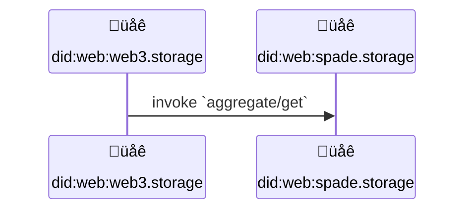

# CAR Aggregation Protocol


## Editors

- [Vasco Santos], [Protocol Labs]
- [Irakli Gozalishvili], [Protocol Labs]
- [Alan Shaw], [Protocol Labs]

## Authors

- [Vasco Santos], [Protocol Labs]
- [Irakli Gozalishvili], [Protocol Labs]
- [Alan Shaw], [Protocol Labs]

# Abstract

This spec describes a [UCAN] protocol allowing an implementer to receive an aggregate of CAR files for inclusion in a Filecoin deal.

## Language

The key words "MUST", "MUST NOT", "REQUIRED", "SHALL", "SHALL NOT", "SHOULD", "SHOULD NOT", "RECOMMENDED", "MAY", and "OPTIONAL" in this document are to be interpreted as described in [RFC2119](https://datatracker.ietf.org/doc/html/rfc2119).

# Terminology

## Roles

There are several roles in the authorization flow:

| Name        | Description |
| ----------- | ----------- |
| Storefront | [Principal] identified by [`did:web`] identifier, representing a storage aggregator like w3up |
| Authority   | [Principal] that represents the service provider that executes invoked capabilities |
| Verifier   | Component of the [authority] that performs UCAN validation |

### Storefront

A _Storefront_ is a type of [principal] identified by a [`did:web`] identifier.

A Storefront facilitates data storage services to applications and users, getting the requested data stored into Filecoin deals asynchronously.

### Authority

_Authority_ is a [principal] that executes invoked capabilities.

### Verifier

A Component of the [authority] that performs UCAN validation

# Protocol

## Overview

A Storefront is the entry point for user/application data into web3. It will act on behalf of users to move data around into different storage points. One of the key storage presences may be Filecoin Storage Providers.

### Authorization

Broker MUST have an authorization mechanism for allowed Storefront principals (e.g. web3.storage). Either by out-of-band exchange of information or through a well defined API. For example, a broker can authorize invocations from `did:web:web3.storage` by validating the signature is from the DID. This way, it allows web3.storage to rotate keys and/or re-delegate access without having to coordinate with the broker.

### Storefront offers broker an aggregate

When a Storefront has enough content to fulfill an aggregate (each broker MAY have different requirements), a Filecoin deal for an aggregate MAY be requested by an `aggregate/offer` invocation. Deal negotiations with Filecoin Storage Providers SHOULD be handled out-of-band. A broker MUST acknowledge a request by issuing a signed receipt.

```mermaid
sequenceDiagram
    participant Storefront as 🌐<br/><br/>did:web:web3.storage
    participant Authority as 🌐<br/><br/>did:web:spade.storage

    Storefront->>Authority: invoke `aggregate/offer`
    Note left of Authority: Request offer to be queued
    Authority-->>Storefront: receipt issued
```



### Broker queues the aggregate

Once a broker successfully receives the offer of an aggregate, the aggregate gets queued for review. A receipt is created to proof the transition of the offered aggregate state from `null` into `queued`. It is worth mentioning that if an offer is for an aggregate that is already `queued` or `complete` it is ignored.

This receipt MUST have link to a followup task (using `.fx.join` field) that either succeeds (if the aggregate was added into a deal) or fails (if the aggregate was determined to be invalid) so that it's receipt COULD be looked up using it.

> Note: Aggregator MAY have several intermediate steps and states it transitions through, however those intentionally are not captured by this protocol, because storefront will take no action until success / failure condition is met.

### Broker reviews and handles the aggregate

After a broker dequeues the aggregate, it will interact with available Filecoin Storage Providers, in order to establish a previously determined (out of band) number of deals. Depending on storage providers availability, as well as the content present in the offer, the aggregate MAY be handled or not. A receipt is created to proof the transition of the aggregate state from `queued` into `accepted` or `rejected`.

```mermaid
sequenceDiagram
    participant Storefront as 🌐<br/><br/>did:web:web3.storage
    participant Authority as 🌐<br/><br/>did:web:spade.storage

    Note right of Storefront: Review and handle offer async
    Authority-->>Storefront: receipt issued
```



If the aggregate reaches the `accepted` state, the broker takes care of renewing deals.

The broker MAY request an out of bound signature from the Storefront to validate the terms of a deal.

### Storefront can query state of the aggregate deals

Storefront users MAY want to check details about deals from the content they previously stored. These deals will change over time as they get renewed. Therefore, Storefront should invoke `aggregate/get` capability to gather information about given aggregate identifier.



## Capabilities

This section describes the capabilities that form the w3 aggregation protocol, along with the details relevant for invoking capabilities with a service provider.

In this document, we will be looking at `spade-proxy.web3.storage` as an implementer of the `aggregate/*` and `offer/*` protocol.

### `aggregate/offer`

A Storefront principal can invoke a capabilty to offer an aggregate that is ready to be included in Filecoin deal(s).

```iplsch
# Segment a set of Piece CIDs
# @see https://github.com/filecoin-project/FIPs/blob/master/FRCs/frc-0058.md
type Segment [&Piece]

type Offer [ContentPiece]

type Piece {
  # Size in nodes. For BLS12-381 (capacity 254 bits), must be >= 16. (16 * 8 = 128)
  size Int # todo: does this make sense for segment?
  link Link
}

type struct ContentPiece {
  piece Piece
  link Link
  src optional [URL]
}

type AggregateOffer struct {
  with StorefrontDID
  nb AggregateOfferDetail
}

type AggregateOfferDetail struct {
  offer &Offer
  segment Segment
}
```

> `did:web:web3.storage` invokes capability from `did:web:spade.storage`

```json
{
  "iss": "did:web:web3.storage",
  "aud": "did:web:spade.storage",
  "att": [{
    "with": "did:web:web3.storage",
    "can": "aggregate/offer",
    "nb": {
      "offer": { "/": "bafy...many-cars" }, /* dag-cbor CID */
      "segment": {
        "link": { "/": "commitment...cars-proof" },
        "size": 10102020203013342343
      } /* commitment proof */
    }
  }],
  "prf": [],
  "sig": "..."
}
```

Invoking `aggregate/offer` capability submits an aggregate to a broker service for inclusion in one or more Filecoin deals. The `nb.offer` field represents a "Ferry" aggregate offer that is ready for a Filecoin deal. Its value is the DAG-CBOR CID that refers to a "Ferry" offer. It encodes a dag-cbor block with an array of entries representing all the CAR files to include in the aggregated deal. This block MUST be included in the CAR file that transports the invocation. Its format is:

```json
/* offers block as ContentPiece type, encoded as DAG-JSON (for readability) */
[
  {
    "link": { "/": "bag...file0" }, /* CAR CID */
    "piece": {
      "link": { "/": "commitment...car0" }, /* COMMP CID */
      "size": 110101,
    },
    "src": ["https://w3s.link/ipfs/bag...file0"]
  },
  {
    /* ... */
  }
]
```

Each entry of the decoded offers block, has all the necessary information for a Storage Provider to fetch and store a CAR file. The `link` field has the CAR CID of the content, while the `piece` field has the corresponding Filecoin `piece` info required by Storage Providers . The `src` field of each piece MUST be set to a (alphabetically sorted) list of URLs from which it can be fetched. Note that `src` field is optional and can be provided in a different part of the flow such as when deal is signed or through a previously agreed API.

Broker MUST issue a signed receipt to acknowledge the received request. Issued receipt MUST contain an [effect](https://github.com/ucan-wg/invocation/#7-effect) with a subsequent task (`.fx.join` field) that is run when submitted aggregate is processed and either succeeds (implying that aggregate was accepted and deals will be arranged) or fail (with `error` describing a problem with the aggregate).

```json
{
  "ran": "bafy...invocation",
  "out": {
    "ok": {
      "status": "queued"
    }
  },
  "fx": {
    "join": { "/": "bafy...dequeue" }
  },
  "meta": {},
  "iss": "did:web:spade.storage",
  "prf": []
}
```

See [`offer/arrange`](#offerarrange) section to see the subsequent task.

### `aggregate/get`

A Storefront principal can invoke a capability to get state of a previously accepted offer.

> `did:web:web3.storage` invokes capability from `did:web:spade.storage`

```json
{
  "iss": "did:web:web3.storage",
  "aud": "did:web:spade.storage",
  "att": [{
    "with": "did:web:web3.storage",
    "can": "aggregate/get",
    "nb": {
      "segment": { "/": "commitment...cars-proof" } /* commitment proof */
    }
  }],
  "prf": [],
  "sig": "..."
}
```

Once this invocation is executed, a receipt is generated with the resulting aggregate information:

```json
{
  "ran": "bafy...get",
  "out": {
    "ok": {
      "deals": {
        "111": {
          "storageProvider": "f07...",
          "status": "Active",
          "pieceCid": "bag...",
          "dataCid": "bafy...",
          "dataModelSelector": "Links/...",
          "activation": "2023-04-13T01:58:00+00:00",
          "expiration": "2024-09-05T01:58:00+00:00",
          "created": "2023-04-11T17:57:30.522198+00:00",
          "updated": "2024-04-12T03:42:26.928993+00:00"
        }
      }
    },
  },
  "fx": {
    "fork": []
  },
  "meta": {},
  "iss": "did:web:spade.storage",
  "prf": []
}
```

### `offer/arrange`

When a broker receives an `aggregate/offer` invocation from a Storefront Principal, an [Effect](https://github.com/ucan-wg/invocation/#7-effect) for this submission is created with join task to be performed asynchronously.

```json
{
  "iss": "did:web:spade.storage",
  "aud": "did:web:web3.storage",
  "att": [{
    "with": "did:web:spade.storage",
    "can": "offer/arrange",
    "nb": {
      "segment": { "/": "commitment...cars-proof" } /* commitment proof */
    }
  }],
  "prf": [],
  "sig": "..."
}
```

Once this invocation is executed, a receipt is generated with the result of the task. Accepted aggregate receipt looks like:

```json
{
  "ran": "bafy...arrange",
  "out": {
    "ok": {
       "segment": { "/": "commitment...cars-proof" } /* commitment proof */
    }
  },
  "fx": {
    "fork": []
  },
  "meta": {},
  "iss": "did:web:spade.storage",
  "prf": []
}
```

If offered aggregate is invalid, details on failing pieces are also reported:

```json
{
  "ran": "bafy...invocation",
  "out": {
    "error": {
      "segment": { "/": "commitment...cars-proof" }, /* commitment proof */
      "cause": [{
        "piece": { "/": "commitment...car0" },
        "reason": "reasonCode",
      }],
    },
  },
  "fx": {
    "fork": []
  },
  "meta": {},
  "iss": "did:web:spade.storage",
  "prf": []
}
```

### Schema

```ipldsch
type Aggregate union {
  | Link "queued"
  | Link "accepted"
  | Link "rejected"
} representation keyed

type AggregateCapability enum {
  AggregateOffer "aggregate/offer"
  AggregateGet "aggregate/get"
} representation inline {
  discriminantKey "can"
}

type OfferCapability union {
  OfferArrange "offer/arrange"
} representation inline {
  discriminantKey "can"
}

type AggregateOffer struct {
  with StorefrontDID
  nb AggregateOfferDetail
}

type AggregateGet struct {
  with StorefrontDID
  nb SucceedAggregateRef
}

type OfferArrange struct {
  with BrokerDID nb AggregateRef
}

type SucceedAggregateRef struct {
  segment Link
}

type AggregateRef struct {
  segment Link
}

type AggregateOfferDetail struct {
  offer &Offer
  segment Segment
}

type Piece {
  # Size in nodes. For BLS12-381 (capacity 254 bits), must be >= 16. (16 * 8 = 128)
  size Int # todo: does this make sense for segment?
  link Link
}

type struct ContentPiece {
  piece Piece
  link Link
  src optional [URL]
}

# Segment a set of Piece CIDs
# @see https://github.com/filecoin-project/FIPs/blob/master/FRCs/frc-0058.md
type Segment [&Piece]

type Offer [ContentPiece]

type StorefrontDID string
type URL string

type BrokerDID string
```

[`did:web`]: https://w3c-ccg.github.io/did-method-web/
[UCAN]: https://github.com/ucan-wg/spec/
[principal]: https://github.com/ucan-wg/spec/#321-principals
[authority]:#authority

[Protocol Labs]:https://protocol.ai/
[Vasco Santos]:https://github.com/vasco-santos
[Irakli Gozalishvili]:https://github.com/Gozala
[Alan Shaw]:https://github.com/alanshaw
