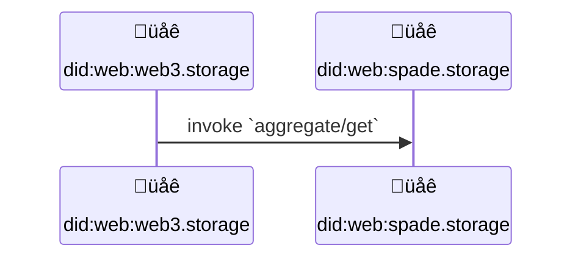

# CAR Aggregation Protocol


## Editors

- [Vasco Santos], [Protocol Labs]
- [Irakli Gozalishvili], [Protocol Labs]
- [Alan Shaw], [Protocol Labs]

## Authors

- [Vasco Santos], [Protocol Labs]
- [Irakli Gozalishvili], [Protocol Labs]
- [Alan Shaw], [Protocol Labs]

# Abstract

This spec describes a [UCAN] protocol allowing an implementer to receive an aggregate of CAR files for inclusion in a Filecoin deal.

## Language

The key words "MUST", "MUST NOT", "REQUIRED", "SHALL", "SHALL NOT", "SHOULD", "SHOULD NOT", "RECOMMENDED", "MAY", and "OPTIONAL" in this document are to be interpreted as described in [RFC2119](https://datatracker.ietf.org/doc/html/rfc2119).

# Terminology

## Roles

There are several roles in the authorization flow:

| Name        | Description |
| ----------- | ----------- |
| Storefront | [Principal] identified by [`did:web`] identifier, representing a storage aggregator like w3up |
| Authority   | [Principal] that represents service provider that executes invoked capabilities |
| Verifier   | Component of the [authority] that performs UCAN validation |

### Storefront

A _Storefront_ is a type of [principal] identified by a [`did:web`] identifier.

A Storefront facilitates data storage services to applications and users, getting the requested data stored into Filecoin deals asynchronously.

### Authority

_Authority_ is a [principal] that executes invoked capabilities.

### Verifier

A Component of the [authority] that performs UCAN validation

# Protocol

## Overview

A Storefront is the entry point for user/application data into web3. It will act on behalf of users to move data around into different storage points. One of the key storage presences may be Filecoin Storage Providers.

### Authorization

Broker MUST have an authorization mechanism for allowed Storefront principals (e.g. web3.storage). Either by out-of-bound exchange of information or through a well defined API. In other words, broker can authorize invocations from `did:web:web3.storage` by validating signature from did. This way, it allows web3.storage to rotate keys without having too coordinate that with the broker.

### Storefront offers broker an aggregate

When a Storefront has enough content to fulfill an aggregate (each broker MAY have different requirements), a Filecoin deal for an aggregate SHALL be requested by a `aggregate/offer` invocations. Deal negotiations with Filecoin Storage Providers will be handled out off band. Broker SHOULD generate a receipt to acknowledge the received request.

```mermaid
sequenceDiagram
    participant Storefront as 🌐<br/><br/>did:web:web3.storage
    participant Authority as 🌐<br/><br/>did:web:spade.storage

    Storefront->>Authority: invoke `aggregate/offer`
    Note left of Authority: Request offer to be queued
```



### Broker queues the offer

Once broker successfuly gets an offer, the offer gets queued for review. A receipt is created to proof the transition of `aggregate/offer` state from `null` into `queued`.

This receipt MUST contain a follow up task in the (`.fx.join` field) that is run when submitted request is processed. It MAY succeed (if aggregate was accepted) or fail (if aggregated was  determined to be invalid). The result of the subsequent task CAN be looked up using its receipt.

```mermaid
sequenceDiagram
    participant Authority as 🌐<br/><br/>did:web:spade.storage
    participant Storefront as 🌐<br/><br/>did:web:web3.storage

    Storefront->>Authority: invoke `aggregate/offer`
    Note left of Storefront: Queueing offer
    Authority-->>Storefront: receipt issued
```



### Broker reviews and handles the offer

When a broker pops the offer from the queue, the offer details MUST be retrievable. With the offer details, the broker MAY interact with available Filecoin Storage Providers, in order to establish a previously determined number of deals. Depending on storage providers availability, as well as the content present in the offer, the aggregate MAY be handlded or not. A receipt is created to proof the transition of `aggregate/offer` state from `queued` into `accepted` or `denied`.

```mermaid
sequenceDiagram
    participant Authority as 🌐<br/><br/>did:web:spade.storage
    participant Storefront as 🌐<br/><br/>did:web:web3.storage

    Note left of Storefront: Review and handle offer async
    Authority-->>Storefront: receipt issued
```



Once offer is accepted broker takes care of arranging and renewing deals.

### Storefront can query state of the aggregate deals

Storefront users MAY want to check details about deals from the content they previously stored. These deals will change over time as they get renewed. Therefore, Storefront should invoke `aggregate/get` capability to gather information about given aggregate identifier.



## Capabilities

This section describes the capabilities that form the w3 aggregation protocol, along with the details relevant for invoking capabilities with a service provider.

In this document, we will be looking at `spade.storage` as an implementer of the `aggregate/*` and `offer/*` protocol.

### `aggregate/offer`

A Storefront principal can invoke a capabilty to submit an aggregate ready for offers.

> `did:web:web3.storage` invokes capability from `did:web:spade.storage`

```json
{
  "iss": "did:web:web3.storage",
  "aud": "did:web:spade.storage",
  "att": [{
    "with": "did:web:web3.storage",
    "can": "aggregate/offer",
    "nb": {
      "offer": {
        "link": "bagy...aggregate",
        "size": 110101,
        "commP": "commP...",
        "src": ["https://w3s.link/ipfs/bagy...aggregate"]
      }
    }
  }],
  "prf": [],
  "sig": "..."
}
```

This capability is invoked to submit a request to a broker service when an aggregate is ready for a Filecoin deal. The `nb.offer.link` is the CAR CID that refers to a "Ferry" aggregate, a collection of dag-cbor blocks with format:

```json
{
  "link": "bag...",
  "size": 110101,
  "commP": "commP...",
  "src": ["https://.../bag(...).car"]
}
```

A receipt will be generated to acknowledge the received request. This receipt MUST contain an [effect](https://github.com/ucan-wg/invocation/#7-effect) with a subsequent task (`.fx.join` field) that is run when submitted aggregate is processed and either succeeds (implying that aggregate was accepted and deals will be arranged) or fail (with `error` describing a problem with an aggregate)

```json
{
  "ran": "bafy...invocation",
  "out": {
    "ok": {
      "status": "queued"
    }
  },
  "fx": {
    "join": { "/": "bafy...dequeue" }
  },
  "meta": {},
  "iss": "did:web:spade.storage",
  "prf": []
}
```

Open questions:

- can we get `commP` of the aggregate with `commP` of every CAR that is part of it?

### `aggregate/get`

A Storefront principal can invoke a capability to get state of an accepted aggregate.

> `did:web:web3.storage` invokes capability from `did:web:spade.storage`

```json
{
  "iss": "did:web:web3.storage",
  "aud": "did:web:spade.storage",
  "att": [{
    "with": "did:web:web3.storage",
    "can": "aggregate/get",
    "nb": {
      "commP": "commP...",
    }
  }],
  "prf": [],
  "sig": "..."
}
```

### `offer/review`

When a broker receives an `aggregate/offer` invocation from a Storefront Principal, an [Effect](https://github.com/ucan-wg/invocation/#7-effect) for this submission is created with join task to be performed asynchronously.

```json
{
  "iss": "did:web:spade.storage",
  "aud": "did:web:web3.storage",
  "att": [{
    "with": "did:web:spade.storage",
    "can": "offer/review",
    "nb": {
      "commP": "commP",
    }
  }],
  "prf": [],
  "sig": "..."
}
```

Once this invocation is executed, a receipt is generated with the status of the task updated. Accepted aggregate receipt will provide aggregate status info:

```json
{
  "ran": "bafy...review",
  "out": {
    "ok": {
       "status": "accepted",
       "link": "bafy...aggregate"
    }
  },
  "fx": {
    "fork": []
  },
  "meta": {},
  "iss": "did:web:spade.storage",
  "prf": []
}
```

If offered aggregate is invalid, details on failing commPs are also reported:

```json
{
  "ran": "bafy...invocation",
  "out": {
    "error": {
      "status": "denied",
      "cause": [{
        "commP": "commP",
        "reason": "reasonCode",
      }],
    },
  },
  "fx": {
    "fork": []
  },
  "meta": {},
  "iss": "did:web:spade.storage",
  "prf": []
}
```

### Schema

```ipldsch
type Aggregate =
  { "status": "queued", link: Link } |
  { "status": "accepted", link: Link } |
  { "status": "denied", link: Link }

type AggregateCapability enum {
  AggregateOffer "aggregate/offer"
  AggregateGet "aggregate/get"
} representation inline {
  discriminantKey "can"
}

type AggregateGet struct {
  with StorefrontDID
  nb SucceedAggregateRef
}

type SucceedAggregateRef struct {
  commP string
}

type AggregateRef struct {
  link &AggregateCAR
}

type AggregateOffer struct {
  with StorefrontDID
  nb AggregateOfferDetail
}

type AggregateOfferDetail struct {
  offer: Offer
}

type Offer {
  link &AggregateCAR
  src [URL]
  size number
  commP string
}

type StorefrontDID string
type URL string
type AggregateCAR any
type OfferCapability union {
  OfferReview "offer/review"
} representation inline {
  discriminantKey "can"
}

type OfferReview struct {
  with BrokerDID nb AggregateRef
}

type BrokerDID string
```

[`did:web`]: https://w3c-ccg.github.io/did-method-web/
[UCAN]: https://github.com/ucan-wg/spec/
[principal]: https://github.com/ucan-wg/spec/#321-principals
[authority]:#authority

[Protocol Labs]:https://protocol.ai/
[Vasco Santos]:https://github.com/vasco-santos
[Irakli Gozalishvili]:https://github.com/Gozala
[Alan Shaw]:https://github.com/alanshaw
