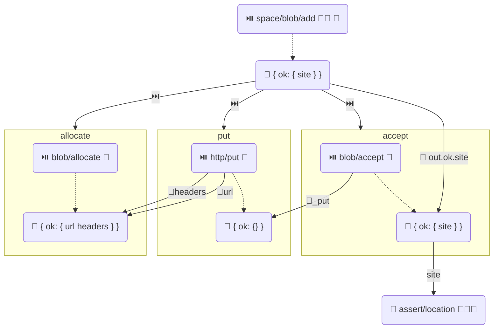

# W3 Blob Protocol


- [Irakli Gozalishvili](https://github.com/gozala)
- [Vasco Santos](https://github.com/vasco-santos)

## Authors

- [Irakli Gozalishvili](https://github.com/gozala)
- [Vasco Santos](https://github.com/vasco-santos)

## Abstract

W3 blob protocol allows authorized agents to store arbitrary content blobs with a storage provider.

## Language

The key words "MUST", "MUST NOT", "REQUIRED", "SHALL", "SHALL NOT", "SHOULD", "SHOULD NOT", "RECOMMENDED", "MAY", and "OPTIONAL" in this document are to be interpreted as described in [RFC2119](https://datatracker.ietf.org/doc/html/rfc2119).

# Introduction

W3 blob protocol provides core building block for storing content and sharing access to it through UCAN authorization system. It is successor to the [store protocol] which no longer requires use of [Content Archive][CAR]s even if in practice clients can continue to use it for storing shards of large DAGs.

## Concepts

### Roles

There are several distinct roles that [principal]s may assume in this specification:

| Name        | Description                                                                                                                           |
| ----------- | ------------------------------------------------------------------------------------------------------------------------------------- |
| Principal   | The general class of entities that interact with a UCAN. Identified by a DID that can be used in the `iss` or `aud` field of a UCAN.  |
| Agent       | A [Principal] identified by [`did:key`] identifier, representing a user in an application.                                            |
| Issuer      | A [principal] delegating capabilities to another [principal]. It is the signer of the [UCAN]. Specified in the `iss` field of a UCAN. |
| Audience    | Principal access is shared with. Specified in the `aud` field of a UCAN.                                                              |

### Space

A namespace, often referred as a "space", is an owned resource that can be shared. It corresponds to a unique asymmetric cryptographic keypair and is identified by a [`did:key`] URI.

### Blob

Blob is a fixed size byte array addressed by the [multihash]. Usually blobs are used to represent set of IPLD blocks at different byte ranges.

# Capabilities

## Add Blob

Authorized agent MAY invoke `space/blob/add` capability on the [space] subject to store specific byte array.

> Note that storing a blob does not imply advertising it on the network or making it publicly available.

### Add Blob Diagram

The following diagram illustrates execution flow. Alice invokes a `space/blob/add` command which produces a receipt with three effects (`allocate`, `put`, `accept`) and an awaited `site` commitment. Effects have dependencies and therefore predict execution flow (from left to right). The output of the main task awaits on the result of the last effect.


```mermaid
flowchart TB
Add("⏯️ space/blob/add 👩‍💻 🤖")
AddOk("🧾 { ok: { site } }")


subgraph accept
Accept("⏯️ blob/accept 🤖")
AcceptOk("🧾 { ok: { site } }")
end

subgraph put
Put("⏯️ http/put 🔑")
PutOk("🧾 { ok: {} }")
end


subgraph allocate
Allocate("⏯️ blob/allocate 🤖")
AllocateOk("🧾 { ok: { url headers } }")
end

Site("🎫 assert/location 🤖👩‍💻")


Add -.-> AddOk
AddOk -- ⏭️ --> allocate
AddOk -- ⏭️ --> put
AddOk -- ⏭️ --> accept
AddOk -- 🚦 out.ok.site --> AcceptOk


Allocate -.-> AllocateOk

Put -- 🚦url --> AllocateOk
Put -- 🚦headers --> AllocateOk

Put -.-> PutOk


Accept -- 🚦_put --> PutOk
Accept -.-> AcceptOk
AcceptOk -- site --> Site
```

#### Iconography

- ⏯️ Task
- ⏭️ Next Task (a.k.a Effect)
- 🧾 Receipt
- 🎫 Delegation
- 🚦 Await
- 👩‍💻 Alice
- 🤖 Service
- 🔑 Derived Principal

### Add Blob Invocation Example

Shown Invocation example illustrates Alice requesting to add 2MiB blob to her space.

> ℹ️ Note: we use `// "/": "bafy..` comments to denote CID of the parent object.

```jsonc
{ // "/": "bafy..add"
  "iss": "did:key:zAlice",
  "aud": "did:web:up.storacha.network",
  "att": [{
    "can": "space/blob/add",
    "with": "did:key:zAlice",
    "nb": {
      "blob": {
        // multihash of the blob as byte array
        "digest": { "/": { "bytes": "mEi...sfKg" } },
        // size of the blob in bytes
        "size": 2097152
      }
    }
  }]
}
```

### Add Blob Receipt Example

Shows an example receipt for the above `space/blob/add` capability invocation.

```jsonc
{
  "ran": "bafy..add",
  "out": {
    "ok": {
      // Result of the add is the content (location) commitment that is produced
      // as result of "bafy..accept"
      "site": {
        "ucan/await": [
          ".out.ok.site",
          { "/": "bafy...accept" }
        ]
      }
    }
  },
  // Async tasks to be scheduled.
  "fx": {
    "fork": [
      // 1. System attempts to allocate memory in user space for the blob.
      { "/": "bafy...alloc" },
      // 2. System requests user agent (or anyone really) to upload the content
      // corresponding to the blob via HTTP PUT to given location.
      { "/": "bafy...put" },
      // 3. System will attempt to accept uploaded content that matches blob
      // multihash and size.
      { "/": "bafy...accept" }
    ]
  }
}
```

### Add Blob Capability

#### Add Blob Capability Schema

```ts
type AddBlob = {
  can: "space/blob/add"
  with: SpaceDID
  nb: {
    blob: Blob
  }
}

type Blob = {
  digest: Multihash
  size: int
}

type Multihash = bytes
type SpaceDID = string
```

#### Blob Digest

The `nb.blob.digest` field MUST be a [multihash] digest of the blob payload bytes. Implementation SHOULD support SHA2-256 algorithm. Implementation MAY in addition support other hashing algorithms.

#### Blob Size

Blob `nb.blob.size` field MUST be set to the number of bytes in the blob content.

### Add Blob Receipt

#### Add Blob Receipt Schema

```ts
// Only operation specific fields are covered the rest are implied
type AddBlobReceipt = {
  out: Result<AddBlobOk, AddBlobError>
  fx: {
    fork: [
      Link<AllocateBlob>,
      Link<PutBlob>,
      Link<AcceptBlob>,
    ]
  }
}

type Result<Ok, Err> = { ok: Ok } | { error: Err }

type AddBlobOk = {
  site: {
    "ucan/await": [".out.ok.site", Link<AcceptBlob>]
  }
}

type AddBlobError = {
  message: string
}
```

#### Add Blob Result

Invocation MUST fail if any of the following is true

1. Provided subject space is not provisioned with a provider.
1. Provided `blob.size` is outside of supported range.
1. Provided `blob.digest` is not a valid [multihash].
1. Provided `blob.digest` [multihash] hashing algorithm is not supported.

Invocation MUST succeed if non of the above is true. Success value MUST be an object with a `site` field set to [ucan/await] of the task that produces a [location commitment].

Task linked from the `site` of the success value MUST be present in the receipt effects _(`next` field)_.

#### Add Blob Effects

Successful invocation MUST start a workflow consisting of following tasks, that MUST be set in receipt effects (`next` field) in the following order.

1. [Allocate Blob]
1. [Put Blob]
1. [Accept Blob]

## Allocate Blob

An authorized agent MAY invoke `blob/allocate` capability on a storage provider to create a memory address where the `blob` content can be written via a HTTP `PUT` request.

### Allocate Blob Capability

Example:

```jsonc
{ // "/": "bafy...alloc",
  "iss": "did:web:up.storacha.network",
  "aud": "did:key:zStorageProvider",
  "att": [{
    "can": "blob/allocate",
    "with": "did:key:zStorageProvider",
    "nb": {
      // space where memory is allocated
      "space": { "/": { "bytes": "did:key:zAlice" } },
      "blob": {
        // multihash of the blob as byte array
        "digest": { "/": { "bytes": "mEi...sfKg" } },
        // size of the blob in bytes
        "size": 2097152,
      },
      // task that caused this invocation
      "cause": { "/": "bafy..add" }
    }
  }]
}
```

#### Allocate Blob Capability Schema

```ts
type BlobAllocate = {
  can: "blob/allocate"
  with: ProviderDID
  nb: {
    space: Bytes<SpaceDID>
    blob: Blob
    cause: Link<AddBlob>
  }
}
```

#### Allocation Space

The `nb.space` field MUST be set to the (byte encoded) [DID] of the user space where allocation takes place.

#### Allocation Blob

The `nb.blob` field MUST be set to the `Blob` the space is allocated for.

#### Allocation Cause

The `nb.cause` field MUST be set to the [Link] for the [Add Blob] task, that caused an allocation.

### Allocate Blob Receipt

Allocations MUST fail if `space` does not have enough capacity for the `blob` and succeed otherwise.

#### Allocate Blob Receipt Schema

```ts
type BlobAllocateReceipt = {
  ran:  Link<BlobAllocate>
  out:  Result<BlobAllocateOk, BlobAllocateError>
}

type BlobAllocateOk = {
  size: int
  address?: BlobAddress
}

type BlobAddress = {
  url: string
  headers: { [key: string]: string }
  // Unix timestamp (in seconds precision) of when this address expires
  expires: int
}
```

### Allocation Size

The `out.ok.size` MUST be set to the number of bytes that were allocated for the `Blob`. It MUST be equal to either:

1. The `nb.blob.size` of the invocation.
2. `0` if the storage node already has memory allocated for the `nb.blob`.

### Allocation Address

The optional `out.ok.address` SHOULD be omitted when content for the allocated blob is already available on site. Otherwise it MUST be set to the `BlobAddress` that can receive a blob content.

The `url` of the `BlobAddress` MUST be an HTTP(S) location that can receive blob content via HTTP `PUT` request, as long as HTTP headers from `headers` dictionary are set on the request.

It is RECOMMENDED that issued `BlobAddress` only accept `PUT` payload that matches requested `blob`, both content [multihash] and size.

> ℹ️ If enforcing above recommendation is not possible implementation MUST enforce in [Accept Blob] invocation.

### Allocation Effects

Allocation MUST have no effects.

## Put Blob

Any agent MAY perform `http/put` capability invocation on behalf of the subject. The [add blob] capability provider MUST add a `http/put` effect and capture the private key of the `subject` in the `facts` field so that any agent can perform it.

The agent that invoked [add blob] capability is expected to perform this task and issue receipt on completion.

### Put Blob Capability

Example:

```jsonc
{ // "/": "bafy...put",
  "iss": "did:key:zMh...der", // <-- Ed299.. derived key from content multihash
  "aud": "did:key:zMh...der",
  "att": [{
    "can": "http/put",
    "with": "did:key:zMh...der",
    "nb": {
      // pipe url from the allocation result
      "url": {
        "ucan/await": [
          ".out.ok.address.url",
          { "/": "bafy...alloc" }
        ]
      },
      // pipe headers from the allocation result 
      "headers": {
        "ucan/await": [
          ".out.ok.address.headers",
          { "/": "bafy...alloc" }
        ]
      },
      // body of the http request
      "body": {
        // multihash of the blob as byte array
        "digest": { "/": { "bytes": "mEi...sfKg" } },
        "size": 2097152
      }
    }
  }],
  "fct": [{
    // archive of the principal keys
    "keys": {
      "did:key:zMh...der": { "/": { "bytes": "mEi...sfKg" } }
    }
  }]
}
```

#### Put Blob Capability Schema

```ts
type BlobPut = {
  can: "http/put"
  with: DID
  nb: {
    url: URL
    headers: Headers
    body: Blob
  }
  fct: [{
    keys: {[key: DID]: bytes}
  }]
}
```

### Put Blob Subject

The subject field SHOULD be [`did:key`] corresponding to the [Ed25519] private key that is last 32 bytes of the blob [multihash].

### Put Blob Facts

Metadata MUST contain `keys` field with an object value that contains [`did:key`] subject as key and corresponding private key bytes as a value.

### Put Blob URL

Destination `url` MUST be specified in the arguments and it MUST be an endpoint that can accept HTTP PUT request.

### Put Blob Headers

The `headers` map MUST be specified in the arguments. It MUST have string keys corresponding to header names and string values corresponding to header values.

### Put Blob Body

The `body` argument MUST be an object with `digest` and `size` fields describing the content of the request body.

### Put Blob Receipt

Receipt is signal to the service to proceed with [accept blob]. Service implementation that does not require signal from the client it MAY issue receipt when content is uploaded.

ℹ️ Client MAY use [UCAN conclusion] capability to deliver receipt to the awaiting service.

#### Put Blob Receipt Schema

```ts
type BlobPutReceipt = {
  ran: Link<BlobPut>
  out: Result<BlobPutOk, BlobPutError>
}

type BlobPutOk = {}

type BlobPutError = {
  message: string
}
```

#### Blob Put Effects

Receipt MUST not have any effects.

## Accept Blob

Authorized agent MAY invoke `blob/accept` capability on the storage provider. Invocation MUST either succeed when content is delivered at allocated site or fail if either allocation failed or expired before content was delivered.

Invocation MUST block until content is delivered. Implementation MAY resume when content is sent to the allocated address or await until client signals that content has been delivered using [put blob receipt].

ℹ️ Implementation that is unable to reject HTTP PUT request for the payload that does not match blob [multihash] or `size` SHOULD enforce the invariant in this invocation by failing task if no valid content has been delivered.

### Accept Blob Capability

Example:

```jsonc
{ // "/": "bafy...accept",
  "iss": "did:web:up.storacha.network",
  "aud": "did:key:zStorageProvider",
  "att": [{
    "can": "blob/accept",
    "with": "did:key:zStorageProvider",
    "nb": {
      "space": { "/": { "bytes": "did:key:zAlice" } },
      "blob": {
        // multihash of the blob as byte array
        "content": { "/": { "bytes": "mEi...sfKg" } },
        "size": 2097152,
      },
      // This task is blocked on blob put
      "_put": { "ucan/await": [".out.ok", { "/": "bafy...put" }] }
    }
  }]
}
```

#### Accept Blob Capability Schema

```ts
type BlobAccept = {
  can: "blob/accept"
  with: ProviderDID
  nb: {
    space: Bytes<SpaceDID>
    blob: Blob
  }
}
```

### Accept Blob Receipt

#### Accept Blob Receipt Schema

```ts
type BlobAcceptReceipt = {
  ran: Link<BlobAccept>
  out: Result<BlobAcceptOk, BlobAcceptError>
}

type BlobAcceptOk = {
  site: Link<LocationCommitment>
}

type BlobAcceptError = {
  message: string
}
```

#### Blob Accept Effects

Receipt MUST not have any effects.

## Location Commitment

Location commitment represents a commitment from the issuer to the audience that content matching the `content` [multihash] can be read via a HTTP [range request].

### Location Commitment Capability

Example:

```jsonc
{
  "iss": "did:key:zStorageProvider",
  "aud": "did:key:zAlice",
  "att": [{
    "can": "assert/location",
    "with": "did:key:zStorageProvider",
    "nb": {
      // space the content was added to
      "space": { "/": { "bytes": "did:key:zAlice" } },
      // multihash must match be for the blob uploaded
      "content": { "/": { "bytes": "mEi...sfKg" } },
      // must be available from this url
      "url": "https://storage-provider.example.com/blob/zQm...",
      // from this range
      "range": {
        "offset": 0,
        "length": 2097152
      }
    }
  }],
  // does not expire
  "exp": null
}
```

#### Location Commitment Capability Schema

```ts
type LocationCommitment = {
  can: "assert/location"
  with: ProviderDID
  nb: {
    space: SpaceDID
    content: Multihash
    url: string
    range?: {
      offset: int
      length?: int
    }
  }
}
```

## List Blob

Authorized agent MAY invoke `/space/blob/list` capability on the [space] subject (`with` field) to list Blobs added to it at the time of invocation.

### List Blob Invocation Example

Shown Invocation example illustrates Alice requesting a page of the list of blobs stored on their space.

```jsonc
{ // "/": "bafy..list",
  "iss": "did:key:zAlice",
  "aud": "did:web:up.storacha.network",
  "att": [{
    "can": "space/blob/list",
    "with": "did:key:zAlice",
    "nb": {
      // cursor where to start listing from
      "cursor": "cursor-value-from-previous-invocation",
      // size of page
      "size": 40
    }
  }]
}
```

### List Blob Receipt Example

An example receipt for the above `space/blob/list` capability invocation:

```jsonc
{ // "/": "bafy..list"
  // refers to the invocation from the example
  "ran": { "/": "bafy..list" },
  "out": {
    "ok": {
      // cursor where to start listing from on next call
      "cursor": "cursor-value-for-next-invocation",
      // size of the list
      "size": 40,
      "results": [
        {
          "insertedAt": "2024-04-16T15:49:22.638Z",
          "blob": {
            "size": 100,
            "content": { "/": { "bytes": "mEi...sfKg" } },
          }
        }
        // ...
      ]
    }
  }
}
```

### List Blob Capability

#### List Blob Capability Schema

```ts
type ListBlob = {
  can: "space/blob/list"
  with: SpaceDID
  nb: {
    cursor?: string
    size?: number
  }
}
```

##### List Cursor

The optional `nb.cursor` MAY be specified in order to paginate over the list of the added Blobs.

##### List Size

The optional `nb.size` MAY be specified to signal desired page size, that is number of items in the result.

### List Blob Receipt

#### List Blob Receipt Schema

```ts
type ListBlobReceipt = {
  out: Result<ListBlobOk, ListBlobError>
}

type ListBlobOk = {
  cursor?: string
  before?: string
  after?: string
  size: number
  results: ListBlobItem
}

type ListBlobItem = {
  blob: Blob
  insertedAt: ISO8601Date
}

type ISO8601Date = string

type ListBlobError = {
  message: string
}
```

##### List Blob Effects

Receipt MUST not have any effects.

## Remove Blob

Authorized agent MAY invoke `space/blob/remove` capability to remove content archive from the subject space (`with` field).

### Remove Blob Invocation Example

Shown Invocation example illustrates Alice requesting to remove a blob stored on their space:

```jsonc
{ // "/": "bafy..remove"
  "iss": "did:key:zAlice",
  "aud": "did:web:up.storacha.network",
  "att": [{
    "can": "space/blob/remove",
    "with": "did:key:zAlice",
    "nb": {
      // multihash of the blob as byte array
      "digest": { "/": { "bytes": "mEi...sfKg" } }
    }
  }]
}
```

### Remove Blob Receipt Example

An example receipt for the above `space/blob/remove` capability invocation:

```jsonc
{
  // refers to the invocation from the example
  "ran": { "/": "bafy..remove" },
  "out": {
    "ok": {
      // size of the blob in bytes removed from space
      "size": 2097152
    }
  }
}
```

### Remove Blob Capability

#### Remove Blob Capability Schema

```ts
type RemoveBlob = {
  can: "space/blob/remove"
  with: SpaceDID
  nb: {
    digest: Multihash
  }
}

type Multihash = bytes
type SpaceDID = string
```

##### Remove Digest

The `nb.digest` field MUST be a [multihash] digest of the blob payload bytes. Implementation SHOULD support SHA2-256 algorithm. Implementation MAY in addition support other hashing algorithms.

### Remove Blob Receipt

#### Remove Blob Receipt Schema

```ts
type RemoveBlobReceipt = {
  out: Result<RemoveBlobOk, RemoveBlobError>
}

type RemoveBlobOk = {
  size: number
}

type RemoveBlobError = {
  message: string
}
```

##### Remove blob Size

The `nb.ok.size` MUST be set to the number of bytes that were freed from the space. It MUST be equal to either:

1. The size of the Blob in bytes.
2. `0` if specified blob is not in space.

##### Remove Blob Effects

Receipt MUST not have any effects.

## Get Blob

Authorized agent MAY invoke `space/blob/get/0/1` capability on the [space] subject (`with` field) to get Blobs added to it at the time of invocation.

This may be used to check for inclusion, or to get the `size` of the blob in bytes.

Note: In the future, we will likely deprecate this capability in favor of a suffix-free version that just returns the Blob receipt id.

### Get Blob Invocation Example

Shown Invocation example illustrates Alice getting a blob stored in their space:

```jsonc
{ // "/": "bafy..get"
  "iss": "did:key:zAlice",
  "aud": "did:web:up.storacha.network",
  "att": [{
    "can": "space/blob/get/0/1",
    "with": "did:key:zAlice",
    "nb": {
      // multihash of the blob as byte array
      "digest": { "/": { "bytes": "mEi...sfKg" } },
    }
  }]
}
```

### Get Blob Receipt Example

An example receipt for the above `space/blob/get/0/1` capability invocation:

```jsonc
{
  // refers to the invocation from the example
  "ran": { "/": "bafy..get" },
  "out": {
    "ok": {
      "blob": {
        "digest": { "/": { "bytes": "mEi...sfKg" } },
        "size": 100
      },
      // task that caused this blob to be stored
      "cause": { "/": "bafy..task" },
      "insertedAt": "2024-04-16T15:49:22.638Z"
    }
  }
}
```

### Get Blob Capability

#### Get Blob Capability Schema

```ts
type GetBlob = {
  can: "space/blob/get/0/1"
  with: SpaceDID
  nb: {
    digest: Multihash
  }
}

type Multihash = bytes
type SpaceDID = string
```

##### Get Digest

The `nb.digest` field MUST be a [multihash] digest of the blob payload bytes. Implementation SHOULD support SHA2-256 algorithm. Implementation MAY in addition support other hashing algorithms.

### Get Blob Receipt

#### Get Blob Receipt Schema

```ts
type GetBlobReceipt = {
  out: Result<GetBlobOk, GetBlobError>
}

type GetBlobOk = {
  blob: Blob
  cause: Link<AddBlob>
  insertedAt: ISO8601Date
}

type ISO8601Date = string

type GetBlobError = {
  message: string
}

type Blob = {
  digest: Multihash
  size: number
}

type Multihash = bytes
```

#### Get Cause

The `nb.cause` field MUST be set to the [Link] for the task, that caused the blob to be added.

##### Get Blob Effects

Receipt MUST NOT have any effects.


[store protocol]:./w3-store.md
[CAR]:https://ipld.io/specs/transport/car/
[multihash]:https://github.com/multiformats/multihash
[space]:#space
[IPNI]:https://github.com/ipni/specs/blob/main/IPNI.md
[location commitment]:#location-commitment
[add Blob]:#add-blob
[Put Blob]:#put-blob
[put blob receipt]:#put-blob-receipt
[Allocate Blob]:#allocate-blob
[Accept Blob]:#accept-blob
[DID]:https://www.w3.org/TR/did-core/
[Link]:https://ipld.io/docs/schemas/features/links/
[range request]:https://developer.mozilla.org/en-US/docs/Web/HTTP/Range_requests
[`did:key`]:https://w3c-ccg.github.io/did-method-key/
[Ed25519]:https://en.wikipedia.org/wiki/EdDSA#Ed25519
[UCAN Conclusion]:./w3-ucan.md#conclusion
