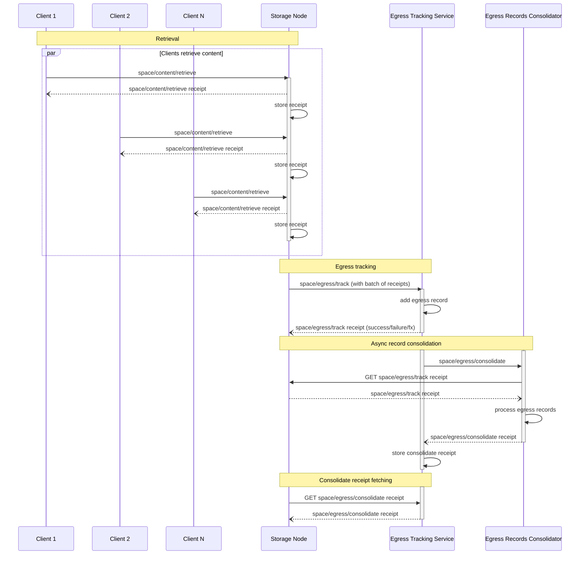

# Egress Tracking Protocol


## Authors

- [Vicente Olmedo](https://github.com/volmedo), [Storacha Network](https://storacha.network/)

## Language

The key words "MUST", "MUST NOT", "REQUIRED", "SHALL", "SHALL NOT", "SHOULD", "SHOULD NOT", "RECOMMENDED", "MAY", and "OPTIONAL" in this document are to be interpreted as described in [RFC2119](https://datatracker.ietf.org/doc/html/rfc2119).

## Abstract

The Egress Tracking Protocol allows node providers to add egress tracking records that will be used to account for the amount of data they serve. These records will then be used to calculate egress fees for the node.

The Egress Tracking Protocol takes place as a result of the [retrieval](./w3-retrieval.md) of blobs from Storage Nodes. Every time a Client retrieves a blob from a Storage Node, the Storage Node will issue a receipt for the retrieval. These receipts will be collected by the Storage Node and used as proofs of retrievals to calculate egress fees.

## Specification

### Protocol Flow

The following diagram depicts the interactions between the different actors involved in the Egress Tracking Protocol. Note that some of the interactions belong to the retrieval protocol, but are included to highlight the relationship between retrieval and egress tracking.


> ℹ️ The diagram shows how the Storage Node batches several receipts into a single `space/egress/track` invocation. This is just a possible implementation and not a requirement of the protocol.

Egress Tracking enables authorized Storage Nodes to be paid egress fees for the content they serve. To do so, they MAY issue `space/egress/track` invocations to an Egress Tracking Service. These invocations contain `space/content/retrieve` receipts as proof that content was served.

Storage Nodes MAY invoke `space/egress/track` on the Egress Tracking Service right after they serve the content for a simpler implementation. However, batching several receipts into a single `space/egress/track` invocation is RECOMMENDED to enable a more efficient communication with the Egress Tracking Service.

Periodically, the Egress Tracking Service will invoke `space/egress/consolidate` on the Egress Records Consolidator (which is a logical entity that can be implemented by the Egress Tracking Service itself). The result of this operation will be stored in the corresponding receipts to keep a paper trail of the process. Storage Nodes MAY fetch these receipts to confirm they match their own records.

### `space/egress/track` invocation example

The following example shows a `space/egress/track` invocation sent by a Storage Node (identified by the [DID] `did:key:zStorageNode`) to an Egress Tracking Service (identified by the [DID] `did:web:ETrackerService`).

```json
{  // "/": "bafy..track"
  "v": "0.9.1",
  "iss": "did:key:zStorageNode",
  "aud": "did:web:ETrackerService",
  "att": [
    {
      "can": "space/egress/track",
      "with": "did:web:ETrackerService",
      "nb": {
        "receipts": [
          "bafy...retrieveRcpt1",
          "bafy...retrieveRcpt2",
          ...
          "bafy...retrieveRcptN"
        ],
        "endpoint": "https://storage.node/receipts"
      }
    }
  ]
}
```

The retrieval receipts the Storage Node wants to provide are included in the invocation caveats. Instead of attaching the receipts directly to the invocation, only their CIDs are included, along with a URL to fetch them from. The Egress Tracking Service will calculate egress fees based on these receipts, so it is in the best interest of the Storage Node that these receipts are available at the URL provided. Therefore, it is RECOMMENDED that this special receipts endpoint is managed by the Storage Node itself.

### `space/egress/track` receipt example

After processing the invocation, the Egress Tracking Service returns a receipt.

```json
{
  "ran": "bafy...track",
  "out": {
    "ok": {}
  },
  "fx": {
    "fork": [
      // Egress tracking records will be consolidated at some point in the future
      { "/": "bafy...consolidate" }
    ]
  }
}
```
Periodically, the Egress Tracking Service (or some other service or component, for that matter) will process tracked egress records sand consolidate them into a view that can be used to calculate egress fees. The effects in the receipt contain a link to a `space/egress/consolidate`, which tells the Storage Node that the egress records will be processed asynchronously. Storage Nodes will be able to fetch receipts of the `space/egress/consolidate` async actions to check the result of the consolidation process.

### `space/egress/consolidate` invocation example

The following example shows a `space/egress/consolidate` invocation sent by the Egress Tracking Service to the Egress Record Consolidator.

```json
{  // "/": "bafy..consolidate"
  "iss": "did:key:zETrackerService",
  "aud": "did:web:ConsolidatorService",
  "att": [
    {
      "can": "space/egress/consolidate",
      "with": "did:web:ConsolidatorService",
      "nb": {
        "cause": { "/": "bafy..track" }
      }
    }
  ]
}
```

When receiving a `space/egress/consolidate` invocation, the Egress Record Consolidator will process egress tracking records and produce a receipt. To process egress records, the Egress Record Consolidator will fetch the receipts from the Storage Node using the URL provided in the `space/egress/track` invocation. The data in these receipts, along with the original invocation, will be used to create a view that can be used to calculate egress fees for the Storage Node.

### `space/egress/consolidate` receipt example

This is an example of the receipt returned by the Egress Record Consolidator.

```json
{
  "ran": "bafy...consolidate",
  "out": {
    "ok": {}
  }
}
```

### Schemas

#### `space/egress/track` capability

```ts
type EgressTrack = {
  can: "space/egress/track"
  with: ETrackerServiceDID
  nb: {
    receipts: [CID]
    endpoint: URL
  }
}

type ETrackerServiceDID = string
type CID = string
type URL = string
```

##### Retrieval receipts
The `nb.receipts` field MUST be an array of CIDs of retrieval receipts. Implementations are not required to batch receipts into a single invocation, but it is RECOMMENDED to do so to reduce the number of invocations.

##### Receipt endpoint
The `nb.endpoint` field MUST be a URL to a special endpoint in the Storage Node that can be used to fetch the receipts from. This special endpoint MUST support HTTP GET requests to `<endpoint>/{cid}`.

For example, given the following caveats:
```json
"nb": {
  "receipts": ["bafy...retrieveRcpt"],
  "endpoint": "https://storage.node/receipts"
}
```
then the receipt can be fetched by sending a HTTP GET request to `https://storage.node/receipts/bafy...retrieveRcpt`.

#### `space/egress/track` receipt

```ts
// Only operation specific fields are covered the rest are implied
type EgressTrackReceipt = {
  ran: Link<EgressTrack>
  out: Result<EgressTrackOk, EgressTrackError>
  fx: {
    fork: [
      Link<EgressConslidate>
    ]
  }
}

type Result<Ok, Err> = { ok: Ok } | { error: Err }

type EgressTracktOk = {}

type EgressTrackError = {
  name: string
  message: string
}
```

#### `space/egress/consolidate` capability

```ts
type EgressConsolidate = {
  can: "space/egress/consolidate"
  with: ConsolidatorServiceDID
  nb: {
    cause: Link<EgressTrack>
  }
}

type ConsolidatorServiceDID = string
```
`nb.cause` is a link to the `space/egress/track` invocation that originated this consolidate task.

#### `space/egress/consolidate` receipt

```ts
type EgressConsolidateReceipt = {
  ran: Link<EgressConsolidate>
  out: Result<EgressConsolidateOk, EgressConsolidateError>
}

type Result<Ok, Err> = { ok: Ok } | { error: Err }

type EgressConsolidateOk = {}

type EgressConsolidateError = {
  name: string
  message: string
}
```

[DID]:https://www.w3.org/TR/did-core/
