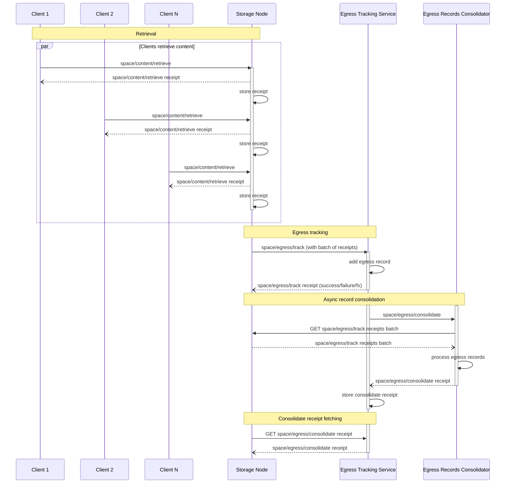

# Egress Tracking Protocol


## Authors

- [Vicente Olmedo](https://github.com/volmedo), [Storacha Network](https://storacha.network/)

## Language

The key words "MUST", "MUST NOT", "REQUIRED", "SHALL", "SHALL NOT", "SHOULD", "SHOULD NOT", "RECOMMENDED", "MAY", and "OPTIONAL" in this document are to be interpreted as described in [RFC2119](https://datatracker.ietf.org/doc/html/rfc2119).

## Abstract

The Egress Tracking Protocol allows node providers to add egress tracking records that will be used to account for the amount of data they serve. These records will then be used to calculate egress fees for the node.

The Egress Tracking Protocol takes place as a result of the [retrieval](./w3-retrieval.md) of blobs from Storage Nodes. Every time a Client retrieves a blob from a Storage Node, the Storage Node will issue a receipt for the retrieval. These receipts will be collected by the Storage Node and used as proofs of retrievals to calculate egress fees.

## Specification

### Protocol Flow

The following diagram depicts the interactions between the different actors involved in the Egress Tracking Protocol. Note that some of the interactions belong to the retrieval protocol, but are included to highlight the relationship between retrieval and egress tracking.



Egress Tracking enables authorized Storage Nodes to be paid egress fees for the content they serve. To do so, they MAY issue `space/egress/track` invocations to an Egress Tracking Service. These invocations contain `space/content/retrieve` receipts as proof that content was served.

In order to make the most efficient use of resources and reduce overhead, Storage Nodes MUST batch receipts into a single `space/egress/track` invocation. As they serve content, Storage Nodes will store `space/content/retrieve` receipts. Once they have collected a batch of them, they will issue a `space/egress/track` invocation to the Egress Tracking Service. Receipt batches MUST have a minimum size of at least 10 MiB and a maximum size of 1 GiB. These limits ensure that egress can be recorded and processed efficiently and that the Storage Node can issue invocations at a reasonable rate.

Periodically, the Egress Tracking Service will invoke `space/egress/consolidate` on the Egress Records Consolidator (which is a logical entity that can be implemented by the Egress Tracking Service itself). The result of this operation will be stored in the corresponding receipts to keep a paper trail of the process. Storage Nodes MAY fetch these receipts to confirm they match their own records.

### `space/egress/track` invocation example

The following example shows a `space/egress/track` invocation sent by a Storage Node (identified by the [DID] `did:key:zStorageNode`) to an Egress Tracking Service (identified by the [DID] `did:web:ETrackerService`).

```json
{  // "/": "bafy..track"
  "v": "0.9.1",
  "iss": "did:key:zStorageNode",
  "aud": "did:web:ETrackerService",
  "att": [
    {
      "can": "space/egress/track",
      "with": "did:web:ETrackerService",
      "nb": {
        "receipts": { "/": "bafy...receiptBatchCAR" },
        "endpoint": "https://storage.node/receipts/{cid}"
      }
    }
  ]
}
```

The retrieval receipts the Storage Node wants to provide are included in the invocation caveats. To ensure an efficient communication, the receipts are not attached directly to the invocation. Instead, they will be batched into a single invocation. The CID referenced in the caveats is that of a CAR file containing the receipts. The caveats also include a URL where receipt batches can be fetched from.

### `space/egress/track` receipt example

After processing the invocation, the Egress Tracking Service returns a receipt.

```json
{
  "ran": "bafy...track",
  "out": {
    "ok": {}
  },
  "fx": {
    "fork": [
      // Egress tracking records will be consolidated at some point in the future
      { "/": "bafy...consolidate" }
    ]
  }
}
```

Periodically, the Egress Tracking Service (or some other service or component, for that matter) will process tracked egress records and consolidate them into a view that can be used to calculate egress fees. The effects in the receipt contain a link to a `space/egress/consolidate`, which tells the Storage Node that the egress records will be processed asynchronously. Storage Nodes will be able to fetch receipts of the `space/egress/consolidate` async actions to check the result of the consolidation process.

### `space/egress/consolidate` invocation example

The following example shows a `space/egress/consolidate` invocation sent by the Egress Tracking Service to the Egress Record Consolidator.

```json
{  // "/": "bafy..consolidate"
  "iss": "did:key:zETrackerService",
  "aud": "did:web:ConsolidatorService",
  "att": [
    {
      "can": "space/egress/consolidate",
      "with": "did:web:ConsolidatorService",
      "nb": {
        "cause": { "/": "bafy..track" }
      }
    }
  ]
}
```

When receiving a `space/egress/consolidate` invocation, the Egress Record Consolidator will process egress tracking records and produce a receipt. To process egress records, the Egress Record Consolidator will fetch the receipts from the Storage Node using the URL provided in the `space/egress/track` invocation. The data in these receipts, along with the original invocation, will be used to create a view that can be used to calculate egress fees for the Storage Node.

### `space/egress/consolidate` receipt example

This is an example of the receipt returned by the Egress Record Consolidator.

```json
{
  "ran": "bafy...consolidate",
  "out": {
    "ok": {
      "errors": [
        {
          "name": "SomeError",
          "message": "something bad happened!",
          "receipt": { "/": "bafy...receipt" }
        }
      ]
    }
  }
}
```

The example shows that the consolidation process was successful, but a receipt failed to be processed. The `errors` array contains a list of errors that occurred during the processing of the receipts. If all receipts were processed successfully, the `errors` list will be empty.

### Schema

#### `space/egress/track` capability

```ts
type EgressTrack = {
  can: "space/egress/track"
  with: ETrackerServiceDID
  nb: {
    receipts: Link
    endpoint: String
  }
}

type ETrackerServiceDID = String
```

##### Retrieval receipts

The `nb.receipts` field MUST be the CID of a CAR file. This CAR file contains a batch of receipts for `space/content/retrieve`, whose audience MUST be the issuer of the `space/egress/track` invocation (i.e. a Storage Node MUST only request tracking of retrievals it fulfilled).

##### Receipts endpoint

The `nb.endpoint` field MUST be a URL to a special endpoint in the Storage Node that can be used to fetch the receipt batches from. This special endpoint MUST support HTTP GET requests and MUST contain a `{cid}` placeholder in the URL. During consolidation, the Egress Record Consolidator will fetch the receipts from the Storage Node using the URL provided, replacing the `{cid}` placeholder with the CID of the receipt batch.

For example, given the following caveats:

```json
"nb": {
  "receipts": "bafy...rcptBatch",
  "endpoint": "https://storage.node/receipts/{cid}"
}
```

then the receipt batch will be fetched by sending a HTTP GET request to `https://storage.node/receipts/bafy...rcptBatch`.

The receipts endpoint MAY support compression via HTTP `Accept-Encoding` header to reduce the amount of data transferred and minimize egress.

#### `space/egress/track` receipt

```ts
// Only operation specific fields are covered the rest are implied
type EgressTrackReceipt = {
  ran: Link<EgressTrack>
  out: Result<EgressTrackOk, EgressTrackError>
  fx: {
    fork: [
      Link<EgressConsolidate>
    ]
  }
}

type Result<Ok, Err> = { ok: Ok } | { error: Err }

type EgressTrackOk = {}

type EgressTrackError = {
  name: string
  message: string
}
```

#### `space/egress/consolidate` capability

```ts
type EgressConsolidate = {
  can: "space/egress/consolidate"
  with: ConsolidatorServiceDID
  nb: {
    cause: Link<EgressTrack>
  }
}

type ConsolidatorServiceDID = string
```

`nb.cause` is a link to the `space/egress/track` invocation that originated this consolidation task.

#### `space/egress/consolidate` receipt

```ts
type EgressConsolidateReceipt = {
  ran: Link<EgressConsolidate>
  out: Result<EgressConsolidateOk, EgressConsolidateError>
}

type Result<Ok, Err> = { ok: Ok } | { error: Err }

type EgressConsolidateOk = {
  errors: ReceiptError[]
}

type ReceiptError = {
  name: string
  message: string
  receipt: Link<Receipt>
}

type EgressConsolidateError = {
  name: string
  message: string
}
```

Note that the consolidation task processes a batch of receipts. It is possible that some receipts, but not all, fail to be processed. In this case, the task will return an `EgressConsolidateOk` result, but it will contain a list of errors that occurred during the processing of the receipts. If all receipts were processed successfully, the `errors` list will be empty.

This is different from an `EgressConsolidateError`, which signals an issue that prevents the batch from being processed at all.

Storage Nodes MUST produce receipt batches that are between 10 MiB and 1 GiB in size. Batches that are too small or too large will be rejected at consolidation time with an `EgressConsolidateError` receipt. If that's the case, the Storage Node will need to issue a new `space/egress/track` invocation with a new, valid batch of receipts.

[DID]:https://www.w3.org/TR/did-core/
