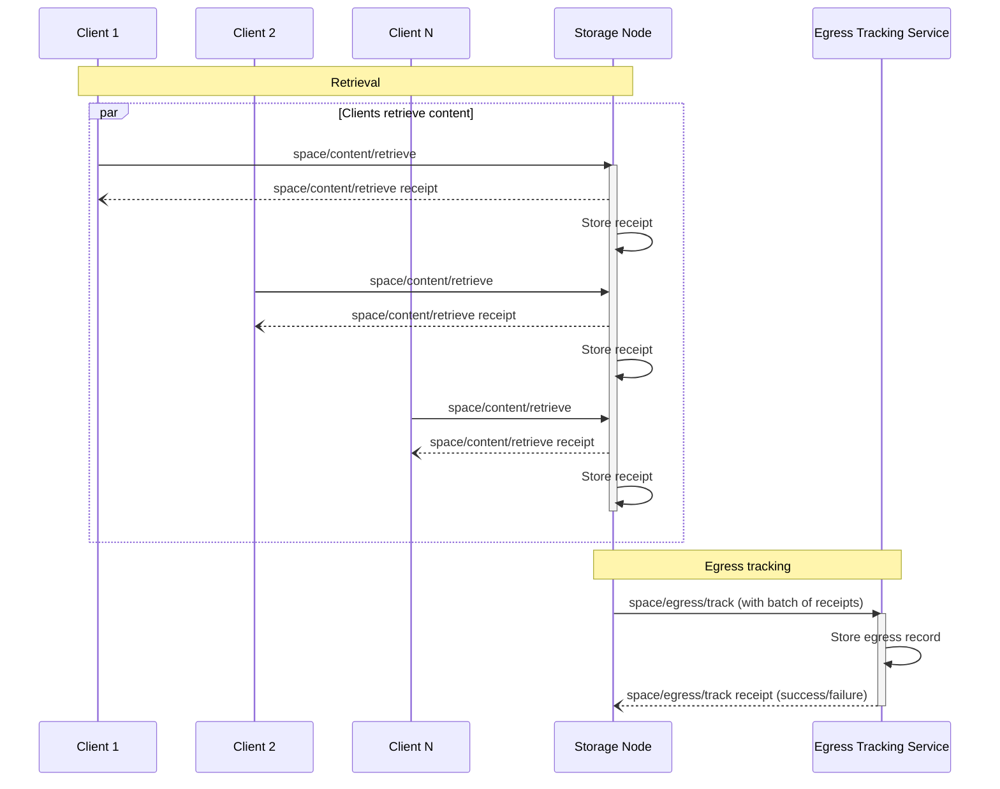

# Egress Tracking Protocol


## Authors

- [Vicente Olmedo](https://github.com/volmedo), [Storacha Network](https://storacha.network/)

## Language

The key words "MUST", "MUST NOT", "REQUIRED", "SHALL", "SHALL NOT", "SHOULD", "SHOULD NOT", "RECOMMENDED", "MAY", and "OPTIONAL" in this document are to be interpreted as described in [RFC2119](https://datatracker.ietf.org/doc/html/rfc2119).

## Abstract

The Egress Tracking Protocol allows node providers to add egress tracking records that will be used to account for the amount of data they serve. These records will then be used to calculate egress fees for the node.

The Egress Tracking Protocol takes place as a result of the [retrieval](./w3-retrieval.md) of blobs from Storage Nodes. Every time a Client retrieves a blob from a Storage Node, the Storage Node will issue a receipt for the retrieval. These receipts will be collected by the Storage Node and used as proofs of retrievals to calculate egress fees.

## Specification

### Protocol Flow

The following diagram depicts the interactions between the different actors involved in the Egress Tracking Protocol. Note that some of the interactions belong to the retrieval protocol, but are included to highlight the relationship between retrieval and egress tracking.


> ℹ️ The diagram shows how the Storage Node batches several receipts into a single `space/egress/track` invocation. This is just a possible implementation and not a requirement of the protocol.


### `space/egress/track` invocation example

Egress Tracking enables authorized Storage Nodes to be paid egress fees for the content they serve. To do so, they MAY issue `space/egress/track` invocations to an Egress Tracking Service. These invocations contain `space/content/retrieve` receipts as proof that content was served.

The following example shows a `space/egress/track` invocation sent by a Storage Node (identified by the [DID] `did:key:zStorageNode`) to an Egress Tracking Service (identified by the [DID] `did:web:ETrackerService`).

```json
{
  "v": "0.9.1",
  "iss": "did:key:zStorageNode",
  "aud": "did:web:ETrackerService",
  "att": [
    {
      "can": "space/egress/track",
      "with": "did:web:ETrackerService",
      "nb": {
        "receipts": [
          "bafy...retrieveRcpt1",
          "bafy...retrieveRcpt2",
          ...
          "bafy...retrieveRcptN"
        ],
        "endpoint": "https://storage.node/receipts"
      }
    }
  ]
}
```

The retrieval receipts the Storage Node wants to provide are included in the invocation caveats. Instead of attaching the receipts directly to the invocation, only their CIDs are included, along with a URL to fetch them from. The Egress Tracking Service will calculate egress fees based on these receipts, so it is in the best interest of the Storage Node that these receipts are available at the URL provided. Therefore, it is RECOMMENDED that this special receipts endpoint is managed by the Storage Node itself.


### Capability schema

```ts
type EgressTrack = {
  can: "space/egress/track"
  with: ETrackerServiceDID
  nb: {
    receipts: [CID]
    endpoint: URL
  }
}

type ETrackerServiceDID = string
type CID = string
type URL = string
```

#### Retrieval receipts
The `nb.receipts` field MUST be an array of CIDs of retrieval receipts. Implementations are not required to batch receipts into a single invocation, but it is RECOMMENDED to do so to reduce the number of invocations.

#### Receipts endpoint
The `nb.endpoint` field MUST be a URL to a special endpoint in the Storage Node that can be used to fetch the receipts from. This special endpoint MUST support HTTP GET requests to `<endpoint>/{cid}`.

For example, given the following caveats:
```json
"nb": {
  "receipts": ["bafy...retrieveRcpt"],
  "endpoint": "https://storage.node/receipts"
}
```
then the receipt can be fetched by sending a HTTP GET request to `https://storage.node/receipts/bafy...retrieveRcpt`.


#### Receipt Schema

```ts
// Only operation specific fields are covered the rest are implied
type EgressTrackReceipt = {
  out: Result<EgressTrackReceiptOk, EgressTrackReceiptError>
}

type Result<Ok, Err> = { ok: Ok } | { error: Err }

type EgressTrackReceiptOk = {}

type EgressTrackReceiptError = {
  name: string
  message: string
}
```

[DID]:https://www.w3.org/TR/did-core/
