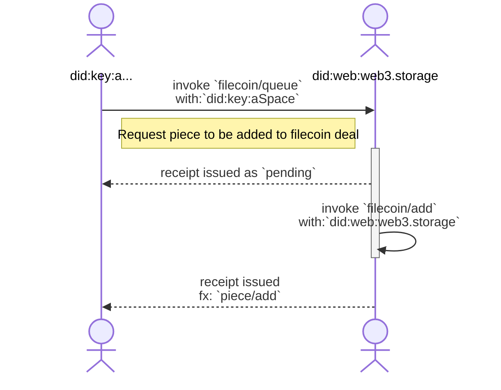
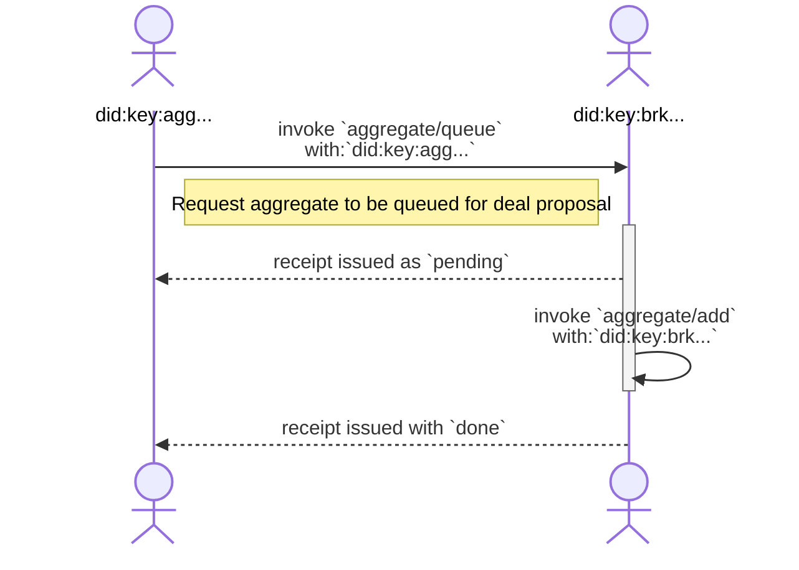
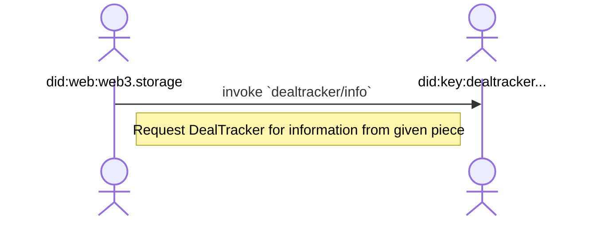

# W3 Filecoin Protocol


## Editors

- [Vasco Santos], [Protocol Labs]
- [Irakli Gozalishvili], [Protocol Labs]
- [Alan Shaw], [Protocol Labs]

## Authors

- [Vasco Santos], [Protocol Labs]

# Abstract

This spec describes a [UCAN] protocol allowing an implementer to receive an aggregate of CAR files for inclusion in a Filecoin deal.

## Language

The key words "MUST", "MUST NOT", "REQUIRED", "SHALL", "SHALL NOT", "SHOULD", "SHOULD NOT", "RECOMMENDED", "MAY", and "OPTIONAL" in this document are to be interpreted as described in [RFC2119](https://datatracker.ietf.org/doc/html/rfc2119).

# Table of Contents

* [Terminology](#terminology)
    * [Roles](#roles)
        * [Storefront](#storefront)
        * [Aggregator](#aggregator)
        * [Dealer](#dealer)
        * [Deal Tracker](#deal-tracker)
* [Protocol](#protocol)
    * [Overview](#overview)
    * [Authorization](#authorization)
    * [Capabilities](#capabilities)
        * [Storefront Capabilities](#storefront-capabilities)
            * [`filecoin/queue`](#filecoinqueue)
            * [`filecoin/add`](#filecoinadd)
        * [Aggregator Capabilities](#aggregator-capabilities)
            * [`aggregate/queue`](#aggregatequeue)
            * [`aggregate/add`](#aggregateadd)
        * [Dealer Capabilities](#storefront-capabilities)
            * [`deal/queue`](#dealqueue)
            * [`deal/add`](#dealadd)
        * [Deal Tracker Capabilities](#deal-tracker-capabilities)
            * [`dealtracker/info`](#dealtrackerinfo)
    * [Schema](#schema)
        * [Base types](#base-types)
        * [`filecoin/queue` schema](#filecoinqueue-schema)
        * [`filecoin/add` schema](#filecoinadd-schema)
        * [`aggregate/queue` schema](#aggregatequeue-schema)
        * [`aggregate/add` schema](#aggregateadd-schema)
        * [`deal/queue` schema](#dealqueue-schema)
        * [`deal/add` schema](#dealadd-schema)
        * [`dealtracker/info` schema](#dealtrackerinfo-schema)

# Terminology

## Roles

There are several roles in the authorization flow:

| Name          | Description |
| ------------- | ----------- |
| Storefront    | [Principal] identified by a DID, representing a storage API like web3.storage. |
| Aggregator    | [Principal] identified by a DID, representing a storage aggregator like w3filecoin. |
| Dealer        | [Principal] identified by a DID, that arranges filecoin deals with storage providers. e.g. Spade. |
| Deal Tracker  | [Principal] identified by a DID, that tracks deals made by the Dealer. |

### Storefront

A _Storefront_ is a type of [principal] identified by a DID (typically a [`did:web`] identifier).

A Storefront facilitates data storage services to applications and users, getting the requested data stored into Filecoin deals asynchronously.

### Aggregator

An _Aggregator_ is a type of [principal] identified by a DID. It is RECOMMENDED to use use [`did:key`] identifier due to their stateless nature.

An Aggregator facilitates data storage into Filecoin deals by aggregating smaller data (Filecoin Pieces) into a larger piece that can effectively be stored with a Filecoin Storage Provider using [Verifiable Data Aggregation
](https://github.com/filecoin-project/FIPs/blob/master/FRCs/frc-0058.md).

### Dealer

A _Dealer_ is a type of [principal] identified by a DID (typically a `did:key` identifier) that arranges deals for the aggregates submitted by _Storefront_.

### Deal Tracker

A _Deal Tracker_ is a type of [principal] identified by a DID (typically a `did:key` identifier) that follows the filecoin chain to keep track of successful deals.

# Protocol

## Overview

A Storefront is a service that ensures content addressed user/application data is stored perpetually on the decentralized web. A Storefront ingests user/application data and replicates it across various storage systems, including Filecoin Storage Providers. Content supplied to a Storefront can be of arbitrary size, while (Filecoin) Storage Providers demand large (>= 16GiB) content pieces.  To align supply and demand requirements, the Aggregator accumulates supplied content pieces into a larger verifiable aggregate pieces per [FRC-0058](https://github.com/filecoin-project/FIPs/blob/master/FRCs/frc-0058.md) that can be stored by Storage Providers.

### Authorization

Storefronts MUST use UCAN based authorization mechanisms to interact with Aggregators, Dealers and Deal Trackers. The way in which Storefronts are registered to use Aggregators, Dealers and Deal Trackers is out of scope of this specification.

For example, an Aggregator can authorize invocations from `did:web:web3.storage` by validating the signature is from the DID. This way, it allows web3.storage to rotate keys and/or re-delegate access without having to coordinate with the Aggregator.

### Storefront receives a Filecoin piece

A Storefront MUST submit content for aggregation by it's piece CID. It MAY be computed from content by a trusted actor or it MAY be computed by the Storefront itself. A Storefront MUST provide a capability that can be used to submit a piece to be replicated by (Filecoin) Storage Providers. It may be invoked by a Storefront client or delegated to a hired third party, ether way a Storefront MUST acknowledge request by issuing a signed receipt. A Storefront MAY decide to verify submitted piece prior to aggregation. A Storefront MAY also operate trusted actor that computes and submits pieces on content upload.

Once a Storefront receives the offer for a piece, it is pending for verification. A receipt is issued to proof the transition of the added piece state from `uninitialized` into `pending` for verification.

This receipt MUST have a link to a followup task (using `.fx.join` field) that either succeeds (if the piece was handled) or fails, so that its receipt MAY be looked up using it. If offered piece is already `pending` or `done` state does not change and receipt capturing current state is issued instead.

After a storefront dequeues the piece and verifies it, a receipt is created to proof the transition of the aggregate state from `pending` into `done`. This receipt MUST have link to a followup task (using `.fx.join` field) with `piece/add`.



### Storefront offers a piece to aggregate

Storefront SHOULD propagate submitted pieces into Filecoin Storage Providers by forwarding them to an Aggregator.

The Aggregator MUST queue offered pieces for an aggregation and issue a signed receipt proving that submitted piece is `pending` to be added. Issued receipt MUST link to a followup task (using `.fx.join` field) that either succeeds with inclusion proof (if the piece was included into an aggregate) or fail, in order to allow state lookup by its receipt.

If piece submitted by Storefront has already been queued, receipt with the same result and effect MUST be issued.

The same Piece submitted by different Storefronts SHOULD NOT be considered a duplicate.

After an Aggregator dequeues the piece and includes it into an aggregate, it MUST issue a receipt with a piece inclusion proof, transition state of the submitted piece from `pending` into `done`.


### Aggregator offers dealer an aggregate

When the Aggregator has enough content pieces to build a qualified aggregate (dealers MAY impose different requirements), it MUST submit a Filecoin deal for the aggregate to a Dealer. Dealer MUST issue signed receipt acknowledging submission, actual deal negotiation with Filecoin Storage Providers MAY carry out of band.

Once a Dealer receives an aggregate offer it is queued for negotiations with Storage Providers. Issued receipt is a proofs transition of the (offered aggregate) state from `uninitialized` into `pending`. If Dealer receives request with an aggregate already in pipeline it MUST simply reissue receipt with a same result and effects as the original request.

Issued receipt MUST link to a followup task (using `.fx.join` field) that either succeeds (if the aggregate deal made it into Filecoin chain) or fails (e.g. if Storage Provider failed to replicate and reported an error) so that its receipt COULD be looked up by it.

After a Dealer dequeues the aggregate, it will interact with available Filecoin Storage Providers, in order to establish a previously determined (out of band) number of deals. Depending on storage providers availability, as well as the content present in the offer, the aggregate MAY be handled or not. A receipt is created to proof the transition of the aggregate state from `pending` into `done`.

> Note: Dealer MAY have several intermediate steps and states it transitions through, however those intentionally are not captured by this protocol, because storefront will take no action until success / failure condition is met.



The Dealer MAY request an out of bound signature from the Storefront to validate the terms of a deal.

### Storefront can query state of the aggregate deals

Storefront users MAY want to check details about deals from the content they previously stored. These deals will change over time as they get renewed. Therefore, Storefront should invoke `dealtracker/info` capability to gather information about given aggregate identifier. Storefront should be able to look into previously received inclusion proofs to get the aggregate to look at based on the requested piece.



## Capabilities

This section describes the capabilities that form the w3 aggregation protocol, along with the details relevant for invoking capabilities with a service provider.

In this document, we will be exposing capabilities implemented by Storefront `web3.storage`, Aggregator `aggregator.web3.storage`, Dealer `dealer.web3.storage` and Deal Tracker `dealtracker.web3.storage`.

### Storefront Capabilities

#### `filecoin/queue`

An agent can invoke a capability to queue a piece to be included in a Filecoin deal(s) with a Storage providers. See [schema](#filecoinqueue-schema).

> `did:key:zAlice` invokes capability from `did:web:web3.storage`

```json
{
  "iss": "did:key:zAlice",
  "aud": "did:web:web3.storage",
  "att": [{
    "with": "did:key:zAlice",
    "can": "filecoin/queue",
    "nb": {
      "content": { "/": "bag...car" }, /* CID of file previously added to resource space */
      "piece": { "/": "bafk...commp" } /* commitment proof for piece */
    }
  }],
  "prf": [],
  "sig": "..."
}
```

A Storefront MUST issue a signed receipt to acknowledge the received request. The issued receipt MUST contain an [effect](https://github.com/ucan-wg/invocation/#7-effect) with a subsequent task (`.fx.join` field) that is run when submitted piece is verified and either succeeds (implying that piece was valid) or fails (with an `error` describing a problem with the piece).

```json
{
  "ran": "bafy...invocation",
  "out": {
    "ok": {
      "piece": { "/": "bafk...commp" } /* commitment proof for piece */
    }
  },
  "fx": {
    "join": { "/": "bafy...dequeue" }
  },
  "meta": {},
  "iss": "did:web:web3.storage",
  "prf": []
}
```

See [`filecoin/add`](#filecoinadd) section to see the subsequent task.

#### `filecoin/add`

When a piece request to be added is dequeued & verified, a Storefront MUST invoke `filecoin/add` with own DID propagating piece through the pipeline and signaling that submitted piece was handled. See [schema](#filecoinadd-schema).

> `did:web:web3.storage` invokes capability from `did:web:web3.storage`

```json
{
  "iss": "did:web:web3.storage",
  "aud": "did:web:web3.storage",
  "att": [{
    "with": "did:web:web3.storage",
    "can": "filecoin/add",
    "nb": {
      "content": { "/": "bag...car" }, /* CID of file previously added to resource space */
      "piece": { "/": "bafk...commp" } /* commitment proof for piece */
    }
  }],
  "prf": [],
  "sig": "..."
}
```

A Storefront MUST issue a signed receipt to communicate the response for the request. The issued receipt MUST contain an [effect](https://github.com/ucan-wg/invocation/#7-effect) with a subsequent task (`.fx.join` field) that submits the piece for aggregation.

```json
{
  "ran": "bafy...invocation",
  "out": {
    "ok": {
      "piece": { "/": "bafk...commp" } /* commitment proof for piece */
    }
  },
  "fx": {
    "join": { "/": "bafy...aggregate...add" }
  },
  "meta": {},
  "iss": "did:web:web3.storage",
  "prf": []
}
```

See [`aggregate/add`](#aggregateadd) section to see the subsequent task.
If the added piece is invalid, details on failing reason is also reported:

```json
{
  "ran": "bafy...invocation",
  "out": {
    "error": {
      "name": "InvalidPieceCID",
      "message": "...."
    },
  },
  "fx": {
    "fork": []
  },
  "meta": {},
  "iss": "did:web:web3.storage",
  "prf": []
}
```

### Aggregator Capabilities

#### `aggregate/queue`

A Storefront can invoke a capability to offer a piece to be aggregated for upcoming Filecoin deal(s). See [schema](#aggregateadd-schema).

> `did:web:web3.storage` invokes capability from `did:key:agg...`

```json
{
  "iss": "did:web:web3.storage",
  "aud": "did:key:agg...",
  "att": [{
    "with": "did:web:web3.storage",
    "can": "aggregate/queue",
    "nb": {
      "piece": { "/": "bafk...commp" }, /* commitment proof for piece */
      "group": "did:web:free.web3.storage", /* grouping of joining segments into an aggregate */
    }
  }],
  "prf": [],
  "sig": "..."
}
```

An Aggregator MUST issue a signed receipt to acknowledge the received request. The issued receipt MUST contain an [effect](https://github.com/ucan-wg/invocation/#7-effect) with a subsequent task (`.fx.join` field) that is run when piece is added to an aggregate and either succeeds (implying that aggregate was queued for being offered) or fails (with an `error` describing the problem).

```json
{
  "ran": "bafy...invocation",
  "out": {
    "ok": {}
  },
  "fx": {
    "join": { "/": "bafy...dequeue" }
  },
  "meta": {},
  "iss": "did:key:agg...",
  "prf": []
}
```

See [`aggregate/add`](#aggregateadd) section to see the subsequent task.

#### `aggregate/add`

When a piece request to be added is dequeued, an Aggregator MUST invoke `aggregate/add` to include it in an aggregate. The `storefront` requester identifier should be included in the invocation. See [schema](#aggregateadd-schema).

> `did:key:agg...` invokes capability from `did:key:agg...`

```json
{
  "iss": "did:key:agg...",
  "aud": "did:key:agg...",
  "att": [{
    "with": "did:key:agg...",
    "can": "aggregate/add",
    "nb": {
      "piece": { "/": "commitment...car" }, /* commitment proof for piece */
      "storefront": "did:web:web3.storage", /* storefront responsible for invocation (with of aggregate/queue) */
      "group": "did:web:free.web3.storage", /* grouping of joining segments into an aggregate */
    }
  }],
  "prf": [],
  "sig": "..."
}
```

An Aggregator MUST issue a signed receipt with the result of the task. An arranged aggregate for piece receipt looks like:

```json
{
  "ran": "bafy...arrange",
  "out": {
    "ok": {
        "piece": { "/": "commitment...car" }, /* commitment proof for piece */
        "aggregate": { "/": "commitment...aggregate-proof" }, /* commitment proof */
        "path": "path-between-root-aggregate-and-piece"
    }
  },
  "meta": {},
  "iss": "did:key:agg...",
  "prf": []
}
```

If the offered piece is invalid, the reason is also reported:

```json
{
  "ran": "bafy...invocation",
  "out": {
    "error": {
      "name": "InvaildPieceCID",
      "message": "..."
    },
  },
  "meta": {},
  "iss": "did:key:agg...",
  "prf": []
}
```

### Dealer Capabilities

#### `deal/queue`

An Aggregator can invoke a capabilty to queue an aggregate that is ready to be included in Filecoin deal(s). See [schema](#dealadd-schema).

> `did:web:filecoin.web3.storage` invokes capability from `did:web:spade.storage`

```json
{
  "iss": "did:web:filecoin.web3.storage",
  "aud": "did:web:spade.storage",
  "att": [{
    "with": "did:web:filecoin.web3.storage",
    "can": "deal/queue",
    "nb": {
      "pieces": { "/": "bafy...many-cars" }, /* dag-cbor CID with content pieces */
      "aggregate": { "/": "bafk...aggregate-proof" }, /* commitment proof for aggregate */
      "storefront": "did:web:web3.storage", /* storefront responsible for invocation */
      "label": "deal-label"
    }
  }],
  "prf": [],
  "sig": "..."
}
```

Invoking the `deal/queue` capability submits an aggregate to a dealer service for inclusion in one or more Filecoin deals.

The `nb.piece` field represents the proof of the `piece` to be offered for the deal. It is a CID with its piece size encoded. In addition, a Filecoin `nb.deal` contains the necessary fields for a Filecoin Deal proposal. More specifically, it MUST include `nb.deal.tenantId` that will allow dealer to select from multiple wallets associated with the tenant and MAY include an arbitrary `nb.deal.label` chosen by the client.

Finally, the `nb.offer` field represents a "Ferry" aggregate offer that is ready for a Filecoin deal. Its value is the DAG-CBOR CID that refers to a "Ferry" offer. It encodes a dag-cbor block with an array of entries representing all the pieces to include in the aggregated deal. This array MUST be sorted in the exact same order as they were used to compute the aggregate piece CID. This block MUST be included in the CAR file that transports the invocation. Its format is:

```json
/* offers block as an array of piece CIDs, encoded as DAG-JSON (for readability) */
[
  { "/": "commitment...car0" }, /* COMMP CID */
  { "/": "commitment...car1" }, /* COMMP CID */
  /* ... */
]
```

Each entry of the decoded offers block has all the necessary information for a Storage Provider to fetch and store a CAR file. It includes an array of Filecoin `piece` info required by Storage Providers.

A Dealer MUST issue a signed receipt to acknowledge the received request. Issued receipt MUST contain an [effect](https://github.com/ucan-wg/invocation/#7-effect) with a subsequent task (`.fx.join` field) that is run when submitted aggregate is processed and either succeeds (implying that aggregate was handled and deals will be arranged) or fail (with `error` describing a problem with the aggregate).

```json
{
  "ran": "bafy...invocation",
  "out": {
    "ok": {}
  },
  "fx": {
    "join": { "/": "bafy...dequeue" }
  },
  "meta": {},
  "iss": "did:web:spade.storage",
  "prf": []
}
```

See [`deal/add`](#dealadd) section to see the subsequent task.

### `deal/add`

When an aggregate request to be added is dequeued, a dealer MUST invoke `deal/add` to store it.

> `did:web:spade.storage` invokes capability from `did:web:spade.storage`

```json
{
  "iss": "did:web:spade.storage",
  "aud": "did:web:spade.storage",
  "att": [{
    "with": "did:web:spade.storage",
    "can": "deal/add",
    "nb": {
      "pieces": { "/": "bafy...many-cars" }, /* dag-cbor CID with content pieces */
      "aggregate": { "/": "bafk...aggregate-proof" }, /* commitment proof for aggregate */
      "storefront": "did:web:web3.storage", /* storefront responsible for invocation */
      "label": "deal-label"
    }
  }],
  "prf": [],
  "sig": "..."
}
```

A Dealer MUST issue a signed receipt with the result of the task. An arranged aggregate receipt looks like:

```json
{
  "ran": "bafy...invocation",
  "out": {
    "ok": {
      "aggregate": { "/": "commitment...aggregate-proof" } /* commitment proof */
    }
  },
  "meta": {},
  "iss": "did:web:spade.storage",
  "prf": []
}
```

If offered aggregate is invalid, details on failing pieces are also reported:

```json
{
  "ran": "bafy...invocation",
  "out": {
    "error": {
       "name": "InvalidPiece",
       "message": "....",
       "aggregate": { "/": "bafk...aggregate-proof" }, /* commitment proof */
       "cause": [{
          "name": "InvalidPieceCID",
          "message": "....",
          "piece": { "/": "bafk...car0" },
       }],
    },
  },
  "meta": {},
  "iss": "did:web:spade.storage",
  "prf": []
}
```

### Deal Tracker Capabilities

#### `dealtracker/info`

A Storefront can query the state of an aggregate by invoking a `dealtracker/info` capability.

> `did:web:web3.storage` invokes capability from `did:key:dealtracker...`

```json
{
  "iss": "did:web:web3.storage",
  "aud": "did:web:dealtracker...",
  "att": [{
    "with": "did:web:web3.storage",
    "can": "dealtracker/info",
    "nb": {
      "piece": { "/": "commitment...aggregate-proof" } /* commitment proof */
    }
  }],
  "prf": [],
  "sig": "..."
}
```

Once this invocation is executed, a receipt is generated with the resulting aggregate information:

```json
{
  "ran": "bafy...get",
  "out": {
    "ok": {
      "deals": {
        "111": {
          "storageProvider": "f07...",
          "status": "Active",
          "pieceCid": "bag...",
          "dataCid": "bafy...",
          "dataModelSelector": "Links/...",
          "activation": "2023-04-13T01:58:00+00:00",
          "expiration": "2024-09-05T01:58:00+00:00",
          "created": "2023-04-11T17:57:30.522198+00:00",
          "updated": "2024-04-12T03:42:26.928993+00:00"
        }
      }
    },
  },
  "fx": {
    "fork": []
  },
  "meta": {},
  "iss": "did:web:spade.storage",
  "prf": []
}
```

## Schema

### Base types

```ipldsch
type FilecoinCapability enum {
  FilecoinQueue "filecoin/queue",
  FilecoinAdd "filecoin/add"
} representation inline {
  discriminantKey "can"
}

type AggregateCapability enum {
  AggregateQueue "aggregate/queue",
  AggregateAdd "aggregate/add"
} representation inline {
  discriminantKey "can"
}

type DealCapability enum {
  DealQueue "deal/queue",
  DealAdd "deal/add"
} representation inline {
  discriminantKey "can"
}

type DealTrackerCapability enum {
  DealTrackerInfo "dealtracker/info"
} representation inline {
  discriminantKey "can"
}

type PieceRef struct {
  piece PieceCid
}

type AgentDID string
type StorefrontDID string
type AggregatorDID string
type DealerDID string
type DealTrackerDID string

# from a fr32-sha2-256-trunc254-padded-binary-tree multihash
type PieceCid Link
type ContentCid Link

type AggregatePieces [PieceCid]
```

### `filecoin/queue` schema

```ipldsch
type FilecoinQueue struct {
  with AgentDID
  nb FilecoinQueueDetail
}

type FilecoinQueueDetail struct {
  # CID of file previously added to resource space
  content ContentCid
  # Piece as Filecoin Piece with padding
  piece PieceCid
}
```

### `filecoin/add` schema

```ipldsch
type FilecoinAdd struct {
  with AgentDID
  nb FilecoinAddDetail
}

type FilecoinAddDetail struct {
  # CID of file previously added to resource space
  content ContentCid
  # Piece as Filecoin Piece with padding
  piece PieceCid
}
```

### `aggregate/queue` schema

```ipldsch
type AggregateQueue struct {
  with AgentDID
  nb AggregateQueueDetail
}

type AggregateQueueDetail struct {
  # Piece as Filecoin Piece with padding
  piece PieceCid
  # grouping for joining segments into an aggregate (subset of space)
  group string
}
```

### `aggregate/add` schema

```ipldsch
type AggregateAdd struct {
  with AgentDID
  nb AggregateAddDetail
}

type AggregateAddDetail struct {
  # Piece as Filecoin Piece with padding
  piece PieceCid
  # storefront responsible for invocation
  storefront string
  # grouping for joining segments into an aggregate (subset of space)
  group string
}
```

### `deal/queue` schema

```ipldsch
type DealQueue struct {
  with StorefrontDID
  nb DealQueueDetail
}

type DealQueueDetail struct {
  # Contains each individual piece within Aggregate piece
  pieces &AggregatePieces
  # Piece as Aggregate of CARs with padding
  aggregate PieceCid
  # Fields to create a contract with a Storage Provider for aggregate
  # storefront responsible for invocation
  storefront string
  # Label is an arbitrary client chosen label to apply to the deal
  # @see https://github.com/filecoin-project/go-state-types/blob/ff2ed169ff566458f2acd8b135d62e8ca27e7d0c/builtin/v9/market/deal.go#L201-L221
  label string
}
```

### `deal/add` schema

```ipldsch
type DealAdd struct {
  with StorefrontDID
  nb DealAddDetail
}

type DealAddDetail struct {
  # Contains each individual piece within Aggregate piece
  pieces &AggregatePieces
  # Piece as Aggregate of CARs with padding
  aggregate PieceCid
  # Fields to create a contract with a Storage Provider for aggregate
  # storefront responsible for invocation
  storefront string
  # Label is an arbitrary client chosen label to apply to the deal
  # @see https://github.com/filecoin-project/go-state-types/blob/ff2ed169ff566458f2acd8b135d62e8ca27e7d0c/builtin/v9/market/deal.go#L201-L221
  label string
}
```

[`did:web`]: https://w3c-ccg.github.io/did-method-web/
[UCAN]: https://github.com/ucan-wg/spec/
[principal]: https://github.com/ucan-wg/spec/#321-principals

[Protocol Labs]:https://protocol.ai/
[Vasco Santos]:https://github.com/vasco-santos
[Irakli Gozalishvili]:https://github.com/Gozala
[Alan Shaw]:https://github.com/alanshaw
