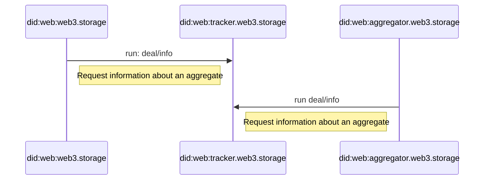

# W3 Filecoin Protocol


## Editors

- [Vasco Santos], [Protocol Labs]
- [Irakli Gozalishvili], [Protocol Labs]
- [Alan Shaw], [Protocol Labs]

## Authors

- [Vasco Santos], [Protocol Labs]

# Abstract

This spec describes a [UCAN] protocol allowing an implementer to receive an aggregate of CAR files for inclusion in a Filecoin deal.

## Language

The key words "MUST", "MUST NOT", "REQUIRED", "SHALL", "SHALL NOT", "SHOULD", "SHOULD NOT", "RECOMMENDED", "MAY", and "OPTIONAL" in this document are to be interpreted as described in [RFC2119](https://datatracker.ietf.org/doc/html/rfc2119).

# Table of Contents

- [Terminology](#terminology)
  - [Roles](#roles)
    - [Storefront](#storefront)
    - [Aggregator](#aggregator)
    - [Dealer](#dealer)
    - [Deal Tracker](#deal-tracker)
- [Protocol](#protocol)
  - [Overview](#overview)
  - [Authorization](#authorization)
  - [Capabilities](#capabilities)
    - [Storefront Capabilities](#storefront-capabilities)
      - [`filecoin/offer`](#filecoinoffer)
      - [`filecoin/submit`](#filecoinsubmit)
      - [`filecoin/accept`](#filecoinaccept)
    - [Aggregator Capabilities](#aggregator-capabilities)
      - [`piece/offer`](#aggregateoffer)
      - [`piece/accept`](#aggregateaccept)
    - [Dealer Capabilities](#storefront-capabilities)
      - [`aggregate/offer`](#aggregateoffer)
      - [`aggregate/accept`](#aggregateaccept)
    - [Deal Tracker Capabilities](#deal-tracker-capabilities)
      - [`deal/info`](#dealinfo)
  - [Schema](#schema)
    - [Base types](#base-types)
    - [`filecoin/offer` schema](#filecoinoffer-schema)
    - [`filecoin/submit` schema](#filecoinsubmit-schema)
    - [`filecoin/accept` schema](#filecoinaccept-schema)
    - [`piece/offer` schema](#pieceoffer-schema)
    - [`piece/accept` schema](#pieceaccept-schema)
    - [`aggregate/offer` schema](#aggregateoffer-schema)
    - [`aggregate/accept` schema](#aggregateaccept-schema)
    - [`deal/info` schema](#dealinfo-schema)

# Terminology

## Roles

There are several roles in the authorization flow:

| Name         | Description                                                                                       |
| ------------ | ------------------------------------------------------------------------------------------------- |
| Storefront   | [Principal] identified by a DID, representing a storage API like web3.storage.                    |
| Aggregator   | [Principal] identified by a DID, representing a storage aggregator like w3filecoin.               |
| Dealer       | [Principal] identified by a DID, that arranges filecoin deals with storage providers. e.g. Spade. |
| Deal Tracker | [Principal] identified by a DID, that tracks deals made by the Dealer.                            |

### Storefront

A _Storefront_ is a type of [principal] identified by a DID (typically a [`did:web`] identifier).

A Storefront facilitates data storage services to applications and users, getting the requested data stored into Filecoin deals asynchronously.

### Aggregator

An _Aggregator_ is a type of [principal] identified by a DID. It is RECOMMENDED to use use [`did:key`] identifier due to their stateless nature.

An Aggregator facilitates data storage into Filecoin deals by aggregating smaller data (Filecoin Pieces) into a larger piece that can effectively be stored with a Filecoin Storage Provider using [Verifiable Data Aggregation
](https://github.com/filecoin-project/FIPs/blob/master/FRCs/frc-0058.md).

### Dealer

A _Dealer_ is a type of [principal] identified by a DID (typically a `did:key` identifier) that arranges deals for the aggregates submitted by _Storefront_.

### Deal Tracker

A _Deal Tracker_ is a type of [principal] identified by a DID (typically a `did:key` identifier) that follows the filecoin chain to keep track of successful deals.

# Protocol

## Overview

A Storefront is a service that ensures content addressed user/application data is stored perpetually on the decentralized web. A Storefront ingests user/application data and replicates it across various storage systems, including Filecoin Storage Providers. Content supplied to a Storefront can be of arbitrary size, while (Filecoin) Storage Providers demand large (>= 16GiB) content pieces. To align supply and demand requirements, the Aggregator accumulates supplied content pieces into a larger verifiable aggregate pieces per [FRC-0058](https://github.com/filecoin-project/FIPs/blob/master/FRCs/frc-0058.md) that can be stored by Storage Providers.

### Authorization

Storefronts MUST use UCAN based authorization mechanisms to interact with Aggregators, Dealers and Deal Trackers. The way in which Storefronts are registered to use Aggregators, Dealers and Deal Trackers is out of scope of this specification.

For example, an Aggregator can authorize invocations from `did:web:web3.storage` by validating the signature is from the DID. This way, it allows web3.storage to rotate keys and/or re-delegate access without having to coordinate with the Aggregator.

### Storefront receives a Filecoin piece

A Storefront MUST submit content for aggregation by it's piece CID. It MAY be computed from content by a trusted actor or it MAY be computed by the Storefront itself. A Storefront MUST provide a capability that can be used to submit a piece to be replicated by (Filecoin) Storage Providers. It may be invoked by a Storefront client or delegated to a hired third party, ether way a Storefront MUST acknowledge request by issuing a signed receipt. A Storefront MAY decide to verify submitted piece prior to aggregation. A Storefront MAY also operate trusted actor that computes and submits pieces on content upload.

Once a Storefront receives the offer for a piece, it is pending for verification. Storefront MUST issue receipt proofing that request state has transition from `uninitialized` to `pending` if result was `ok` or to `failed` if result was `error`. Storefront MAY fail invocation if piece `content` has not been provided.

#### `filecoin/accept` effect

Successful invocation receipt MUST have `fx.join` [effect] that links to the terminating task of the workflow. It allowing observer to lookup whether offered piece has landed on filecoin or failed.

#### `filecoin/submit` effect

Successful invocation receipt MUST have `fx.fork` [effect] that links to the next task of the workflow. It allows observer to follow progress of the execution.

The storefront MUST issue receipt of the linked `filecoin/submit` task after it verifies offered piece queues it for aggregation. This receipt MUST have `fx.join` [effect] that links to a `piece/offer` task that forwards submitted piece to the _Aggregator_.


### Storefront offers a piece to aggregate

Storefront SHOULD propagate offered pieces to Filecoin Storage Providers by forwarding them to an Aggregator.

The Aggregator MUST queue offered pieces for an aggregation and issue a signed receipt proving that piece is been `pending` to be added. Issued receipt MUST have `fx.join` [effect] that links to a `piece/accept` task, which either succeeds with (aggregate) inclusion proof or fail.

If Storefront offers a piece multiple times, Aggregator MUST respond with the receipt containing same result and effect(s).

> ℹ️ Invocation nonce could be used to force piece to be included into another aggregate.

The same Piece submitted by different Storefronts SHOULD NOT be considered a duplicate.

After an Aggregator includes piece in an aggregate it MUST issue `piece/accept` receipt with an piece inclusion proof in result. Receipt MUST have `fx.join` [effect] that links to an `aggregate/offer` task for the aggregate where piece was included.


### Aggregator offers dealer an aggregate

When the Aggregator has enough content pieces to build a qualified aggregate (dealers MAY impose different requirements), it MUST offer an aggregate to the Dealer. Dealer MUST issue signed receipt acknowledging an offer, actual deal negotiation with Filecoin Storage Providers MAY be carried out of band.

If Dealer receives a request with an aggregate multiple times it MUST (re)issue receipt with the same result and effects.

> ℹ️ Invocation nonce could be used to force aggregate to be reprocessed.

Issued receipt MUST have `fx.join` [effect] linking to a `aggregate/accept` task which either succeeds with filecoin [`DataAggregationProof`] result or fails (e.g. if Storage Provider failed to replicate and reported an error).

Dealer MUST broker deal(s) with Filecoin Storage Providers (out of band). It MUST issue receipt for `aggregate/accept` task with succeed or failure result depending on the availability of storage providers and their ability to replicate content pieces in the aggregate. Successful task MUST have [`DataAggregationProof`] as result and contain no [effect]s.
Failed task MUST provide an error reason. When pieces of the aggregate can be retried issued receipt MUST contain `fx.fork` [effect]s with `piece/offer` task per piece.

> Note: Dealer MAY have several intermediate steps and states it transitions through, however those intentionally are not captured by this protocol, because other actor take no action until success / failure condition is met.


### _Deal Tracker_ can be queried for the aggregate status

Storefront users MAY want to check status of the deals of their content. Deals change over time as they get renewed. Therefore, Storefront MAY invoke `deal/info` capability to gather information about an aggregate. Storefront SHOULD be able to look up aggregate from received inclusion proofs and use it to look up deal info by it.

Dealer MAY also use _Deal Tracker_ to poll for status of the the aggregates to obtain proof that deals have made it onto a chain and to issue `aggregate/accept` receipts when they do.



## Capabilities

This section describes set of capabilities that form the w3 filecoin protocol, along with the details relevant for invoking them with a service provider.

In this document, we will be exposing capabilities implemented by Storefront `web3.storage`, Aggregator `aggregator.web3.storage`, Dealer `dealer.web3.storage` and Deal Tracker `tracker.web3.storage`.

### Storefront Capabilities

#### `filecoin/offer`

An agent MAY invoke `filecoin/offer` capability to request storing a content piece in Filecoin. See [schema](#filecoinqueue-schema).

> `did:key:zAliceAgent` invokes `filecoin/offer` capability provided by `did:web:web3.storage`

```json
{
  "iss": "did:key:zAliceAgent",
  "aud": "did:web:web3.storage",
  "att": [
    {
      "with": "did:key:zAlice",
      "can": "filecoin/offer",
      "nb": {
        /* CID of the uploaded content */
        "content": { "/": "bag...car" },
        /* Commitment proof for piece */
        "piece": { "/": "bafk...commp" }
      }
    }
  ],
  "prf": [],
  "sig": "..."
}
```

Storefront MAY fail invocation if linked `content` has not yet been stored in the given space.

```json
{
  "ran": "bafy...filOffer",
  "out": {
    "error": {
      "name": "ContentNotFoundError",
      "content": { "/": "bag...car" }
    }
  }
}
```

Alternatively, Storefront MAY choose to queue request until linked `content` has been uploaded.

Storefront MUST issue a signed receipt for successful invocation akwnoledging request (regardless if it already has a `content` or if it chose to wait for an upload).

#### Effects

Issued receipt MUST have `fx.join` [effect] that links to the `filecoin/accept` task. Storefront MUST issue receipt for this task once content piece is aggregated and deal is published to filecoin chain.

> This allows agent to get a result without having to follow the progress across invocation chain

Issued receipt MUST have `fx.fork` [effect] that links to the `filecoin/submit` task. Storefront MUST issue receipt for this task once it processed request and queued it for aggregation or failed with an error (implying problem with piece or a content).

> This allows agent to follow the progress across invocation chain.

```json
{
  "ran": "bafy...filOffer",
  "out": {
    /* commitment proof for piece */
    "ok": { "piece": { "/": "bafk...commp" } }
  },
  "fx": {
    "join": { "/": "bafy...filAccept" },
    "fork": [{ "/": "bafy...filSubmit" }]
  },
  "meta": {},
  "iss": "did:web:web3.storage",
  "prf": []
}
```

#### `filecoin/accept`

This task is effectively a shortcut allowing observer to find out result of the `filecoin/offer` task chain without having to follow each step.  _Storefront_ MUST issue signed receipt with an [`DataAggregationProof`] result or an error.

##### Filecoin Accept Failure

```json
{
  "ran": "bafy...filAccept",
  "out": {
    "error": {
      "name": "InvalidContentPiece",
      "content": { "/": "bafk...commp" }
    }
  }
}
```

##### Filecoin Accept Success

```json
{
  "ran": "bafy...filAccept",
  "out": {
    "ok": {
      "inclusion": {
        "tree": {
          "path": [
            "bafk...root",
            "bafk...parent",
            "bafk...child",
            "bag...car"
          ],
          "at": 1
        },
        "index": {
          "path": [/** ... */],
          "at": 7
        }
      },
      "auxDataType": 0,
      "auxDataSource": {
        "dealID": 1245
      }
    }
  }
}
```

#### `filecoin/submit`

The task MUST be invoked by the Storefront which MAY be used to verify offered content piece before propagating it through the pipeline.
> `did:web:web3.storage` invokes capability from `did:web:web3.storage`

```json
{
  "iss": "did:web:web3.storage",
  "aud": "did:web:web3.storage",
  "att": [
    {
      "with": "did:web:web3.storage",
      "can": "filecoin/submit",
      "nb": {
        /* CID of uploaded content */
        "content": { "/": "bag...car" },
        /* commitment proof for piece */
        "piece": { "/": "bafk...commp" }
      }
    }
  ],
  "prf": [],
  "sig": "..."
}
```

Storefront MUST issue signed receipt that either succeeds and links to the `aggregate/offer` task via `fx.join` [effect] or fails with specified reason (e.g. `content` does not corresponds to the provided `piece`).

```json
{
  "ran": "bafy...filSubmit",
  "out": {
    "ok": {
      /* commitment proof for piece */
      "piece": { "/": "bafk...commp" } 
    }
  },
  "fx": {
    "join": { "/": "bafy...aggregateOffer" }
  },
  "meta": {},
  "iss": "did:web:web3.storage",
  "prf": []
}
```

See [`aggregate/offer`](#aggregateoffer) section to see the subsequent task.
If the added piece is invalid, details on failing reason is also reported:

```json
{
  "ran": "bafy...filSubmit",
  "out": {
    "error": {
      "name": "InvalidPieceCID",
      "message": "...."
    }
  },
  "fx": {
    "fork": []
  },
  "meta": {},
  "iss": "did:web:web3.storage",
  "prf": []
}
```

### Aggregator Capabilities

#### `aggregate/offer`

A Storefront can invoke a capability to offer a piece to be aggregated for upcoming Filecoin deal(s). See [schema](#aggregateoffer-schema).

> `did:web:web3.storage` invokes capability from `did:web:aggregator.web3.storage`

```json
{
  "iss": "did:web:web3.storage",
  "aud": "did:web:aggregator.web3.storage",
  "att": [
    {
      "with": "did:web:web3.storage",
      "can": "aggregate/offer",
      "nb": {
        /* commitment proof for piece */
        "piece": { "/": "bafk...commp" },
        /* grouping of joining segments into an aggregate */
        "group": "did:web:free.web3.storage"
      }
    }
  ],
  "prf": [],
  "sig": "..."
}
```

An _Aggregator_ MUST issue a signed receipt to acknowledge the received request. Receipt MUST contain `fx.join` [effect] with a `aggregate/accept` task that MUST either succeed with [`InclusionProof`] or fail with an error describing the reason.

```json
{
  "ran": "bafy...aggregateOffer",
  "out": {
    "ok": {
      /* commitment proof for piece */
      "piece": { "/": "bafk...commp" },
    }
  },
  "fx": {
    "join": { "/": "bafy...aggregateAccept" }
  },
  "meta": {},
  "iss": "did:web:aggregator.web3.storage",
  "prf": []
}
```

See [`aggregate/accept`](#aggregateaccept) section to see the subsequent task.

#### `aggregate/accept`

An _Aggregator_ MUST issue receipt for `aggregate/accept` task for the offered piece that was included into an aggregate. Receipt MUST either contain [`InclusionProof`] in a result and `fx.join` [effect] linking to `deal/offer` task, or an error detailing the reason.

> It is RECOMMENDED to not fail `aggregate/accept` as piece inclusion is deterministic computation occurring on validated data

```json
{
  "ran": "bafy...aggregateAccept",
  "out": {
    "ok": {
      /* commitment proof for piece */
      "piece": { "/": "commitment...car" },
      /* commitment proof for aggregate */
      "aggregate": { "/": "commitment...aggregate" },
      /** inclusion proof */
      "inclusion": {
        "tree": {
          "path": [/** ... */],
          "at": 4
        },
        "index": {
          "path": [/** ... */],
          "at": 7
        }
      }
    }
  },
  "meta": {},
  "iss": "did:web:aggregator.web3.storage",
  "prf": []
}
```

### Dealer Capabilities

#### `deal/offer`

An _Aggregator_ can offer an aggregate for Filecoin deal inclusion by invoking a `deal/offer` capability. See [schema](#dealoffer-schema).

> `did:web:aggregator.web3.storage` invokes capability from `did:web:dealer.web3.storage`

```json
{
  "iss": "did:web:aggregator.web3.storage",
  "aud": "did:web:dealer.web3.storage",
  "att": [
    {
      "can": "deal/offer",
      /* storefront responsible for invocation */
      "with": "did:web:web3.storage",
      "nb": {
        /* commitment proof for aggregate */
        "aggregate": { "/": "bafk...aggregate-proof" },
        /* dag-cbor CID with content pieces */
        "pieces": { "/": "bafy...many-cars" },
      }
    }
  ],
  "prf": [],
  "sig": "..."
}
```

Invoking the `deal/offer` capability is a request to arrange Filecoin deals for the aggregate.

The `nb.aggregate` field represents commitment proof for the `aggregate` to arrange a deal(s) for.

The `nb.pieces` field represents a link to DAG-CBOR encoded list of pieces of an `aggregate`. The elements of the `nb.pieces` MUST be sorted in the exact same order as they were used to compute the aggregate piece CID. This block MUST be included with the invocation. Its format is:

```json
/* offers block as an array of piece CIDs, encoded as DAG-JSON (for readability) */
[
  { "/": "commitment...car0" } /* COMMP CID */,
  { "/": "commitment...car1" } /* COMMP CID */
  /* ... */
]
```

Each entry of the decoded offers block has all the necessary information for a Storage Provider to fetch and store a CAR file.

The Dealer MUST issue a signed receipt to acknowledge request. Issued receipt MUST have `fx.join` [effect] linking to the `deal/accept` task which MUST succeed with [`DataAggregationProof`] after deals are live on Filecoin chain or fail (with an `error` describing a problem with the `aggregate`).

```json
{
  "ran": "bafy...dealOffer",
  "out": {
    "ok": {
      /* commitment proof for aggregate */
        "aggregate": { "/": "bafk...aggregate-proof" },
    }
  },
  "fx": {
    "join": { "/": "bafy...dealAccept" }
  },
  "meta": {},
  "iss": "did:web:dealer.web3.storage",
  "prf": []
}
```

See [`deal/accept`](#dealaccept) section to see the subsequent task.

### `deal/accept`

The _Dealer_ MUST issue receipt for `deal/accept` task once it arranges deals with Storage Providers and they are live on Filecoin chain. Receipt MUST either succeed with [`DataAggregationProof`] or fail (with an `error` describing a problem with the `aggregate`).

```json
{
  "ran": "bafy...dealAccept",
  "out": {
    "ok": {
      "inclusion": {
        "tree": {
          "path": [
            "bafk...root",
            "bafk...parent",
            "bafk...child",
            "bag...car"
          ],
          "at": 1
        },
        "index": {
          "path": [/** ... */],
          "at": 7
        }
      },
      "auxDataType": 0,
      "auxDataSource": {
        "dealID": 1245
      }
    }
  },
  "fx": {},
  "iss": "did:web:dealer.web3.storage",
  "meta": {},
  "prf": []
}
```

If deal fails due to invalid piece issued receipt MUST have contain `fx.fork` [effect]s that to retry valid pieces.

> ℹ️ This allows observer to follow new execution chain even if original piece inclusion failed.

```json
{
  "ran": "bafy...dealAccept",
  "out": {
    "error": {
      "name": "InvalidPiece",
      "message": "....",
      /* commitment proof */
      "aggregate": { "/": "bafk...aggregate-proof" },
      "cause": [
        {
          "name": "InvalidPieceCID",
          "message": "....",
          "piece": { "/": "bafk...car0" }
        }
      ]
    }
  },
  "fx": {
    "fork": [
      { "/": "bafy...piece1Offer" },
      { "/": "bafy...piece2Offer" },
      /** ... */
    ]
  },
  "iss": "did:web:dealer.web3.storage",
  "meta": {},
  "prf": []
}
```

### Deal Tracker Capabilities

#### `deal/info`

A _Storefront_ and _Aggregator_ MAY invoke `deal/info` capability to request a current state of the aggregate.

> `did:web:web3.storage` invokes capability from `did:web:tracker.web3.storage`

```json
{
  "iss": "did:web:web3.storage",
  "aud": "did:web:tracker.web3.storage",
  "att": [
    {
      "with": "did:web:web3.storage",
      "can": "deal/info",
      "nb": {
        /* commitment proof */
        "piece": { "/": "commitment...aggregate-proof" }
      }
    }
  ],
  "nnc": "lmpxywjr",
  "prf": [],
  "sig": "..."
}
```

> ⚠️ Invoker SHOULD utilize nonce on subsequent calls to avoid receiving response for the prior invocation.

_Deal Tracker_ MUST succeed invocation and return deal information for the aggregate if it is on chain.

```json
{
  "ran": "bafy...dealInfo",
  "out": {
    "ok": {
      "deals": {
        "111": {
          "storageProvider": "f07...",
          "status": "Active",
          "pieceCid": "bag...",
          "dataCid": "bafy...",
          "dataModelSelector": "Links/...",
          "activation": "2023-04-13T01:58:00+00:00",
          "expiration": "2024-09-05T01:58:00+00:00",
          "created": "2023-04-11T17:57:30.522198+00:00",
          "updated": "2024-04-12T03:42:26.928993+00:00"
        }
      }
    }
  },
  "fx": {
    "fork": []
  },
  "meta": {},
  "iss": "did:web:spade.storage",
  "prf": []
}
```

_Deal Tracker_ MUST fail invocation if deal information for the aggregate is not on chain.

```json
{
  "ran": "bafy...dealInfo",
  "out": {
    "error": {
      "name": "DealNotFound"
      /* ... */
    }
  },
  "fx": {
    "fork": []
  },
  "meta": {},
  "iss": "did:web:spade.storage",
  "prf": []
}
```

## Schema

### Base types

```ipldsch
type FilecoinCapability union {
  | FilecoinOffer "filecoin/offer"
  | FilecoinAccept "filecoin/accept"
} representation inline {
  discriminantKey "can"
}

type PieceCapability union {
  | PieceOffer "piece/offer"
  | PieceSubmit "piece/submit"
  | PieceAccept "piece/accept"
} representation inline {
  discriminantKey "can"
}

type AggregateCapability union {
  | AggregateOffer "aggregate/offer"
  | AggregateAccept "aggregate/accept"
} representation inline {
  discriminantKey "can"
}

type DealCapability enum {
  DealOffer "deal/info",
} representation inline {
  discriminantKey "can"
}


type PieceRef struct {
  piece PieceLink
}

type AgentDID string
type StorefrontDID string
type AggregatorDID string
type DealerDID string
type DealTrackerDID string

# from a fr32-sha2-256-trunc254-padded-binary-tree multihash
type PieceLink Link
type Content Any

type AggregatePieces [PieceCid]
```

### `filecoin/offer` schema

```ipldsch
type FilecoinOffer struct {
  with AgentDID
  nb FilecoinOfferDetail
}

type FilecoinOfferDetail struct {
  # CID of file previously added to resource space
  content &Content
  # Piece as Filecoin Piece with padding
  piece PieceLink
}
```

### `filecoin/submit` schema

```ipldsch
type FilecoinSubmit struct {
  with AgentDID
  nb FilecoinOfferDetail
}

type FilecoinSubmitDetail = FilecoinOfferDetail
```

### `filecoin/accept` schema

```ipldsch
type FilecoinAccept struct {
  with AgentDID
  nb FilecoinAcceptDetail
}

type FilecoinAcceptDetail = FilecoinOfferDetail
```

### `piece/offer` schema

```ipldsch
type PieceOffer struct {
  with AgentDID
  nb PieceOfferDetail
}

type PieceOfferDetail struct {
  # Piece as Filecoin Piece with padding
  piece PieceLink
  # grouping for joining segments into an aggregate (subset of space)
  group string
}
```

### `piece/accept` schema

```ipldsch
type PieceAccept struct {
  with AgentDID
  nb PieceAcceptDetail
}

type PieceAcceptDetail struct {
  # Piece as Filecoin Piece with padding
  piece PieceLink
  # Grouping for joining segments into an aggregate (subset of space)
  group string
}
```

### `aggregate/offer` schema

```ipldsch
type AggregateOffer struct {
  with StorefrontDID
  nb AggregateOfferDetail
}

type AggregateOfferDetail struct {
  # Contains each individual piece within Aggregate piece
  pieces &AggregatePieces
  # Piece as Aggregate of CARs with padding
  aggregate PieceLink
}
```

### `aggregate/accept` schema

```ipldsch
type AggregateAccept struct {
  with StorefrontDID
  nb AggregateAcceptDetail
}

type AggregateAcceptDetail struct {
  # Contains each individual piece within Aggregate piece
  pieces &AggregatePieces
  # Piece as Aggregate of CARs with padding
  aggregate PieceLink
}
```

### `deal/info` schema

```ipldsch
type DealInfo struct {
  with StorefrontDID
  nb DealInfoDetail
}

type DealInfoDetail struct {
  # Piece as Aggregate of CARs with padding
  aggregate PieceLink
}
```

[`did:web`]: https://w3c-ccg.github.io/did-method-web/
[`did:key`]:https://w3c-ccg.github.io/did-method-key/
[UCAN]: https://github.com/ucan-wg/spec/
[principal]: https://github.com/ucan-wg/spec/#321-principals
[Protocol Labs]: https://protocol.ai/
[Vasco Santos]: https://github.com/vasco-santos
[Irakli Gozalishvili]: https://github.com/Gozala
[Alan Shaw]: https://github.com/alanshaw
[effect]:https://github.com/ucan-wg/invocation/#7-effect
[`DataAggregationProof`]:https://github.com/filecoin-project/go-data-segment/blob/e3257b64fa2c84e0df95df35de409cfed7a38438/datasegment/verifier.go#L8-L14
[`InclusionProof`]:https://github.com/filecoin-project/go-data-segment/blob/e3257b64fa2c84e0df95df35de409cfed7a38438/datasegment/inclusion.go#L30-L39
