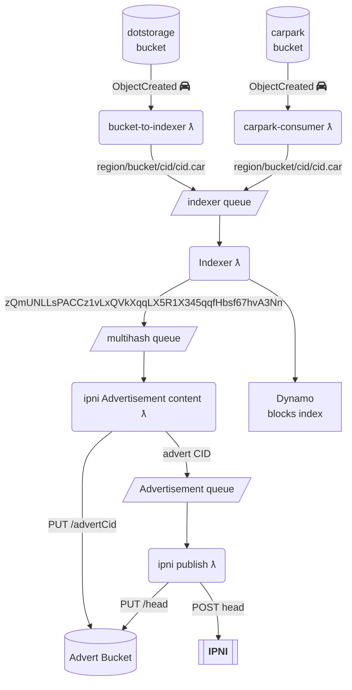
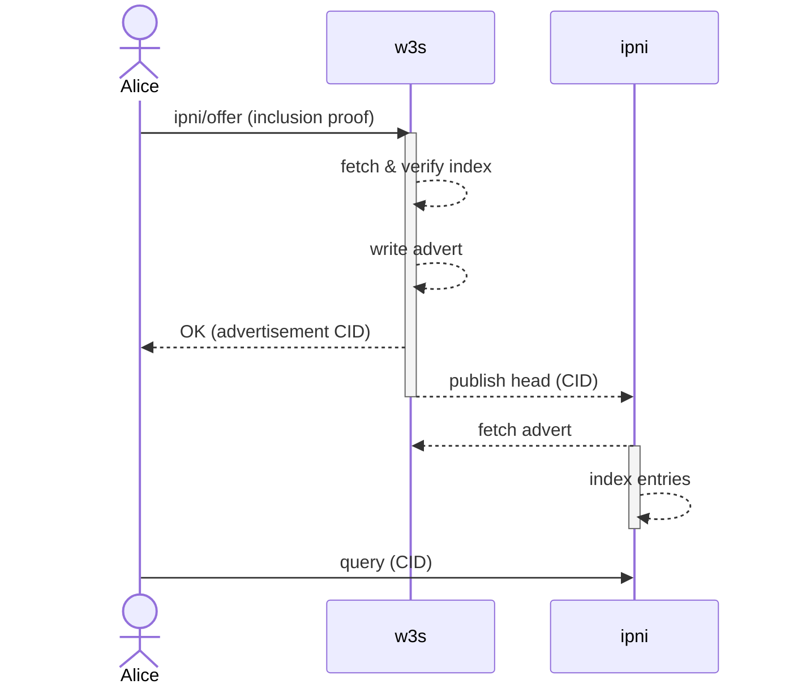

# W3 IPNI Protocol


## Authors

- [olizilla], [Protocol Labs]

## Abstract

For [IPNI] we assert that we can provide batches of multihashes by signing "Advertisements".

With an [inclusion claim], a user asserts that a CAR contains a given set of multihashes via a car index.

This spec describes how to merge these two concepts by adding an `ipni/offer` capability to publish an inclusion claim as [IPNI Advertisements].

## Language

The key words "MUST", "MUST NOT", "REQUIRED", "SHALL", "SHALL NOT", "SHOULD", "SHOULD NOT", "RECOMMENDED", "MAY", and "OPTIONAL" in this document are to be interpreted as described in [RFC2119](https://datatracker.ietf.org/doc/html/rfc2119).

## Introduction

We publish ad-hoc batches of multihashes to IPNI. This proposal aims to align our usage of IPNI with content-claims, by publishing an advert per inclusion claim, and include the source claim in the IPNI advert.

### Motivation

- Align IPNI advert entries with CAR block sets and setting the `ContextID` to be the CAR CID.
  - With this we (or anyone, ipni is open access) can now use IPNI to find which CAR a block is in. The context id bytes provide the CAR CID for any block look up. The CAR CID can then be used to find the CAR index via our content-claims API.
  - We can **delete** the IPNI records by CAR CID if the CAR is deleted.
- Make IPNI advertising an explicit UCAN capability that clients can invoke rather than a side-effect of bucket events
  - With this we are free to write CARs anywhere. The users agent invokes a `ipni/offer` capability to ask us to publish and IPNI ad for the blocks in their CAR.
  - This empowers the user to opt-in or out as they need, and allows us to bill for the (small) cost of running that service.
- Put the source inclusion claim in the IPNI advert metadata.
  - We have to sign IPNI Adverts as the provider. Providing a signed source claim allows more nuanced reputation decisions.

### Quick IPNI primer

IPNI ingests and replicates billions of signed provider claims for where individual block CIDs can be retrieved from.

Users can query IPNI servers for any CID, and it provides a set of provider addresses and transport info, along with a provider specific `ContextID` and optional metadata.

<http://cid.contact> hosts an IPNI server that Protocol Labs maintains. _(at time of writing)_

```bash
curl https://cid.contact/cid/bafybeicawc3qwtlecld6lmtvsndimoz3446xyaprgsxvhd3aapwa2twnc4 -sS | jq
```

```json
{
  "MultihashResults": [
    {
      "Multihash": "EiBAsLcLTWQSx+WydZNGhjs75z18AfE0r1OPYAPsDU7NFw==",
      "ProviderResults": [
        {
          "ContextID": "YmFndXFlZXJheTJ2ZWJsZGNhY2JjM3Z0em94bXBvM2NiYmFsNzV3d3R0aHRyamhuaDdvN2o2c2J0d2xmcQ==",
          "Metadata": "gBI=",
          "Provider": {
            "ID": "QmQzqxhK82kAmKvARFZSkUVS6fo9sySaiogAnx5EnZ6ZmC",
            "Addrs": [
              "/dns4/elastic.dag.house/tcp/443/wss"
            ]
          }
        },
        {
          "ContextID": "YmFndXFlZXJheTJ2ZWJsZGNhY2JjM3Z0em94bXBvM2NiYmFsNzV3d3R0aHRyamhuaDdvN2o2c2J0d2xmcQ==",
          "Metadata": "oBIA",
          "Provider": {
            "ID": "QmUA9D3H7HeCYsirB3KmPSvZh3dNXMZas6Lwgr4fv1HTTp",
            "Addrs": [
              "/dns4/dag.w3s.link/tcp/443/https"
            ]
          }
        }
]}]}
```

web3.storage publishes the blocks it can provide by encoding a batch of multihashes as an IPLD object and writing it to a bucket as an `Advertisement`, addressed by it's CID.

An `Advertisement` includes `Provider` info which claims that a the batch of multihashes are available via bitswap or HTTP, and are signed by the provider PeerID private key; Each advert is a claim that this peer will provide that batch of multihashes.

Advertisements also include a CID link to any previous ones from the same provider forming a hash linked list.

The latest `head` CID of the ad list can be broadcast over [gossipsub], to be replicated and indexed by all listeners, or via HTTP to specific IPNI servers as a notification to pull and index the latest ads from you at their earliest convenience.

The advert `ContextID` allows providers to specify a custom grouping key for multiple adverts. You can update or remove multiple adverts by specifying the same `ContextID`. The value is an opaque byte array as far as IPNI is concerned, and is provided in the query response.

A `Metadata` field is also available for provider specific retrieval hints, that a user should send to the provider when making a request for the block, but the mechanism here is unclear _(HTTP headers? bitswap?)_.

Regardless, it is space for provider specified bytes which we can use as to include the portable cryptographic proof that an end-user made the original claim that a set of blocks are included in a CAR and that as a large provider we have alerted IPNI on their behalf.

### How web3.storage integrates IPNI today

web3.storage publishes IPNI advertisements as a side-effect of the E-IPFS car [indexer-lambda].

Each multihash in a CAR is sent to an SQS queue. The `publisher-lambda` takes batches from the queue, encodes and signs `Advertisement`s and writes them to a bucket as JSON.

The lambda makes an HTTP request to the IPNI server at `cid.contact` to inform it when the head CID of the Advertisement linked list changes.

The IPNI server fetches new head Advertisement from our bucket, and any others in the chain it hasn't read yet, and updates it's indexes.

Our `Advertisement`s contain arbitrary batches of multihashes defined by SQS queue batching config. The `ContextID` is set to opaque bytes (a custom hash of the hashes).

#### Diagram



## Proposal

Provide a `ipni/offer` UCAN ability to sign and publish an IPNI Advertisement for the set of multihashes in a CAR a user has stored with w3s, to make them discoverable via IPFS implementations and other IPNI consumers.



Invoke it with the CID for an [inclusion claim] that associates a CAR CID with a [MultihashIndexSorted CARv2 Index] CID.

:::info
Other CAR index forms may be supported in the future. A more convenient external CAR index format would provide the offset byte and block byte length for a given multihash from the start of the CAR file.
:::

**UCAN invocation** example

```json
{
  "iss": "did:key:zAlice",
  "aud": "did:web:web3.storage",
  "att": [{
    "can": "ipni/offer",
    "with": "did:key:space", // users space DID
    "nb": {
      "inclusion": CID   // inclusion claim CID
    }
  }]
}
```

**Inclusion claim** example

```json
{
  "content": CID, // CAR CID
  "includes": CID // CARv2 Index CID
}
```

When `ipni/offer` is invoked the service must fetch the inclusion claim. The encoded claim block may be sent with the invocation.

The service must fetch he CARv2 index and parse it to find the set of multihashes included in the CAR. see: [Verifying the CARv2 Index](#verifying-the-carv2-index)

The set of multihashes must be encoded as 1 or more [IPNI Advertisements].

```ipldsch
type Advertisement struct {
    PreviousID optional Link
    Provider String
    Addresses [String]
    Signature Bytes
    Entries Link
    ContextID Bytes
    Metadata Bytes
    IsRm Bool
    ExtendedProvider optional ExtendedProvider
}
```

- `Entries` must be the CID of an `EntryChunk` for a subset (or all) of multihashes in the CAR.
- `ContextID` must be the byte encoded form of the CAR CID.
- `Metadata` must be the bytes of the inclusion claim.

See: [Encoding the IPNI Advertisement](#encoding-the-ipni-advertisement)

The Advertisement should then be available for consumption by indexer nodes per the [Advertisement Transfer](https://github.com/ipni/specs/blob/main/IPNI.md#advertisement-transfer) section of the IPNI spec.

### Verifying the CARv2 Index

The service must fetch the CARv2 Index and may verify 1 or more multihashes from the index exist at the specified offsets in the associated CAR.

The verifier should pick a set of multihashes at random and fetch the bytes from the CAR identified by the index entry and verify it's multihash. The invocation must return an error if any entry is found to be invalid.

Random validation of a number of blocks allows us to detect invalid indexes and lets us tune how much work we are willing to do per car index.

Full validation of every block is not recommended as it opens us up to performing unbounded work. _We have seen CAR files with millions of tiny blocks._

### Encoding the IPNI Advertisement

> The set of multihashes must be encoded as 1 or more [IPNI Advertisements].

Where the IPLD encoded size of an `EntryChunk` with the set of multihashes would exceed 4MiB (the upper limit for a block that can be transferred by libp2p) the set of multihashes must be split into multiple `EntryChunk` blocks.

```ipldsch
type EntryChunk struct {
    Entries [Bytes]
    Next optional Link
}
```

It is possible to create long chains of `EntryChunk` blocks by setting the `Next` field to the CID to another `EntryChunk`, but this requires an entire EntryChunk to be fetched and decoded, before the IPNI server can determine the next chunk to fetch.

The containing CAR CID provides a useful `ContextID` for grouping multiple (light weight) Advertisement blocks so it is recommended to split the set across multiple `Advertisement` blocks each pointing to an `EntryChunk` with a partition of the set of multihashes in, and the `ContextID` set to the CAR CID.

[IPNI]: https://github.com/ipni/specs/blob/main/IPNI.md
[MultihashIndexSorted CARv2 Index]:  https://ipld.io/specs/transport/car/carv2/#format-0x0401-multihashindexsorted
[inclusion claim]: https://github.com/web3-storage/content-claims?tab=readme-ov-file#inclusion-claim
[IPNI Advertisements]: https://github.com/ipni/specs/blob/main/IPNI.md#advertisements
[gossipsub]: https://github.com/libp2p/specs/blob/master/pubsub/gossipsub/README.md
[indexer-lambda]: https://github.com/elastic-ipfs/indexer-lambda/blob/a38d8074424d3f02845bac303a0d3fb3719dad82/src/lib/block.js#L22-L32
[olizilla]: https://github.com/olizilla
[Protocol Labs]: https://protocol.ai
