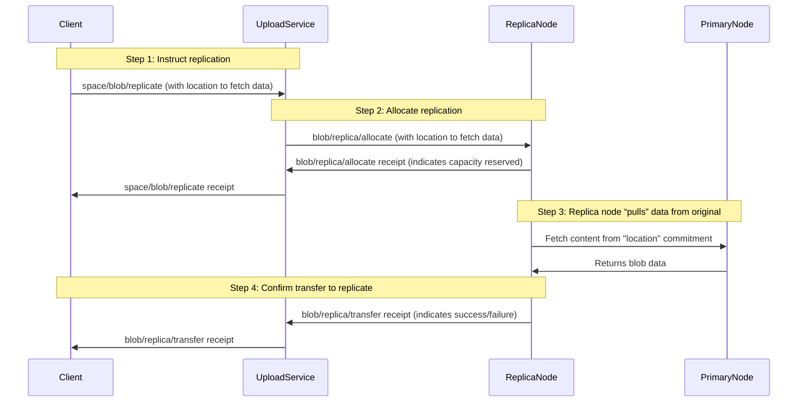

# Replication Protocol


## Authors

- [Alan Shaw](https://github.com/alanshaw), [Storacha Network](https://storacha.network/)

## Language

The key words "MUST", "MUST NOT", "REQUIRED", "SHALL", "SHALL NOT", "SHOULD", "SHOULD NOT", "RECOMMENDED", "MAY", and "OPTIONAL" in this document are to be interpreted as described in [RFC2119](https://datatracker.ietf.org/doc/html/rfc2119).

## Introduction

Replication ensures that if a storage node loses a blob, it remains available in the network. This specification is an extension to the blob protocol that allows nodes within the network to replicate data between each other _after_ a storage node has received an initial upload.

Out of scope: This specification does not propose any solution for repairing lost data from any node.

## Specification

### Diagram

The interactions can be summarized by the following diagram.



### Blob Replicate

A `space/blob/replicate` invocation instructs the upload service to replicate a blob to the specified number of storage nodes. A replication request is only valid to be issued _after_ the client has received a `blob/accept` receipt, indicating the target storage node has successfully received the blob.

The caveats for `space/blob/replicate` MUST include a `replicas` parameter, an unsigned integer indicating the number of copies the network should ensure are stored _in addition_ to the original.

It is RECOMMENDED that the upload service mandate a minimum _and_ a maximum value. The minimum and maximum MAY be the same.

e.g. `replicas: 2` will ensure 3 copies of the data exist in the network.

The blob to be replicated and the location where the blob may be found are also required.

```json5
{
  "iss": "did:key:zAlice",
  "aud": "did:web:upload.service.example.com",
  "att": [
    {
      "with": "did:key:zAliceSpace",
      "can": "space/blob/replicate",
      "nb": {
        /** The blob that MUST be replicated. */
        "blob": {
          "digest": { "/": { "bytes": "..." } },
          "size": 1234
        },
        /** Number of replicas to ensure. */
        "replicas": 2,
        /** A location commitment indicating where the blob MUST be fetched from. */
        "location": { "/": "bafy..locationCommitment" }
      }
    }
  ],
  "prf": [],
  "sig": "..."
}
```

It is RECOMMENDED that the location commitment is included in the invocation.

The receipt for `space/blob/replicate` includes effects (async tasks) for `blob/replica/transfer`. Successful completion of the `blob/replica/transfer` task indicates the replication target has transferred and stored the blob. The number of `blob/replica/transfer` tasks corresponds directly to number of replicas requested.

Each replication task MUST target a _different_ storage node and they MUST NOT target the original upload target.

The upload service MUST select storage node(s) and allocate replication space when the `space/blob/replicate` invocation is received.

The reciept also includes effects (async tasks) and receipts for each allocation task performed.

#### Blob Replicate Capability Schema

```ts
type ReplicateBlob = {
  can: "space/blob/replicate"
  with: SpaceDID
  nb: {
    blob: Blob
    replicas: int
    location: Link<LocationCommitment>
  }
}

type Blob = {
  digest: Multihash
  size: int
}

type Multihash = bytes
type SpaceDID = string
```

##### Blob

The `nb.blob` field MUST be set to the `Blob` that is to be replicated.

##### Replicas

The `nb.replicas` field MUST be an unsigned integer indicating the number of copies the network should ensure are stored _in addition_ to the original. It MUST be greater than 0.

##### Location

The `nb.location` field MUST be a [Link](https://ipld.io/docs/schemas/features/links/) to the [location commitment](./w3-blob.md#location-commitment) describing where the blob can be retrieved.

#### Blob Replicate Reciept Schema

```ts
type ReplicateBlobReceipt = {
  out: Result<ReplicateBlobOk, ReplicateBlobError>
  fx: {
    fork: [
      Link<AllocateReplicaBlob>
      Link<TransferReplicaBlob>
    ]
  }
}

type Result<Ok, Err> = { ok: Ok } | { error: Err }

type ReplicateBlobOk = {
  site: [{
    "ucan/await": [".out.ok.site", Link<TransferReplicaBlob>]
  }]
}

type ReplicateBlobError = {
  message: string
}
```

##### Blob Replicate Result

Invocation MUST fail if any of the following is true:

1. Provided subject space is not provisioned with a provider.
1. Provided subject space does not currently store the blob.
1. Provided `blob.size` is outside of supported range.
1. Provided `blob.digest` is not a valid [multihash].
1. Provided `blob.digest` [multihash] hashing algorithm is not supported.
1. Provided `replicas` is not an unsigned integer greater than 0.
1. Provided `location` commitment is invalid or has been revoked.

Invocation MUST succeed if non of the above is true. Success value MUST be an object with a `site` field set to an array of [ucan/await] of the task that produces a [location commitment](./w3-blob.md#location-commitment), one for each replica requested.

Task linked from the `site` of the success value MUST be present in the receipt effects _(`fx` field)_.

##### Blob Replicate Effects

Successful invocation MUST start a workflow consisting of following tasks, that MUST be set in receipt effects (`fx` field) in the following order:

1. [Blob Replica Allocate](#blob-replica-allocate) (1 or more)
1. [Blob Replica Transfer](#blob-replica-transfer) (1 or more)

The number of effects recieved is dependant on the number of replicas requested.

### Blob Replica Allocation

The upload service allocates replication space on storage nodes by issuing a `blob/replica/allocate` invocation:

```json5
{
  "iss": "did:web:upload.service.example.com",
  "aud": "did:key:zStorageNode",
  "att": [
    {
      "with": "did:key:zStorageNode",
      "can": "blob/replica/allocate",
      "nb": {
        /** The blob that was must be replicated. */
        "blob": {
          "digest": { "/": { "bytes": "..." } },
          "size": 1234
        },
        /** DID of the space the blob has been allocated to. */
        "space": { "/": { "bytes": "..." } },
        /** A location commitment indicating where the blob MUST be fetched from. */
        "location": { "/": "bafy..locationCommitment" },
        /** The `space/blob/replicate` invocation that caused this allocation. */
        "cause": { "/": "bafy..replicate" }
      }
    }
  ],
  "prf": [],
  "sig": "..."
}
```

The `blob/replica/allocate` task receipt includes an async task that will be performed by the storage node - `blob/replica/transfer`. The `blob/replica/transfer` task is completed when the storage node has transferred the blob from its location to the storage node.

#### Blob Replica Allocate Capability Schema

TODO

#### Blob Replica Allocate Reciept Schema

TODO

### Blob Replica Transfer

The `blob/replica/transfer` task is completed by each replication node. Replication data is fetched from the location specified in the location commitment referenced by the `blob/replica/allocate` invocation.

A `blob/replica/transfer` task takes the following form:

```json5
{
  "iss": "did:key:zStorageNode",
  "aud": "did:key:zStorageNode",
  "att": [
    {
      "with": "did:key:zStorageNode",
      "can": "blob/replica/transfer",
      "nb": {
        /** The blob that will be transferred. */
        "blob": {
          "digest": { "/": { "bytes": "..." } },
          "size": 1234
        },
        /** The location the blob will be transferred from. */
        "location": { "/": "bafy..locationCommitment" },
        /** The `blob/replica/allocate` invocation that initiated this transfer. */
        "cause": { "/": "bafy..allocate" }
      }
    }
  ],
  "prf": [],
  "sig": "..."
}
```

When the `blob/replica/transfer` task is complete a receipt is issued. The receipt is communicated back to the upload service via a `ucan/conclude` invocation.

The receipt for `blob/replica/transfer` includes a new signed location commitment from the storage node the blob has been replicated to.

Client can poll the upload service for the `blob/replica/transfer` receipt.

#### Blob Replica Transfer Capability Schema

TODO

#### Blob Replica Transfer Reciept Schema

TODO
