# Authorization Protocol


## Editors

- [Irakli Gozalishvili], [Protocol Labs]

## Authors

- [Irakli Gozalishvili], [Protocol Labs]

# Abstract

Within the w3 family of protocols, users have the ability to manage access across namespaces through delegated [UCAN] capabilities using an [w3account]. However, this process can be daunting for an average user due to the use of unfamiliar user flows. To address this, we propose a complementary solution that can utilize a widely used email authorization flow.

## Language

The key words "MUST", "MUST NOT", "REQUIRED", "SHALL", "SHALL NOT", "SHOULD", "SHOULD NOT", "RECOMMENDED", "MAY", and "OPTIONAL" in this document are to be interpreted as described in [RFC2119](https://datatracker.ietf.org/doc/html/rfc2119).

# Introduction

An abstraction of an [w3account] provides a convenient method for sharing capabilities without the need to prearrange key exchange. While delegation to a [w3account] is represented with a standard [UCAN], delegation from a [w3account] requires the use of [DKIM signature]. However, generating such signatures requires users to send an email with a special subject line, which may not work well for many users.

To address this, we propose an alternative method (using an [Authorization Session Signature]) for delegating capabilities from the [account] that uses a well-known email-based authorization flow that can be used alongside or instead of [DKIM signature]. In this document, we propose a protocol through which a user [agent] _(identified by a [`did:key`] identifier)_ can request a set of desired capabilities from a memorable [`did:mailto`] identifier through an intermediary that facilitates out-of-band user authorization. We also specify how the special `ucan/attest` capability can be utilized by supporting agents to establish authorization session.

> ℹ️ Note that while this specification focuses on [`did:mailto`] identifiers, this approach is valid and can be extended to various other identifiers.

# Terminology

## Roles

There are several roles that agents in the authorization flow may assume:

| Name        | Description |
| ----------- | ----------- |
| Account    | [Principal] identified by memorable identifier like [`did:mailto`]. |
| Agent       | [Principal] identified by [`did:key`] identifier, representing a user in some application installation |
| Oracle      | [Principal], entrusted by [Authority] to carry out out-of-bound authorization flow |
| Authority   | [Principal] that represents service provider that executes invoked capabilities |
| Verifier   | Component of the [authority] that performs UCAN validation |

### Account

An _account_ is a type of [principal] that is identified by a memorable identifier, such as [`did:mailto`].

Accounts can be used to conveniently aggregate and manage capabilities across different user [agents].

In addition, accounts can facilitate familiar user authorization and recovery flows.

### Agent

An _agent_ is a type of [principal] identified by a [`did:key`] identifier.

When interacting with a system, users may use different _agents_ across multiple devices and applications. It is strongly advised that _agents_ use [non-extractable keys] whenever possible.

> ℹ️ Note that agents are designed to be temporary and can be disposed of or created as needed.

### Oracle

The term _Oracle_ refers to a specific kind of [principal] that is authorized by the [authority] to conduct an out-of-band authorization process on behalf of a user [agent]. This process enables the [agent] to obtain delegation for the requested capabilities from the [account]. As part of this process, the _Oracle_ is trusted to carry out the authorization in good faith and to delegate the `ucan/attest` capability to the [agent], which serves as proof that the delegation from the [account] to the [agent] has been authorized by the [account] holder.

### Authority

_Authority_ is a [principal] that executes invoked capabilities.

### Verifier

Component of the [authority] that performs UCAN validation

# Protocol

## Overview

At a high level, our proposal involves capturing stateful out-of-bound authorization in a stateless [authorization session], using a [UCAN] delegation. This delegation can then be used by a delegated [agent] to prove that an [account] has delegated a set of capabilities.

## Authorization Request

The user's [agent] has the option to request authorization from the user's [account] by utilizing the `access/authorize` capability, which is facilitated by a trusted [oracle] to carry out the out-of-bound authorization flow.

```mermaid
sequenceDiagram
  participant Agent as 👩‍💻<br/><br/>did:key:zAgent
  participant W3 as 🌐<br/><br/>did:web:web3.storage #32;
  participant Email as 📬<br/><br/>alice@web.mail

  Agent ->> W3: access/authorize
  
  W3 ->> Email: ✉️ Confirm Authorization 
  Email ->> W3: 🔗 Grant Authorization
  Email -->> Agent: store/*
  W3 ->> Agent: ucan/attest
```



### Authorization Request Schema

```ipldsch
# Authorization protocol consists of a single capability.
type Access union {
  | Claim   "access/authorize"
} representation inline {
  discriminantKey "can"
}


type Claim struct {
  # DID of the agent requesting an authorization
  with  Agent
  # Authorization request describing set of desired capabilities
  nb    AuthorizationRequest
}

type AuthorizationRequest {
  # DID of the Account authorization is requested from.
  iss Account
  # Capabilities agent wishes to be granted.
  att [CapabilityRequest]
}

type CapabilityRequest struct {
  # Describes the request capability. If set to `*` implies desire to have
  # complete authority over the account and is equivalent to "sudo" access.
  can    string
}

type Agent DIDKey
type Account DIDMailto
```

#### Agent Requesting Authorization

The resource (`with` field) MUST be set to the [`did:key`] of the [agent] requesting an authorization.

> ℹ️ It should be noted that the resource specified in the with field of the authorization request is not required to be the same as the issuer of the request. The identity of the issuer is not important as long as it has been granted the `access/claim` capability by the [agent].

#### Account Granting Authorization

The `nb.iss` field MUST be set to the [account] DID from which the desired capabilities (`nb.att`) are being requested.

#### Requested Capabilities

The `nb.att` field MUST adhere to the `CapabilityRequest` [IPLD schema] and MUST specify the capabilities that the [agent] is requesting. The `{ "can": "*" }` is equivalent to [sudo] access and should be reserved for special cases as it represents a request for [superuser] permissions.

In general, it is RECOMMENDED that [agents] only request the set of capabilities that are necessary to complete a user-initiated action and only when the user initiates such an action.

### Authorization Request Example

> Agent `did:key:z6Mkk89bC3JrVqKie71YEcc5M1SMVxuCgNx6zLZ8SYJsxALi` requests a `store/*` capability from `alice@web.mail` account

```json
{
  "v": "0.9.1",
  "iss": "did:key:z6Mkk89bC3JrVqKie71YEcc5M1SMVxuCgNx6zLZ8SYJsxALi",
  "aud": "did:web:web3.storage",
  "att": [
    {
      "with": "did:key:z6Mkk89bC3JrVqKie71YEcc5M1SMVxuCgNx6zLZ8SYJsxALi",
      "can": "access/authorize",
      "nb": {
        "iss": "did:mailto:web.mail:alice",
        "att": [{"can":"store/*"}]
       }
    }
  ],
  "prf": [],
  "exp": 1685602800,
  "s": {
    "/": {
      "bytes": "7aEDQJbJqmyMxTxcK05XQKWfvxG+Tv+LWCJeE18RSMnciCZ/RQ21U75LA0uFSvIjdqnF5RaauZTE8mh2ZYMBBejdJQ4"
    }
  }
}
```

### Implementations

- [`{ authorize }` from `@web3-storage/capabilities/access`](https://github.com/web3-storage/w3up/blob/10a1a4bfc5ec79ea0b7b2049fd7d1953ca0810ef/packages/capabilities/src/access.js#L65)

## Authorization

An [oracle] MUST provide `access/authorize` capability. When this capability is invoked, the [oracle] MUST facilitate an out-of-bound authorization flow that allows the [account] holder to select which capabilities they wish to grant. It is RECOMMENDED that the [oracle] by default presents only a subset of capabilities that match the request criteria.

If the user denies the authorization request, the corresponding `access/authorize` invocation MUST fail. Otherwise, the [oracle] must issue a delegation from the [account] [`did:mailto`] principal using an [Authorization Session Signature]. This delegation MUST delegate ONLY the capabilities that the user has granted.

### Example Authorization in [DAG-JSON]

```json
{
  "bafyreifer23oxeyamllbmrfkkyvcqpujevuediffrpvrxmgn736f4fffui": {
    "v": "0.9.1",
    "iss": "did:mailto:web.mail:alice",
    "aud": "did:key:z6Mkk89bC3JrVqKie71YEcc5M1SMVxuCgNx6zLZ8SYJsxALi",
    "att": [
      {
        "can": "store/*",
        "with": "space://did:key:z6MktafZTREjJkvV5mfJxcLpNBoVPwDLhTuMg9ng7dY4zMAL"
      }
    ],
    "exp": null,
    "s": {
      "/": {
        "bytes": "gKADAA"
      }
    }
  }
}
```

### Implementations

#### @web3-storage/capabilities

- [`access/authorize` capability parser](https://github.com/web3-storage/w3up/blob/e34eed1fa3d6ef24ce2c01982764f2012dbf30d8/packages/capabilities/src/access.js#L65) nb field is [`AuthorizationRequest`](https://github.com/web3-storage/w3up/blob/e34eed1fa3d6ef24ce2c01982764f2012dbf30d8/packages/capabilities/src/access.js#L40) parser

#### @web3-storage/upload-api

- has an [access service](https://github.com/web3-storage/w3up/blob/e34eed1fa3d6ef24ce2c01982764f2012dbf30d8/packages/upload-api/src/access.js#L10) that acts as this authorization oracle and sends authorization request emails in response to `access/authorize` invocations that mention `did:mailto` accounts
- `access/authorize` invocation handler [generates `access/confirm` invocation](https://github.com/web3-storage/w3up/blob/e34eed1fa3d6ef24ce2c01982764f2012dbf30d8/packages/upload-api/src/access/authorize.js#L57), encodes it into a clickable URL, and then includes a link to that URL (with self-signed `access/confirm` invocation) in confirmation email. The `access/confirm` is not invoked unless the confirmation link in the confirmation email is followed.

## Authorization Session

An authorization session is a UCAN delegation from the [authority] to the [agent]. It is an attestation issued by a trusted third party _(such as an [oracle])_ indicating that the [account] holder has authorized a specific delegation (specified by the `nb.proof` field).

The session CAN be used with delegations from an [account] signed by either [DKIM Signature] or [Authorization Session Signature], as it only confirms that the [authority] has verified the authenticity of the specific delegation from the [account].

> ⚠️ Note that this does not imply that the delegation has been verified to not escalate any capabilities. The validator is simply informed that the UCAN signature is valid.

### Schema

```ipldsch
type Session union {
  | Attest    "ucan/attest"
} representation inline {
  discriminantKey "can"
}

type Attest struct {
  with          Authority
  nb            Attestation
}

type Attestation struct {
  proof        &UCAN
}
```

#### Session Issuer

Session MUST be issued by the [authority] or a trusted [oracle]. Issuing [oracle] MAY be trusted directly in which case [authority] has delegated `ucan/attest` capability to it, or transitively in which case [authority] had delegated `ucan/attest` capability to a [principal] that re-delegated it to an [oracle].

#### Session Audience

The [agent] to whom the session is delegated MUST be the same [principal] as the audience (`aud`) of the attested proof.

#### Session Proof

The `nb.proof` field MUST be a [link] to the UCAN delegation that specifies the delegation of granted capabilities from the [account] to the [agent].

#### Session Context

The value of the `with` field MUST be the DID of the [authority], indicating that ONLY an [oracle] with the delegated `ucan/attest` capability from the [authority] can issue the session.

### Session Example

> Proof that `did:mailto:web.mail:alice` has delegated `did:key:zAgent` the `store/*` capability.

```json
{
  "bafyreiat7z45tiyt52ju4h576xrmcmovkjl7ax22m5ndjij56ht4hqabba": {
    "v": "0.9.1",
    "iss": "did:web:web3.storage",
    "aud": "did:key:z6Mkk89bC3JrVqKie71YEcc5M1SMVxuCgNx6zLZ8SYJsxALi",
    "att": [
      {
        "with": "did:web:web3.storage",
        "can": "ucan/attest",
        "nb": {
          "proof": {
            "/": "bafyreifer23oxeyamllbmrfkkyvcqpujevuediffrpvrxmgn736f4fffui"
          }
        },
      }
    ],
    "exp": null,
    "s": {
      "/": {
        "bytes": "7aEDQBj34uAed7Mup+aVCTKuUtcKWwJtzMZ5yPA6tptMrcRrbE3o7uHKG/wBqF+OKJYGY7epQOV+OUuzseZvXuJN2QI"
      }
    }
  }
}
```

### Session Scope

Authorization sessions only apply to UCANs that have a [proof] linking to them. They are subject to UCAN [time bounds] and [revocation]s. The session only covers UCANs that meet the standard [principal alignment] requirement.

### Implementations

#### @ucanto/validator

- tested in [session.spec.js](https://github.com/web3-storage/ucanto/blob/main/packages/validator/test/session.spec.js)

#### @web3-storage/capabilities

- [`ucan/attest` capability parser](https://github.com/web3-storage/w3up/blob/e34eed1fa3d6ef24ce2c01982764f2012dbf30d8/packages/capabilities/src/ucan.js#L102)

#### @web3-storage/upload-api

- supports w3-session [via `@ucanto/server`](https://github.com/web3-storage/w3up/blob/main/packages/upload-api/src/lib.js#L28)
- deployed to [up.web3.storage](https://up.web3.storage) via [w3infra](https://github.com/web3-storage/w3infra)
- `access/confirm` handler [creates session proofs](https://github.com/web3-storage/w3up/blob/main/packages/upload-api/src/access/confirm.js#L60) and [includes in result](https://github.com/web3-storage/w3up/blob/main/packages/upload-api/src/access/confirm.js#L93)

#### @web3-storage/access

- [Agent.proofs](https://github.com/web3-storage/w3up/blob/e34eed1fa3d6ef24ce2c01982764f2012dbf30d8/packages/access-client/src/agent.js#L275) is aware of w3-session proofs

[`did:mailto`]: https://github.com/ucan-wg/did-mailto/
[`did:key`]: https://w3c-ccg.github.io/did-method-key/
[ucan]: https://github.com/ucan-wg/spec/
[principal alignment]: https://github.com/ucan-wg/spec/blob/main/README.md#62-principal-alignment
[revocation]: https://github.com/ucan-wg/spec/#28-revocation
[time bounds]: https://github.com/ucan-wg/spec/#322-time-bounds
[principal]: https://github.com/ucan-wg/spec/#321-principals
[agent]:#agent
[account]:#account
[oracle]:#oracle
[authority]:#authority
[sudo]:https://en.wikipedia.org/wiki/Sudo
[link]:https://ipld.io/docs/schemas/features/links/
[IPLD schema]:https://ipld.io/docs/schemas/
[superuser]:https://en.wikipedia.org/wiki/Superuser
[DAG-JSON]:https://ipld.io/specs/codecs/dag-json/spec/

[w3account]:./w3-account.md
[Protocol Labs]:https://protocol.ai/
[Irakli Gozalishvili]:https://github.com/Gozala
[DKIM Signature]:./w3-account.md#domainkeys-identified-mail-dkim-signature
[Authorization Session Signature]:./w3-account.md#authorization-session-signature
