# Authorization


## Editors

- [Irakli Gozalishvili](https://github.com/Gozala), [DAG House](https://dag.house/)

## Authors

- [Irakli Gozalishvili](https://github.com/Gozala), [DAG House](https://dag.house/)

# Abstract

In web3.storage we describe the concept of an account as convenience for aggregating and managing capabilities across various user spaces under some (human-meaningful) identifier like an email address.

## Language

The key words "MUST", "MUST NOT", "REQUIRED", "SHALL", "SHALL NOT", "SHOULD", "SHOULD NOT", "RECOMMENDED", "MAY", and "OPTIONAL" in this document are to be interpreted as described in [RFC2119](https://datatracker.ietf.org/doc/html/rfc2119).

# Introduction

## Motivation

In web3.storage users may create (name)space by generating an asymmetric keypair and deriving [`did:key`] identifier from it. (Name)space owner (private key owner) can delegate some or all capabilities to other identifiers without anyone's permission, however managing keypairs across multiple agents and devices can be complicated.

We propose [petname][] inspired approach that allows mapping cryptographic [`did:key`] identifiers to a memorable identity. This specification focuses on [`did:mailto`] identifiers, however approach is valid and can be extended to various other identifiers.

# Terminology

## Roles

There are several roles that agents in the authorization flow may assume:

| Name        | Description                                                                                                                                    |
| ----------- | ---------------------------------------------------------------------------------------------------------------------------------------------- |
| Identity    | Principal identified by a memorable identifier like [`did:mailto`]. Authorized agents will act on behalf of some identity                      |
| Notary      | Trusted principal, an oracle that performed out-of-bound authentication and issuer of the [authorization session]                              |
| Authority   | An agent that interprets a UCAN and verifies that it is valid                                                                                  |
| Session key | The [`did:key`] identifier of the key that is used to sign UCANs issued by Identity. Usually this is a DID of the Agent authorized as Identity |

## Premise

Mapping cryptographic [`did:key`] identifier to an identity with memorable identifier like [`did:mailto`] MUST be authorized by the identity owner. When identity is identified with a a non-cryptographic identifier authorization is not self-evident from the UCAN delegation and requires performing out-of-bound authentication like [DID resolution] or an email based confirmation flow.

To keep UCANs verifiable in stateless settings we propose capturing stateful information (out-of-bound authorization) in a stateless [session], represented using a UCAN, so it can be included in verifiable proofs.

### Authorization

An agent MAY request an authorization [session] by invoking `access/authorize` capability that specifies desired identity (`nb.as`) and session key (`with`).
Capability provider (notary) MUST carry out-of-bound authentication that allows identity owner to accept or deny authorization request.

```mermaid
sequenceDiagram
  participant Agent as 👩‍💻<br/><br/>did:key:zAgent
  participant W3 as 🌐<br/><br/>did:web:web3.storage #32;
  participant Email as 📬<br/><br/>alice@web.mail

  Agent ->> W3: access/authorize
  Note right of Agent:🎟<br/>with: did:key:zAgent<br/>as: did:mailto:web.mail:alice
  W3 ->> Email: ✉️ Verification email
  Email ->> W3: 🔗 Approve
  W3 -->> Agent: ./update
    Note right of Agent:🎫<br/>with: did:web:web3.storage<br/>key: did:key:zAgent
```



#### Authorization Example

> Request authorization from `alice@web.mail` with `did:key:zAgent`.

```ts
{
  "iss": "did:key:zAgent",        // agent
  "aud": "did:web:web3.storage",  // notary
  "att": [{
    "with": "did:key:zAgent",     // session key
    "can": "access/authorize",
    "nb": { as: "did:mailto:web.mail:alice" }  // identity
  }]
}
```

#### Authorization Principal

The `nb.as` field MUST specify a principal that requesting agent wishes to represent in authorized session. It MUST be valid [UCAN principal] so that it can be used as issuer (`iss`) in UCANs covered by authorized session.

#### Authorization Key

Resource (`with`) MUST be a [`did:key`][] identifier for the desired session key. It represents a key that agent wishes to use for signing [UCAN][]s that it will issue using authorization principal.

> Please note that session key `with`, MAY be different or same as the issuing agent DID (`iss`).

### Authentication

Agent providing `access/authorize` capability (notary) MUST carry out-of-bound process in which authorizing principal may confirm or deny authorization. Process MAY vary based on type of identity.

#### Example [`did:mailto`] authorization

Notary MAY issue authorization [session] after verifying that specified [`did:key`] is authorized by either:

- Performing [`did:mailto` resolution] and ensuring it is listed under [capability invocations] when [DKIM-Signature] is provided.

- Perform out-of-bound verification by sending an email to the corresponding address with a callback link that can authorize requested [`did:key`].

#### Example [`did:web`]

Notary MAY issue authorization [session] after performing [DID resolution] and either:

- Ensuring that specified [`did:key`] is authorized to perform [capability invocations].
- Carry [DID authentication] using challenge-response protocol.

### Authorization context

Notary MUST issue [session] for the [authorization] request that was approved. This enables authorized agents (ones with access to session private key) to use UCANs covered by this [session].

Authorization context extends to the principals that trust that notary has carried out authorization process is good faith.

> To make it more concrete consider following scenario: **Alice** shares **Bobs** contact info with **Mallory** from her address book.
>
> **Mallory** assumes shared phone number belongs to **Bob** because she trusts **Alice** to act in good faith.

#### Delegated Trust

Trust in notary CAN explicitly be captured via [session] delegating, in which case notary SHOULD re-delegate it. This allows modeling complex trust relationships where trusted authority delegates trust to some intermediary principal which (re)delegates this trust to the notary that issued a [session].

## Session

Session is UCAN issued by (trusted) notary (`iss`) and proof that notary has verified that authorizing principal (`aud`) has approved use of session key (`with`) in the context of this session.

In other words notary has ensured that principal in `aud` field has approved UCAN issued by it to be signed using (`with`) key.

### Session Example

> Proof that `did:mailto:web.mail:alice` can issue UCANs signed with `did:key:zAgent` session key.

```ts
{
  iss: "did:web:web3.storage",
  aud: "did:mailto:web.mail:alice",
  att: [{
    with: "did:web:web3.storage",
    can: "./update",
    nb: { key: "did:key:zAgent" }
  }],
  exp: null
  sig: "..."
}
```

### Session Context

Resource MUST be set to the trusted principal corresponding to the [authorization context]. It SHOULD match `aud` of the UCAN that uses [session] in [proofs].

Authority MAY choose to trust principal other than itself and therefor extend authorization context to those principals.

### Session Principal

Audience of the [UCAN][] MUST be a non-cryptographic identifier of the authorizing principal. It MUST match [`nb.as`][authorization principal] of the corresponding authorization request.

> This ensures [principal alignment] when [session] is used as a proof in [UCAN][] issued by the authorizing principal.

### Session Key

The `nb.key` field MUST be set to [`did:key`][] identifier of the session key. It MUST be the same DID as [`nb.with`][authorization key] of the authorization request.

## Session Scope

Authorization [session] covers UCANs that include it in their [proofs] and are subject to UCAN [time bounds][] and [revocations][ucan revocation]. Only UCANs meeting standard [principal alignment] requirement are covered by the [session], meaning UCAN MUST be issued by the `aud` of the included [session].

## Session Extensions

The `./update` capability provides functionality roughly equivalent of [`Set-Cookie`][] HTTP header. It allows capturing stateful information in the stateless UCAN delegations.

Capability MAY include arbitrary session information besides `key` which MUST be ignored in the context of this specification, or put it differently MUST NOT impact authorization [session] handling.

[petname]: https://en.wikipedia.org/wiki/Petname
[ucan mailto]: https://github.com/ucan-wg/ucan-mailto/
[`did:mailto`]: https://github.com/ucan-wg/did-mailto/
[principal]: https://github.com/ucan-wg/spec/blob/main/README.md#321-principals
[recipient validation]: https://github.com/ucan-wg/spec/blob/main/README.md#621-recipient-validation
[`did:key`]: https://w3c-ccg.github.io/did-method-key/
[`access/authorize`]: #Authorize
[authorize `as`]: #authorize-as
[authorize `with`]: #authorize-with
[session `with`]: #Session-with
[session `aud`]: #Session-aud
[session `nb`]: #Session-nbkey
[ucan]: https://github.com/ucan-wg/spec/
[principal alignment]: https://github.com/ucan-wg/spec/blob/main/README.md#62-principal-alignment
[email verification]: #Email-Verification
[authorization]: #Authorization
[access delegation]: #Delegate-Access
[cookies]: https://en.wikipedia.org/wiki/HTTP_cookie
[`./update`]: #update
[`set-cookie`]: https://developer.mozilla.org/en-US/docs/Web/HTTP/Headers/Set-Cookie
[session]: #Session
[ucan revocation]: https://github.com/ucan-wg/spec/#28-revocation
[`did:web`]: https://w3c-ccg.github.io/did-method-web/
[did resolution]: https://www.w3.org/TR/did-core/#resolution
[capability invocations]: https://www.w3.org/TR/did-core/#capability-invocation
[did authentication]: https://www.w3.org/TR/did-core/#authentication
[`did:mailto` resolution]: https://github.com/ucan-wg/did-mailto/blob/draft/README.md#read-resolve
[dkim-signature]: https://en.wikipedia.org/wiki/DomainKeys_Identified_Mail
[time bounds]: https://github.com/ucan-wg/spec/#322-time-bounds
[proofs]: https://github.com/ucan-wg/spec/#327-proof-of-delegation
[ucan principal]: https://github.com/ucan-wg/spec/#321-principals
[session scope]: #Session_Scope
[authorization context]: #Authorization_Context
[authorization principal]: #Authorization_Principal
[authorization key]: #Authorization_Key
