# Authorization Protocol


## Editors

- [Irakli Gozalishvili], [Protocol Labs]

## Authors

- [Irakli Gozalishvili], [Protocol Labs]

# Abstract

In w3 family of protocols users can use an [account] to manage access across namespaces through delegated [UCAN] capabilities. Doing so however requires use of unfamiliar user flows which may prove intimidating to an average user. We propose complimentary solution that can leverage widely used email authorization flow.

## Language

The key words "MUST", "MUST NOT", "REQUIRED", "SHALL", "SHALL NOT", "SHOULD", "SHOULD NOT", "RECOMMENDED", "MAY", and "OPTIONAL" in this document are to be interpreted as described in [RFC2119](https://datatracker.ietf.org/doc/html/rfc2119).

# Introduction

An [account] abstraction provides a convenient way to share capabilities without having to prearrange key exchange. Delegation to an [account] is represented with pretty standard [UCAN], however delegation from an [account] requires use of [DKIM signatures]. To generate such signature user needs to send an email with special subject line, which is unusual and may prove to not to work well for many users.

We propose another method for delegating capabilities from the [account] that uses well known email based authorization flow instead, which could be used instead of [DKIM Signatures] or in conjunction with it.

In this document we propose a protocol through which user [agent] (identified by [`did:key`] identifier) could request set of desired capabilities from memorable [`did:mailto`] identifier through an intermediary facilitating out-of-bound user authorization. We also specify how **special** `./update` capability may be utilized by supporting agents for establishing authorization sessions.

> ℹ️ This specification focuses on [`did:mailto`] identifiers, however approach is valid and can be extended to various other identifiers.

# Terminology

## Roles

There are several roles that agents in the authorization flow may assume:

| Name        | Description                                                                                                                                    |
| ----------- | ---------------------------------------------------------------------------------------------------------------------------------------------- |
---------------------------------------------------------------- |
| Account    | [Principal] identified by memorable identifier like [`did:mailto`]. |
| Agent       | [Principal] identified by [`did:key`] identifier, representing a user in some application installation |
| Oracle      | [Principal], entrusted by [Authority] to carry out out-of-bound authorization flow |
| Authority   | [Principal] that represents service provider that executes invoked capabilities |
| Verifier   | Component of the [authority] that performs UCAN validation |

### Account

_Account_ is a [principal] identified by a memorable identifier like [`did:mailto`].

Account MAY be used for convenience of aggregating and managing capabilities across various user [Agent]s.

Account CAN be used to facilitate familiar user authorization and recovery flows.

### Agent

_Agent_ is a [principal] identified by a [`did:key`] identifier.

Users interacts with a system through different _agents_ across multiple devices and applications. It is highly RECOMMENDED that _agents_ use [non-extractable keys] when possible.

> ℹ️ _Agents_ are meant to be ephemeral that could be disposed or created on demand.

### Oracle

_Oracle_ is a [principal], facilitating out-of-bound account authorization flow. _Oracle_ is explicitly or implicitly trusted by the [authority] to carry out authorization in good faith and record the outcome in an issued [permit].

### Authority

_Authority_ is a [principal] that executes invoked capabilities.

### Verifier

Component of the [authority] that performs UCAN validation

# Protocol

## Overview

At the high level we propose capturing stateful out-of-bound authorization in a stateless [authorization session] using a UCAN delegation, that delegate [agent] could use to proof that an [account] has delegated set of capabilities.

## Authorization Request

User [agent] MAY request an authorization from a user [account] by invoking `access/authorize` capability through a trusted [oracle] facilitating out-of-bound authorization flow.

```mermaid
sequenceDiagram
  participant Agent as 👩‍💻<br/><br/>did:key:zAgent
  participant W3 as 🌐<br/><br/>did:web:web3.storage #32;
  participant Email as 📬<br/><br/>alice@web.mail

  Agent ->> W3: access/authorize
  
  W3 ->> Email: ✉️ Confirm Authorization 
  Email ->> W3: 🔗 Grant Authorization
  W3 -->> Agent: ucan/attest
  Email -->> Agent: store/add
```



### Authorization Request Schema

```ipldsch
# Authorization protocol consists of a single `Claim` capability.
type Access union {
  | Claim   "access/authorize"
} representation inline {
  discriminantKey "can"
}


type Claim struct {
  # DID of the agent requesting an authorization
  with  Agent
  # Authorization request describing set of desired capabilities
  nb    AuthorizationRequest
}

type AuthorizationRequest {
  # DID of the Account authorization is requested from.
  iss optional Account
  # Capabilities requesting agent wishes to be granted.
  att [CapabilityRequest]
}

type CapabilityRequest struct {
  # Describes the request capability. If set to `*` implies desire to have
  # complete authority over the account and is equivalent to "sudo" access.
  can    string
}

type Agent DIDKey
type Account DIDMailto
```

#### Agent Requesting Authorization

Resource (`with` field) MUST be set to [`did:key`] agent identifier requesting an authorization.

> ℹ️ Note that it MAY be different from the issuer of the authorization request. The issuer is irrelevant, as long as it has been delegated `access/claim` capability from  the [agent].

#### Account Granting Authorization

The OPTIONAL `nb.iss` field, if specified MUST be set to the [account] DID from which desired capabilities (`nb.att`) are requested.

If `nb.iss` field is omitted, request MUST be interpreted as desire to fetch UCAN delegations to the [agent] that match requested capabilities (described by `nb.iss` field).

#### Requested Capabilities

The `nb.att` field MUST conform to the `CapabilityRequest` [IPLD schema]. It MUST
specify set of capabilities [agent] is requesting.

The `{ "can": "*" }` is equivalent to [sudo] access and represents request for for [superuser] permissions and SHOULD be reserved for special cases.

It is generally RECOMMENDED that [agent]s request only a set of capabilities needed to complete a user initiated action and when user initiates such action.

### Authorization Example

> Agent `did:key:z6Mkk89bC3JrVqKie71YEcc5M1SMVxuCgNx6zLZ8SYJsxALi` requests a `store/*` capability from `alice@web.mail` account

```json
{
  "v": "0.9.1",
  "iss": "did:key:z6Mkk89bC3JrVqKie71YEcc5M1SMVxuCgNx6zLZ8SYJsxALi",
  "aud": "did:web:web3.storage",
  "att": [
    {
      "with": "did:key:z6Mkk89bC3JrVqKie71YEcc5M1SMVxuCgNx6zLZ8SYJsxALi",
      "can": "access/authorize",
      "nb": {
        "iss": "did:mailto:web.mail:alice",
        "att": [{"can":"store/*"}]
       }
    }
  ],
  "prf": [],
  "exp": 1685602800,
  "s": {
    "/": {
      "bytes": "7aEDQJbJqmyMxTxcK05XQKWfvxG+Tv+LWCJeE18RSMnciCZ/RQ21U75LA0uFSvIjdqnF5RaauZTE8mh2ZYMBBejdJQ4"
    }
  }
}
```

## Authorization Permit

An [oracle] MUST provide `access/claim` capability. When `access/claim` capability is invoked [oracle] MUST carry out an out-of-bound authorization flow allowing [account] holder to select capabilities they wish to grant. It is RECOMMENDED that [oracle] by default limit set of presented capability choices to a subset matching request criteria.

If user denied authorization request, [oracle] MUST fail corresponding `access/claim` invocation. Otherwise [oracle] MUST record authorization result as an IPLD node conforming to `Permit` [IPLD Schema].

### Authorization Permit Schema

The `Permit` is the same as [UCAN-IPLD] schema except for omitted proofs (`prf`) and and a signature (`s`).

```ipldsch
type Permit struct {
  v                 SemVer
  iss               Account
  aud               Agent
  att               [Capability]
  exp               Int

  fct               [Fact]
  nnc   optional    String
  nbf   optional    Int
}

type SemVer string
```

#### Permit Version

The `v` field MUST contain the SemVer-formatted version of the [UCAN-IPLD] schema.

#### Account Granting Authorization

The `iss` field MUST be set to the [Account] DID encoded as a UCAN [principal]. Issuer MUST be set to the [account granting authorization] (`nb.iss` in the [authorization request]).

#### Agent Granted Authorization

The `aud` field MUST be set to the [Agent] DID encoded as a [principal]. [Agent] MUST be set to the [agent requesting authorization] (`nb.with` in the [authorization request]).

#### Authorized Capabilities

The `att` field MUST contain set of capabilities conforming to [UCAN Capability] schema. It MUST contain capabilities that [account] holder authorized through out-of-bound authorization flow.

#### Authorization Expiry

The `exp` field MUST be set to the expiration in UTC Unix Timestamp format. If the authorization explicitly never expires, the `exp` field MUST be set to `null`. If the `exp` time is in the past at validation time, the authorization MUST be treated as expired and invalid.

#### Authorization Facts

The `fct` fields MUST contain arbitrary facts and proofs of knowledge. The `fct` field MUST be a list of nodes conforming to [UCAN Facts] schema.

#### Authorization Nonce

The OPTIONAL `nnc` field MAY be set to arbitrary string. The `nnc` field MUST corresponds to [UCAN nonce].

#### Authorization Time

The `nbf` field is OPTIONAL. When omitted, authorization MUST be treated as valid beginning from the Unix epoch. If the `nbf` time is in the future at the validation time, the authorization MUST be treated as invalid.

### Example Permit in [DAG-JSON]

```json
{
  "v": "0.9.1",
  "iss": "did:mailto:web.mail:alice",
  "aud": "did:key:z6Mkk89bC3JrVqKie71YEcc5M1SMVxuCgNx6zLZ8SYJsxALi",
  "att": [
    {
      "can": "store/*",
      "with": "space://did:key:z6MktafZTREjJkvV5mfJxcLpNBoVPwDLhTuMg9ng7dY4zMAL"
    },
    {
      "can": "store/list",
      "with": "space://did:key:z6MkffDZCkCTWreg8868fG1FGFogcJj5X6PY93pPcWDn9bob"
    }
  ],
  "exp": 1685602800,
  "fct": []
}
```

## Authorization

An [account] MAY delegate requested capabilities to an [agent] by creating a delegation with a [DKIM signature]. Alternatively [principal] handling authorization request could carry out an out-of-bound authorization flow using a trusted [oracle] so that user could approve all or some of the requested capabilities and issue a delegation attesting to the fact.

## Authorization Session

An authorization session is UCAN delegation from an [authority] to the [agent]. It represents an attestation issued by trusted third party _(like an [oracle])_ that [account] holder has authorized specific delegation (`nb.proof` field)

Session CAN be used with both [DKIM Signed] and Session signed proofs, as it simply attests that [authority] has checked specific delegation from [account] is authentic.

### Schema

```ipldsch
type Session union {
  | Attest    "ucan/attest"
} representation inline {
  discriminantKey "can"
}

type Attest struct {
  with          Authority
  nb            Attestation
}

type Attestation struct {
  proof        &UCAN
}
```

#### Session Issuer

Session MUST be issued by the [authority] or a trusted [oracle]. Issuing [oracle] MAY be trusted directly in which case [authority] has delegated `ucan/attest` capability to it, or transitively in which case [authority] had delegated `ucan/attest` capability to a [principal] that re-delegated it to an [oracle].

#### Session Audience

Session MUST be delegated to an [agent] that is the same [principal] as audience (`aud`) of the proof been attested.

#### Session Proof

The `nb.proof` MUST [link] to the [UCAN] delegation from [account] to the [agent].

#### Session Context

The `with` field MUST be set to the DID of the [authority], implying that session MAY be issued only by [oracle] to whom [authority] delegated `./update` capability.

### Session Example

> Proof that `did:mailto:web.mail:alice` has authorized `did:key:zAgent` to excercise `store/*` capabilities with `did:key:zAlice`.

```json
{
  "bafyreiat7z45tiyt52ju4h576xrmcmovkjl7ax22m5ndjij56ht4hqabba": {
    "v": "0.9.1",
    "iss": "did:key:z6MkrZ1r5XBFZjBU34qyD8fueMbMRkKw17BZaq2ivKFjnz2z",
    "aud": "did:key:z6Mkk89bC3JrVqKie71YEcc5M1SMVxuCgNx6zLZ8SYJsxALi",
    "att": [
      {
        "can": "ucan/attest",
        "nb": {
          "proof": {
            "/": "bafyreifer23oxeyamllbmrfkkyvcqpujevuediffrpvrxmgn736f4fffui"
          }
        },
        "with": "did:web:web3.storage"
      }
    ],
    "prf": [
      {
        "/": "bafyreibsisg5agttkynykz4jqjhq6xfeipsrevlfxzepcmafe6ucfraxly"
      }
    ],
    "exp": null,
    "s": {
      "/": {
        "bytes": "7aEDQBj34uAed7Mup+aVCTKuUtcKWwJtzMZ5yPA6tptMrcRrbE3o7uHKG/wBqF+OKJYGY7epQOV+OUuzseZvXuJN2QI"
      }
    }
  },
  "bafyreibsisg5agttkynykz4jqjhq6xfeipsrevlfxzepcmafe6ucfraxly": {
    "v": "0.9.1",
    "iss": "did:web:web3.storage",
    "aud": "did:key:z6MkrZ1r5XBFZjBU34qyD8fueMbMRkKw17BZaq2ivKFjnz2z",
    "att": [
      {
        "can": "./update",
        "with": "did:web:web3.storage"
      }
    ],
    "prf": [],
    "exp": null,
    "s": {
      "/": {
        "bytes": "7aEDQPhRaOAFHq+R2px8hOnaFenFmTvQn9gfGaGTZcaQ0mAaVpw4G/14+h3ApFo264BkLw62ACqQv5OF8eq5667NvQU"
      }
    }
  },
  "bafyreifer23oxeyamllbmrfkkyvcqpujevuediffrpvrxmgn736f4fffui": {
    "v": "0.9.1",
    "iss": "did:mailto:web.mail:alice",
    "aud": "did:key:z6Mkk89bC3JrVqKie71YEcc5M1SMVxuCgNx6zLZ8SYJsxALi",
    "att": [
      {
        "can": "store/*",
        "with": "space://did:key:z6MktafZTREjJkvV5mfJxcLpNBoVPwDLhTuMg9ng7dY4zMAL"
      },
      {
        "can": "store/list",
        "with": "space://did:key:z6MkffDZCkCTWreg8868fG1FGFogcJj5X6PY93pPcWDn9bob"
      }
    ],
    "exp": 1685602800,
    "fct": []
  }
}
```

### Session Scope

Authorization session apply only to the UCANs that link to it in their [proofs]s. Sessions are subject to UCAN [time bounds] and [revocations][ucan revocation]. Only UCANs meeting standard [principal alignment] requirement are covered the session.

[`did:mailto`]: https://github.com/ucan-wg/did-mailto/
[`did:key`]: https://w3c-ccg.github.io/did-method-key/
[ucan]: https://github.com/ucan-wg/spec/
[principal alignment]: https://github.com/ucan-wg/spec/blob/main/README.md#62-principal-alignment
[ucan revocation]: https://github.com/ucan-wg/spec/#28-revocation
[time bounds]: https://github.com/ucan-wg/spec/#322-time-bounds
[proofs]: https://github.com/ucan-wg/spec/#327-proof-of-delegation
[principal]: https://github.com/ucan-wg/spec/#321-principals
[agent]:#agent
[account]:#account
[oracle]:#oracle
[authority]:#authority
[sudo]:https://en.wikipedia.org/wiki/Sudo
[link]:https://ipld.io/docs/schemas/features/links/
[IPLD schema]:https://ipld.io/docs/schemas/
[UCAN-IPLD]:https://github.com/ucan-wg/ucan-ipld/
[account granting authorization]:#account-granting-authorization
[authorization request]:#authorization-request
[agent requesting authorization]:#agent-requesting-authorization
[UCAN Capability]:https://github.com/ucan-wg/ucan-ipld/#22-capability
[UCAN Facts]:https://github.com/ucan-wg/ucan-ipld/#23-fact
[UCAN Nonce]:https://github.com/ucan-wg/spec/#323-nonce
[superuser]:https://en.wikipedia.org/wiki/Superuser
[permit]:#authorization-permit
[DAG-JSON]:https://ipld.io/specs/codecs/dag-json/spec/

[Protocol Labs]:https://protocol.ai/
[Irakli Gozalishvili]:https://github.com/Gozala
[DKIM Signature]:./w3-account.md#domainkeys-identified-mail-dkim-signature
