# Authorization Protocol


## Editors

- [Irakli Gozalishvili](https://github.com/Gozala), [DAG House](https://dag.house/)

## Authors

- [Irakli Gozalishvili](https://github.com/Gozala), [DAG House](https://dag.house/)

# Abstract

In web3.storage we describe the concept of an account as convenience for aggregating and managing capabilities across various user spaces under some (human-meaningful) identifier like an email address.

## Language

The key words "MUST", "MUST NOT", "REQUIRED", "SHALL", "SHALL NOT", "SHOULD", "SHOULD NOT", "RECOMMENDED", "MAY", and "OPTIONAL" in this document are to be interpreted as described in [RFC2119](https://datatracker.ietf.org/doc/html/rfc2119).

# Introduction

## Motivation

In web3.storage users may create (name)space by generating an asymmetric keypair and deriving [`did:key`] identifier from it. (Name)space owner (private key holder) can delegate some or all the (name)space capabilities to other identifiers without anyone's permission, however there are several UX challenges in this setup:

1. Getting delegations synced across multiple user agents on multiple devices can prove challenging as agent would need discover each others DIDs without making user memorizing or typing them.
2. Recovering account access when both (name)space key and all devices are lost.

Here we propose use of user email address for deriving account [`did:mailto`] identifiers. User owned [`did:mailto`] UCAN principal can act as delegations hub:

1. All participating user agents can delegate capabilities to such an identifier (natively with UCANs).
2. New user agents can request delegation for required capabilities from user [`did:mailto`] principal.

In this document we propose a protocol through which user [agent] (identified by [`did:key`] identifier) could request set of desired capabilities from memorable [`did:mailto`] identifier through an intermediary facilitating out-of-bound user authorization. We also specify how **special** `./update` capability may be utilized by supporting agents for establishing authorization sessions.

> ℹ️ This specification focuses on [`did:mailto`] identifiers, however approach is valid and can be extended to various other identifiers.

# Terminology

## Roles

There are several roles that agents in the authorization flow may assume:

| Name        | Description                                                                                                                                    |
| ----------- | ---------------------------------------------------------------------------------------------------------------------------------------------- |
| Account    | UCAN Principal identified using memorable identifier like [`did:mailto`]. |
| Agent       | UCAN Principal identified using [`did:key`] identifier, representing a user in some application installation |
| Oracle      | UCAN principal, entrusted by [Authority] to carry out out-of-bound authorization flow |
| Authority   | UCAN Principal that represents service provider that executes invoked capabilities |
| Verifier   | Component of the [authority] that performs UCAN validation |

### Account

_Account_ is a [UCAN Principal] identified with a memorable identifier like [`did:mailto`].

It MAY be used as a convenience for aggregating and managing capabilities across various user [Agent]s, facilitating familiar flows for account recovery and authorization.

### Agent

Agent is a [UCAN Principal] identified by a [`did:key`] identifier.

User interacts with a system through different _agents_ across multiple devices and application installations. _Agent_ keys are RECOMMENDED to be non-extractable.

_Agents_ are meant to be ephemeral that could be disposed or created on demand.

### Oracle

_Oracle_ is a [UCAN Principal], facilitating out-of-bound account authorization flow. _Oracle_ is explicitly or implicitly trusted by the [authority] to carry out authorization in good faith and record the outcome in an issued [permit].

### Authority

_Authority_ is a [UCAN Principal] that executes invoked capabilities.

### Verifier

Component of the [authority] that performs UCAN validation

# Protocol

## Overview

Delegating capabilities from [`did:key`] identifiers to memorable [`did:mailto`] identifiers is straightforward with UCANs due to cryptographic signatures. However delegation in opposite direction (from [`did:mailto`] to [`did:key`] principal) is not self-evident from the UCAN delegation and requires out-of-bound interaction like an email based authorization flow.

To keep such UCANs delegation chains verifiable in stateless settings we propose capturing stateful information (out-of-bound authorization) in a stateless [session], represented using a UCAN delegation, that [Agent] could include in delegation proofs and avoid repeated user authorizations.

## Authorization Request

User [agent] MAY request an authorization from the user [account] by invoking `access/authorize` capability through a trusted [oracle] facilitating out-of-bound authorization.

```mermaid
sequenceDiagram
  participant Agent as 👩‍💻<br/><br/>did:key:zAgent
  participant W3 as 🌐<br/><br/>did:web:web3.storage #32;
  participant Email as 📬<br/><br/>alice@web.mail

  Agent ->> W3: access/claim
  
  W3 ->> Email: ✉️ Confirm Authorization 
  Email ->> W3: 🔗 Grant Authorization
  W3 -->> Agent: ./update
```



### Authorization Request Schema

```ipldsch
# Authorization protocol consists of a single `Claim` capability.
type Access union {
  | Claim   "access/claim"
} representation inline {
  discriminantKey "can"
}


type Claim struct {
  # DID of the agent requesting an authorization
  with  Agent
  # Authorization request describing set of desired capabilities
  nb    AuthorizationRequest
}

type AuthorizationRequest {
  # DID of the Account authorization is requested from.
  iss optional Account
  # Capabilities requesting agent wishes to be granted.
  att [CapabilityRequest]
}

type CapabilityRequest struct {
  # Describes the request capability. If set to `*` implies desire to have
  # complete authority over the account and is equivalent to "sudo" access.
  can    string
}

type Agent DIDKey
type Account DIDMailto
```

#### Agent Requesting Authorization

Resource (`with` field) MUST be set to [`did:key`] agent identifier requesting an authorization.

> ℹ️ Note that it MAY be different from the issuer of the authorization request. The issuer is irrelevant, as long as it has been delegated `access/claim` capability from  the [agent].

#### Account Granting Authorization

The OPTIONAL `nb.iss` field, if specified MUST be set to the [account] DID from which desired capabilities (`nb.att`) are requested.

If `nb.iss` field is omitted, request MUST be interpreted as desire to fetch UCAN delegations to the [agent] that match requested capabilities (described by `nb.iss` field).

#### Requested Capabilities

The `nb.att` field MUST conform to the `CapabilityRequest` [IPLD schema]. It MUST
specify set of capabilities [agent] is requesting.

The `{ "can": "*" }` is equivalent to [sudo] access and represents request for for [superuser] permissions and SHOULD be reserved for special cases.

It is generally RECOMMENDED that [agent]s request only a set of capabilities needed to complete a user initiated action and when user initiates such action.

### Authorization Example

> Agent `did:key:z6Mkk89bC3JrVqKie71YEcc5M1SMVxuCgNx6zLZ8SYJsxALi` requests a `store/*` capability from `alice@web.mail` account

```json
{
  "v": "0.9.1",
  "iss": "did:key:z6Mkk89bC3JrVqKie71YEcc5M1SMVxuCgNx6zLZ8SYJsxALi",
  "aud": "did:web:web3.storage",
  "att": [
    {
      "with": "did:key:z6Mkk89bC3JrVqKie71YEcc5M1SMVxuCgNx6zLZ8SYJsxALi",
      "can": "access/authorize",
      "nb": {
        "iss": "did:mailto:web.mail:alice",
        "att": [{"can":"store/*"}]
       }
    }
  ],
  "prf": [],
  "exp": 1685602800,
  "s": {
    "/": {
      "bytes": "7aEDQJbJqmyMxTxcK05XQKWfvxG+Tv+LWCJeE18RSMnciCZ/RQ21U75LA0uFSvIjdqnF5RaauZTE8mh2ZYMBBejdJQ4"
    }
  }
}
```

## Authorization Permit

An [oracle] MUST provide `access/claim` capability. When `access/claim` capability is invoked [oracle] MUST carry out an out-of-bound authorization flow allowing [account] holder to select capabilities they wish to grant. It is RECOMMENDED that [oracle] by default limit set of presented capability choices to a subset matching request criteria.

If user denied authorization request, [oracle] MUST fail corresponding `access/claim` invocation. Otherwise [oracle] MUST record authorization result as an IPLD node conforming to `Permit` [IPLD Schema].

### Authorization Permit Schema

The `Permit` is the same as [UCAN-IPLD] schema except for omitted proofs (`prf`) and and a signature (`s`).

```ipldsch
type Permit struct {
  v                 SemVer
  iss               Account
  aud               Agent
  att               [Capability]
  exp               Int

  fct               [Fact]
  nnc   optional    String
  nbf   optional    Int
}

type SemVer string
```

#### Permit Version

The `v` field MUST contain the SemVer-formatted version of the [UCAN-IPLD] schema.

#### Account Granting Authorization

The `iss` field MUST be set to the [Account] DID encoded as a [UCAN Principal]. Issuer MUST be set to the [account granting authorization] (`nb.iss` in the [authorization request]).

#### Agent Granted Authorization

The `aud` field MUST be set to the [Agent] DID encoded as a [UCAN Principal]. [Agent] MUST be set to the [agent requesting authorization] (`nb.with` in the [authorization request]).

#### Authorized Capabilities

The `att` field MUST contain set of capabilities conforming to [UCAN Capability] schema. It MUST contain capabilities that [account] holder authorized through out-of-bound authorization flow.

#### Authorization Expiry

The `exp` field MUST be set to the expiration in UTC Unix Timestamp format. If the authorization explicitly never expires, the `exp` field MUST be set to `null`. If the `exp` time is in the past at validation time, the authorization MUST be treated as expired and invalid.

#### Authorization Facts

The `fct` fields MUST contain arbitrary facts and proofs of knowledge. The `fct` field MUST be a list of nodes conforming to [UCAN Facts] schema.

#### Authorization Nonce

The OPTIONAL `nnc` field MAY be set to arbitrary string. The `nnc` field MUST corresponds to [UCAN nonce].

#### Authorization Time

The `nbf` field is OPTIONAL. When omitted, authorization MUST be treated as valid beginning from the Unix epoch. If the `nbf` time is in the future at the validation time, the authorization MUST be treated as invalid.

### Example Permit in [DAG-JSON]

```json
{
  "v": "0.9.1",
  "iss": "did:mailto:web.mail:alice",
  "aud": "did:key:z6Mkk89bC3JrVqKie71YEcc5M1SMVxuCgNx6zLZ8SYJsxALi",
  "att": [
    {
      "can": "store/*",
      "with": "space://did:key:z6MktafZTREjJkvV5mfJxcLpNBoVPwDLhTuMg9ng7dY4zMAL"
    },
    {
      "can": "store/list",
      "with": "space://did:key:z6MkffDZCkCTWreg8868fG1FGFogcJj5X6PY93pPcWDn9bob"
    }
  ],
  "exp": 1685602800,
  "fct": []
}
```

## Authorization

Authorization is a [UCAN] Delegation from [account] to an [agent], that conforms to the [Permit] schema. Because authorization is issued by the [account] principal signing key is not self-evident.

Authorization signature depends on the DID method of the principal. This specification only defines signatures for the [`did:mailto`] principal. Signatures for other DID methods is left undefined.

### DKIM Signed Authorization

Authorization issued by [account] identified by [`did:mailto`] identifier MAY be signed using DKIM-Signature DomainKeys Identified Mail ([DKIM]) Signature header.

Given `DKIM-Signature` format signing a whole UCAN payload would take up too much space. For this reason signer MUST encode it in a [permit] and sign it's IPLD [link].

Signer MUST generate signature by sending an email from the [account] address and set `Subject` header to an [authorization message] derived from the [permit] [link]. `DKIM-Signature` from received email MUST be extracted and as UCAN signature.

#### Authorization Message

An authorization message MUST conform to the following [ABNF] definition, where `permit` is IPLD [link] to the derived [permit].

```abnf
auth := "Permit ipfs://" permit " granted after careful risk assessment"
permit  := z[a-km-zA-HJ-NP-Z1-9]+
```

> ⚠️ As of this writing web3.storage does not yet support DKIM signed [UCAN]s.

### Unsigned Authorization

An unsigned authorization MAY be used to signal that [verifier] MUST confirm an authorization with an [account] holder using out-of-bound interaction, usually through an [oracle].

This type of signature is encoded as a "NonStandard" [VarSig] with 0 bytes. In [DAG-JSON] format it corresponds to

```jSON
{ "/": { "bytes": "gKADAA" } }
```

This type of signature SHOULD be used in conjunction with [authorization session] that [oracle] CAN issue on behalf of the [authority].

Authorization is an out-of-bound negotiation process between [agent] and an [account] carried out by the [oracle]. Details of the authorization process are left undefined to allow for wide range of domain specific applications.

[UCAN]s issued by an [account] identified by [`did:mailto`] principal MAY be signed with [DKIM-Signature].

#### Unsigned Authorization Example

```json
{
  "bafyreif7xqul5yo4kk6ad32n37lzb74crjlrtfprfxydoq2cc3fyfrzru4": {
    "v": "0.9.1",
    "iss": "did:mailto:web.mail:alice",
    "aud": "did:key:z6Mkk89bC3JrVqKie71YEcc5M1SMVxuCgNx6zLZ8SYJsxALi",
    "att": [
      {
        "can": "store/*",
        "with": "space://did:key:z6MktafZTREjJkvV5mfJxcLpNBoVPwDLhTuMg9ng7dY4zMAL"
      },
      {
        "can": "store/list",
        "with": "space://did:key:z6MkffDZCkCTWreg8868fG1FGFogcJj5X6PY93pPcWDn9bob"
      }
    ],
    "prf": [
      {
        "/": "bafyreia5u55uto7pmucvd4hqzynmkddrxxj5wfxnc2owlxdju55yi77usq"
      },
      {
        "/": "bafyreifqh3qvixqre7oa37lm5fi3xbwrhm7rsvhnclhvrp5fv76rz6thze"
      }
    ],
    "exp": 1685602800,
    "s": {
      "/": {
        "bytes": "gKADAA"
      }
    }
  },
  "bafyreia5u55uto7pmucvd4hqzynmkddrxxj5wfxnc2owlxdju55yi77usq": {
    "v": "0.9.1",
    "iss": "did:key:z6MktafZTREjJkvV5mfJxcLpNBoVPwDLhTuMg9ng7dY4zMAL",
    "aud": "did:mailto:web.mail:alice",
    "att": [
      {
        "can": "*",
        "with": "space://did:key:z6MktafZTREjJkvV5mfJxcLpNBoVPwDLhTuMg9ng7dY4zMAL"
      }
    ],
    "prf": [],
    "exp": 1676618087,
    "s": {
      "/": {
        "bytes": "7aEDQG+vMq7A2hnmKuj9s5yMEprtNVUVwfTgEri7/UCom8AK467pVnJyLk/3nwoT5901eBAAgyueOc5406rD9Ao1LgA"
      }
    }
  },
  "bafyreifqh3qvixqre7oa37lm5fi3xbwrhm7rsvhnclhvrp5fv76rz6thze": {
    "v": "0.9.1",
    "iss": "did:key:z6MkffDZCkCTWreg8868fG1FGFogcJj5X6PY93pPcWDn9bob",
    "aud": "did:mailto:web.mail:alice",
    "att": [
      {
        "can": "store/*",
        "with": "space://did:key:z6MkffDZCkCTWreg8868fG1FGFogcJj5X6PY93pPcWDn9bob"
      }
    ],
    "prf": [],
    "exp": 1676618240,
    "s": {
      "/": {
        "bytes": "7aEDQB6TdVUKh+TtggnvB7tcJbwLvFvT/RUQRkj7+YO6qUtT7FeD7cTq8DfSqPIrzSa/jtLAz0kAcQyAadrhSfpLPgs"
      }
    }
  }
}
```

## Authorization Session

An authorization session is UCAN delegation from an [authority] to the [account]. Similarity to [DKIM Signature], it also represents an attestation from a trusted third party _(like an [oracle])_ that [account] holder has authorized delegation described by enclosed [permit].

Session CAN be used as proof in [unsigned authorization] allowing [verifier] to leverage result of already carried out authorization flow.

Session CAN also be used with [DKIM Signed Authorization]s allowing [verifier] to leverage result of prior domain key resolution and signature verification.

### Schema

```ipldsch
type Session union {
  | Authorization    "./update"
} representation inline {
  discriminantKey "can"
}

type Authorization struct {
  with          Authority
  nb            GrantedPermit
}

type GrantedPermit struct {
  permit        &Permit
}
```

#### Session Issuer

Session MUST be issued by the [authority] or a trusted [oracle]. Issuing [oracle] MAY be trusted directly in which case [authority] has delegated `./update` capability to it, or transitively in which case [authority] had delegated `./update` capability to a principal that re-delegated it to an [oracle].

#### Session Audience

Session MUST be delegated to the [account] principal. This ensures [principal alignment] when linking it from the [authorization] proofs.

#### Session Permit

The `nb.permit` MUST [link] to the node conforming to the [Permit] IPLD schema. Implementation MUST support `Permit` in [DAG-CBOR] encoding. Implementation MUST support links with SHA-256 multihash.

Support for any other encoding and hashing algorithm is not REQUIRED and is left up to implementation to decide.

#### Session Context

The `with` field MUST be set to the DID of the [authority], implying that session MAY be issued only by [oracle] to whom [authority] delegated `./update` capability.

[Verifier] that encounters an [authorization] with session issued on behalf of own [authority] COULD verify a session and skip signature verification. This allows [verifier] to avoid repeated checks of [unsigned authorization].

### Session Example

> Proof that `did:mailto:web.mail:alice` has authorized `did:key:zAgent` to excercise `store/*` capabilities with `did:key:zAlice`.

```json
{
  "bafyreiat7z45tiyt52ju4h576xrmcmovkjl7ax22m5ndjij56ht4hqabba": {
    "v": "0.9.1",
    "iss": "did:key:z6MkrZ1r5XBFZjBU34qyD8fueMbMRkKw17BZaq2ivKFjnz2z",
    "aud": "did:mailto:web.mail:alice",
    "att": [
      {
        "can": "./update",
        "nb": {
          "permit": {
            "/": "bafyreifer23oxeyamllbmrfkkyvcqpujevuediffrpvrxmgn736f4fffui"
          }
        },
        "with": "did:web:web3.storage"
      }
    ],
    "prf": [
      {
        "/": "bafyreibsisg5agttkynykz4jqjhq6xfeipsrevlfxzepcmafe6ucfraxly"
      }
    ],
    "exp": null,
    "s": {
      "/": {
        "bytes": "7aEDQBj34uAed7Mup+aVCTKuUtcKWwJtzMZ5yPA6tptMrcRrbE3o7uHKG/wBqF+OKJYGY7epQOV+OUuzseZvXuJN2QI"
      }
    }
  },
  "bafyreibsisg5agttkynykz4jqjhq6xfeipsrevlfxzepcmafe6ucfraxly": {
    "v": "0.9.1",
    "iss": "did:web:web3.storage",
    "aud": "did:key:z6MkrZ1r5XBFZjBU34qyD8fueMbMRkKw17BZaq2ivKFjnz2z",
    "att": [
      {
        "can": "./update",
        "with": "did:web:web3.storage"
      }
    ],
    "prf": [],
    "exp": null,
    "s": {
      "/": {
        "bytes": "7aEDQPhRaOAFHq+R2px8hOnaFenFmTvQn9gfGaGTZcaQ0mAaVpw4G/14+h3ApFo264BkLw62ACqQv5OF8eq5667NvQU"
      }
    }
  },
  "bafyreifer23oxeyamllbmrfkkyvcqpujevuediffrpvrxmgn736f4fffui": {
    "v": "0.9.1",
    "iss": "did:mailto:web.mail:alice",
    "aud": "did:key:z6Mkk89bC3JrVqKie71YEcc5M1SMVxuCgNx6zLZ8SYJsxALi",
    "att": [
      {
        "can": "store/*",
        "with": "space://did:key:z6MktafZTREjJkvV5mfJxcLpNBoVPwDLhTuMg9ng7dY4zMAL"
      },
      {
        "can": "store/list",
        "with": "space://did:key:z6MkffDZCkCTWreg8868fG1FGFogcJj5X6PY93pPcWDn9bob"
      }
    ],
    "exp": 1685602800,
    "fct": []
  }
}
```

### Session Scope

Authorization session apply only to the UCANs that link to it in their [proofs]s. Sessions are subject to UCAN [time bounds] and [revocations][ucan revocation]. Only UCANs meeting standard [principal alignment] requirement are covered the session.

### Session Extensions

The `./update` capability provides functionality roughly equivalent of [`Set-Cookie`] HTTP header. It allows capturing stateful information in the stateless UCAN delegations.

Capability MAY include arbitrary session information in the `nb` along with `permit`.
[Verifier] MUST ignored all other fields in the context of this specification, or put it differently MUST NOT impact authorization session handling.

### Session Verification

[Verifier] MUST consider [authorization] valid when all of the following are true:

1. Authorization is issued by an [account].
2. Authorization links to the valid session permitting it.

[Verifier] MUST consider [session] valid when all of the following are true:

1. Session is issued (`iss`) by an [oracle] authorized by [authority].
1. Session is delegated to (`aud`) an [account] that issues [authorization].
1. Session permits (`nb.permit`) an [authorization] it is linked from.
1. Session context (`with`) is set to the [authority] DID.
1. Session links to a valid `./update` capability delegation chain from [authority] to the [oracle].
1. Current time is within session [time bounds].
1. Session has not been revoked.

[session]: #authorization-session
[`did:mailto`]: https://github.com/ucan-wg/did-mailto/
[`did:key`]: https://w3c-ccg.github.io/did-method-key/
[ucan]: https://github.com/ucan-wg/spec/
[principal alignment]: https://github.com/ucan-wg/spec/blob/main/README.md#62-principal-alignment
[`set-cookie`]: https://developer.mozilla.org/en-US/docs/Web/HTTP/Headers/Set-Cookie
[ucan revocation]: https://github.com/ucan-wg/spec/#28-revocation
[dkim-signature]: https://en.wikipedia.org/wiki/DomainKeys_Identified_Mail
[time bounds]: https://github.com/ucan-wg/spec/#322-time-bounds
[proofs]: https://github.com/ucan-wg/spec/#327-proof-of-delegation
[ucan principal]: https://github.com/ucan-wg/spec/#321-principals
[agent]:#agent
[account]:#account
[oracle]:#oracle
[authority]:#authority
[verifier]:#verifier
[sudo]:https://en.wikipedia.org/wiki/Sudo
[link]:https://ipld.io/docs/schemas/features/links/
[DAG-CBOR]:https://ipld.io/specs/codecs/dag-cbor/
[IPLD schema]:https://ipld.io/docs/schemas/
[UCAN-IPLD]:https://github.com/ucan-wg/ucan-ipld/
[account granting authorization]:#account-granting-authorization
[authorization request]:#authorization-request
[agent requesting authorization]:#agent-requesting-authorization
[UCAN Capability]:https://github.com/ucan-wg/ucan-ipld/#22-capability
[UCAN Facts]:https://github.com/ucan-wg/ucan-ipld/#23-fact
[UCAN Nonce]:https://github.com/ucan-wg/spec/#323-nonce
[superuser]:https://en.wikipedia.org/wiki/Superuser
[permit]:#authorization-permit
[authorization]: #authorization
[DKIM]:https://www.rfc-editor.org/rfc/rfc6376.html
[authorization message]:#authorization-message
[ABNF]:https://en.wikipedia.org/wiki/Augmented_Backus%E2%80%93Naur_form
[VarSig]:https://github.com/ucan-wg/ucan-ipld/#25-signature
[DAG-JSON]:https://ipld.io/specs/codecs/dag-json/spec/
[DKIM Signature]:#dkim-signed-authorization
[unsigned authorization]:#unsigned-authorization
[DKIM Signed Authorization]:#dkim-signed-authorization
