# Space protocol


[](https://hackmd.io/Zb7gjpLsQn2w3a3JUvnFcw)

## Abstract

Thinking about users in web2 terms introduces unfortunate limitations and seems to be a poor fit for User Controlled Authorization Network ([UCAN][]).

#### Capabilities

In web2, a user _(which could be an individual or an organization)_ directly correlates to a (name) space _(usually behind a walled garden)_ they're given access to. In this model, a user authenticates using credentials or a server issued (secret) authorization token to gain an access to set of capabilities with-in a bound (name) space.

> If there is a notion of sharing capabilities it's usually limited & very domain specific. Sharing across applications is extremely rare and usually involves large cross-organizational efforts.

With a [UCAN][] based authorization model, things are different. User creates a (name)space _(addressed by [did:key][] URI)_ locally and can delegate set of capabilities to an agent _(also addressed by [did:key][] URI)_ that acts on their behalf. This allows an agent to invoke any of the delegated capabilities or to (re)delegate them to _another_ user, so they could invoke them. This model enables a wide range of possibilities that are difficult to impossible in the web2 model. Capabilities are the protocol, therefor sharing and interop is built into every layer of the stack. Inevitably this breaks 1 to 1 correlation between users and spaces. Instead each user may have access to a multitude of spaces (that they either own or were delegated capabilities to) and a multitude of users may have access to the same (shared) space.

> The implications of this are tremendous, we are no longer building apps behind walled gardens, but rather tap into the rich network of information with self describing protocols

#### Providers

As we have above established, users create, own, and manage access to their space through the capabilities that can be delegated. However, owning a `store/add` capability to some `did:key:zAlice` space does not imply it can be invoked, something needs to provide that capability. A user can contract a "storage provider" which they can add it to their (or anyone else's) space, in turn making it possible for a anyone with `store/add` capability to a space with a store provider to store data.

Providers are services which user can add to a space so they can handle provided capabilities when they are invoked.

#### Funding

Direct correlation between a user and a space in the Web 2 model leads to a system in which users fund their space (by money or their privacy).

Decoupling users from spaces enables all kinds of funding strategies. User can hire a storage provider and add it to their space. User can also hire a provider and add it to some common goods space they would like to financially support. Just like every capability can be shared, just the same, every space can be crowd funded, because space is decoupled from the capability provider(s).

## Specification

The key words "MUST", "MUST NOT", "REQUIRED", "SHALL", "SHALL NOT", "SHOULD", "SHOULD NOT", "RECOMMENDED", "MAY", and "OPTIONAL" in this document are to be interpreted as described in [RFC 2119](https://datatracker.ietf.org/doc/html/rfc2119).

### Space

#### Representation

Any valid [did:key][] identifier SHOULD represent a valid space that has no capability providers, therefore attempt to store data into such space (or invoking any other capability) SHOULD fail.

#### Ownership

Space is a resource that MUST be addressed by the [did:key][] URI. It is owned by the (corresponding) private key holder.

Any [UCAN][] capability for the space resource MUST be issued by the owner _([UCAN][] `iss` MUST be equal to `with` of the capability)_ or its delegate _([UCAN][] MUST have a proof chain leading to delegation from the owner)_.

This implies that [UCAN][] invocations on a space resource CAN be validated by verifying:

1. Signatures, time bounds and principal alignment of the delegation chain.
2. Root `issuer` is the same DID as a resource (`with` field) of the invoked capability.

#### Creation

User MAY create a new space by generating a [keypair][public key cryptography] and deriving a valid [did:key][] identifier from it.

> It is RECOMMENDED that user facing applications create a _space_ for a new user with a [ED25519][] keypair & delegate capabilities to it to a local agent whose DID is derived from another [non-extractable keypair](https://developer.mozilla.org/en-US/docs/Web/API/CryptoKey#cryptokey.extractable).
>
> This grants an agent access to a space without reusing its key or a risk of it been compromised.

```ts
// illustration of the space to agent delegation
{
  iss: "did:key:zSpace",
  aud: "did:key:zAgent",
  exp: null, // delegation never expires
  // allows did:key:zAgent to do anything with did:key:zSpace
  att: [{
    with: "did:key:zSpace",
    can: "*"
  }]
}
```

#### Setup

As we have established, space creator is an owner and has a full authority to delegate whichever capabilities to others. However, unless a space has an active provider of the capabilities, no invocation of them could succeed.

To make capabilities invocable, one needs to obtain a provider and add it to the desired space. For example, a user could get the "free" provider from web3.storage, which provides `storage/*` and `upload/*` capabilities allowing them to store up to 5GiB of data.


#### Provider protocol

The "free" provider setup describes a more general framework for unlocking various capabilities.

It is RECOMMENDED to follow the outlined `provider/*` protocol even though some domain specific details may vary.

##### `provider/get`

A user agent MAY get a "free" storage provider by invoking a self-issued `provider/get` capability from an [account][] principal. 

```ts
{
  iss: "did:mailto:alice@web.mail",
  aud: "did:web:web3.storage",
  att: [{
    can: "provider/get",
    with: "did:mailto:alice@web.mail",
    nb: {
      // did of the provider,
      provider: "did:web:free.web3.storage"
      // did of the consumer space
      consumer: "did:key:zSpace"
    }
  }],
  // proof that agent is authorized to represent account 
  prf: [{
    iss: "did:web:web3.storage",
    aud: "did:mailto:alice@web.mail",
    att: [{
      can: "./update",
      with: "did:web:web3.storage",
      nb: {
        key: "did:key:zAgent"
      }
    }]
    
  }]
  
}
```

###### get `with`

Providers MAY impose certain requirements that resource (`with`) must meet. For example "free storage provider" requires that resource must be an [account][] identifier because they are limited to one per account. Paid providers additionally will require that the invocation resource has a payment provider for billing.

###### get `nb.provider`

Capability MUST have `nb.provider` field with a DID of the provider it wants to get.

###### get `nb.consumer`

Capability MAY specify `nb.consumer` field with a DID of the (consumer) space provider is requested for.

> ⚠️ If `nb.consumer` is omitted, it implies that request is for a provider that can be added to an arbitrary number of consumers. Some providers MAY deny requests that do not specify `nb.consumer`, because they may limit the number of providers per user.


```ts
{
  iss: "did:key:zAgent",
  aud: "did:dns:web3.storage",
  att: [{
    can: "provider/get",
    with: "did:key:zAgent",
    nb: {
      // did of the provider
      provider: "did:dns:free.web3.storage"
      // did of the space
      consumer: "did:key:zSpace"
      // Signup process may require require contract
      // specific input. In case of "free" provider
      // service just asks for verifiable identity
      // in the `nb.credential` field
      credential: "mailto:alice@web.mail",
    }
  }]
}
```

###### get `nb...`

Getting certain providers MAY require additional `nb` fields.

###### get `nb.credential`

To get a "free" provider, an invocation MUST set `nb.credential` field to a _verifiable credential_ of the user. It MUST be a valid `mailto:` URI where a user can receive an email with terms of service.

> Please note that URIs are used so that other types of verifiable credentials could be supported in the future

##### `consumer/add`

An agent MAY be delegated `consumer/add` capability, allowing it to add a consumer to a space by invoking it.

```ts
{
  iss: "did:dns:web3.storage",
  aud: "did:key:zAgent",
  att:[
    {
      can: "consumer/add",
      with: "did:dns:free.web3.storage",
      nb: {
        // link to "provider/get" invocation
        request: { "/": "bafy...signup" },
        credential: "mailto:alice@web.mail",
      }
    }
  ],
  prf: [
    {
      iss: "did:dns:free.web3.storage",
      aud: "did:dns:web3.storage",
      att: [
        {
          can: "consumer/add",
          with: "did:dns:free.web3.storage",
          nb: {
            credential: "mailto:*"
          }
        }
      ]
    }
  ]
}
```

###### add `aud`

Capability MUST be delegated back to the `iss` of the [`provider/get`][] request.

###### add `with`

Capability resource MUST be DID that is same as [`nb.provider`](#get-nbprovider) of the corresponding [`provider/get`][] invocation.

###### add `nb.consumer`

If `nb.consumer` is set, it MUST match [`nb.consumer`](#get-consumer) of the [`provider/get`][] request. If the request omitted it, the delegation MUST omit the field as well. If the request did specify `nb.consumer`, the delegation still MAY omit it if it wishes to allow adding multiple consumers to the delegated provider.


> ⚠️ Omitting `nb.consumer` would allow delegate to add arbitrary number of consumers to the provider

###### add `nb.request`

Issuers MUST set the `nb.request` field to the corresponding link (CID) of the [`provider/get`][] invocation.

###### add `nb...`

Providers MAY impose various other constraints using `nb` fields of the `consumer/add` capability. Usually they would mirror [`nb`](#get_nb) fields of the corresponding [`provider/get`][] request.

###### add `nb.credential`

Issuers MAY set `nb.credential` field to restrict
the type of _verifiable credentials_ that may be used, for example `mailto:` URIs.

##### `consumer/add` invocation

Delegates MAY invoke [`consumer/add`] capability to add a consumer space to the provider. It automatically adds the provider to the consumer space, making provider provided capabilities invocable by authorized agents.

> Please note that while providers may add consumers without their consent, that will not affect consumers in any way, since unless a provider is used it has no effect on space.

```ts
{
  iss: "did:key:zAgent",
  aud: "did:dns:web3.storage",
  att: [
    {
      can: "consumer/add",
      with: "did:dns:free.web3.storage",
      nb: {
        target: "did:key:zSpace"
        // link to "provider/signup" invocation
        request: { "/": "bafy...signup" },
        credential: "mailto:alice@web.mail",
      }
    }
  ],
  prf: [
    {
      iss: "did:dns:web3.storage",
      aud: "did:key:zAgent",
      att:[
        {
          can: "consumer/add",
          with: "did:dns:free.web3.storage",
          nb: {
            // link to "provider/signup" invocation
            signup: { "/": "bafy...signup" },
            credential: "mailto:alice@web.mail",
          }
        }
      ],
      prf: [
        {
          iss: "did:dns:free.web3.storage",
          aud: "did:dns:web3.storage",
          att: [
            {
              can: "consumer/add",
              with: "did:dns:free.web3.storage",
              nb: {
                credential: "mailto:*"
              }
            }
          ]
        }
      ]
    }
  ]
}
```

##### `provider/publish`

In the future we plan to define a set of `provider` capabilities that will allow an author to specify the capabilities it provides, terms of service and various other details.

In the meantime, publishing providers is not supported. However, existing providers do impose specific terms and limitations. For example, the following terms are imposed by `did:dns:free.web3.storage` provider:

1. Provided `store/*` capabilities are limited to 5GiB of storage.
2. Agent MUST specify `nb.consumer` in [`provider/get`] invocation to enforce single consumer space per user limitation.

##### `provider/add`

In a typical flow, a user agent requests [`provider/get`] to get [`consumer/add`][] capability delegated, which it then invokes to add a desired [`nb.consumer`] space.

```mermaid
sequenceDiagram
  participant Agent as 💻<br/><br/>did:key:zAgent #32;
  participant Provider as 🤖<br/><br/>did:web:free.web3.storage #32;
  participant W3 as 🌐<br/><br/>did:web:web3.storage #32;
  
  
  Agent ->> Provider: provider/get
  activate Provider
  Provider->>Agent: consumer/add
  deactivate Provider
  Agent->>W3: consumer/add
```



A more simplified flow exists when a provider is needed for a specific space consumer through a `provider/add` capability, which is an exact equivalent of [`provider/get`], except [`nb.consumer`][] is required. On successful invocation, the handler takes care of invoking [`consumer/add`] instead of delegating it back to agent, removing the need for an extra roundtrip.

```mermaid
sequenceDiagram
  participant Agent as 💻<br/><br/>did:key:zAgent #32;
  participant Provider as 🤖<br/><br/>did:web:free.web3.storage #32;
  participant W3 as 🌐<br/><br/>did:web:web3.storage #32;

  Agent ->> Provider: provider/add
  Provider ->> W3: consumer/add
```



A handler MAY embed a [`provider/add`](#provideradd-invocation) invocation link in the verification email so that clicking it will automatically add consumer space to the provider.

#### Payment protocol

##### Add payment provider

A user agent MAY add a payment provider using credit card information.

```ts
{
  iss: "did:key:zAgent",
  aud: "did:dns:web3.storage",
  att: [{
    can: "provider/add",
    with: "did:key:zAgent",
    nb: {
      provider: "did:dns:pay.web3.storage",
      consumer: "did:key:zSpace",
      /* data is the linked CBOR block that has
         been encrypted with a symmetric key
         inside the `cypher`. We inline here for
         simplicity
      */
      credential: {
        type: 'card',
        card: {
          number: '4242424242424242',
          exp_month: 9,
          exp_year: 2023,
          cvc: '314',
        }
      }
      /* symmetric key encrypted with a public
         key of the `aud` so only private key
         holder is able to decrypt */
      cypher: ".....",
    }
  }],
}
```

On success, the payment provider is added to the consumer space, allowing an owner or a delegate to invoke and delegate `payment/*` capabilities.

> A service MAY instead, or in addition to, create an out of bound payment method setup flow to avoid capturing sensitive data like card info.

##### Add paid provider

When a space has a payment provider, its owner or delegate can invoke [`provider/add`] and [`provider/get`] capabilities to add providers that require payments.

> Example below illustrates Alice adding a "Lite plan" to Bob's space on her expense.

```ts
{
  iss: "did:key:zAgent",
  aud: "did:dns:web3.storage",
  att: [{
    can: "provider/add",
    with: "did:key:zAlice",
    nb: {
      // 30GiB storage plan
      provider: "did:dns:lite.web3.storage"
      // Space to add storage provider to
      consumer: "did:key:zBob"
    }
  }]
  prf: [{
    iss: "did:key:zAlice",
    aud: "did:key:zAgent",
    att: [{
      can: "*",
      with: "did:key:zAlice"
    }]
  }]
}
```

[did:key]: https://w3c-ccg.github.io/did-method-key/
[ucan]: https://github.com/ucan-wg/spec/#57-revocation
[acl]: https://en.wikipedia.org/wiki/Access-control_list
[public key cryptography]: https://en.wikipedia.org/wiki/Public-key_cryptography
[`provider/get`]: #providerget
[`consumer/add`]: #consumeradd
[`provider/add`]: #provideradd-delegation
[`nb.consumer`]: #add-consumer
[payment method]: https://stripe.com/docs/api/payment_methods/object
[ed25519]: https://en.wikipedia.org/wiki/EdDSA#Ed25519
[account]: ./w3-account.md
